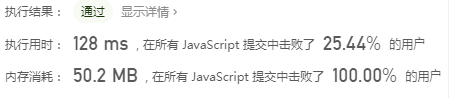
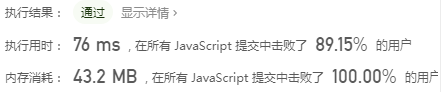
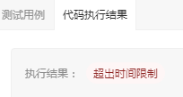
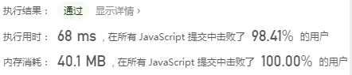

# 3. 数组中重复的数字

## 题目链接

[牛客网](https://www.nowcoder.com/practice/623a5ac0ea5b4e5f95552655361ae0a8?tpId=13&tqId=11203&tPage=1&rp=1&ru=/ta/coding-interviews&qru=/ta/coding-interviews/question-ranking&from=cyc_github)

[力扣](https://leetcode-cn.com/problems/shu-zu-zhong-zhong-fu-de-shu-zi-lcof/)

## 题目描述

在一个长度为 n 的数组里的所有数字都在 0 到 n-1 的范围内。数组中某些数字是重复的，但不知道有几个数字是重复的，也不知道每个数字重复几次。请找出数组中任意一个重复的数字。

```html
Input:
{2, 3, 1, 0, 2, 5}

Output:
2
```


类似题目：

LeetCode - [287. 寻找重复数](https://app.yinxiang.com/shard/s33/nl/27004768/683f1535-5ecc-422d-9041-17033afa725d)（存在一个重复数字）


## 解题思路

[力扣官方题解](https://leetcode-cn.com/problems/shu-zu-zhong-zhong-fu-de-shu-zi-lcof/solution/mian-shi-ti-03-shu-zu-zhong-zhong-fu-de-shu-zi-b-4/)（Java）

### Set

Set 自动忽略重复元素。遍历数组中元素，若长度未增加，则输出当前元素。

不重复的每个元素都可能存入集合，空间复杂度 O(N)。遍历数组一次，添加元素 O(1)，故总的时间复杂度 O(N)。

```js
/**
 * @param {number[]} nums
 * @return {number}
 */
var findRepeatNumber = function(nums) {
    let s = new Set();
    for(let i in nums){
        var curLenth = s.size;
        s.add(nums[i]);
        if(s.size == curLenth){
            return nums[i];
        }
    }
};
```

<div align="center">  </div><br>


### 哈希表

哈希表（number-boolean，number），后者是数组中的数字，前者代表数字是否出现过。

遍历数组中元素，检查是否出现过，如果出现过，那么返回此数字。

使用了哈希表，空间复杂度 O(N)。需要遍历一次，时间复杂度 O(1)。

```js
/**
 * @param {number[]} nums
 * @return {number}
 */
var findRepeatNumber = function(nums) {
    const map = {};
    for (const num of nums) {
        if (!map[num]) {
            map[num] = true;
        } else {
            return num;
        }
    }
};
```

<div align="center">  </div><br>


### 原地哈希

要求时间复杂度 O(N)，空间复杂度 O(1)。因此不能使用排序的方法，也不能使用额外的标记数组。

对于这种数组元素在 [0, n-1] 范围内的问题，可以**将值为 i 的元素调整到第 i 个位置上**进行求解。本题要求找出重复的数字，因此在调整过程中，如果第 i 位置上已经有一个值为 i 的元素，就可以知道 i 值重复。

以 (2, 3, 1, 0, 2, 5) 为例，遍历到位置 4 时，该位置上的数为 2，但是第 2 个位置上已经有一个 2 的值了，因此可以知道 2 重复：

<div align="center">  </div><br>

JavaScript - 版本 1：

```js
var findRepeatNumber = function(nums) {
    const length = nums.length;
    for (let i = 0; i < length; ++i) {
        // 检测下标为 i 的元素是否放在了位置 i 上
        while (nums[i] !== i) {
            if (nums[i] === nums[nums[i]]) {
                return nums[i];
            }
            [nums[i], nums[nums[i]]] = [nums[nums[i]], nums[i]];
        }
    }
};
```

<div align="center">  </div><br>

JavaScript - 版本 2：

```js
var findRepeatNumber = function(nums) {
    const length = nums.length;
    for (let i = 0; i < length; ++i) {
        // 检测下标为 i 的元素是否放在了位置 i 上
        while ((num = nums[i]) !== i) {
            if (num === nums[num]) {
                return num;
            }
            [nums[i], nums[num]] = [nums[num], nums[i]];
        }
    }
};
```

<div align="center">  </div><br>


Java ：


```java
public boolean duplicate(int[] nums, int length, int[] duplication) {
    if (nums == null || length <= 0)
        return false;
    for (int i = 0; i < length; i++) {
        while (nums[i] != i) {
            if (nums[i] == nums[nums[i]]) {
                duplication[0] = nums[i];
                return true;
            }
            swap(nums, i, nums[i]);
        }
    }
    return false;
}

private void swap(int[] nums, int i, int j) {
    int t = nums[i];
    nums[i] = nums[j];
    nums[j] = t;
}
```


