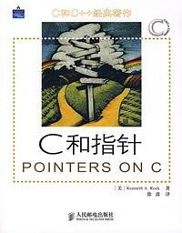
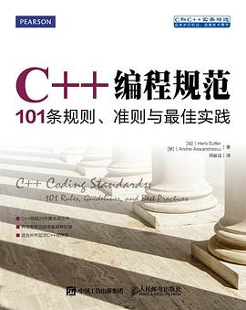

# C

## 《 C 和指针》

 KennethA·Reek / 2008年4月 / 人民邮电出版社

[豆瓣](https://book.douban.com/subject/3012360/)，9.0 分，1442 人评分。

  
 

## 《 C 程序设计语言》

 第2版·新版 （美）BrianW.Kernighan/（美）DennisM.Ritchie/ 2004-1 / 机械工业出版社

[豆瓣](https://book.douban.com/subject/1139336/)，9.4 分，4501 人评分。

  
 

## 《C Primer Plus 》

StephenPrata/云巅工作室/ 2005-2-1 / 人民邮电出版社

（第6版）中文版 普拉达 (Stephen Prata) / 2016-4-1 / 人民邮电出版社

[豆瓣](https://book.douban.com/subject/26792521/)，9.3 分，696 人评分。

  
 

# C++

## 《C++ Primer》

中文版（第 4 版） StanleyB.Lippman/JoséeLaJoie/BarbaraE.Moo/ 2006 / 人民邮电出版社

中文版（第 5 版） [美]StanleyB.Lippman/[美]JoséeLajoie/[美]BarbaraE.Moo/ 2013-9-1 / 电子工业出版社 / 出品方:博文视点

[豆瓣](https://book.douban.com/subject/25708312/)，9.4 分，1696 人评分。

  
 

## 《C++ Primer Plus》

Stephen Prata / 孙建春/韦强 / 2005-5 / 人民邮电出版社

中文版（第六版） Stephen Prata / 2012-6-19 / 人民邮电出版社

[豆瓣](https://book.douban.com/subject/10789789/)，8.6 分，562 人评分。

  
 

## 《Effective C++》

改善程序与设计的55个具体做法

(第3版)  梅耶 (Scott Meyers) / 2011-1-1 / 电子工业出版社 / 

[豆瓣](https://book.douban.com/subject/5387403/)，9.6 分，672 人评分。

  
 

## 《C++ 编程规范》

101条规则、准则与最佳实践

(第3版)  Herb Sutter / Andrei Alexandrescu / 2016-3-1 / 人民邮电出版社 / 

[豆瓣](https://book.douban.com/subject/26899830/)，8.8 分，16 人评分。

  
 

