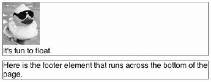

#   四、CSS 排版


## 浮动 `float`


### 浮动原理

float 属性就是把元素从常规文档流中拿出来，原来紧跟其后的元素会在空间允许的情况下，向上提升到与浮动元素平起平坐。

可以实现文字绕排图片的效果，也可以让原来上下堆叠的块级元素，变成左右并列，从而实现布局中的分栏。


**浮动的元素可以向左或向右移动， 直到它的外边缘碰到包含元素（父元素）或另一个浮动元素的边框为止**。要想使元素浮动， 必须为元素设定宽度 width （本身有默认宽度的除外，比如 img）。

虽然浮动元素已不在文档流中， 但是它浮动后所处的位置依然在浮动之前的水平方向上。因为浮动元素不在文档流中，所以文档流中的块元素表现得就像浮动元素不存在一样，下面的元素会填补原来的位置。有些元素会在浮动元素的下方，但是这些元素的内容并不一定会被浮动的元素遮盖。

- 浮动元素脱离文档流，不占据空间（可能引起“高度塌陷”现象）；
- 浮动元素向左或向右移动，碰到包含它的边框或其他浮动元素的边框停留。


**用途 1：文本环绕图片**

```html

<p>…the paragraph text…</p>
```

让图片浮动到左侧，从而让文本绕排到右侧

```css
/*为简明起见，省略了字体声明*/
p {margin:0; border:1px solid red;}
/*外边距防止图片紧挨文本*/
img {float:left; margin:0 4px 4px 0;}
```

<div align="center">  </div><br>

**用途 2：创建分栏**

浮动非图片元素时，必须给它设定宽度，否则后果难以预料。图片无所谓，因为它本身有默认的宽度。

```css
p {float:left; margin:0; width:200px; border:1px solid red;}
img {float:left; margin:0 4px 4px 0;}
```

<div align="center">  </div><br>


在 CSS 中，任何元素都可以浮动。不论浮动元素本身是何种元素，都会生成一个块级框。因此，对于内联元素，如果设置为浮动，会产生和块级框相同的效果。


浮动对其它元素的影响？

浮动元素之后的元素将围绕它。

浮动元素之前的元素将不会受到影响。如果有非浮动元素和浮动元素同时存在，且非浮动元素在前，则浮动元素不会高于非浮动元素。


浮动元素重叠

如果有多个浮动元素，浮动元素会按顺序排下来而不会发生重叠的现象。

行内元素与浮动元素发生重叠，边框、背景、内容都会显示**在浮动元素之上**。

块级元素与浮动元素发生重叠，边框、背景会显示在浮动元素之下，内容会显示**在浮动元素之上**


### clear

CSS 中 clear 的作用是指明**该元素周围不可出现浮动元素**。

[`clear`](https://developer.mozilla.org/zh-CN/docs/Web/CSS/clear) 可以取三个值：

- `left`：停止任何活动的左浮动
- `right`：停止任何活动的右浮动
- `both`：停止任何活动的左右浮动


### 清除浮动

**浮动元素的行为对布局会产生什么影响？**

以下面的例子来说明：

```html
<section>
	
	<p>It's fun to float.</p>
</section>
<footer> Here is the footer element that runs across the bottom of the page.</footer>
```

常规文档流：块级元素包围着所有子元素，而且在页面中自上而下相互堆叠在一起。

```css
section {border:1px solid blue; margin:0 0 10px 0;}
/*删除默认的上下外边距*/
p {margin 0;}
/*为简明起见，省略了字体声明*/
footer {border:1px solid red;}
```

<div align="center">  </div><br>

浮动图片后：

```css
section {border:1px solid blue; margin:0 0 10px 0;}
img {float:left;}
footer {border:1px solid red;}
```

标题跑到了右边，但父元素 section 也收缩到只包含文本的高度高度。section 不再包围浮动元素了，只包围非浮动的元素。footer 被提了上来。

<div align="center">  </div><br>


**问题：**

所有在浮动下面的自身不浮动的内容都将围绕浮动元素进行包装，如果没有处理这些元素，就会变得很糟糕：

- 父元素的高度无法被撑开，影响与父元素同级的元素，比如，例子中 `<section>` 和 `<footer>` 。
- 与浮动元素同级的非浮动元素会跟随其后，比如，例子中  `` 和 `<p>` 。
- 若非第一个元素浮动，则该元素之前的元素也需要浮动，否则会影响页面显示的结构
- *整个宽度可能难以计算*
- *浮动项目的背景高度*
- *清除浮动会变复杂*

**解决方法：**清除浮动/围住浮动元素

- 为父元素定义高度 `height`
- 为父元素添加 `overflow:hidden` 
- 为父元素添加 `overflow:auto` 
- 同时浮动父元素
- 在父元素内容的末尾添加非浮动的清除元素：额外标签法 + clear
- 给父元素添加 clearfix 类，after伪类
- （伪元素、内墙法、外墙法）


**清除浮动方法一：为浮动元素的父元素高度 `height`**

解决了父元素无法自动获取到高度的问题。 

不推荐使用，只建议高度固定的布局时使用。


**清除浮动方法二：为浮动元素的父元素添加 `overflow:hidden` **

把 `overflow:hidden` 声明应用到父元素 `<section>` 后，`<footer>` 又回到了期望的位置。

`overflow:hidden` 声明的真正用途是防止包含元素被超大内容撑大。应用之后，包含元素依然保持其设定的宽度，而超大的子内容则会被容器剪切掉

```css
section {border:1px solid blue; margin:0 0 10px 0; overflow:hidden;}
img {float:left;}
p {border:1px solid red;}
```


很简单，缺点是不太直观。只推荐没有使用 position 或对 overflow:hidden 理解比较深的朋友使用。 


**清除浮动方法三：为浮动元素的父元素添加 `overflow:auto`** 

原理：必须定义 width 或 zoom:1，同时不能定义 height，使用 `overflow:auto` 时，浏览器会自动检查浮动区域的高度 

优点：简单、代码少、浏览器支持好 

缺点：内部宽高超过父级 div 时，会出现滚动条。 

建议：不推荐使用，如果需要出现滚动条或者确保代码不会出现滚动条就使用吧。

给包含浮动元素的父标签添加css属性 overflow:auto; zoom:1; zoom:1用于兼容IE6。


**清除浮动方法四：同时浮动父元素**

浮动父元素 `<section>` 标签后，不管其子元素是否浮动，它都会紧紧地包围（也称收缩包裹）住它的子元素。因此，需要用 width:100% 再让 `<section>` 与浏览器容器同宽。

另外，由于 `<section>` 现在也浮动了，所以 `<footer>` 会努力往上挤到它旁边去。为了强制  `<footer>` 依然呆在 `<section>` 下方，要给它应用 clear:left。被清除的元素不会被提升到浮动元素的旁边。

```css
section {border:1px solid blue; float:left; width:100%;}
img {float:left;}
footer {border:1px solid red; clear:left;}
```

缺点：不稳定，不推荐使用。


**清除浮动方法五：添加非浮动的清除元素**

直接在浮动元素后添加一个子元素，并给它应用 clear 属性，让父元素能自动获取到高度。

```html
<section>
	
	<p>It's fun to float.</p>
	<div class="clear_me"></div>			<!--div 元素不会引入多余空间-->
</section>
<footer> Here is the footer element…</footer>
```

为 div 添加了一个类，以便于在 CSS 中添加它。

```css
section {border:1px solid blue;}
img {float:left;}
.clear_me {clear:left;}				/*为子元素应用 clear 属性*/
footer {border:1px solid red;}css
```


优点：简单、代码少、浏览器支持好、不容易出现怪问题 

缺点：不少初学者不理解原理；增加了无意义标签

建议：不推荐使用，但此方法是以前主要使用的一种清除浮动方法 


**清除浮动方法六：给父元素添加 clearfix 类，after 伪类**

给父元素添加一个类名。

```html
<section class="clearfix">					<!--给 section 添加一个类名-->
	
	<p>It's fun to float.</p>
</section>
<footer> Here is the footer element…</footer>
```

样式表中得需要相应的 clearfix 规则。必须为需要清除浮动元素的伪对象设置 height:0，否则该元素会比实际高出若干像素。

```css
.clearfix:after {
    content:".";
    display:block;
    height:0;
    visibility:hidden;
    clear:both;
}
```

**父级定义 伪类:after 和 zoom** 

原理：IE8以上和非IE浏览器才支持:after，原理和方法2有点类似，zoom(IE转有属性)可解决ie6,ie7浮动问题 

优点：浏览器支持好、不容易出现怪问题（目前：大型网站都有使用，如：腾迅，网易，新浪等等）


缺点：代码多、不少初学者不理解原理，要两句代码结合使用才能让主流浏览器都支持。

建议：推荐使用，建议定义公共类，以减少CSS代码。


## 定位


| 属性                                                         | 描述                                                         |
| :----------------------------------------------------------- | :----------------------------------------------------------- |
| [position](https://www.w3school.com.cn/cssref/pr_class_position.asp) | 把元素放置到一个静态的、相对的、绝对的、或固定的位置中。     |
| [top](https://www.w3school.com.cn/cssref/pr_pos_top.asp)     | 定义了一个定位元素的上外边距边界与其包含块上边界之间的偏移。 |
| [right](https://www.w3school.com.cn/cssref/pr_pos_right.asp) | 定义了定位元素右外边距边界与其包含块右边界之间的偏移。       |
| [bottom](https://www.w3school.com.cn/cssref/pr_pos_bottom.asp) | 定义了定位元素下外边距边界与其包含块下边界之间的偏移。       |
| [left](https://www.w3school.com.cn/cssref/pr_pos_left.asp)   | 定义了定位元素左外边距边界与其包含块左边界之间的偏移。       |
| [overflow](https://www.w3school.com.cn/cssref/pr_pos_overflow.asp) | 设置当元素的内容溢出其区域时发生的事情。                     |
| [clip](https://www.w3school.com.cn/cssref/pr_pos_clip.asp)   | 设置元素的形状。元素被剪入这个形状之中，然后显示出来。       |
| [vertical-align](https://www.w3school.com.cn/cssref/pr_pos_vertical-align.asp) | 设置元素的垂直对齐方式。                                     |
| [z-index](https://www.w3school.com.cn/cssref/pr_pos_z-index.asp) | 设置元素的堆叠顺序。                                         |


### position 


CSS 布局的核心是 position 属性。position 属性指定了元素的定位类型，与 top，right，bottom，left 这 4 个定位偏移属性一起使用。


position 属性值有：

- **static（静态定位）**，<u>默认值</u>，没有定位，遵循正常的文档流对象。不会受到偏移属性的影响。
- **relative（相对定位）**，对象遵循常规流，参照**自身在常规流中的位置**通过偏移属性进行偏移，原本所占的空间不会改变，不会影响常规流中的任何元素。

- **absolute（绝对定位）**，偏移属性参照**离自身最近的定位祖先元素**，如果没有则一直回溯到 body 元素。<u>对象脱离常规流，不占据空间，元素和其他元素重叠</u>。盒子的偏移位置不影响常规流中的任何元素，其 margin 不与其他任何 margin 折叠。

  参照位置要满足两个条件，第一个条件：离自身最近的祖先元素。第二个条件：祖先元素的 position 的属性值 absolute 或者 relative。

- **fixed（固定定位）**，与 absolute 一致，但**相对于浏览器窗口**进行定位。**在标准流中不占位置**，不会随着页面滚动，元素和其他元素重叠。

- center，与 absolute 一致，但以定位祖先元素的中心点为参考。盒子在其包含容器垂直水平居中。（CSS3）

- page，与 absolute 一致。元素在分页媒体或者区域块内，元素的包含块始终是初始包含块，否则取决于每个 absolute 模式。（CSS3）

- **sticky**，对象在常态时遵循常规流。它就像是 relative 和 fixed 的合体，当在屏幕中时按常规流排版，当卷动到屏幕外时则表现如 fixed。该属性的表现是现实中你见到的吸附效果。（CSS3）


### overflow


 overflow 属性可以控制内容溢出元素框时在对应的元素区间内添加滚动条。

overflow 属性有以下值：

| 值         | 描述                                                         |
| :--------- | :----------------------------------------------------------- |
| visible    | 默认值。内容不会被修剪，会呈现在元素框之外。                 |
| hidden     | 内容会被修剪，并且其余内容是不可见的。                       |
| **scroll** | 内容会被修剪，**一定会出现滚动条**。                         |
| auto       | 如果内容被修剪，显示滚动条。子元素内容大于父元素时出现滚动条。 |
| inherit    | 规定应该从父元素继承 overflow 属性的值。                     |


### z-index


z-index 属性指定一个元素的堆叠顺序。适用于定位元素，即定义了 position 属性，且属性值不是 static 的元素。

拥有更高堆叠顺序的元素总是会处于堆叠顺序较低的元素的前面。

| 值       | 描述                                    |
| :------- | :-------------------------------------- |
| auto     | 默认。堆叠顺序与父元素相等。            |
| *number* | 设置元素的堆叠顺序。                    |
| inherit  | 规定应该从父元素继承 z-index 属性的值。 |


### 总结

## 格式化上下文


### BFC

BFC （Block Formatting Context，<u>块级格式化上下文</u>），是 Web 页面的可视 CSS 渲染的一部分，是块盒子的布局过程发生的区域，也是浮动元素与其他元素交互的区域。

BFC 决定元素如何对其内容进行布局，也决定与其他元素的关系和相互作用。

用于清除浮动，防止 margin 重叠。BFC 对浮动定位与清除浮动都很重要。浮动定位和清除浮动时只会应用于同一个 BFC 内的元素。浮动不会影响其它 BFC 中元素的布局，而清除浮动只能清除同一 BFC 中在它前面的元素的浮动。

- 使用 BFC 清除浮动原理：

  - 为浮动元素的父元素设置非默认的 `overflow` 的值，创建一个会包含这个浮动的 BFC。理论上 scroll 也可以，但是使用这个属性值一定会出现滚动条。
  - 在父级块中使用 `display: flow-root` 可以创建新的 BFC。`display: flow-root`不支持 Safari。

- 使用 BFC 避免外边距合并问题：子元素的 margin-top 传递到父级。外边距折叠也只会发生在属于同一 BFC 的块级元素之间。

  ```html
  <div class="blue"></div>
  <div class="red-outer">
    <div class="red-inner">red inner</div>
  </div>
  ```

  ```css
  .blue, .red-inner {
    height: 50px;
    margin: 10px 0;
  }
  .blue {
    background: blue;
  }
  .red-outer {
    overflow: hidden;
    background: red;
  }
  ```

  


`BFC` 规定了内部的 `Block Box` 如何布局。一个页面是由很多个 `Box` 组成的，元素的类型和 `display` 属性决定了这个 `Box` 的类型。不同类型的 `box`，会参与不同的 `Formatting Context`（决定如何渲染文档的容器），因此 `Box` 内的元素会以不用的方式渲染，也是就是说 `BFC` 内部的元素和外部的元素不会相互影响。

定位方案：

- 内部的 `box` 会在垂直方向上一个接一个的放置；
- `box` 垂直方向的距离由 `margin` 决定，**属于同一个 BFC 的两个相邻 `Box` 的 `margin` 会发生重叠**；
- 每个元素 `margin box` 的左边，与包含块 `border box` 的左边相接触；
-  **BFC 的区域不会与 float box 重叠**；
-  BFC 是页面上的一个隔离的独立容器，容器里面的元素不会影响到外面的元素；
- 计算 BFC 的高度时，浮动元素也会参与计算。

下列方式会创建**块格式化上下文**：

- 根元素，即 `<html>` ；
- 浮动元素，`<float>` 的值**<u>不为 `none`</u>**（默认）；
- 绝对定位元素，`<position>` 的值为 **`<absolute>`** 或 `<fixed>`；
- 行内块元素，表格单元格，表格标题。`<display>` 的值为 **`inline-block`**，`table-cell`，`table-caption`；
- 匿名表格单元格元素（元素的 `display` 为 `table`、 `table-row`、 `table-row-group`、`table-header-group`、`table-footer-group`（分别是 HTML table、row、tbody、thead、tfoot 的默认属性）或 `inline-table`）
- `<overflow>` 的值不为 `visible`（默认）；


- `display` 值为 `flow-root` 的元素
- `contain` 值为 `layout`、`content` 或 paint 的元素
- 弹性元素（`display` 为 `flex` 或 `inline-flex` 元素的直接子元素）
- 网格元素（`display` 为 `grid` 或 `inline-grid` 元素的直接子元素）
- 多列容器（元素的 `column-count` 或 `column-width` 不为 `auto `，包括 `column-count`为 `1`）
- `column-span` 为 `all` 的元素始终会创建一个新的 BFC，即使该元素没有包裹在一个多列容器中（[标准变更](https://github.com/w3c/csswg-drafts/commit/a8634b96900279916bd6c505fda88dda71d8ec51)，[Chrome bug](https://bugs.chromium.org/p/chromium/issues/detail?id=709362)）。


## 响应式设计


# 参考资料

- https://juejin.im/post/5ee0cf335188254ec9505381