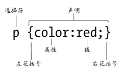
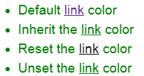

# 一、CSS 基本理论


## CSS 定义

**什么是 CSS？**

CSS（Cascading *S*tyle *S*heets，层叠样式表）是一门指定文档该如何呈现给用户的语言。

- 样式定义**如何显示** HTML 元素，多个样式定义可**层叠**为一。
- 样式通常存储在**样式表**中。**外部样式表**可以极大提高工作效率，通常存储在 **CSS 文件**中。


**为什么使用 CSS？**

CSS 是在 HTML 4 开始使用的，是为了更好的渲染 HTML 元素而引入的。CSS 解决内容与表现分离的问题，将文档信息的内容和如何展现它的细节相分离。

将样式从它的内容分离出来，能够：

- 避免重复
- 更容易维护
- 为不同的目的，使用不同的样式而内容相同


## CSS 使用

CSS 可以通过四种方式添加到 HTML 中：

- 外部样式表(External style sheet) ，链接样式。用 `<link>` 标签引入。

- 内部样式表(Internal style sheet)，嵌入样式，写在 `<style>` 元素里。

- 内联样式(Inline style)，行内样式，写在元素标签里。

  ```html
  <div style="width:100px;"></div>
  ```

- @import 导入。可以将 CSS 文件导入到 HTML 中，也可以导入到另一个 CSS 文件中。这种方式也是外部引用 CSS 的方式。


**外部样式表**

也称为链接样式。外部样式表通过 `<link>` 标签引入，可以在任何文本编辑器中进行编辑。文件不能包含任何的 HTML 标签。样式表应该以 .css 扩展名进行保存。

当样式需要应用于很多页面时，外部样式表将是理想的选择。

```html
<head>
    <!--浏览器会从文件 mystyle.css 中读到样式声明，并根据它来格式文档。-->
	<link rel="stylesheet" type="text/css" href="mystyle.css">
</head>
```


 `@import` 指令是一种 at 规则。在 HTML 中的用法：

```html
<style type='text/css' media='screen'>
	@import url('CSS文件 ');
</style>
```

要注意的是， `@import` 指令必须出现在样式表中其他样式之前，否则  `@import` 引用的样式表不会被加载。

两者都是外部引用 CSS 的方式，但是存在一定的区别：

- `<link>` 是 HTML 标签，`@import` 是在 CSS2.1 提出的。
- **加载资源的限制**：`<link>` 除了加载 CSS 外，还可以定义 RSS 等其他事务；`@import` 属于 CSS 范畴，<u>只能加载 CSS</u> 。
- **加载方式**：`<link>` 引用 CSS 时，在页面载入时同时加载； `@import` 需要<u>页面完全载入以后加载</u>。
- **兼容性**：`<link>` 是 HTML 标签，无兼容问题；`@import` <u>只在 IE5 以上才能识别</u>，低版本的浏览器不支持。
- **改变样式**：`<link>` 支持使用 Javascript 控制 DOM 去改变样式；而 `@import` <u>不支持</u>。
- `<link>` 方式的样式的权重高于 `@import` 的权重。


`<link>` 加载顺序

多个 CSS 文件，同时开始加载，先加载完成的优先解析。

如果有相同的选择器，后面的 CSS 文件的规则会覆盖前面的 CSS 文件的规则。


**内部样式表**

也称嵌入样式，在 HTML 文档头部 `<head>` 区域使用 `<style>` **元素**来包含 CSS。

嵌入样式的应用范围仅限于当前页面，会覆盖外部样式表中的样式，但也会被行内样式覆盖。

当单个文档需要特殊的样式时，就应该使用内部样式表。

```html
<head>
    <style>
    	hr {color:sienna;}
    	p {margin-left:20px;}
    	body {background-image:url("images/back40.gif");}
    </style>
</head>
```


**内联样式**

也称行内样式，写在特定 HTML 标签的 "style" **属性**里。style 属性可以包含任何 CSS 属性。

行内样式的作用范围非常有限，只能影响它所在的标签，而且总会覆盖嵌入样式和链接样式。

由于要将表现和内容混杂在一起，内联样式会损失掉样式表的许多优势。请慎用这种方法，例如当样式仅需要在一个元素上应用一次时。

```html
<p style="color:sienna;margin-left:20px">这是一个段落。</p>
```

<p style="color:sienna;margin-left:20px">这是一个段落。</p>


## CSS 语法

CSS 是一门基于规则的语言。CSS 规则由两个主要的部分构成：选择器（selector）以及一条或多条声明（declarations）。

<div align="center">  </div><br>

- 选择器：通常是需要改变样式的 HTML 元素。
- 大括号：在大括号内部定义一个或多条声明。
- 声明：每条声明由一个属性和一个值组成。属性指出要影响元素哪方面的样式，值就是属性的一个新状态。

注意：不要在属性值与单位之间留有空格。

```css
margin-left: 20 px	/*错误例子*/
margin-left: 20px	/*正确例子*/
```

总体来看，选择符后面是左花括号，然后是以冒号分隔的属性和值，二者构成声明。每个声明以分号结尾，最后是结束规则的右花括号。

对这个基本的结构，有三种方法可以进行扩展。

**第一种方法：多个声明包含在一条规则里**。

```css
p {color:red; text-align:center;}
```

**第二种方法：选择器列表**。

将多个使用相同 CSS 的选择器组合起来，在它们之间加上一个**逗号**，变为选择器列表。

```css
h1 		 {   color: blue; } 
.special {   color: blue; }
```

```css
h1, .special {   color: blue; }
```

如果每个选择器都另起一行，会更好读些。

```css
h1, 
.special {
  color: blue; 
} 
```

..special 被忽略，`<h1>` 仍会被样式化。

```css
h1 {   color: blue; } 			/*被样式化*/
..special {   color: blue; }	/*被忽略*/
```

如果选择器列表任何一个选择器无效，那么整条规则都会被忽略。

```css
h1, ..special {   color: blue; } 	/*整条规则都会被忽略*/
```

**第三种方法：多条规则应用给一个选择符**。

```css
h1, h2, h3 {color:blue; font-weight:bold;}
h3 {font-style:italic;}
```


## CSS 选择器

CSS 选择器是 CSS 规则的第一部分，是元素和其他项的一种组合形式。元素被选择器所选择的话，就被叫做“选择器的对象”。

**选择器的种类**

所有用于选择特定元素的选择符又分三种。

- 上下文选择符。基于祖先或同胞元素选择一个元素。
- ID 和类选择符。基于 id 和 class 属性的值选择元素。
- 属性选择符。基于属性的有无和特征选择元素。

**选择器具体分类**

| 选择器                                                       | 示例                | 描述                                         |
| :----------------------------------------------------------- | :------------------ | -------------------------------------------- |
| [类型选择器](https://developer.mozilla.org/zh-CN/docs/Web/CSS/Type_selectors) | `h1 { }`            | 选择一类标签                                 |
| [通配选择器](https://developer.mozilla.org/zh-CN/docs/Web/CSS/Universal_selectors) | `* { }`             |                                              |
| [类选择器](https://developer.mozilla.org/zh-CN/docs/Web/CSS/Class_selectors) | `.box { }`          | 选择相同类名的元素                           |
| [ID 选择器](https://developer.mozilla.org/zh-CN/docs/Web/CSS/ID_selectors) | `#unique { }`       | 选择一个 ID                                  |
| [标签属性选择器](https://developer.mozilla.org/zh-CN/docs/Web/CSS/Attribute_selectors) | `a[title] { }`      | 属性名选择符                                 |
| [伪类选择器](https://developer.mozilla.org/zh-CN/docs/Web/CSS/Pseudo-classes) | `p:first-child { }` |                                              |
| [伪元素选择器](https://developer.mozilla.org/zh-CN/docs/Web/CSS/Pseudo-elements) | `p::first-line { }` |                                              |
| [后代选择器](https://developer.mozilla.org/zh-CN/docs/Web/CSS/Descendant_combinator) | `article p`         | 选择作为指定祖先元素后代的标签               |
| [子代选择器](https://developer.mozilla.org/zh-CN/docs/Web/CSS/Child_combinator) | `article > p`       | 选中直接子元素                               |
| [相邻兄弟选择器](https://developer.mozilla.org/zh-CN/docs/Web/CSS/Adjacent_sibling_combinator) | `h1 + p`            | 选中**恰好处于另一个在继承关系上同级**的元素 |
| [通用兄弟选择器](https://developer.mozilla.org/zh-CN/docs/Web/CSS/General_sibling_combinator) | `h1 ~ p`            | 后者必须在前者同袍的后面，不一定紧跟         |


### 类型选择器

有时也叫做“标签名选择器*”*或者是”元素选择器“。

```css
h1 { }
```


### ID 和类选择器

ID 和类为选择元素提供了另一套手段，利用它们可以不用考虑文档的层次结构。

只要在 HTML 标记中为元素添加了 id 和 class 属性，就可以在 CSS 选择符中使用 ID 和类名，直接选中文档中特定的区域。

可以给 id 和 class 属性设定任何值，但**不能以数字**或特殊符号开头。数字开头的 ID 在 Mozilla/Firefox 浏览器中不起作用。


**类选择器**

> .类名

class 选择器用于描述一组元素的样式，有别于 id 选择器，class 可以在多个元素中使用。

class 选择器在 HTML 中以 class 属性表示，在 CSS 中，以一个点"."号显示。两者之间没有空格。

```css
.center {text-align:center;}
```

**标签带类选择符**：可以指定特定的 HTML 元素使用 class。

```css
p.center {text-align:center;}
```

**多类选择符**：可以给元素添加多个类。

```html
<p class="specialtext featured">Here the span tag <span>may or may not</span> be styled.</p>
```

 HTML 的 class 属性可以有多个空格分隔的值。要选择同时存在这两个类名的元素：

```css
.specialtext.featured {font-size:120%;}
```

**注意**：不要乱用类！


**ID 选择器**

ID 选择器可以为标有特定 ID 的 HTML 元素指定特定的样式。在一篇文档中，一个 ID 只会用到一次。

HTML 元素以 ID 属性来设置 ID 选择器，CSS 中 ID 选择器以 "#" 来定义。

```css
#para1{    text-align:center;    color:red;}
```


**什么时候用 ID，什么时候用类**

ID 的用途是在页面中唯一地标识一个元素。换一个角度讲，每个 ID 名在页面中都只能用一次。它能够为我们编写 CSS 规则提供必要的上下文，排除无关的标记，而只选择该上下文中的标签。

类的目的是为了标识一组具有相同特征的元素。类是可以应用给任意多个页面中的任意多个HTML 元素的公共标识符，以便我们为这些元素应用相同的 CSS 样式。而且，使用类也让为不同标签名的元素应用相同的样式成为可能。


### 属性选择器

**存否和值选择器**

基于一个元素自身是否存在或者基于各式不同的按属性值的匹配，来选取元素。

| 选择器                         | 示例                            | 描述                                                         |
| :----------------------------- | :------------------------------ | :----------------------------------------------------------- |
| `[attr]`（属性名选择符）       | `a[title]`                      | 匹配带有一个名为*attr*的属性的元素。                         |
| `[attr=value]`（属性值选择符） | `a[href="https://example.com"]` | 匹配带有一个名为*attr*的属性的元素，其值正为*value*。        |
| `[attr~=value]`                | `p[class~="special"]`           | 匹配带有一个*attr*属性的元素，其值有一个或者更多，至少有一个和*value*匹配。 |
| `[attr|=value]`                | `div[lang|="zh"]`               | 匹配带有一个名为*attr*的属性的元素，其值可正为*value*，或者开始为*value*，后面紧随着一个连字符。 |


**子字符串匹配选择器**

| 选择器          | 示例                | 描述                                                         |
| :-------------- | :------------------ | :----------------------------------------------------------- |
| `[attr^=value]` | `li[class^="box-"]` | 匹配带有一个名为*attr*的属性的元素，其值开头为*value*子字符串。 |
| `[attr$=value]` | `li[class$="-box"]` | 匹配带有一个名为*attr*的属性的元素，其值结尾为*value*子字符串 |
| `[attr*=value]` | `li[class*="box"]`  | 匹配带有一个名为*attr*的属性的元素，其值的字符串中的任何地方，至少出现了一次*value*子字符串。 |


HTML 和 CSS 大小写不敏感。但是这两者是相互联系的，合在一起使用的时候就产生了变化。 TagName, ClassName, Id 这三样东西是他们相互联系的纽带。

通过 CSS 设置样式时：

- #myID{...} ，ID 大小写敏感
- .myClass{...} ，ClassName 大小写敏感
- SPAN{...}，TagName 大小写不敏感

在大小写不敏感的情况下匹配属性值，可以在闭合括号之前，使用 `i` 值。这个标记告诉浏览器，要以大小写不敏感的方式匹配 ASCII 字符。

```css
/* 只匹配了第一项 */
li[class^="a"] {
    background-color: yellow;
}
/* 匹配了所有项 */
li[class^="a" i] {
    color: red;
}
```

```html
<h1>Case-insensitivity</h1>
<ul>
    <li class="a">Item 1</li>
    <li class="A">Item 2</li>
    <li class="Ab">Item 3</li>
</ul>
```

> 此外还有一个更加新的 `s` 值，它会强制在上下文的匹配正常为大小写不敏感的时候，强行要求匹配时大小写敏感。不过，在浏览器中它不太受支持，而且在上下文为HTML时也没啥用。


### 伪类

伪类选择器选择处于特定状态的元素。伪类就是开头为冒号的关键字。**可以同时使用多个伪类**。

> :pseudo-class-name

伪类分两种。

- UI 伪类：会在 HTML 元素处于某个状态时，为该元素应用 CSS 样式。
- 结构化伪类：会在标记中存在某种结构上的关系时，为相应元素应用 CSS 样式。


**用户行为伪类/UI伪类**

一些伪类只会在用户以某种方式和文档交互的时候应用。这些**用户行为伪类**，有时叫做**动态伪类**，表现得就像是一个类在用户和元素交互的时候加到了元素上一样。

- :focus 伪类。只会在用户使用键盘控制，选定元素的时候激活。
- :target 伪类
- 链接伪类
  - Link。链接就在那儿等着用户点击。
  - Visited：点击过
  - Hover：鼠标指针正悬停在链接上。
  - Active：链接正在被点击（鼠标在元素上按下，还没有释放）。

```css
a:link,
a:visited {
    color: rebeccapurple;
    font-weight: bold;
}

a:hover {
    color:hotpink;
} 
```

```html
<p><a href="">Hover over me</a></p>
```


**结构化伪类**

结构化伪类可以根据标记的结构应用样式。

- :first-child 和:last-child

  :first-child 代表一组同胞元素中的第一个元素，而:last-child 则代表最后一个。

  ```html
  <div><a href="http://www.w3.org/">链接到W3C</a></div>
  ```

  在上例中，div:first-child 表示选择属于父元素的第一个子元素的每个 `<div>` 元素。

- :nth-child

  - :nth-child(n)，n 从 1 开始计数
  - :nth-child(odd) 和:nth-child(even)，从 1 开始计数
  - :nth-child(an+b)，**n 从 0 开始计数**。

[伪类和伪元素-DIY 总结](前端 - CSS 参考手册 伪类和伪元素.md)


### 伪元素

伪元素开头为双冒号`::`。**每条选择器最多只能出现一个伪元素**。

> **备注：**一些早期的伪元素曾使用单冒号的语法。浏览器为了保持后向兼容，支持早期的带有单双冒号语法的伪元素。

**::first-letter 伪元素**

```css
/*段落首字符放大*/
p::first-letter {font-size:300%;}
```

如果不用伪元素创建这个首字符放大效果，必须手工给该字母加上 `<span>` 标签，然后再为该标签应用样式。而伪元素实际上是替我们添加了无形的标签。

**::first-line 伪元素**

```css
/*第一行以小型大写字母显示*/
p::first-line {font-variant:small-caps;}
```

**::before 和::after 伪元素**

```html
<p class="age">25</p>
```

在特定元素前面或后面添加特殊内容。

```css
p.age::before {content:"Age: ";}
p.age::after {content:" years.";}
```

显示：Age: 25 years.

**把伪类和伪元素组合起来**

```css
/* 选择一个 <article> 元素里面的第一个 <p> 元素的第一行。*/
article p:first-child::first-line { 
  font-size: 120%; 
  font-weight: bold; 
}
```

https://www.cnblogs.com/andy-lehhaxm/p/9561776.html


### 关系选择器

**后代选择器**

> 标签1 标签2 {声明}

在 CSS 规范里，叫后代组合式选择符（descendant combinator selector），就是一组以空格分隔的标签名。用于选择作为指定祖先元素后代的标签。

```css
.box p {
    color: red;
}  
```

匹配处于带有 `.box` 类的元素里面的 `<p>` 元素。

```html
<div class="box"><p>Text in .box</p></div>
<p>Text not in .box</p>
```


**子代关系选择器** >

> 标签1 > 标签2

子代关系选择器是个大于号（`>`），只会在选择器**选中直接子元素**的时候匹配。继承关系上更远的后代则不会匹配。

```css
/* 选中作为 <article> 的直接子元素的<p>元素 */
article > p
```


**邻接兄弟** +

> 标签1 + 标签2

邻接兄弟选择器（`+`）用来选中**恰好处于另一个在继承关系上同级**的元素旁边的物件。

```css
/* 选中所有紧随 <p> 元素之后的  元素 */
p + img
```


**通用兄弟** ~

> 标签1 ~ 标签2

标签2 必须跟在其同胞标签1 后面，但不一定紧跟。

```css
/* 选中所有的<p>元素后任何地方的元素 */
p ~ img
```


**使用关系选择器**

```css
/* 选中为<ul>的直接子元素的带有“a”类的列表项 */
ul > li[class="a"]  {  }
```


**全局选择器**

> *

全局选择器，是由一个星号（`*`）代指的，它选中了文档中的所有内容（或者是父元素中的所有内容）。

把 p 包含的所有元素的文本变成红色：

```css
p * {color:red;}
```

**全局选择器让选择器更易读**。

易混淆的两个选择器：

```css
/* 选中任何 <article> 元素的第一子元素 */
article :first-child {  }
/* 选中作为其他元素的第一子元素的 <article> 元素 */
article:first-child {  }
```

向 `:first-child` 选择器加入全局选择器，以区分：

```css
/* 选中 <article> 元素的任何第一子元素 */
article *:first-child { }
```

这个选择符有一个非常有意思的用法，即用它**构成非子选择符**：

```css
section * a {font-size:1.3em;}
```

任何是 section 孙子元素，而非子元素的 a 标签都会被选中。


## CSS 工作原理

### 加载原理

**浏览器如何获取CSS、HTML并将他们加载成网页？**

当浏览器展示一个文件时，必须兼顾文件的内容和文件的样式信息。下面的步骤是浏览加载网页的简化版本。

1. 浏览器载入 HTML 文件。
2. 将 HTML 文件转化成一个 DOM，DOM 是文件在计算机内存中的表现形式。
3. 接下来，浏览器会拉取该 HTML 相关的大部分资源，比如嵌入到页面的图片、视频和 CSS 样式。JavaScript 则会稍后进行处理。
4. 浏览器拉取到 CSS 之后会进行解析，根据选择器的不同类型，把他们分到不同的“桶”中。浏览器基于它找到的不同的选择器，将不同的选择器的规则应用在对应的 DOM 的节点中，并添加节点依赖的样式（这个中间步骤称为渲染树）。
5. 上述的规则应用于渲染树之后，渲染树会依照应该出现的结构进行布局。
6. 网页展示在屏幕上（这一步被称为着色）。

<div align="center">  </div><br>


**当浏览器遇到无法解析的CSS代码会发生什么**

如果一个浏览器在解析 CSS 规则的过程中遇到了无法理解的属性或者值，它会忽略这些并继续解析下面的 CSS 声明。


**加载顺序**

存在多个外部样式表时，样式表同时加载，先加载完成的优先解析。如果多个外部样式表存在相同的选择器规则，那么采取就近原则。

下例中，main1.css 和 main2.css 同时开始加载，先加载完成的优先解析。如果 main1.css 和 main2.css 中有相同的选择器规则，那么 main2.css 中的规则将合并 main1.css 的规则。

```html
<head>
	<link rel="stylesheet" type="text/css" href="main1.css">
    <link rel="stylesheet" type="text/css" href="main2.css">
</head>
```


### 层叠


CSS 提供了三种机制：继承、层叠和特指。

**层叠**

层叠，就是层叠样式表中的层叠，是一种样式在文档层次中逐层叠加的过程，目的是让浏览器面对某个标签特定属性值的多个来源，确定最终使用哪个值。层叠是 CSS 的核心机制。

**样式来源**

浏览器层叠各个来源样式的顺序：

- 浏览器默认样式表
- 用户样式表
- 作者链接样式表（按照它们链接到页面的先后顺序）
- 作者嵌入样式
- 作者行内样式

**层叠规则**

**层叠规则一：找到应用给每个元素和属性的所有声明**。

**层叠规则二：按照顺序和权重排序**。

 ` !important;` 用于加重声明的权重。单独的声明增加权重：

```css
p {color:green !important; font-size:12pt;}
```

<u>除了非常情况不要使用它。</u> `!important` 改变了层叠的常规工作方式，它会使调试 CSS 问题非常困难，特别是在大型样式表中。

**层叠规则三：按特指度排序**。

特指度（specificity）表示一条规则有多明确。

```css
p {font-size:12px;}
p.largetext {font-size:16px;}
```

下面的段落将显示16 像素高的文本

```html
<p class="largetext">A bit of text</p>
```

**层叠规则四：顺序决定权重**。

CSS 规则的顺序很重要。规则有相同的优先级时，顺序在最后的生效。如果两条规则都影响某元素的同一个属性，而且它们的特指度也相同，则位置最靠下（或后声明）的规则胜出。

例子：`h1` 最后显示蓝色。

```css
h1 {     color: red; }
h1 {     color: blue; }
```


### 继承


一些设置在父元素上的 CSS 属性可以被子元素继承。也**有很多 CSS 属性不能继承**，因为继承这些属性没有意义，比如盒子的定位和显示方式。

被继承例子：

```css
body {    color: blue;}
span {    color: black;}
```

```html
<p>段落1</p>					<!--段落1：蓝色-->
<p>段落<span>2</span></p>		<!--段落：蓝色，2：黑色-->
```

不能被继承例子：

在一个元素上设置 `width=50%`  ，所有的后代不会是父元素的宽度的 50%。


> https://www.cnblogs.com/thislbq/p/5882105.html

**无继承性的属性**

- 1、display：规定元素应该生成的框的类型
- 2、文本属性：**vertical-align**（垂直文本对齐）；text-decoration：文本装饰；text-shadow：文本阴影；white-space：空白符的处理；unicode-bidi：文本方向
- 3、盒子模型的属性：**width**、height、**margin** （margin-top、margin-right、margin-bottom、margin-left）、**border**（border-style、border-top-style、border-right-style、border-bottom-style、border-left-style、border-width、border-top-width、border-right-right、border-bottom-width、border-left-width、border-color、border-top-color、border-right-color、border-bottom-color、border-left-color、border-top、border-right、border-bottom、border-left）、**padding**（padding-top、padding-right、padding-bottom、padding-left）

- 4、背景属性：background（**background-color**、background-image、background-repeat、background-position、background-attachment）
- 5、定位属性：**float**、clear、**position**、top、right、bottom、left、min-width、min-height、max-width、max-height、overflow、clip、z-index

- 6、生成内容属性：content、counter-reset、counter-increment
- 7、轮廓样式属性：outline-style、outline-width、outline-color、outline

- 8、页面样式属性：size、page-break-before、page-break-after

- 9、声音样式属性：pause-before、pause-after、pause、cue-before、cue-after、cue、play-during
- 10、其它：table-layout

 

**有继承性的属性**

- 所有元素可继承：visibility 和 cursor。

- 内联元素可继承：letter-spacing、word-spacing、~~white-space~~、line-height、**color**、font、 **font-family**、**font-size**、font-style、font-variant、font-weight、text- decoration、text-transform、direction。

- 块状元素可继承：**text-indent** 和 text-align。

- 列表元素可继承：list-style、list-style-type、list-style-position、list-style-image。

- 表格元素可继承：border-collapse。


**控制继承**

CSS 为控制继承提供了四个特殊的通用属性值。每个 CSS 属性都接收这些值。

- [`inherit`](https://developer.mozilla.org/zh-CN/docs/Web/CSS/inherit)：使子元素属性和父元素相同， "开启继承"。

- [`initial`](https://developer.mozilla.org/zh-CN/docs/Web/CSS/initial)

  设置属性值和浏览器默认样式相同。如果浏览器默认样式中未设置且该属性是自然继承的，那么会设置为 `inherit` 。

- [`unset`](https://developer.mozilla.org/zh-CN/docs/Web/CSS/unset)：将属性重置为自然值，也就是如果属性是自然继承那么就是 `inherit`，否则和 `initial` 一样

- [`revert`](https://developer.mozilla.org/zh-CN/docs/Web/CSS/revert)， 只有很少的浏览器支持。

<div align="center">  </div><br>


### 优先级

**计算特指度**

特指度（specificity）表示一条规则有多明确。

对每个选择符都要按下面的“I-C-E”公式计算三个值，得到一个三位数。三个字母间的短横线是分隔符，并非减号。针对这个公式的计分办法如下：

1. 选择符中有一个 ID，就在 I 的位置上加 1；
2. 选择符中有一个类，就在 C 的位置上加 1；
3. 选择符中有一个元素（标签）名，就在 E 的位置上加 1；

| 选择符例子                    | 特制度计算说明   |
| ----------------------------- | ---------------- |
| P                             | 0-0-1 特指度=1   |
| p.largetext                   | 0-1-1 特指度=11  |
| p#largetext                   | 1-0-1 特指度=101 |
| body p#largetext              | 1-0-2 特指度=102 |
| body p#largetext ul.mylist    | 1-1-3 特指度=113 |
| body p#largetext ul.mylist li | 1-1-4 特指度=114 |


当多个规则有不同选择器对应相同的元素的时候，浏览器根据优先级来决定使用哪个规则。

通常将权重分为 4 个等级，可用 0.0.0.0 来表示这 4 个等级，从左往右是内联样式（非选择器）、ID、Class、Element。


CSS 优先级如何排序？

-  `!important;` 关键字优先级最高。
- 设定的样式 > 继承的样式
- **行内样式** > 内嵌样式 > 链接样式 > 浏览器默认样式
- ID 选择符（权重 100） > 类选择符（权重 10） > 元素选择符（权重 1） > 通配符 > 继承。
- 同类别的样式中，后面的会覆盖前面的。

**注意：**如果外部样式放在内部样式的后面，则外部样式将覆盖内部样式。


例子：

因为设定的样式 > 继承的样式，所以内嵌样式中的标签选择器的优先级高于继承自 span 标签的父元素 div 的样式，即使后者的样式中有 ` !important` 关键字。

```html
<!DOCTYPE html>
<html>
<head>
  <style>
	.main{color:blue}
	span{color:green}
  </style>
</head>
<body>
  <div style="color:red !important" class=""main"">
	<span>123</span>
  </div>
</body>
</html>
```

显示：<font style="color:green">123</font>


**多重样式**

如果属性被同一个样式表中相同的选择器定义，选择后声明的属性值，然后从另一个选择器中继承其它属性的声明。 

`h1` 最后显示字号为 16px 的红色字体。

```
h1 {     color: blue;	font-size:16px;}
h1 {     color: red;}
```

如果属性被不同样式表的相同的选择器定义，先根据优先级选择采用哪个样式表的选择器，然后从另一个选择器中层叠其它属性的声明。

外部样式表：

```css
h3{    color:red;    text-align:left;    font-size:8pt;}
```

内部样式表：

```html
h3{    text-align:right;    font-size:20pt;}
```

h3 得到的样式是：

```
color:red;	text-align:right;	font-size:20pt;
```


## 值和单位


CSS 属性值主要分以下三类：文本值、数字值、颜色值


| 数值类型       | 描述                                                         |
| :------------- | :----------------------------------------------------------- |
| integer        | 是一个整数，比如 1024 或 -55。                               |
| number         | 表示一个小数——可能有小数点后面的部分，也可能没有，例如 0.255、128 或 -1.2。 |
| dimension      | dimension 是一个 number，它有一个附加的单位，例如45deg、5s或10px。是一个伞形类别，包括 length、angle、time 和 resolution 类型。 |
| **percentage** | 表示一些其他值的一部分，例如 50%。百分比值总是相对于另一个量，例如，一个元素的长度相对于其父元素的长度。 |


90deg表示顺时针旋转90度


百分比参照问题：

- 参照父元素**宽度**的元素：padding、 **margin**、 width、 text-indent
- 参照父元素高度的元素：height
- 参照父元素属性：ont-size 、line-height
- 特殊：相对定位的时候，top(bottom) left(right)参照的是父元素的内容区域的高度与宽度，而绝对定位的时候参照的是最近的定位元素包含 padding 的高度与宽度
- margin-top 、padding-top 相对最近父级块级元素的 width，相对最近父级块级元素的width

> 《CSS权威指南（第三版）》中第220页“百分数和外边距”说明：“百分数是相对于父元素的 width 计算的，所以如果父元素的 width 以某种方式发生变化，百分数也会变化”。
>


### 长度单位


**在 CSS 中刻度是用于设置元素尺寸的单位。**

- 特殊值 0 可以省略单位。例如：margin:0px 可以写成 margin:0 
- 一些属性可能允许有负长度值，或者有一定的范围限制。如果不支持负长度值，那应该变换到能够被支持的最近的一个长度值。 
- 长度单位包括：相对单位和绝对单位。 


绝对长度单位

| 单位     | 名称         | 等价换算            |
| :------- | :----------- | :------------------ |
| `cm`     | 厘米         | 1cm = 96px/2.54     |
| `mm`     | 毫米         | 1mm = 1/10th of 1cm |
| `Q`      | 四分之一毫米 | 1Q = 1/40th of 1cm  |
| `in`     | 英寸         | 1in = 2.54cm = 96px |
| `pc`     | 十二点活字   | 1pc = 1/16th of 1in |
| **`pt`** | 点           | 1pt = 1/72th of 1in |
| **`px`** | 像素         | 1px = 1/96th of 1in |


相对长度单位

| 单位              | 相对于                                                       |
| :---------------- | :----------------------------------------------------------- |
| **`em`**          | 在 font-size 中使用是相对于父元素的字体大小，在其他属性中使用是相对于自身的字体大小，如 width。（font-size 能被继承，width 不能被继承。） |
| `ex`              | 字符“x”的高度                                                |
| `ch`              | 数字“0”的宽度                                                |
| **`rem`**（CSS3） | 根元素的字体大小                                             |
| `lh`              | 元素的line-height                                            |
| **`vw`**          | 视窗宽度的1%                                                 |
| **`vh`**          | 视窗高度的1%                                                 |
| `vmin`            | 视窗较小尺寸的1%                                             |
| `vmax`            | 视图大尺寸的1%                                               |


CSS 中，自适应的单位都有哪些？

- 百分比：% 。
- 相对于视口宽度的单位： vw
- 相对于视口高度的单位： vh
- 相对于视口宽度或者高度（取决于哪个小）的单位：vm
- 相对于父元素字体大小的单位： em
- 相对于根元素字体大小的单位： rem


### 颜色

属性值：关键词、十六进制 RGB 值、RGB 和 RGBA 的值、HSL 和 HSLA 的值


**十六进制 RGB 值**

每个十六进制值由一个“ # ”和六个十六进制数字组成，每个十六进制数字都可以取 0 到 f 之间的 16 个值中的一个。


**rgb()**

RGB 值是一个函数，RGB()。它有三个参数，表示颜色的红色、绿色和蓝色通道值，与十六进制值的方法非常相似。RGB 的不同之处在于，每个通道不是由两个十六进制数字表示的，而是由一个介于 0 到 255 之间的十进制数字表示的。

**rgba()**

工作方式与 RGB() 颜色完全相同，但是 RGBA() 有第四个值表示颜色的 alpha 通道，控制不透明度。值为 `0`，颜色完全透明，为 `1` 颜色完全不透明。


**hsl()**

与 RGB 相比，HSL 颜色模型的支持稍差一些，它是在设计师们感兴趣之后实现的。`hsl()` 函数接受色调、饱和度和亮度值（Hue-saturation-lightness）作为参数，而不是红色、绿色和蓝色值，这些值的不同方式组合，可以区分 1670 万种颜色：

- **色调**： 颜色的底色，表示色环（即代表彩虹的一个圆环）的一个角度。这个值在 0 和 360 之间，表示色轮周围的角度。

  red=0=360，green=120， blue=240。作为一个角度，它隐含像 -120=240 和 480=120 这样的回环。

- **饱和度**： 值为 0 - 100 %，其中 0 为无颜色(显示为灰色阴影)，100% 为全色饱和度

- **亮度**：值为 0 - 100% ，其中 0 表示没有光(完全显示为黑色)，100% 表示完全亮(完全显示为白色)。

HSL 相比 RGB 的优点是更加直观。通过保持相同的色相并改变明度/暗度和饱和度，更易于创建相称的颜色集合。

[CSS 颜色 - MDN](https://developer.mozilla.org/en-US/docs/Web/CSS/color_value)


## 其它

### 注释

以 "`/*`" 开始，以 "`*/`" 结束。

```css
/*元素选择器*/
p{
	text-align:center;
	/*颜色声明*/
	color:black;
}
```


### 空白

空白是指实际空格、制表符和新行。与 HTML 相同，浏览器往往忽略 CSS 中的大部分空白。许多空白只是为了提高可读性。


# 参考资料