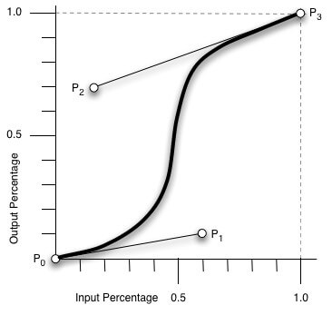

# CSS 动画属性


学习意义：

增加浏览页面的趣味性

增加用户视觉冲击力


动画是什么？

- 会动的画面（动画片、漫画、视频、flash）
- 过渡动画：颜色、高度等属性的变化（过渡）


CSS3 动画的发展


CSS3 可以创建动画，可以取代许多网页动画图像、Flash 动画和 JavaScript 实现的效果。

动画是使元素从一种样式逐渐变化为另一种样式的效果。


## animation 动画

```
animation: name duration timing-function delay iteration-count direction fill-mode play-state;
```


| 属性                                                         | 描述                                                         |
| :----------------------------------------------------------- | :----------------------------------------------------------- |
| [@keyframes](https://www.runoob.com/cssref/css3-pr-animation-keyframes.html) | 规定动画。                                                   |
| [animation](https://www.runoob.com/cssref/css3-pr-animation.html) | 所有动画属性的简写属性，除了 animation-play-state 属性。     |
| [animation-name](https://www.runoob.com/cssref/css3-pr-animation-name.html) | 必要属性，规定 @keyframes 动画的名称。                       |
| [animation-duration](https://www.runoob.com/cssref/css3-pr-animation-duration.html) | 必要属性，规定动画完成一个周期所花费的秒或毫秒。默认是 0。   |
| [animation-timing-function](https://www.runoob.com/cssref/css3-pr-animation-timing-function.html) | 规定动画的速度曲线。默认是 "ease"。                          |
| [animation-fill-mode](https://www.runoob.com/cssref/css3-pr-animation-fill-mode.html) | 规定当动画不播放时（当动画完成时，或当动画有一个延迟未开始播放时），要应用到元素的样式。 |
| [animation-delay](https://www.runoob.com/cssref/css3-pr-animation-delay.html) | 动画延迟时间，规定动画何时开始。默认是 0。                   |
| [animation-iteration-count](https://www.runoob.com/cssref/css3-pr-animation-iteration-count.html) | 规定动画被播放的次数。默认是 1。                             |
| [animation-direction](https://www.runoob.com/cssref/css3-pr-animation-direction.html) | 规定动画是否在下一周期逆向地播放。默认是 "normal"。          |
| [animation-play-state](https://www.runoob.com/cssref/css3-pr-animation-play-state.html) | 规定动画是否正在运行或暂停。默认是 "running"。paused 表示暂停。 |


### @keyframes 规则

@keyframes 规则用于创建动画，指定一个 CSS 样式和动画将逐步从目前的样式更改为新的样式。在 **@keyframes** 创建动画，要把它绑定到一个选择器，否则动画不会有任何效果。

用百分比来规定变化发生的时间，或用关键词 "from" 和 "to"，等同于 0% 和 100%。当动画完成时，会变回初始的样式。

0% 是动画的开始，100% 是动画的完成。为了得到最佳的浏览器支持，应该始终定义 0% 和 100% 选择器。

把 "myfirst" 动画捆绑到 div 元素，时长：5 秒。

```css
.box{
    width:100px;
    height:100px;
    background:red;
}
.demo{
    animation: myfirst 5s;
    -webkit-animation:myfirst 5s; 	/* Safari and Chrome */
}
@keyframes myfirst{
	from {background:red;}
	to {background:yellow;}
}
@-webkit-keyframes myfirst{			/* Safari and Chrome */
	from {background:red;}
	to {background:yellow;}
}
```

```html
<div class="box demo"></div>
```

改变背景色和位置：

```css
.box{
    /* 省略 width、height、background、animation */
    position:relative;
}
@keyframes myfirst{
    0%   {background: red; left:0px; top:0px;}
    25%  {background: yellow; left:200px; top:0px;}
    50%  {background: blue; left:200px; top:200px;}
    75%  {background: green; left:0px; top:200px;}
    100% {background: red; left:0px; top:0px;}
}
```


### `animation-fill-mode` 


`animation-fill-mode` 属性规定当动画不播放时（当动画完成时，或当动画有一个延迟未开始播放时），要应用到元素的样式。

默认情况下，CSS 动画在第一个关键帧播放完之前不会影响元素，在最后一个关键帧完成后停止影响元素。animation-fill-mode 属性可重写该行为。

| 值        | 描述                                                         |
| :-------- | :----------------------------------------------------------- |
| none      | 默认值。动画在动画执行之前和之后不会应用任何样式到目标元素。 |
| forwards  | 在动画结束后（由 animation-iteration-count 决定），动画将应用该属性值。保持最后一个属性值（在最后一个关键帧中定义）。 |
| backwards | 动画将应用在 animation-delay 定义期间启动动画的第一次迭代的关键帧中定义的属性值。这些都是 from 关键帧中的值（当 animation-direction 为 "normal" 或 "alternate" 时）或 to 关键帧中的值（当 animation-direction 为 "reverse" 或 "alternate-reverse" 时）。 |
| both      | 动画遵循 forwards 和 backwards 的规则。也就是说，动画会在两个方向上扩展动画属性。 |
| initial   | 设置该属性为它的默认值。请参阅 [*initial*](https://www.runoob.com/cssref/css-initial.html)。 |
| inherit   | 从父元素继承该属性。请参阅 [*inherit*](https://www.runoob.com/cssref/css-inherit.html)。 |


### `animation-timing-function` 

`animation-timing-function` ，即动画运动形式，指定动画将如何完成一个周期。

animation-timing-function 使用的数学函数，称为三次贝塞尔曲线，速度曲线。使用此函数，可以使用自己的值，或使用预先定义的值之一：

| 值                            | 描述                                                         |
| :---------------------------- | :----------------------------------------------------------- |
| linear                        | 动画从头到尾的速度是相同的。（等于 cubic-bezier(0,0,1,1)）   |
| ease                          | **默认**。动画以低速开始，然后加快，在结束前变慢。（cubic-bezier(0.25,0.1,0.25,1)） |
| ease-in                       | 动画以低速开始。（等于 cubic-bezier(0.42,0,1,1)）            |
| ease-out                      | 动画以低速结束。（等于 cubic-bezier(0,0,0.58,1)）            |
| ease-in-out                   | 动画以低速开始和结束。（等于 cubic-bezier(0.42,0,0.58,1)）   |
| cubic-bezier(*n*,*n*,*n*,*n*) | 在 cubic-bezier 函数中自己的值。可能的值是从 0 到 1 的数值。 |

cubic-bezier 函数可以实现上面五个效果，不能实现淡入淡出效果（fade-in 和 fade-out）。


## transition 过渡

`transition` 属性实现元素**从一种样式逐渐改变为另一种样式**的效果。

```
transition: property duration timing-function delay;
```


| 属性                                                         | 描述                                                         | CSS  |
| :----------------------------------------------------------- | :----------------------------------------------------------- | :--- |
| [transition](https://www.runoob.com/cssref/css3-pr-transition.html) | 简写属性，用于在一个属性中设置四个过渡属性。                 | 3    |
| [transition-property](https://www.runoob.com/cssref/css3-pr-transition-property.html) | （必需）规定应用过渡的 CSS 属性的名称。                      | 3    |
| [transition-duration](https://www.runoob.com/cssref/css3-pr-transition-duration.html) | （必需）定义过渡效果花费的时间。默认是 0，如果未指定，将没有任何效果。 | 3    |
| [transition-timing-function](https://www.runoob.com/cssref/css3-pr-transition-timing-function.html) | 规定过渡效果的时间曲线。默认是 "ease"。（类似 `animation-timing-function`） | 3    |
| [transition-delay](https://www.runoob.com/cssref/css3-pr-transition-delay.html) | 规定过渡效果何时开始。默认是 0。                             | 3    |


在下例中，鼠标移动到 div 元素上，查看过渡效果。

```css
.box{
    width:100px;
    height:100px;
    background:red;
}
.demo1{
    transition:width 2s;
}
.demo1:hover{
    width:300px;
}
```

```html
<div class="box demo1"></div>
```

**多项改变**

要添加多个样式的变换效果，添加的属性由逗号分隔：

```css
.demo1{
    transition: width 2s, transform 2s;
}
.demo1:hover{
    width:300px;
    transform: rotate(45deg);
}
```


 transition有什么需要注意的地方？ 

- display 不能与 transition 一起使用。transition 建立在初始属性的基础上，display 为 none 时，初始属性在文档中不存在。
- transition 后面尽量不要跟 all。
- 常见闪动。perspective 和 backface-visibility。


## 时间函数

### cubic-bezier()  - 线性

> *cubic-bezier(x1,y1,x2,y2)*

cubic-bezier() 函数可用于 `animation-timing-function` 和 `transition-timing-function` 属性，函数定义了一个贝塞尔曲线（Cubic Bezier）。

贝塞尔曲线曲线由四个点 P0(0, 0)，P1(x1, y1)，P2(x2, y2) 和 P3(1, 1) 定义。P0 和 P3 是曲线的起点和终点。P0 表示初始时间和初始状态，P3 表示最终时间和最终状态。P1 和 P2 动态取值。

<div align="center">  </div><br>

 cubic-bezier 的取值范围：需要关注的是 P1 和 P2 两点的取值，而其中 X 轴的取值范围是 0 到 1，当取值超出范围时 cubic-bezier 将失效；Y 轴的取值没有规定，当然也毋须过大。

最直接的理解是，将一条直线放在范围只有 1 的坐标轴中，并从中间拿出两个点来拉扯（X 轴的取值区间是 [0, 1]，Y 轴任意），最后形成的曲线就是动画的速度曲线。


> 可视化效果网站：https://cubic-bezier.com


### **steps() - 非线性**

animation-timing-function 还有个一实用的函数，steps(number_of_steps, direction)，这个函数叫做阶梯函数，这个函数能够起到定格动画的效果。

能够实现动画的阶跃式变化，不是线性的过度

Steps 作用的是每个关键帧，而不是整个时间


# 动画状态的监听和思考

监听的事件

- animationstart \- CSS 动画开始后触发
- animationend - CSS 动画完成后触发
- transitionend
- animationiteration \- CSS 动画重复播放时触发

兼容 Chrome, Safari 与 Opera ：

- webkitAnimationStart
- webkitAnimationEnd
- webkitAnimationIteration


HTML 部分：

```html
<div class="loading"></div>
```

CSS 部分：

```css
.loading {
    margin: 25px;
    width: 550px;
    height: 100px;
    background: orange;
    position: relative;
    animation: mymove 4s 2;
     -webkit-animation: mymove 4s 2;
}
@-webkit-keyframes mymove {		/* Chrome, Safari, Opera */
    from {top: 0px;}
    to {top: 200px;}
}
@keyframes mymove {
    from {top: 0px;}
    to {top: 200px;}
}
```

JS 部分：

```js
let $loading = document.querySelector(".loading");
let runstart = ()=>{console.log('runstart')};
let webkitRunStart = ()=>{alert('webkitRunstart')};
let runend = ()=>{console.log('runend')};
//let webkitRunEnd = ()=>{alert('webkitRunEnd')};
let iteration = ()=>{console.log('iteration')};
//let webkitRunIteration = ()=>{alert('webkitRunIteration')};
$loading.addEventListener('animatonstart',runstart);
$loading.addEventListener('webkitAnimatonStart',webkitRunStart);
$loading.addEventListener('animatonend',runend);
//$loading.addEventListener('webkitAnimatonEnd',webkitRunEnd);
$loading.addEventListener('animatoniteration',iteration);
//$loading.addEventListener('webkitAnimatonIteration',webkitRunIteration);
```


# 参考资料

- [带你走入前端动画的世界 - 慕课网课程](https://www.imooc.com/video/20542)


