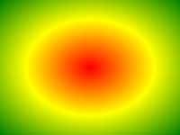

# 概述

CSS3 有哪些新特性？

- 圆角（**border-radius** )
- 阴影（**box-shadow**)
- 对文字加特效（**text-shadow** )
- 线性渐变（gradient)
- 变换（transform）
- 更多的 CSS 选择器；
- 多背景设置；
- 色彩模式，如 **rgba**
- 伪元素 ::selection
- 媒体查询（**@media**）；
- 布局：**flexbox**，多栏布局；
- 图片边框（ border-image ） 
- 动画（**@keyframes**


CSS3 中对溢出的处理

单行文字溢出处理：（溢出后出现三个点...）

- overflow：hidden；
- text-overflow：ellipsis；
- white-space：nowrap；

多行文字溢出处理：（仅支持 webkit 内核，支持大部分移动设备）

- overflow: hidden;
- text-overflow: ellipsis;
- white-space: normal !important;
- display: -webkit-box;
- word-wrap: break-word;
- -webkit-line-clamp: 2;
- -webkit-box-orient: vertical;


# 选择器

CSS 3 新增选择器：

| 选择器                                                       | 示例                  | 示例说明                                                  | CSS  |
| ------------------------------------------------------------ | --------------------- | --------------------------------------------------------- | ---- |
| [*element1*~*element2*](https://www.runoob.com/cssref/sel-gen-sibling.html) | p~ul                  | 选择p元素之后的每一个ul元素                               | 3    |
| [[*attribute*^=*value*\]](https://www.runoob.com/cssref/sel-attr-begin.html) | a[src^="https"]       | 选择每一个src属性的值以"https"开头的元素                  | 3    |
| [[*attribute*$=*value*\]](https://www.runoob.com/cssref/sel-attr-end.html) | a[src$=".pdf"]        | 选择每一个src属性的值以".pdf"结尾的元素                   | 3    |
| [[*attribute**=*value*\]](https://www.runoob.com/cssref/sel-attr-contain.html) | a[src*="runoob"]      | 选择每一个src属性的值包含子字符串"runoob"的元素           | 3    |
|                                                              |                       |                                                           |      |
| [:first-of-type](https://www.runoob.com/cssref/sel-first-of-type.html) | p:first-of-type       | 选择每个p元素是其父级的第一个p元素                        | 3    |
| [:last-of-type](https://www.runoob.com/cssref/sel-last-of-type.html) | p:last-of-type        | 选择每个p元素是其父级的最后一个p元素                      | 3    |
| [:only-of-type](https://www.runoob.com/cssref/sel-only-of-type.html) | p:only-of-type        | 选择每个p元素是其父级的唯一p元素                          | 3    |
| [:only-child](https://www.runoob.com/cssref/sel-only-child.html) | p:only-child          | 选择每个p元素是其父级的唯一子元素                         | 3    |
| [:nth-child(*n*)](https://www.runoob.com/cssref/sel-nth-child.html) | p:nth-child(2)        | 选择每个p元素是其父级的第二个子元素                       | 3    |
| [:nth-last-child(*n*)](https://www.runoob.com/cssref/sel-nth-last-child.html) | p:nth-last-child(2)   | 选择每个p元素的是其父级的第二个子元素，从最后一个子项计数 | 3    |
| [:nth-of-type(*n*)](https://www.runoob.com/cssref/sel-nth-of-type.html) | p:nth-of-type(2)      | 选择每个p元素是其父级的第二个p元素                        | 3    |
| [:nth-last-of-type(*n*)](https://www.runoob.com/cssref/sel-nth-last-of-type.html) | p:nth-last-of-type(2) | 选择每个p元素的是其父级的第二个p元素，从最后一个子项计数  | 3    |
| [:last-child](https://www.runoob.com/cssref/sel-last-child.html) | p:last-child          | 选择每个p元素是其父级的最后一个子级。                     | 3    |
| [:root](https://www.runoob.com/cssref/sel-root.html)         | :root                 | 选择文档的根元素                                          | 3    |
| [:empty](https://www.runoob.com/cssref/sel-empty.html)       | p:empty               | 选择每个没有任何子级的p元素（包括文本节点）               | 3    |
| [:target](https://www.runoob.com/cssref/sel-target.html)     | #news:target          | 选择当前活动的#news元素（包含该锚名称的点击的URL）        | 3    |
| [:enabled](https://www.runoob.com/cssref/sel-enabled.html)   | input:enabled         | 选择每一个已启用的输入元素                                | 3    |
| [:disabled](https://www.runoob.com/cssref/sel-disabled.html) | input:disabled        | 选择每一个禁用的输入元素                                  | 3    |
| [:checked](https://www.runoob.com/cssref/sel-checked.html)   | input:checked         | 选择每个选中的输入元素                                    | 3    |
| [:not(*selector*)](https://www.runoob.com/cssref/sel-not.html) | :not(p)               | 选择每个并非p元素的元素                                   | 3    |
| [::selection](https://www.runoob.com/cssref/sel-selection.html) | ::selection           | 匹配元素中被用户选中或处于高亮状态的部分                  | 3    |
| [:out-of-range](https://www.runoob.com/cssref/sel-out-of-range.html) | :out-of-range         | 匹配值在指定区间之外的input元素                           | 3    |
| [:in-range](https://www.runoob.com/cssref/sel-in-range.html) | :in-range             | 匹配值在指定区间之内的input元素                           | 3    |
| [:read-write](https://www.runoob.com/cssref/sel-read-write.html) | :read-write           | 用于匹配可读及可写的元素                                  | 3    |
| [:read-only](https://www.runoob.com/cssref/sel-read-only.html) | :read-only            | 用于匹配设置 "readonly"（只读） 属性的元素                | 3    |
| [:optional](https://www.runoob.com/cssref/sel-optional.html) | :optional             | 用于匹配可选的输入元素                                    | 3    |
| [:required](https://www.runoob.com/cssref/sel-required.html) | :required             | 用于匹配设置了 "required" 属性的元素                      | 3    |
| [:valid](https://www.runoob.com/cssref/sel-valid.html)       | :valid                | 用于匹配输入值为合法的元素                                | 3    |
| [:invalid](https://www.runoob.com/cssref/sel-invalid.html)   | :invalid              | 用于匹配输入值为非法的元素                                | 3    |


# 边框

边框属性

- border-radius
- box-shadow
- border-image

## `border-radius` 圆角

通过使用 [`border-radius`](https://developer.mozilla.org/zh-CN/docs/Web/CSS/border-radius) 属性和与方框的每个角相关的长边来实现**圆角边框**。可以使用两个长度或百分比作为值，第一个值定义水平半径，第二个值定义垂直半径。在很多情况下，只用一个值。

例如，要使一个盒子的四个角都有 10px 的圆角半径：

```css
.box {   border-radius: 10px; }
```

使右上角的水平半径为 1em，垂直半径为 10％：

```css
.box {   border-top-right-radius: 1em 10%; } 
```

浏览器支持：**IE 9.0**、Chrome 5.0（4.0 -webkit-）、FireFox 4.0（3.0 -moz-）、Safari 5.0（3.1 -webkit-）、Opera（10.5）。


`border-radius` 是所有四个边角 `border-*-*-radius` 属性的缩写。

| 属性                                                         | 描述               |
| :----------------------------------------------------------- | :----------------- |
| [border-radius](https://www.runoob.com/cssref/css3-pr-border-radius.html) | 圆角边框           |
| [border-top-left-radius](https://www.runoob.com/cssref/css3-pr-border-top-left-radius.html) | 定义了左上角的弧度 |
| [border-top-right-radius](https://www.runoob.com/cssref/css3-pr-border-top-right-radius.html) | 定义了右上角的弧度 |
| [border-bottom-right-radius](https://www.runoob.com/cssref/css3-pr-border-bottom-right-radius.html) | 定义了右下角的弧度 |
| [border-bottom-left-radius](https://www.runoob.com/cssref/css3-pr-border-bottom-left-radius.html) | 定义了左下角的弧度 |

`border-radius` 可以指定 1 - 4 个值。

- **四个值：** 左上角，右上角，右下角，左下角。
- **三个值：**左上角，右上角和左下角，右下角
- **两个值：**左上角与右下角，右上角与左下角
- **一个值：** 四个圆角值相同

```css
#rcorners5 {
    border-radius: 20px 50px 30px;
    background: #8AC007;
    padding: 20px; 
    width: 200px;
    height: 150px; 
}
```

```html
<p id="rcorners5"></p>
```

<div align="center">  </div><br>


`border-radius` 可以创建椭圆边框。注意：px 和 px 不会消去。直接写数字，显示的是直角边框。

```css
#rcorners8 {
    border-radius: 15px/50px;
    background: #8AC007;
    padding: 20px; 
    width: 200px;
    height: 150px; 
}
```


## `box-shadow` 盒阴影


CSS3 中的 box-shadow 属性被用来添加阴影。

```css
div{box-shadow: 10px 10px 5px #888888;}
```

 盒阴影的语法结构与文本阴影类似，但是，盒阴影多了一个属性，即外延值 inset。


## `border-image`

border-image 属性允许指定一个图片作为边框。


# 背景

新的背景属性

| 顺序                                                         | 描述                     | CSS  |
| :----------------------------------------------------------- | :----------------------- | :--- |
| [background-clip](https://www.runoob.com/cssref/css3-pr-background-clip.html) | 规定背景的绘制区域。     | 3    |
| [background-origin](https://www.runoob.com/cssref/css3-pr-background-origin.html) | 规定背景图片的定位区域。 | 3    |
| [background-size](https://www.runoob.com/cssref/css3-pr-background-size.html) | 规定背景图片的尺寸。     | 3    |


背景属性的浏览器支持情况：

|                                              | Chrome           | IE   | FireFox       | Safari           | Opera         |
| -------------------------------------------- | ---------------- | ---- | ------------- | ---------------- | ------------- |
| background-image (with multiple backgrounds) | 4.0              | 9.0  | 3.6           | 3.1              | 11.5          |
| background-size                              | 4.0 1.0 -webkit- | 9.0  | 4.0 3.6 -moz- | 4.1 3.0 -webkit- | 10.5 10.0 -o- |
| background-origin                            | 1.0              | 9.0  | 4.0           | 3.0              | 10.5          |
| background-clip                              | 4.0              | 9.0  | 4.0           | 3.0              | 10.5          |


## background-image

通过 background-image 属性（CSS1）添加背景图片。


### **多重背景**

不同的背景图像用逗号隔开，所有的图片中显示在最顶端的为第一张。

```css
#example1 { 
    background-image: url(img_flwr.gif), url(paper.gif); 
    background-position: right bottom, left top; 
    background-repeat: no-repeat, repeat; 
}
```

-  用逗号隔开每组 background 的缩写值；
-  如果有 size 值，需要紧跟 position 并且用 "/" 隔开；
-  如果有多个背景图片，而其他属性只有一个（例如 background-repeat 只有一个），表明所有背景图片应用该属性值。
-  background-color 只能设置一个。


### **渐变**

CSS 3 渐变（gradients）可以在两个或多个指定的颜色之间显示平稳的过渡。

以前必须使用图像来实现这些效果。使用渐变可以减少下载的时间和宽带的使用。此外，渐变效果的元素在放大时看起来效果更好，因为渐变是由浏览器生成的。

CSS3 定义了两种类型的渐变（gradients）：

- **线性渐变（Linear Gradients）- 向下/向上/向左/向右/对角方向**
- **径向渐变（Radial Gradients）- 由它们的中心定义**

注意：IE8 及更早版本的 IE 浏览器不支持该属性。


**线性渐变**

> background-image: linear-gradient(direction, color-stop1, color-stop2, ...);

创建一个线性渐变必须至少定义两种颜色节点。颜色节点即想要呈现平稳过渡的颜色。同时，也可以设置一个起点和一个方向（或一个角度）。


默认情况下，方向是从上到下。预定义方向有：to bottom、to top、to right（从左到右）、to left、to bottom right（从左上角到右下角），等等。

```css
#grad {
  height: 200px;
  background-color: red; /* 浏览器不支持时显示 */
  background-image: linear-gradient(to right, red , yellow);
}
```

方向也可以是一个角度。角度是指水平线和渐变线之间的角度，逆时针方向计算。比如：0deg 将创建一个从下到上的渐变，90deg 将创建一个从左到右的渐变。

<div align="center">  </div><br>

但是，很多浏览器（Chrome、Safari、firefox 等）使用了旧的标准，即 0deg 将创建一个从左到右的渐变，90deg 将创建一个从下到上的渐变。换算公式 **90 - x = y** 其中 x 为标准角度，y 为非标准角度。

**使用多个颜色节点**

7 个颜色结点均匀分布

```css
#grad2 {
    height: 200px;
    background-color: red; /* 浏览器不支持的时候显示 */
	background-image: linear-gradient(red, orange, yellow, green, blue, indigo, violet); /* 标准的语法（必须放在最后） */
}
```

当指定百分比时，颜色是不均匀分布。下例显示，3 个颜色结点不均匀分布：

```css
#grad3 {
    height: 200px;
	background-color: red; /* 浏览器不支持的时候显示 */
	background-image: linear-gradient(red 10%, green 85%, blue 90%); /* 标准的语法（必须放在最后） */
}
```

**使用透明度**

CSS3 渐变也支持透明度（transparent），可用于创建减弱变淡的效果。

为了添加透明度，使用 rgba() 函数来定义颜色节点。rgba() 函数中的最后一个参数可以是从 0 到 1 的值，0 表示完全透明，1 表示完全不透明。

下例中，起点是完全透明，慢慢过渡到完全不透明的红色

```css
#grad {
  background-image: linear-gradient(to right, rgba(255,0,0,0), rgba(255,0,0,1));
}
```

**重复的线性渐变**

repeating-linear-gradient() 函数用于重复线性渐变

```css
#grad {
  /* 标准的语法 */
  background-image: repeating-linear-gradient(red, yellow 10%, green 20%);
}
```


**径向渐变**

> background-image: radial-gradient(shape size at position, start-color, ..., last-color);

径向渐变由它的中心定义。

创建一个径向渐变也必须至少定义两种颜色节点。同时，也可以指定渐变的中心、形状（圆形或椭圆形）、大小。默认情况下，渐变的中心是 center（表示在中心点），渐变的形状是 ellipse（表示椭圆形），渐变的大小是 farthest-corner（表示到最远的角落）。

**径向渐变的实例：**

<div align="center">  </div><br>

颜色节点均匀分布的径向渐变：

```css
#grad {  background-image: radial-gradient(red, yellow, green); }
```

颜色节点不均匀分布的径向渐变：

```css
#grad {  background-image: radial-gradient(red 5%, yellow 15%, green 60%); }
```

**设置形状**

shape 参数定义了形状，值可以是 circle（圆形）或 ellipse（椭圆形）。其中，默认值是 ellipse。

形状为圆形的径向渐变：

```css
#grad {  background-image: radial-gradient(circle, red, yellow, green); }
```

**设置尺寸**

size 参数定义了渐变的大小。它可以是以下四个值：

- **closest-side**
- **farthest-side**
- **closest-corner**
- **farthest-corner**

带有不同尺寸大小关键字的径向渐变：

```css
#grad1 {  background-image: radial-gradient(closest-side at 60% 55%, red, yellow, black); }  
#grad2 {  background-image: radial-gradient(farthest-side at 60% 55%, red, yellow, black); }
```

**重复的径向渐变**

repeating-radial-gradient() 函数用于重复径向渐变：

```css
#grad {  background-image: repeating-radial-gradient(red, yellow 10%, green 15%); }
```


## `background-size`

background-size指定背景图像的大小。CSS3 以前，背景图像大小由图像的实际大小决定。

属性值可以是像素或百分比大小。指定的大小是相对于父元素的宽度和高度的百分比的大小。


## 位置区域和绘制区域


```css
background-origin:content-box
```

比如：

```css
.demo {
	height: 200px;
	width: 200px;
	padding: 50px;
	border: lpx solid #ccc;
	background-image: url('logo.png');
	background-repeat: no-repeat;
	background-position: left top;
	background-origin: content-box;
}
```


`background-origin` 属性指定了背景图片的位置区域。属性值如下：

| 值          | 描述                       |
| :---------- | :------------------------- |
| padding-box | 背景图像填充框的相对位置   |
| border-box  | 背景图像边界框的相对位置   |
| content-box | 背景图像的相对位置的内容框 |

要注意，`background-origin` 描述的是“背景图片”。也就是说，它只能对背景做样式上的操作。一旦规定了图片开始绘制的区域，就当于规定图片的左上角从什么地方开始，其他的就不负责了。

`background-clip` 规定背景（包括背景颜色和背景图片）的绘制区域。属性值可以是 content-box，padding-box。

| 值          | 说明                                             |
| :---------- | :----------------------------------------------- |
| border-box  | 默认值。背景绘制在边框方框内（剪切成边框方框）。 |
| padding-box | 背景绘制在衬距方框内（剪切成衬距方框）。         |
| content-box | 背景绘制在内容方框内（剪切成内容方框）。         |


# 文字特效

新文本属性

| 属性                                                         | 描述                                                    |
| :----------------------------------------------------------- | :------------------------------------------------------ |
| [hanging-punctuation](https://www.runoob.com/cssref/css3-pr-hanging-punctuation.html) | 规定标点字符是否位于线框之外。                          |
| [punctuation-trim](https://www.runoob.com/cssref/css3-pr-punctuation-trim.html) | 规定是否对标点字符进行修剪。                            |
| [text-align-last](https://www.runoob.com/cssref/css3-pr-text-align-last.html) | 设置如何对齐最后一行或紧挨着强制换行符之前的行。        |
| [text-emphasis](https://www.runoob.com/css3/css3-pr-text-emphasis.html) | 向元素的文本应用重点标记以及重点标记的前景色。          |
| [text-justify](https://www.runoob.com/cssref/css3-pr-text-justify.html) | 规定当 text-align 设置为 "justify" 时所使用的对齐方法。 |
| [text-outline](https://www.runoob.com/cssref/css3-pr-text-outline.html) | 规定文本的轮廓。                                        |
| [**text-overflow**](https://www.runoob.com/cssref/css3-pr-text-overflow.html) | 规定当文本溢出包含元素时发生的事情。                    |
| [**text-shadow**](https://www.runoob.com/cssref/css3-pr-text-shadow.html) | 向文本添加阴影。                                        |
| [text-wrap](https://www.runoob.com/cssref/css3-pr-text-wrap.html) | 规定文本的换行规则。                                    |
| [**word-break**](https://www.runoob.com/cssref/css3-pr-word-break.html) | 规定非中日韩文本的换行规则。                            |
| [**word-wrap**](https://www.runoob.com/cssref/css3-pr-word-wrap.html) | 允许对长的不可分割的单词进行分割并换行到下一行。        |

在浏览器中的支持：

| 属性          | Chrome            | IE   | Firefox       | Safari           | Opera        |
| :------------ | ----------------- | ---- | ------------- | ---------------- | ------------ |
| text-shadow   | 4.0               | 10.0 | 3.5           | 4.0              | 9.5          |
| box-shadow    | 10.0 4.0 -webkit- | 9.0  | 4.0 3.5 -moz- | 5.1 3.1 -webkit- | 10.5         |
| text-overflow | 4.0               | 6.0  | 7.0           | 3.1              | 11.0 9.0 -o- |
| word-wrap     | 23.0              | 5.5  | 3.5           | 6.1              | 12.1         |
| word-break    | 4.0               | 5.5  | 15.0          | 3.1              | 15.0         |


## text-shadow


CSS3 中，text-shadow 属性适用于文本阴影。有四个值：水平阴影，垂直阴影，模糊的距离，以及阴影的颜色。

```css
p{text-shadow: 5px 5px 5px #FF0000;}
```

<p style="text-shadow: 5px 5px 5px #FF0000;">文本阴影<p>


## box-shadow

CSS3 中 box-shadow 属性适用于盒子阴影。

可以在 ::before 和 ::after 两个伪元素中添加阴影效果

**卡片效果**

box-shadow属性可以用来创建纸质样式卡片。图片卡片例子：

```css
div.polaroid {
  width: 250px;
  box-shadow: 0 4px 8px 0 rgba(0, 0, 0, 0.2), 0 6px 20px 0 rgba(0, 0, 0, 0.19);
  text-align: center;
}

div.container {
  padding: 10px;
}
```

```html
<div class="polaroid">
  
  <div class="container">
    <p>Hardanger, Norway</p>
  </div>
</div>
```

<div align="center">  </div><br>

文字卡片

```css
div.card {
  width: 250px;
  box-shadow: 0 4px 8px 0 rgba(0, 0, 0, 0.2), 0 6px 20px 0 rgba(0, 0, 0, 0.19);
  text-align: center;
}

div.header {
    background-color: #4CAF50;
    color: white;
    padding: 10px;
    font-size: 40px;
}

div.container {
    padding: 10px;
}
```

```html
<div class="card">
  <div class="header">
    <h1>1</h1>
  </div>

  <div class="container">
    <p>January 1, 2016</p>
  </div>
</div>
```

<div align="center">  </div><br>


## `text-overflow`

规定当文本溢出包含元素时发生的事情。

| 值           | 描述                                 |
| :----------- | :----------------------------------- |
| clip         | 默认值，修剪文本。                   |
| **ellipsis** | 显示**省略符号**来代表被修剪的文本。 |
| *string*     | 使用给定的字符串来代表被修剪的文本。 |


以下长文本无法完全显示，可以看到它们被裁剪了：

```css
div.test{
	white-space:nowrap; 
	width:12em; 
	overflow:hidden; 
	border:1px solid #000000;
}
```

HTML 中：

```css
<div class="test" style="text-overflow:ellipsis;">This is some long text that will not fit in the box</div>
<div class="test" style="text-overflow:clip;">This is some long text that will not fit in the box</div>
<div class="test" style="text-overflow:'>>';">This is some long text that will not fit in the box</div>
```

注意：`text-overflow: string` 只在 Firefox 浏览器下有效。

<div class="test" style="text-overflow:ellipsis;white-space:nowrap;	width:12em; overflow:hidden; border:1px solid #000000;">This is some long text that will not fit in the box</div>

<div class="test" style="text-overflow:clip;white-space:nowrap;	width:12em; overflow:hidden; border:1px solid #000000;">This is some long text that will not fit in the box</div>

<div class="test" style="text-overflow:'>>';white-space:nowrap;	width:12em; overflow:hidden; border:1px solid #000000;">This is some long text that will not fit in the box</div>


## word-wrap


 允许对长的不可分割的单词进行分割并换行到下一行。

| 值         | 描述                                         |
| :--------- | :------------------------------------------- |
| normal     | 只在允许的断字点换行（浏览器保持默认处理）。 |
| break-word | 在长单词或 URL 地址内部进行换行。            |


## word-break

 规定非中日韩文本的换行规则。

| 值        | 描述                           |
| :-------- | :----------------------------- |
| normal    | 使用浏览器默认的换行规则。     |
| break-all | 允许在单词内换行。             |
| keep-all  | 只能在半角空格或连字符处换行。 |


## @font-face 字体

CSS3 以前，只能使用用户计算机上已经安装的字体。使用 @font-face 规则，可以使用 Web 字体。

Web 字体是一种 CSS 特性，允许指定在访问时随网站一起下载字体文件，这意味着任何支持 Web 字体的浏览器都可以使用指定的字体。

@font-face 语法：

- 在 CSS 的开始处有一个 `@font-face` 块，它指定要下载的字体文件。
- 使用 @font-face 中指定的字体种类名称来将定制字体应用到元素中。

```css
@font-face {
  [ font-family: <family-name>; ] ||
  [ src: <src>; ] ||
  [ unicode-range: <unicode-range>; ] ||
  [ font-variant: <font-variant>; ] ||
  [ font-feature-settings: <font-feature-settings>; ] ||
  [ font-variation-settings: <font-variation-settings>; ] ||
  [ font-stretch: <font-stretch>; ] ||
  [ font-weight: <font-weight>; ] ||
  [ font-style: <font-style>; ]
}
where 
<family-name> = <string> | <custom-ident>+
```

例子：

```html
<style type="text/css" media="screen, print">
    @font-face {
        font-family: "myFont";
        src: url("myFont.ttf");
    }

    html { font-family: "myFont", "Bitstream Vera Serif", serif; }
</style>
```

关于网页字体有两件重要的事情要记住：

1. 浏览器支持不同的字体格式，因此需要多种字体格式以获得良好的跨浏览器支持。
2. 字体一般都不能自由使用。必须付费，或者遵循其他许可条件，比如在代码中（或者站点上）提供字体创建者。


# transform 转换

可以使用 2D 或 3D 转换来转换元素。转换的效果是让某个元素改变形状，大小和位置。可以对元素进行移动、缩放、转动、拉长或拉伸。

转换属性：

| 属性                                                         | 描述                                 |
| :----------------------------------------------------------- | :----------------------------------- |
| [transform](https://www.runoob.com/cssref/css3-pr-transform.html) | 向元素应用 2D 或 3D 转换。           |
| [transform-origin](https://www.runoob.com/cssref/css3-pr-transform-origin.html) | 允许你改变被转换元素的位置。         |
| [transform-style](https://www.runoob.com/cssref/css3-pr-transform-style.html) | 规定被嵌套元素如何在 3D 空间中显示。 |
| [perspective](https://www.runoob.com/cssref/css3-pr-perspective.html) | 规定 3D 元素的透视效果。             |
| [perspective-origin](https://www.runoob.com/cssref/css3-pr-perspective-origin.html) | 规定 3D 元素的底部位置。             |
| [backface-visibility](https://www.runoob.com/cssref/css3-pr-backface-visibility.html) | 定义元素在不面对屏幕时是否可见。     |


## 2D 转换

**2D 转换方法**

| 函数                            | 描述                                     |
| :------------------------------ | :--------------------------------------- |
| matrix(*n*,*n*,*n*,*n*,*n*,*n*) | 定义 2D 转换，使用六个值的矩阵。         |
| translate(*x*,*y*)              | 定义 2D 转换，沿着 X 和 Y 轴移动元素。   |
| translateX(*n*)                 | 定义 2D 转换，沿着 X 轴移动元素。        |
| translateY(*n*)                 | 定义 2D 转换，沿着 Y 轴移动元素。        |
| scale(*x*,*y*)                  | 定义 2D 缩放转换，改变元素的宽度和高度。 |
| scaleX(*n*)                     | 定义 2D 缩放转换，改变元素的宽度。       |
| scaleY(*n*)                     | 定义 2D 缩放转换，改变元素的高度。       |
| rotate(*angle*)                 | 定义 2D 旋转，在参数中规定角度。         |
| skew(*x-angle*,*y-angle*)       | 定义 2D 倾斜转换，沿着 X 和 Y 轴。       |
| skewX(*angle*)                  | 定义 2D 倾斜转换，沿着 X 轴。            |
| skewY(*angle*)                  | 定义 2D 倾斜转换，沿着 Y 轴。            |


matrix 方法有六个参数，包含旋转，缩放，移动（平移）和倾斜功能。

下例，效果同：transform:rotate(30deg);

```css
div{
transform:matrix(0.866,0.5,-0.5,0.866,0,0);
-ms-transform:matrix(0.866,0.5,-0.5,0.866,0,0); /* IE 9 */
-webkit-transform:matrix(0.866,0.5,-0.5,0.866,0,0); /* Safari and Chrome */
}
```


### translate()

根据左(X轴)和顶部(Y轴)位置给定的参数，从当前元素位置移动。


```css
div{
	width:100px;
	height:75px;
	background-color:red;
	border:1px solid black;
}
div#div2{
	transform:translate(20px,40px);
	-ms-transform:translate(20px,40px); /* IE 9 */
	-webkit-transform:translate(20px,40px); /* Safari and Chrome */
}
```

```html
<div>Hello. This is a DIV element.</div>
<div id="div2">Hello. This is a DIV element.</div>
```

<div align="center">  </div><br>


### rotate()

在一个给定度数顺时针旋转的元素。负值是允许的，这样是元素逆时针旋转。


```
div#div2{
	transform:rotate(20deg);
	-ms-transform:rotate(20deg); /* IE 9 */
	-webkit-transform:rotate(20deg); /* Safari and Chrome */
}
```

<div align="center">  </div><br>


### scale()

缩放转换，改变元素的宽度和高度。

scale(2,3) ：宽度为原来的大小的 2 倍，高度为原始大小的 3 倍。


### skew()

> transform:skew(angle [,angle]);

包含两个参数值，分别表示 X 轴和 Y 轴倾斜的角度，如果第二个参数为空，则默认为 0，参数为负表示向相反方向倾斜。

- skewX(angle);表示只在 X 轴(水平方向)倾斜。
- skewY(angle);表示只在 Y 轴(垂直方向)倾斜。

skew(30deg,20deg) 元素在 X 轴和 Y 轴上倾斜 20 度 30 度。

<div align="center">  </div><br>


### matrix()

matrix()方法和2D变换方法合并成一个。

matrix 方法有六个参数，包含旋转，缩放，移动（平移）和倾斜功能。


## 3D 转换

3D 转换方法

| 函数                                                         | 描述                                      |
| :----------------------------------------------------------- | :---------------------------------------- |
| matrix3d(*n*,*n*,*n*,*n*,*n*,*n*, *n*,*n*,*n*,*n*,*n*,*n*,*n*,*n*,*n*,*n*) | 定义 3D 转换，使用 16 个值的 4x4 矩阵。   |
| translate3d(*x*,*y*,*z*)                                     | 定义 3D 转化。                            |
| translateX(*x*)                                              | 定义 3D 转化，仅使用用于 X 轴的值。       |
| translateY(*y*)                                              | 定义 3D 转化，仅使用用于 Y 轴的值。       |
| translateZ(*z*)                                              | 定义 3D 转化，仅使用用于 Z 轴的值。       |
| scale3d(*x*,*y*,*z*)                                         | 定义 3D 缩放转换。                        |
| scaleX(*x*)                                                  | 定义 3D 缩放转换，通过给定一个 X 轴的值。 |
| scaleY(*y*)                                                  | 定义 3D 缩放转换，通过给定一个 Y 轴的值。 |
| scaleZ(*z*)                                                  | 定义 3D 缩放转换，通过给定一个 Z 轴的值。 |
| rotate3d(*x*,*y*,*z*,*angle*)                                | 定义 3D 旋转。                            |
| rotateX(*angle*)                                             | 定义沿 X 轴的 3D 旋转。                   |
| rotateY(*angle*)                                             | 定义沿 Y 轴的 3D 旋转。                   |
| rotateZ(*angle*)                                             | 定义沿 Z 轴的 3D 旋转。                   |
| perspective(*n*)                                             | 定义 3D 转换元素的透视视图。              |


### translateZ() 方法

`translateZ(tz)` 相当于 `translate3d(0, 0, tz)`。`tz` 表示平移矢量的 z 分量的 `<length>` 值。正值将元素移向观察者，负值则远离。


### rotateX() 方法


### rotateY() 方法

定义沿 Y 轴的 3D 旋转。可以实现**翻书**的效果。


# 动画


# 布局

## 多列布局

所有 CSS3 的多列属性：

| 属性                                                         | 描述                                     |
| :----------------------------------------------------------- | :--------------------------------------- |
| [column-count](https://www.runoob.com/cssref/css3-pr-column-count.html) | 指定元素应该被分割的列数。               |
| [column-fill](https://www.runoob.com/cssref/css3-pr-column-fill.html) | 指定如何填充列                           |
| [column-gap](https://www.runoob.com/cssref/css3-pr-column-gap.html) | 指定列与列之间的间隙                     |
| [column-rule](https://www.runoob.com/cssref/css3-pr-column-rule.html) | 所有 column-rule-* 属性的简写            |
| [column-rule-color](https://www.runoob.com/cssref/css3-pr-column-rule-color.html) | 指定两列间边框的颜色                     |
| [column-rule-style](https://www.runoob.com/cssref/css3-pr-column-rule-style.html) | 指定两列间边框的样式                     |
| [column-rule-width](https://www.runoob.com/cssref/css3-pr-column-rule-width.html) | 指定两列间边框的厚度                     |
| [column-span](https://www.runoob.com/cssref/css3-pr-column-span.html) | 指定元素要跨越多少列                     |
| [column-width](https://www.runoob.com/cssref/css3-pr-column-width.html) | 指定列的宽度                             |
| [columns](https://www.runoob.com/cssref/css3-pr-columns.html) | 设置 column-width 和 column-count 的简写 |

column-width 和 column-count 尽量不要同时出现，所以尽量少用 columns。


## 弹性盒子


CSS 3 引入了 Flexbox 布局，即伸缩布局盒模型（Flexible Box），简称为 Flex。

弹性盒是一种当页面需要适应不同的屏幕大小以及设备类型时确保元素拥有恰当的行为的布局方式。弹性盒子使得很多布局任务变得更加容易。

引入弹性盒布局模型的目的是提供一种更加有效的方式来对一个容器中的子元素进行排列、对齐和分配空白空间。

下表列出了在弹性盒子中常用到的属性：

| 属性                                                         | 描述                                                         |
| :----------------------------------------------------------- | :----------------------------------------------------------- |
| [display](https://www.runoob.com/cssref/pr-class-display.html) | 指定 HTML 元素盒子类型。                                     |
| [flex-direction](https://www.runoob.com/cssref/css3-pr-flex-direction.html) | 指定了弹性容器中子元素的排列方式                             |
| [justify-content](https://www.runoob.com/cssref/css3-pr-justify-content.html) | 设置弹性盒子元素在主轴（横轴）方向上的对齐方式。             |
| [align-items](https://www.runoob.com/cssref/css3-pr-align-items.html) | 设置弹性盒子元素在侧轴（纵轴）方向上的对齐方式。             |
| [flex-wrap](https://www.runoob.com/cssref/css3-pr-flex-wrap.html) | 设置弹性盒子的子元素超出父容器时是否换行。                   |
| [align-content](https://www.runoob.com/cssref/css3-pr-align-content.html) | 修改 flex-wrap 属性的行为，类似 align-items, 但不是设置子元素对齐，而是设置行对齐 |
| [flex-flow](https://www.runoob.com/cssref/css3-pr-flex-flow.html) | flex-direction 和 flex-wrap 的简写                           |
| [order](https://www.runoob.com/cssref/css3-pr-order.html)    | 设置弹性盒子的子元素排列顺序。                               |
| [align-self](https://www.runoob.com/cssref/css3-pr-align-self.html) | 在弹性子元素上使用。覆盖容器的 align-items 属性。            |
| [flex](https://www.runoob.com/cssref/css3-pr-flex.html)      | 设置弹性盒子的子元素如何分配空间。                           |


**指定元素的布局为 flexible**

弹性盒子由弹性容器（Flex container）和弹性子元素（Flex item）组成。

通过设置 display 属性的值为 flex 或 inline-flex 将其定义为弹性容器。弹性容器内包含了一个或多个弹性子元素。


**注意：** 弹性容器外及弹性子元素内是正常渲染的。弹性盒子只定义了弹性子元素如何在弹性容器内布局。

弹性子元素通常在弹性盒子内一行显示。默认情况每个容器只有一行。


使用 CSS 的 flexbox 布局，可以实现三列布局、多列布局。随容器宽度等宽弹性伸缩，每列的高度按内容最高的一列等高。或者左列宽度像素数确定，中、右列随容器宽度等宽弹性伸缩。

不能实现的效果：多个宽高不等的元素，实现无缝瀑布流布局（要用到js获取当前的高度）。


### flex 模型说明

当元素表现为 flex 框时，它们沿着两个轴来布局：

- **主轴（main axis）**：沿着 flex 元素放置的方向延伸的轴（比如页面上的横向的行、纵向的列）。该轴的开始和结束被称为 **main start** 和 **main end**。
- **交叉轴（cross axis）**：垂直于 flex 元素放置方向的轴。该轴的开始和结束被称为 **cross start** 和 **cross end**。
- 设置了 `display: flex` 的父元素被称之为 **flex 容器（flex container）。**
- 在 flex 容器中表现为柔性的盒子的元素被称之为 **flex 项**（**flex item**）。

<div align="center">  </div><br>


#### `flex-direction`

`flex-direction` 属性指定了弹性子元素在父容器中的位置。

- row：横向从左到右排列（左对齐），默认的排列方式。
- row-reverse：反转横向排列（右对齐），从后往前排，最后一项排在最前面。
- column：纵向排列。
- column-reverse：反转纵向排列，从后往前排，最后一项排在最上面。


#### `flex-wrap`

`flex-wrap` 属性用于指定弹性盒子的子元素换行方式。

- **nowrap** - 默认， 弹性容器为单行。该情况下弹性子项可能会溢出容器。
- **wrap** - 弹性容器为多行。该情况下弹性子项溢出的部分会被放置到新行，子项内部会发生断行
- **wrap-reverse** -反转 wrap 排列。


#### `flex-flow`

 [`flex-flow`](https://developer.mozilla.org/zh-CN/docs/Web/CSS/flex-flow) 是 [`flex-direction`](https://developer.mozilla.org/zh-CN/docs/Web/CSS/flex-direction) 和 [`flex-wrap`](https://developer.mozilla.org/zh-CN/docs/Web/CSS/flex-wrap) 的缩写。

```css
flex-direction: row;
flex-wrap: wrap;
```

替换为

```css
flex-flow: row wrap;
```


#### `justify-content` 

内容对齐（justify-content）属性应用在弹性容器上，把弹性项沿着弹性容器的主轴线对齐。

各个值解析：

- flex-start：默认值。弹性项目向行头紧挨着填充。

- flex-end：弹性项目向行尾紧挨着填充。

- center：弹性项目居中紧挨着填充。（如果剩余的自由空间是负的，则弹性项目将在两个方向上同时溢出）。

- space-between：弹性项目平均分布在该行上。

  如果剩余空间为负或者只有一个弹性项，等同于 flex-start。否则，第 1 个弹性项的外边距和行的 main-start 边线对齐，而最后 1 个弹性项的外边距和行的 main-end 边线对齐，然后剩余的弹性项分布在该行上，相邻项目的间隔相等。

- space-around：弹性项目平均分布在该行上，两边留有一半的间隔空间。

  如果剩余空间为负或者只有一个弹性项，则该值等同于 center。否则，弹性项目沿该行分布，且彼此间隔相等（比如是 20px），同时首尾两边和弹性容器之间留有一半的间隔（1/2*20px=10px）。

<div align="center"> </div><br>


#### `align-items` 

`align-items` 设置或检索弹性盒子元素在侧轴（纵轴）方向上的对齐方式。

- flex-start：弹性盒子元素的侧轴（纵轴）起始位置的边界紧靠住该行的侧轴起始边界。
- flex-end：弹性盒子元素的侧轴（纵轴）起始位置的边界紧靠住该行的侧轴结束边界。
- center：弹性盒子元素在该行的侧轴（纵轴）上居中放置。（如果该行的尺寸小于弹性盒子元素的尺寸，则会向两个方向溢出相同的长度）。
- baseline：如弹性盒子元素的行内轴与侧轴为同一条，则该值与'flex-start'等效。其它情况下，该值将参与基线对齐。
- stretch：默认值，如果指定侧轴大小的属性值为'auto'，则其值会使项目的边距盒的尺寸尽可能接近所在行的尺寸，但同时会遵照'min/max-width/height'属性的限制。


#### `align-content` 

`align-content` 属性用于修改 `flex-wrap` 属性的行为。类似于 `align-items`， 但它不是设置弹性子元素的对齐，而是设置各个行的对齐。

- `stretch` - 默认。各行将会伸展以占用剩余的空间。
- `flex-start` - 各行向弹性盒容器的起始位置堆叠。
- `flex-end` - 各行向弹性盒容器的结束位置堆叠。
- `center` -各行向弹性盒容器的中间位置堆叠。
- `space-between` -各行在弹性盒容器中平均分布。
- `space-around` - 各行在弹性盒容器中平均分布，两端保留子元素与子元素之间间距大小的一半。


# 用户界面

新的用户界面特性

| 属性                                                         | 说明                                           | CSS  |
| :----------------------------------------------------------- | :--------------------------------------------- | :--- |
| [appearance](https://www.runoob.com/cssref/css3-pr-appearance.html) | 允许您使一个元素的外观像一个标准的用户界面元素 | 3    |
| [box-sizing](https://www.runoob.com/cssref/css3-pr-box-sizing.html) | 允许你以适应区域而用某种方式定义某些元素       | 3    |
| [icon](https://www.runoob.com/cssref/css3-pr-icon.html)      | 为创作者提供了将元素设置为图标等价物的能力。   | 3    |
| [nav-down](https://www.runoob.com/cssref/css3-pr-nav-down.html) | 指定在何处使用箭头向下导航键时进行导航         | 3    |
| [nav-index](https://www.runoob.com/cssref/css3-pr-nav-index.html) | 指定一个元素的Tab的顺序                        | 3    |
| [nav-left](https://www.runoob.com/cssref/css3-pr-nav-left.html) | 指定在何处使用左侧的箭头导航键进行导航         | 3    |
| [nav-right](https://www.runoob.com/cssref/css3-pr-nav-right.html) | 指定在何处使用右侧的箭头导航键进行导航         | 3    |
| [nav-up](https://www.runoob.com/cssref/css3-pr-nav-up.html)  | 指定在何处使用箭头向上导航键时进行导航         | 3    |
| [outline-offset](https://www.runoob.com/cssref/css3-pr-outline-offset.html) | 外轮廓修饰并绘制超出边框的边缘                 | 3    |
| [resize](https://www.runoob.com/cssref/css3-pr-resize.html)  | 指定一个元素是否是由用户调整大小               | 3    |


## box-sizing

 box-sizing 属性允许以某种方式定义某些元素，以适应指定区域。主要用来拉制元素盒模型的解析模式。设置或检索对象的盒模型组成模式。

| 值          | 说明                                                         |
| :---------- | :----------------------------------------------------------- |
| content-box | CSS2.1 指定行为。指定元素的宽度和高度（最小/最大属性）适用于 box 的宽度和高度。元素的填充和边框布局和绘制指定宽度和高度除外。 |
| border-box  | 对元素指定宽度和高度包括了 padding 和 border 。从已设定的宽度和高度分别减去边框和内边距才能得到内容的宽度和高度。 |
| inherit     | 指定 box-sizing 属性的值，应该从父元素继承                   |

content-box 让元素维持 W3C 的标准盒模型。元素的宽度/高度由 border + padding + content 的宽度／高度决定，设置 width/height 属性指的是指定 content 部分的宽度／高度。

border-box 让元素维持 IE 传统盒模型（ IE6 以下版本和 IE6 、IE7 的怪异模式）。设置 width/height 属性指的是指定 border+ padding + content 的宽度／高度。

标准浏览器下，按照 W3C 规范解析盒模型。一旦修改了元素的边框或内距， 就会影响元素的盒子尺寸， 就不得不重新计算元素的盒子尺寸， 从而影响整个页面的布局。


浏览器默认使用标准模型。如果需要使用替代模型，可以通过为其设置 `box-sizing: border-box` 来实现。 

```css
.box { 
  box-sizing: border-box; 
} 
```

如果希望所有元素都使用替代模式，设置 `box-sizing` 在 `<html>` 元素上，然后设置所有元素继承该属性：

```css
html {
  box-sizing: border-box;
}
*, *::before, *::after {
  box-sizing: inherit;
}
```


# 多媒体查询

> https://developer.mozilla.org/zh-CN/docs/Web/Guide/CSS/Media_queries


媒体查询常被用于以下目的：

- 有条件的通过 `@media` 和 `@import` at-rules 用 CSS 装饰样式。
- 用 `media=` 属性为 `<style>` , `<link>`，  `<source>` 和其他 HTML 元素指定特定的媒体类型。如:

```html
<link rel="stylesheet" src="styles.css" media="screen" />
<link rel="stylesheet" src="styles.css" media="print" />
```

- 使用 `Window.matchMedia()` 和 `MediaQueryList.addListener()` 方法来测试和监控媒体状态。


媒体查询可用于检测很多事情，例如：

- viewport(视窗) 的宽度与高度
- 设备的宽度与高度
- 朝向 (智能手机横屏，竖屏) 。
- 分辨率


媒体查询的使用方法是什么？

语法：@media 媒体类型 and (媒体特性) {你的样式}


作为媒体查询的条件：设备像素比、设备类型、设备高度。


CSS3 多媒体类型

| 值     | 描述                             |
| :----- | :------------------------------- |
| all    | 用于所有多媒体类型设备           |
| print  | 用于打印机                       |
| screen | 用于电脑屏幕，平板，智能手机等。 |
| speech | 用于屏幕阅读器                   |


# 其他属性


backface-visibility 属性定义当元素背面向屏幕时是否可见。如果在旋转元素不希望看到其背面时，该属性很有用。

| 值      | 描述             |
| :------ | :--------------- |
| visible | 背面是可见的。   |
| hidden  | 背面是不可见的。 |


## cal() 


calc() 函数用于动态计算长度值。

- 需要注意的是，运算符前后都需要保留一个空格，例如：`width: calc(100% - 10px)`；
- 任何长度值都可以使用calc()函数进行计算；
- calc() 函数支持 **"+", "-", "*", "/"** 运算；
- calc() 函数使用标准的数学运算优先级规则；

语法：calc(expression)


## box-reflect


通过 -webkit-box-reflect 设置方向、距离。方向可以设置为 below 、above 、left 、right。

```css
demo {
    height: 144px;
    width: 144px;
    background: url (logo.png);
    -webkit-box-reflect: below lOpx;
}
```


## opacity

IE8和早期版本支持另一种过滤器属性。像：filter:Alpha(opacity=50)


以下可将一对象的背景色透明度改为80%：

```
filter:alpha(opacity=80);
```


