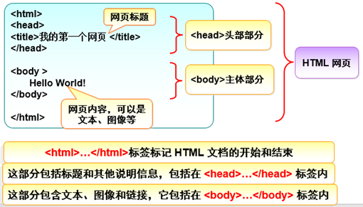
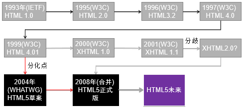

[TOC]


# 一、HTML 概述

# 1、HTML 定义

**什么是 HTML？**

HTML （HyperText Markup Language，超文本标记语言）是一种描述语言 / 标记语言，用来定义网页结构。

- HTML 不是一种编程语言。
- 标记语言（markup language）是一套**标记标签** （markup tag）。

浏览器不会显示 HTML 标签，而是使用标签来解释页面的内容。

- HTML：网页的“源码”
- 浏览器：“解释和执行” HTML 源码的工具 


**HTML 标签**

HTML 标记标签，简称 HTML 标签，是由**尖括号**包围的关键词。

```html
<title>	内容 </TiTLE>
```

- 通常**成对出现**。

  第一个标签是**开始标签**（Opening tag，开放标签、起始标签），第二个标签是**结束标签**（Closing tag，闭合标签）。
- **不区分大小写**。
- 最好**仅使用小写**字母。W3C 在 HTML 4 中**推荐**使用小写，未来 (X)HTML 版本**强制**使用小写。

[HTML 元素参考 - MDN（按功能分组）](https://developer.mozilla.org/zh-CN/docs/Web/HTML/Element)

[HTML 标签列表 - w3school（功能排序）](https://www.w3school.com.cn/tags/html_ref_byfunc.asp)


# 2、HTML 元素

**什么是 HTML 元素？**

HTML 元素（Element）以**开始标签**起始，以**结束标签**终止，**元素的内容**（Content）是开始标签与结束标签之间的内容。

<div align="center">  </div><br>


**HTML 标签与 HTML 元素的区别**

两者通常都是描述同样的意思，但严格来说 一个 HTML 元素包含了开始标签与结束标签。


## 语义化

**什么是 HTML 语义化？**

根据内容的结构化（内容语义化），选择合适的标签（代码语义化），便于开发者阅读和写出更优雅的代码，同时让浏览器的爬虫和机器很好地解析。


<u>确保使用了正确的元素来给予内容正确的意思、作用以及外形</u>。

- 在没有 CSS 的情况下，页面也能呈现出很好地内容结构、代码结构。

- 用户阅读体验。例如 title、 alt 用于解释名词、图片信息、 label 标签的活用；

- 有利于 SEO（搜索引擎优化）。和搜索引擎建立良好沟通，有助于爬虫抓取更多的有效信息：爬虫依赖于标签来确定上下文和各个关键字的权重；

- 方便其他设备解析（如屏幕阅读器、盲人阅读器、移动设备）以意义的方式来渲染网页，快速找到他们需要的信息；

- CSS / JavaScript 可以有效地定位它。

- 便于团队开发和维护，语义化更具可读性，是下一步网页的重要动向，遵循 W3C 标准的团队都遵循这个标准，可以减少差异化。

例子： `<h1>` 元素是一个语义元素，表示顶级标题的角色（或意义）。

```html
<h1>这是一个顶级标题</h1>
```

浏览器会给它一个更大的字形来让它看上去像个标题。更重要的是，它的语义值将以多种方式被使用，比如搜索引擎和屏幕阅读器。

在另一方面，可以使用 CSS 让任一元素看起来像一个顶级标题，如下：

```html
<span style="font-size: 32px; margin: 21px 0;">这是顶级标题吗？</span>
```

然而，由于 `<span>` 元素没有语义，所以它不会有任何上文提到的帮助。最好的方法是使用相关的 HTML 元素来标记这个项目。


**语义化标签**

- 结构标签

**非语义化标签**

- 表象元素：仅仅影响表象而且没有语义，被称为**表象元素（presentational elements）**。

  [b](https://developer.mozilla.org/zh-CN/docs/Web/HTML/Element/b), [big](https://developer.mozilla.org/zh-CN/docs/Web/HTML/Element/big), [i](https://developer.mozilla.org/zh-CN/docs/Web/HTML/Element/i), [small](https://developer.mozilla.org/zh-CN/docs/Web/HTML/Element/small), [tt](https://developer.mozilla.org/zh-CN/docs/Web/HTML/Element/tt)

- [abbr](https://developer.mozilla.org/zh-CN/docs/Web/HTML/Element/abbr), [acronym](https://developer.mozilla.org/zh-CN/docs/Web/HTML/Element/acronym), [cite](https://developer.mozilla.org/zh-CN/docs/Web/HTML/Element/cite), [code](https://developer.mozilla.org/zh-CN/HTML/Element/code), [dfn](https://developer.mozilla.org/zh-CN/docs/Web/HTML/Element/dfn), [em](https://developer.mozilla.org/zh-CN/docs/Web/HTML/Element/em), [kbd](https://developer.mozilla.org/zh-CN/docs/Web/HTML/Element/kbd), [strong](https://developer.mozilla.org/zh-CN/docs/Web/HTML/Element/strong), [samp](https://developer.mozilla.org/zh-CN/docs/Web/HTML/Element/samp), [var](https://developer.mozilla.org/zh-CN/docs/Web/HTML/Element/var)

- [a](https://developer.mozilla.org/zh-CN/docs/Web/HTML/Element/a), [bdo](https://developer.mozilla.org/zh-CN/HTML/Element/bdo), [br](https://developer.mozilla.org/zh-CN/HTML/Element/br), [img](https://developer.mozilla.org/zh-CN/HTML/Element/Img), [map](https://developer.mozilla.org/zh-CN/HTML/Element/map), [object](https://developer.mozilla.org/zh-CN/HTML/Element/object), [q](https://developer.mozilla.org/zh-CN/HTML/Element/q), [script](https://developer.mozilla.org/zh-CN/HTML/Element/Script),  `<span>` , [sub](https://developer.mozilla.org/zh-CN/HTML/Element/sub), [sup](https://developer.mozilla.org/zh-CN/HTML/Element/sup)

- [button](https://developer.mozilla.org/zh-CN/docs/Web/HTML/Element/button), [input](https://developer.mozilla.org/zh-CN/HTML/Element/Input), [label](https://developer.mozilla.org/zh-CN/HTML/Element/label), [select](https://developer.mozilla.org/zh-CN/HTML/Element/select), [textarea](https://developer.mozilla.org/zh-CN/HTML/Element/textarea)

 `<div>` 


## 块级元素和内联元素

大多数 HTML 元素被定义为**块级元素**（block element）或**内联元素**（inline element）（行内元素）。

- 块级元素：默认情况下， 独占一行，前后自动换行。例如**`<address>`**、`<div>` 、**`<form>`**、 **`<h1>`-`<h6>`**、**`<hr>`**、**`<li>`**、**`<ol>`**、`<p>` 、**`<table>`**、**`<ul>`**。
- 行内元素：可以和其他行内元素位于同一行， 不会导致文本换行， **不能设置其高度和宽度**。例如  `<a>`、**``**、**`<input>`**、**`<label>`**、**`<span>`**、**`<strong>`** 等。
- 行内块级元素：可以和其他行内元素位于同一行， 同时可以设置其高度和宽度。拥有内在尺寸，可设置高宽，不会自动换行。比如 ``、  `<input>` 、  `<button>` 等。注意：**`<label>`** 不是天生 inline-block 标签。


MDN：[块级元素](https://developer.mozilla.org/zh-CN/docs/Web/HTML/Block-level_elements)、[内联元素](https://developer.mozilla.org/zh-CN/docs/Web/HTML/Inline_elements)

DIY：[块级元素、内联元素、空元素](前端 - HTML 参考手册 元素 - 块级元素、内联元素、空元素.md)


## HTML5 元素分类

为了消除块元素和行内元素这两个概念引起的混淆，HTML5 中的元素分类比 HTML 4.01 中的分类更具体，总共分为 7 类，每种元素并不限于某一类型，有可能某个元素属于多个类型。

<div align="center">  </div><br>

- ###### Flow（流式元素）:

  这个分类基本上包含了 HTML 4.01 中的块状元素和行内元素。

```
a， abbr， address， area（如果它是map元素的后裔）， article， aside， audio， b， bdi， bdo， blockquote， br， button， canvas， cite， code， command， datalist， del， details， dfn， div， dl，em， embed， fieldset， figure， footer， form， h1， h2， h3， h4， h5， h6， header， hgroup， hr， i， iframe， img， input， ins， kbd， keygen， label， map， mark， math， menu， meter，nav， noscript， object， ol， output， p， pre， progress， q， ruby， s， samp， script， section， select， small， span， strong， style（如果该元素设置了scoped属性）， sub， sup， svg， table，textarea， time， u， ul， var， video， wbr， text
```

- ###### Heading（标题元素）:

```
h1， h2， h3， h4， h5， h6， hgroup
```

- ###### Sectioning（章节元素）:

```
article， aside， nav， section
```

- ###### Phrasing（段落元素）:

  基本上等同于HTML 4.01中行内元素的范围

```
a（如果其只包含段落式元素）， abbr， area（如果它是map元素的后裔）， audio， b， bdi， bdo， br， button， canvas， cite， code， command， datalist， del（如果其只包含段落式元素）， dfn， em， embed， i，iframe， img， input， ins（如果其只包含段落式元素）， kbd，keygen， label， map（如果其只包含段落式元素）， mark， math， meter， noscript，object， output， progress， q， ruby， s， samp， script，select， small， span， strong， sub， sup， svg， textarea，time， u， var， video， wbr， text
```

- ###### Embedded（嵌入元素）:

  嵌入式元素是引用或插入到文档中其他资源的元素。

```
audio， canvas， embed， iframe， img， math， object， svg， video
```

- ###### Interactive（交互元素）:

  交互式元素是专门用于与用户交互的元素。

```
a， audio（如果设置了controls属性）， button， details， embed， iframe， img（如果设置了usemap属性）， input（如果"type"属性不为hidden状态）， keygen， label， menu（如果"type"属性为toolbar状态），object（如果设置了usemap属性）， select， textarea， video（如果设置了controls属性）
```

- ###### Metadata（元数据元素）:

  ```
  base，command，link，meta，noscript，script，style，title
  ```


## 嵌套元素

把元素放到其它元素之中，称作嵌套。大多数 HTML 元素可以嵌套。

**要确保元素被正确的嵌套**。正确例子：

```HTML
<p>这是一个<strong>段落</strong></p>	<!--后打开的元素先关闭。-->
```


**嵌套规则**：

> https://www.jb51.net/html5/454857.html
>
> https://segmentfault.com/a/1190000009638226
>
> https://www.softwhy.com/article-33-1.html

- 块元素与块元素平级，内联元素与内联元素平级 。

- 块元素可以包含内联元素或某些块元素，内联元素可以包含其它的内联元素，但一般不能包含块元素。

- 有几个特殊的块级元素只能包含内嵌元素，不能再包含块级元素（除了自身外？），这几个特殊的标签是：**`<h1>`-`<h6>`**、**`<p>`** 、dt。它们的子元素是语句型元素。**`<p>` 元素不能包含 div**。在 `<h1>`-`<h6> `元素内嵌入 `<div>` 等元素所有浏览器可以解析正常。

- `<a>`  是内联元素，但是它可以包含除了它本身外的任意块元素。**`<a>` 元素可以包含`` **。 `<a>` 的子元素是transparent(以它的父元素允许的子元素为准)，但不包括交互型元素。在 `<a>` 元素内嵌入 `<a>` 元素会导致所有浏览器的解析错误。

- ul、ol 下都只能跟 li，dl 下只能跟 dt、dd。

- li 标签可以包含 div 标签，因为 li 和 div 标签都是装载内容的容器

- li元素的祖先元素可能是 li，但父元素不可能是 li。

- ul 不能嵌套 p 。在列表元素`<li><dt><dd>`等插入非列表兄弟元素会导致 IE6\IE7 的解析错误。

  ```html
  <ul><p>牛客网</p></ul>		<!--错误-->
  ```


- `<header>` 、 `<footer>` 不可嵌套 `<header>` 、 `<footer>` 。
- `<form>` 不可嵌套 `<form>` 
- `<caption>` 不可嵌套 `<table>` 
- `<button>` 子元素是语句型元素，不可嵌套交互型元素。
- `<dt>` 、`<th>` 不可嵌套 `<header>` 、 `<footer>` 、区块型元素、标题型元素。


## 置换元素

**替换元素**的内容和尺寸由外部资源所定义，而不是元素自身。

置换元素（**替换元素**）：浏览器根据元素的标签和属性，来决定元素的具体显示内容。 **``** 、 **`<input>`** 、 **`<textarea>`**、 **`<select>`**、`<object>` 、 `<video>` 都是置换元素。这些元素往往没有实际的内容，即是一个空元素。

例如：浏览器会根据 `` 标签的 src 属性的值来读取图片信息并显示出来，而如果查看代码，则看不到图片的实际内容；`<input>` 标签的 type 属性来决定是显示输入 框，还是单选按钮等。 

置换元素在其显示中生成了框，这也就是有的内联元素能够设置宽高的原因。


**不可替换元素**

大多数元素是不可替换元素，即其内容直接表现给用户端（如浏览器）。例如： `<label>` 。


## 元素语法

**不要忘记结束标签**

> 忘记使用结束标签，浏览器会出错吗？

即使忘记使用结束标签，大多数浏览器也会正确地显示 HTML，因为关闭标签是可选的。以下实例在浏览器中也能正常显示：

```html
<p>这是一个段落
```

- 不要依赖这种做法，因为可能会产生不可预料的结果或错误。
- 未来的 HTML 版本不允许省略结束标签。
- 清楚地标记某个元素在何处开始，并在何处结束，不论对编写者还是对浏览器来说，都会使代码更容易理解。


**空的 HTML 元素**

> 空元素（Empty elements），有时也被叫作 *void elements*。

没有内容的 HTML 元素被称为空元素。

空元素只有一个标签，通常用来在此元素所在位置插入 / 嵌入一些东西。

空元素没有关闭标签。关闭空元素的正确方法：在开始标签中添加斜杠，比如 `<br />` 。HTML、XHTML 和 XML 都接受这种方式。

```html

```

常见空元素：**`<embed>`**、**``**、**`<input>`**、**`<wbr>`**


 **`<br>` 还是 `<br />` ？**

`<br>` 标签定义换行，是空元素 。

在 XHTML、XML 以及未来版本的 HTML 中，所有元素都必须被关闭。即使 `<br>` 在所有浏览器中都是有效的，但使用 `<br />` 是更长远的保障。


## 属性

大多数 HTML 元素可拥有**属性**。属性为 HTML 元素提供附加信息，这些信息不会出现在实际内容中。

<div align="center">  </div><br>

- 属性总是以名称/值对的形式出现。一个属性必须包含如下内容：
  - 一个空格。在元素名和属性名之间以及两个属性之间要有一个**空格**。
  - 属性名称。后面跟着一个等于号。
  - 一个属性值。

- 属性总是在 HTML 元素的**开始标签**中规定。


**使用小写属性**

- 属性大小写不敏感。
- 推荐小写。W3C 在 HTML 4 中推荐小写的属性/属性值，新版本的 (X)HTML 要求使用小写属性。


**布尔属性**

没有值的属性是合法的，这些属性被称为布尔属性。他们只能有跟它的属性名一样的属性值。

```html
<!-- 使用 disabled 属性来防止终端用户输入文本到输入框中 -->
<input type="text" disabled="disabled"> 
```

方便起见，可以将其写成以下形式：

```html
<input type="text" disabled>
```


**建议始终添加引号**

在某些情况下，省略包围属性值的引号是被允许的。

```html
<a href=https://www.mozilla.org/>收藏页面</a>
```

但是在某些情况下会破坏标记。下例中，再添加 title 属性时会出错：

```html
<a href=https://www.mozilla.org/ title=The Mozilla homepage>收藏页面</a>
```

浏览器会把 title 属性理解为三个属性 —— title的属性值为"The“，另外还有两个布尔属性 “`Mozilla`” 和 “`homepage`”。

建议始终添加引号——这样可以避免很多问题，并且使代码更易读。


**单引号或者双引号？**

属性值应该始终被包括在引号内。双引号是最常用的，使用单引号也没有问题。

```html
<a href="http://www.example.com">示例站点链接</a>
<a href='http://www.example.com'>示例站点链接</a>
```

注意：

- 单引号和双引号不能在一个属性值里面混用。

    ```html
  <!--下面的语法是错误的-->
  <a href="http://www.example.com'>示例站点链接</a>		
  ```

- 已使用一种引号，可以在此引号中嵌套另外一种引号。

    ```html
    <a href="" title="你觉得'好玩吗'？">示例站点链接</a>
    ```

- 如果将引号当作文本显示在 HTML 中，必须使用[实体引用](https://developer.mozilla.org/zh-CN/docs/Learn/HTML/Introduction_to_HTML/Getting_started#实体引用：_在HTML中包含特殊字符)。


**HTML 属性参考手册**

下面列出了适用于大多数 HTML 元素的属性：

| 属性  | 描述                                                         |
| :---- | :----------------------------------------------------------- |
| class | 为html元素定义一个或多个类名（classname）(类名从样式文件引入) |
| id    | 定义元素的唯一id                                             |
| style | 规定元素的行内样式（inline style）                           |
| title | 描述了元素的额外信息 (作为工具条使用)                        |


**src 与 href**

- src 用于替换当前元素， href 用于在当前文档和引用资源之间确立联系。
- src 表示来源地址（引入），用在 img 、script 、ifame 等元素上。href 表示超文本引用，用在 link 和 a 等元素上。

src（source），指向外部资源的位置。在请求 src 资源时会将其指向的资源下载并应用到文档内，例如 JS 脚本， img 图片和 frame 等元素。

当浏览器解析到该元素时，会暂停其他资源的下载和处理，直到将该资源加载、编译、执行完毕。这也是为什么将 JS 脚本放在底部而不是头部的原因。

```html
<script src ='js.js'></script>
```

href （Hypertext Reference），指向网络资源所在位置，建立和当前元素（锚点）或当前文档（链接）之间的链接。

下例中，浏览器会识别该文档为 CSS 文件，就会并行下载资源并且不会停止对当前文档的处理。这也是为什么建议使用 link 方式来加载 CSS，而不是使用 @import 方式的原因。

```html
<link href='common.css' rel='stylesheet'/>
```


# 3、HTML 文档

HTML 文档，也叫做 **Web 页面**，由嵌套的 HTML 元素构成。

HTML 文档的基本结构：

<div align="center">  </div><br>

例子：

```html
<!DOCTYPE html>
<html>	<!--html 是根元素，后面的内容描述网页，其他所有元素必须是这个元素的子节点。-->
  <head>						<!--head 是一个容器，包含内容不会显示在页面中-->
    <meta charset="utf-8">		<!--设置文档使用 utf-8 字符集编码-->
    <title>我的测试站点</title>	<!--设置页面标题，出现在浏览器标签-->
  </head>
  <body>					<!-- body 后面的内容会显示在页面中-->
    <h1>我的第一个标题</h1>	   <!--标题-->
    <p>这是我的页面</p>			<!--段落-->
  </body>
</html>
```

一份标准的 HTML 文档有哪几个必须的 HTML 标签？

答： `<html>` 、 `<head>` 、 `<title>` 、 `<body>` 。


## `<!DOCTYPE>` 

**定义及用途**

`<!DOCTYPE>` 不是 HTML 标签。`<!DOCTYPE>` <u>声明文档类型</u>，<u>**告诉浏览器按照何种规范解析页面**</u>，有助于浏览器正确显示网页。


HTML 有多个不同的版本，只有完全明白页面中使用的确切 HTML 版本，浏览器才能完全正确地显示出 HTML 页面。

 [DOCTYPE 参考手册](https://www.runoob.com/tags/tag-doctype.html)


**使用说明**

`<!DOCTYPE>` 声明位于文档中的最前面的位置，处于 `<html>` 标签之前。

doctype 声明不区分大小写，以下方式均可：

```html
<!DOCTYPE html>
<!DOCTYPE HTML>
<!doctype html>
<!Doctype Html>
```


### **HTML 版本**

<div align="center">  </div><br>

从 Web 诞生早期至今，已经发展出多个 HTML 版本：

| 版本          | 年份 |
| :------------ | :--- |
| HTML          | 1991 |
| HTML+         | 1993 |
| HTML 2.0      | 1995 |
| HTML 3.2      | 1997 |
| **HTML 4.01** | 1999 |
| XHTML 1.0     | 2000 |
| **HTML5**     | 2012 |
| XHTML5        | 2013 |

HTML5 之前的 HTML 版本是 HTML 4.01。


------


### **文档类型**

> 《JavaScript 高级程序设计》Ch2.3 P16

在 HTML 4.01 中，`<!DOCTYPE>` 声明需引用 DTD （Document Type Definition，文档类型声明），因为 HTML 4.01 是基于 SGML （Standard Generalized Markup Language，标准通用标记语言）。DTD 指定了标记语言的规则，确保了浏览器能够正确的渲染内容。

HTML 4.01 规定了三种不同的 `<!DOCTYPE>` 声明，分别是：

- Strict：包含所有 HTML 元素和属性，但不包括表象或过时的元素（如 font ）。框架集是不允许的。
- Transitional：包含所有 HTML 元素和属性，包括表象或过时的元素（如 font ）。框架集是不允许的。
- Frameset：与 Transitional 相同，但是允许使用框架集内容。


IE5.5 引入了文档模式的概念，而这个概念是通过使用文档类型 `<!DOCTYPE>` 切换实现的。最初的两种文档模式是：

**严格模式：**（标准模式，standards mode），指浏览器按照 W3C 标准解析代码。严格模式的排版和 JavaScript 运作模式以该浏览器支持的最高标准运行。

**混杂模式：**（怪异模式、兼容模式，quirks mode），指浏览器用自己的方式解析代码。因为不同浏览器解析执行的方式不一样，所以我们称之为怪异模式。页面以宽松的<u>向后兼容</u>的方式显示，模拟老式浏览器的行为以防止站点无法工作（主要针对IE 浏览器），可以实现 IE5.5 以下版本浏览器的渲染模式。 防止浏览器无法兼容页面。

> 向后兼容中的“后”字指“落后”，而不是“后来”，表示站在新版本的立场上讨论过去版本的兼容性问题。

这两种模式主要影响 CSS 内容的呈现，但在某些情况下也会影响到 JavaScript 的解释执行。

在 IE 引入文档模式的概念后，其他浏览器也纷纷效仿。在此之后，IE 又提出一种所谓的**准标准模式**（almost standards mode）。准标准模式与标准模式非常接近，它们的差异几乎可以忽略不计。因此，当有人提到“标准模式”时，有可能是指这两种模式中的任何一种。


**来源**：

Netscape4 和 IE4 实现 CSS 机制时，并没有遵循 W3C 提出的标准。Netscape4 提供了糟糕的支持，IE4 虽然接近标准，但依旧未能完全正确的支持标准。尽管 IE5 修复了 IE4 许多的问题，但是依然延续 CSS 实现中的其它故障（主要是盒模型问题）。

为了保障自己的网站在各个浏览器上显示正确，网页开发者们不得不依据各个浏览器自身的规范来使用 CSS，因此大部分网站的 CSS 实现并不符合 W3C 规范的标准。

**区分：**

**浏览器如何决定使用哪个模式？**与网页中的 DTD （ `<!DOCTYPE>` ）直接相关。

- 严格模式：严格 DTD ；有 URI 的过渡 DTD。
- 混杂模式：**DTD 不存在或者格式不正确**；没有 URI 的过渡 DTD 。
- 准标准模式：过渡 DTD 或 框架集 DTD 。
- HTML5 没有 DTD ，没有严格模式与混杂模式之分，HTML5 有相对宽松的语法，实现时已经尽可能大的实现了向后兼容。

**意义：**

随着标准一致性越来越重要，逐渐遵循 W3C 的标准是前进的方向。但是如果浏览器突然以正确的方式解析现存的 CSS，陈旧的网站的显示必然会受到影响。所以，所有的浏览器都需要提供两种模式：混杂模式服务于旧式规则，而严格模式服务于标准规则。


------


### **常用声明**

早期的 HTML (大约 1991 年 2 月)，文档类型声明类似于链接，规定了 HTML 页面必须遵从的良好规则，能自动检测错误和其他有用的东西。

**HTML 4.01 Strict**

```html
<!DOCTYPE HTML PUBLIC "-//W3C//DTD HTML 4.01//EN" "http://www.w3.org/TR/html4/strict.dtd">
```

**HTML 4.01 Transitional**

```
<!DOCTYPE HTML PUBLIC "-//W3C//DTD HTML 4.01 Transitional//EN" "http://www.w3.org/TR/html4/loose.dtd">
```

**HTML 4.01 Frameset**

```
<!DOCTYPE HTML PUBLIC "-//W3C//DTD HTML 4.01 Frameset//EN" "http://www.w3.org/TR/html4/frameset.dtd">
```

**XHTML 1.0 Strict**

```
<!DOCTYPE html PUBLIC "-//W3C//DTD XHTML 1.0 Strict//EN" "http://www.w3.org/TR/xhtml1/DTD/xhtml1-strict.dtd">
```

**XHTML 1.0 Transitional**

```
<!DOCTYPE html PUBLIC "-//W3C//DTD XHTML 1.0 Transitional//EN" "http://www.w3.org/TR/xhtml1/DTD/xhtml1-transitional.dtd">
```

**XHTML 1.0 Frameset**

```
<!DOCTYPE html PUBLIC "-//W3C//DTD XHTML 1.0 Frameset//EN" "http://www.w3.org/TR/xhtml1/DTD/xhtml1-frameset.dtd">
```

**XHTML 1.1**

与 XHTML 1.0 Strict 相同，但允许添加模块（例如为东亚语言提供 ruby 支持）。

```
<!DOCTYPE html PUBLIC "-//W3C//DTD XHTML 1.1//EN" "http://www.w3.org/TR/xhtml11/DTD/xhtml11.dtd">
```

**HTML5**

HTML5 不是基于 SGML，因此不要求引用 DTD。

```
<!DOCTYPE html>
```


## `<body>` 

通常在浏览器内容区看到的内容，都是放入在 `<body>`  之间

`<body>` 可选的属性

| 属性                                                         | 值                               | 描述                                                         |
| :----------------------------------------------------------- | :------------------------------- | :----------------------------------------------------------- |
| [alink](https://www.w3school.com.cn/tags/att_body_alink.asp) | *rgb(x,x,x)**#xxxxxx**colorname* | 不赞成使用。请使用样式取代它。规定文档中活动链接（active link）的的颜色。 |
| [background](https://www.w3school.com.cn/tags/att_body_background.asp) | *URL*                            | 不赞成使用。请使用样式取代它。规定文档的背景图像。           |
| [bgcolor](https://www.w3school.com.cn/tags/att_body_bgcolor.asp) | *rgb(x,x,x)**#xxxxxx**colorname* | 不赞成使用。请使用样式取代它。规定文档的背景颜色。           |
| [link](https://www.w3school.com.cn/tags/att_body_link.asp)   | *rgb(x,x,x)**#xxxxxx**colorname* | 不赞成使用。请使用样式取代它。规定文档中未访问链接的默认颜色。 |
| [text](https://www.w3school.com.cn/tags/att_body_text.asp)   | *rgb(x,x,x)**#xxxxxx**colorname* | 不赞成使用。请使用样式取代它。规定文档中所有文本的颜色。     |
| [vlink](https://www.w3school.com.cn/tags/att_body_vlink.asp) | *rgb(x,x,x)**#xxxxxx**colorname* | 不赞成使用。请使用样式取代它。规定文档中**已被访问链接**的颜色。 |


## 加载顺序

在不涉及样式情况下,页面元素的优先显示与标签选用无关。

html 文档加载是从上到下加载，只与标签的上下顺序有关，与标签选用无关。


# 4、其它

## 空白

多余的空白可以增加代码的可读性。HTML 解释器会将连续出现的空白字符（空格、换行）减少为一个单独的空格符。

```html
<p>狗 狗 很 呆 萌。</p>
<p>狗 狗        很
         呆 萌。</p>
```

<p>狗 狗 很 呆 萌。</p>

<p>狗 狗        很
         呆 萌。</p>


## 实体引用

在 HTML 中，某些字符是预留的。这些特殊字符是 HTML 语法自身的一部分，比如 `<`， `>`，`"`，`'` 和 `&` 等。

如果希望正确地显示预留字符，不被浏览器视为代码并解释，必须在 HTML 源代码中使用字符引用（实体引用，字符实体）。

字符引用是表示字符的特殊编码，每个字符引用以符号 `&` 开始，以分号 `;` 结束。

虽然 HTML 不区分大小写，但实体字符对大小写敏感。

```html
<p>例子1：HTML 中用 <p> 来定义段落元素。</p>
<p>例子2：HTML 中用 &lt;p&gt; 来定义段落元素</p>
```

**浏览器显示**：

<p>例子1：HTML 中用 <p> 来定义段落元素。</p>
<p>例子2：HTML 中用 &lt;p&gt; 来定义段落元素</p>


实体应用表：

| 显示结果 | 描述        | 实体名称            | 实体编号 |
| :------- | :---------- | :------------------ | :------- |
|          | 空格        | `&nbsp;`            | `&#160;` |
| <        | 小于号      | `&lt;`              | `&#60;` |
| >        | 大于号      | `&gt;`              | `&#62;` |
| &        | 和号        | `&amp;`             | `&#38;` |
| "        | 引号        | `&quot;`            | `&#34;` |
| '        | 撇号        | `&apos;` (IE不支持) | `&#39;` |
| ￠       | 分          | `&cent;`           | `&#162;` |
| £        | 镑          | `&pound;`          | `&#163;` |
| ¥        | 人民币/日元 | `&yen;`            | `&#165;` |
| €        | 欧元        | `&euro;`           | `&#8364;` |
| §        | 小节        | `&sect;`           | `&#167;` |
| ©        | 版权        | `&copy;`           | `&#169;` |
| ®        | 注册商标    | `&reg;`            | `&#174;` |
| ™        | 商标        | `&trade;`          | `&#8482;` |
| ×        | 乘号        | `&times;`          | `&#215;` |
| ÷        | 除号        | `&divide;`         | `&#247;` |


> [XML和HTML字符实体引用列表](http://en.wikipedia.org/wiki/List_of_XML_and_HTML_character_entity_references)。
>
>  [HTML 实体参考手册](https://www.runoob.com/tags/ref-entities.html)。


## 注释

注释标签  `<!--` 与 `-->`   用于在 HTML 插入注释。

注释可以在 HTML 中放置通知和提醒信息，还可以用于 HTML 纠错。

```html
<!-- 此刻不显示图片：

-->
```


**条件注释**

条件注释定义只有 Internet Explorer 执行的 HTML 标签。

```html
<!--[if IE 8]>
    .... some HTML here ....
<![endif]-->
```


**软件程序标签**

各种 HTML 软件程序也能够生成 HTML 注释。

例如 `<!--webbot bot-->` 标签会被包围在由 FrontPage 和 Expression Web 创建的 HTML 注释中。

作为一项规则，这些标签的存在，有助于对创建这些标签的软件的支持。


