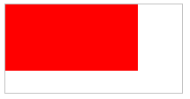

# 四、多媒体

## 音/视频


HTML5 使用 `<audio>` 元素在网页上嵌入音频元素，使用 `<video>` 标签嵌入视频元素。

- control 属性供添加播放、暂停和音量控件。

- 元素支持多个 `<source>` 元素，可以链接不同的音/视频文件。浏览器将使用第一个可识别的格式。

 `<audio>` 支持的格式包括MP3 、Wav 和Ogg等

```html
<audio controls>
  <source src="horse.ogg" type="audio/ogg">
  <source src="horse.mp3" type="audio/mpeg">
您的浏览器不支持 audio 元素。
</audio>
```

`<video>` 元素支持三种视频格式： MP4，WebM，和 Ogg。

```html
<video width="320" height="240" controls>
  <source src="movie.mp4" type="video/mp4">
  <source src="movie.ogg" type="video/ogg">
您的浏览器不支持Video标签。
</video>
```

| 浏览器            | MP4                  | WebM | Ogg  |
| :---------------- | :------------------- | :--- | :--- |
| Internet Explorer | YES                  | NO   | NO   |
| Chrome            | YES                  | YES  | YES  |
| Firefox           | YES                  | YES  | YES  |
| Safari            | YES                  | NO   | NO   |
| Opera             | YES (从 Opera 25 起) | YES  | YES  |


**使用 DOM 进行控制**

 `<video>` 和 `<audio>` 元素的方法、属性和事件可以使用 JavaScript 进行控制。<u>JavaScript 可与 HTML5 视频和音频标记结合起来使用来增强其行为</u>。

其中的方法用于播放、暂停以及加载等。其中的属性（比如时长、音量等）可以被读取或设置。其中的 DOM 事件能够通知您，比方说，`<video>` 元素开始播放、已暂停，已停止，等等。

下面的例子调用了两个方法：play() 和 pause()。同时使用了两个属性：paused 和 width。

```html
<div style="text-align:center"> 
  <button onclick="playPause()">播放/暂停</button> 
  <button onclick="makeBig()">放大</button>
  <button onclick="makeSmall()">缩小</button>
  <button onclick="makeNormal()">普通</button>
  <br> 
  <video id="video1" width="420">
    <source src="mov_bbb.mp4" type="video/mp4">
    <source src="mov_bbb.ogg" type="video/ogg">
    您的浏览器不支持 HTML5 video 标签。
  </video>
</div> 

<script> 
var myVideo=document.getElementById("video1"); 
function playPause(){ 
	if (myVideo.paused) 
	  myVideo.play(); 
	else 
	  myVideo.pause(); 
} 

function makeBig(){ 
	myVideo.width=560; 
} 

function makeSmall(){ 
	myVideo.width=320; 
} 

function makeNormal(){ 
	myVideo.width=420; 
} 
</script> 
```


## WebRTC


## Camera API


# 五、图像

## `<canvas>` 


HTML5 `<canvas>` 元素是图形容器，通过 JavaScript （[Canvas](https://developer.mozilla.org/zh-CN/docs/Web/API/Canvas_API) API 或 [WebGL](https://developer.mozilla.org/zh-CN/docs/Web/API/WebGL_API) API）绘制图形及图形动画。

浏览器支持：Chrome 4.0，**IE 9.0**，FireFox 2.0，Safari 3.1，Opera 9.0。


Canvas 元素用于在网页上绘制图形，该元素标签的强大之处在于可以直接在HTML 上进行图形操作。 `<canvas>` 拥有多种绘制路径、矩形、圆形、字符以及添加图像的方法。


例子：画一个矩形

**创建一个画布**

一个画布在网页中是一个矩形框，通过 `<canvas>` 元素来绘制。

脚本中通过 id 属性引用标签，width 和 height 属性定义的画布的大小。

```html
<canvas id="myCanvas" width="200" height="100"></canvas>
```

默认情况下 `<canvas>` 元素没有边框和内容。使用 style 属性来添加边框。

```html
<canvas id="myCanvas" width="200" height="100"
style="border:1px solid #000000;">
</canvas>
```

**使用 JavaScript 来绘制图像**

canvas 元素本身没有绘图能力。所有的绘制工作必须在 JavaScript 内部完成。

调用 canvas 对象的 **getContext** 方法来获取绘图环境。

```js
var c=document.getElementById("myCanvas");		// 找到 canvas 元素
var ctx=c.getContext("2d");						// 创建 context 对象
ctx.fillStyle="#FF0000";						// 绘制一个红色的矩形
ctx.fillRect(0,0,150,75);
```

<div align="center">  </div><br>

JavaScript 方法：

| JavaScript 方法                        | 描述                                                         |
| -------------------------------------- | ------------------------------------------------------------ |
| fillStyle                              | 可以是CSS颜色，渐变，或图案                                  |
| fillRect(*x,y,width,height*)           | 矩形当前的填充方式。从 *(x,y)* 开始，在画布上绘制 *width x height* 的矩形。 |
| moveTo(*x,y*)                          | 定义线条开始坐标                                             |
| lineTo(*x,y*)                          | 定义线条结束坐标                                             |
| stroke()                               | 绘制线条                                                     |
| **arc(x,y,r,start,stop)**              |                                                              |
| font                                   | 定义字体                                                     |
| fillText(*text,x,y*)                   | 在 canvas 上绘制实心的文本                                   |
| strokeText(*text,x,y*)                 | 在 canvas 上绘制空心的文本                                   |
| createLinearGradient(*x,y,x1,y1*)      | 创建线条渐变                                                 |
| createRadialGradient(*x,y,r,x1,y1,r1*) | 创建一个径向/圆渐变                                          |
| addColorStop()                         | 指定颜色停止                                                 |
| drawImage(*image,x,y*)                 | 把一幅图像放置到画布上                                       |

**arc() 方法**

*context*.arc(*x,y,r,sAngle,eAngle,counterclockwise*);

| 参数               | 描述                                                         |
| :----------------- | :----------------------------------------------------------- |
| *x*                | 圆的中心的 x 坐标。                                          |
| *y*                | 圆的中心的 y 坐标。                                          |
| *r*                | 圆的半径。                                                   |
| *sAngle*           | 起始角，以弧度计（弧的圆形的三点钟位置是 0 度）。            |
| *eAngle*           | 结束角，以弧度计。                                           |
| *counterclockwise* | 可选。规定应该逆时针还是顺时针绘图。False = 顺时针，true = 逆时针。 |

arc(x,y,r,0,Math.PI,true);是一个半圆

arc(x,y,r,0,2Math.PI,true);才是绘制一整个圆


**Canvas 坐标**

canvas 是一个二维网格，左上角坐标为 (0,0)。

**坐标实例：**鼠标移动的矩形框上，显示定位坐标。

<iframe src="https://www.runoob.com/try/demo_source/tryhtml5_canvas_coordinates.htm" frameborder="0" style="border: 0px; margin: 0px; padding: 0px; overflow: hidden; width: 400px; height: 120px;"></iframe>


## WebGL


WebGL（Web Graphics Library，Web图形库）是一个 JavaScript API，可在任何兼容的 Web 浏览器中渲染高性能的交互式 3D 和 2D 图形，而无需使用插件。WebGL 通过引入一个与 OpenGL ES 2.0 非常一致的 API 来做到这一点，该 API 可以在HTML5 `<canvas>` 元素中使用。 这种一致性使 API 可以利用用户设备提供的硬件图形加速。

WebGL 技术标准免去了开发网页专用渲染插件的麻烦，可被用于创建具有复杂 3D 结构的网站页面，甚至可以用来设计 3D 网页游戏等等。

WebGL 完美地解决了现有的 Web 交互式三维动画的两个问题：

- 第一，无需任何浏览器插件支持 ，通过 HTML 脚本实现 Web 交互式三维动画的制作 ;
- 第二，通过统一的、标准的、跨平台的 OpenGL 接口，利用底层的图形硬件加速功能，进行图形渲染。

WebGL 2 API 引入了对大部分的 OpenGL ES 3.0 功能集的支持；它是通过 `WebGL2RenderingContext` 界面提供的。


## 内联 SVG

SVG 是由 W3C 自 1999 年开始开发的开放标准，于 2003 年 1 月 14 日成为 W3C 推荐标准。

SVG （Scalable Vector Graphics，可伸缩矢量图形），是一种用于描述基于二维的矢量图形，基于 XML 的标记语言。本质上，SVG 相对于图像，就好比 HTML 相对于文本。SVG 严格遵从 XML 语法，并用文本格式的描述性语言来描述图像内容，因此是一种和图像分辨率无关的矢量图形格式。

浏览器支持：IE 9+， Firefox， Opera， Chrome， 和 Safari 支持内联 SVG。


与其他图像格式相比（比如 JPEG 和 GIF），使用 SVG 的优势在于：

- 任意放缩。SVG 是可伸缩的。SVG 图像在放大或改变尺寸的情况下其图形质量不会有损失。

- 文本独立。SVG 图像中的文字独立于图像，文字保留可编辑和可搜寻的状态。SVG 图像可通过文本编辑器来创建和修改，可被搜索、索引、脚本化或压缩。

- 较小文件。总体来讲，SVG 文件比那些 GIF 和 JPEG 格式的文件要小很多，因而下载也很快。

- 超强显示效果。SVG 图像可在任何的分辨率下被高质量地打印。SVG 图像在屏幕上总是边缘清晰，它的清晰度适合任何屏幕分辨率和打印分辨率。

- 超级颜色控制。SVG 图像提供一个 1600 万种颜色的调色板，支持 ICC 颜色描述文件标准、 RGB 、线 X 填充、渐变和蒙版。

- 交互 X 和智能化。SVG 面临的主要问题一个是如何和已经占有重要市场份额的矢量图形格式 Flash 竞争的问题，另一个问题就是 SVG 的本地运行环境下的厂家支持程度。


在 HTML5 中，可以将 SVG 元素直接嵌入 HTML 页面中：

```html
<svg xmlns="http://www.w3.org/2000/svg" version="1.1" height="190">
   <polygon points="100,10 40,180 190,60 10,60 160,180"
   style="fill:lime;stroke:purple;stroke-width:5;fill-rule:evenodd;"/>
</svg>
```

<svg xmlns="http://www.w3.org/2000/svg" version="1.1" height="190">
   <polygon points="100,10 40,180 190,60 10,60 160,180"
   style="fill:lime;stroke:purple;stroke-width:5;fill-rule:evenodd;"/>
</svg>


```html
<svg xmlns="http://www.w3.org/2000/svg" version="1.1">
    <rect style="fill:rgb(255,100,);" height="200" width="400"></rect>
</svg>
```

<svg xmlns="http://www.w3.org/2000/svg" version="1.1">
    <rect style="fill:rgb(255,100,);" height="200" width="400"></rect>
</svg>


## Canvas 与 SVG

相同之处：Canvas 和 SVG 都可以使用 JavaScript 来绘制。

不同之处：

SVG 是一种使用 XML 描述 2D 图形的语言。Canvas 通过 JavaScript 来绘制 2D 图形。

SVG 基于 XML，这意味着 SVG DOM 中的每个元素都是可用的。可以为某个元素附加 JavaScript 事件处理器。

在 SVG 中，每个被绘制的图形均被视为对象。如果 SVG 对象的属性发生变化，那么浏览器能够自动重现图形。

Canvas 是逐像素进行渲染的。在 canvas 中，一旦图形被绘制完成，它就不会继续得到浏览器的关注。如果其位置发生变化，那么整个场景也需要重新绘制，包括任何或许已被图形覆盖的对象。

canvas **不能动态渲染**，绘制完成不能再通过 JS 去修改，只能从源码修改。

| Canvas                                         | SVG                                                     |
| :--------------------------------------------- | :------------------------------------------------------ |
| 依赖分辨率图像                                 | 不依赖分辨率                                            |
| 不支持事件处理器                               | 支持事件处理器                                          |
| 弱的文本渲染能力                               | 最适合带有大型渲染区域的应用程序（比如谷歌地图）        |
| 能够以 .png 或 .jpg 格式保存结果图像           | 复杂度高会减慢渲染速度（任何过度使用 DOM 的应用都不快） |
| 最适合密集型的游戏，其中的许多对象会被频繁重绘 | 不适合游戏应用                                          |


