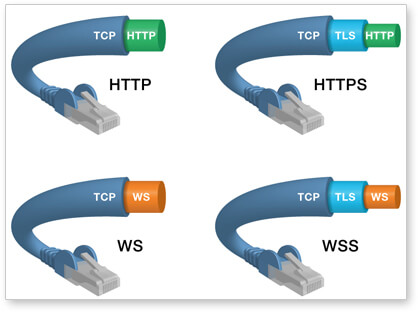

# 二、通信

## Web Sockets


> 阮一峰：http://www.ruanyifeng.com/blog/2017/05/websocket.html
>
> 菜鸟教程：https://www.runoob.com/html/html5-websocket.html


**为什么需要 WebSocket？**

HTTP 协议有一个缺陷：单向请求，即通信只能由客户端发起，做不到服务器主动向客户端推送信息。

很多网站为了实现推送技术，所用的技术都是 Ajax 轮询（每隔一段时间，就发出一个询问，了解服务器有没有新的信息）。典型场景：聊天室。

然而，轮询的效率低，非常浪费资源（因为必须不停连接，或者 HTTP 连接始终打开）。

所以，工程师们发明了 WebSocket 协议。HTML5 定义的 WebSocket 协议，能更好的节省服务器资源和带宽，并且能够更实时地进行通讯。


**什么是 WebSocket？**

WebSocket 是 HTML5 中的一种网络通信协议，在单个 TCP 连接上进行全双工通讯。WebSocket 属于**服务器推送技术**的一种。

WebSocket 最大的特点是，允许服务端主动向客户端推送数据。在 WebSocket API 中，浏览器和服务器只需要完成一次握手，两者之间就直接可以创建持久性的连接，并进行双向数据传输。

WebSocket 协议在 2008 年诞生，2011 年成为国际标准。所有浏览器都支持。

<div align="center">  </div><br>

WebSocket 其他特点包括：

（1）建立在 TCP 协议之上，服务器端的实现比较容易。

（2）与 HTTP 协议有着良好的兼容性。默认端口也是 80 和 443，并且握手阶段采用 HTTP 协议，因此握手时不容易屏蔽，能通过各种 HTTP 代理服务器。

（3）数据格式比较轻量，性能开销小，通信高效。

（4）可以发送文本，也可以发送二进制数据。

（5）没有同源限制，客户端可以与任意服务器通信。

（6）协议标识符是`ws`（如果加密，则为`wss`），服务器网址就是 URL。

```
ws://example.com:80/some/path
```

<div align="center">  </div><br>

**一个网页脚本的例子**

[运行结果](http://jsbin.com/muqamiqimu/edit?js,console)

```javascript
var ws = new WebSocket("wss://echo.websocket.org");

ws.onopen = function(evt) { 
  console.log("Connection open ..."); 
  ws.send("Hello WebSockets!");
};

ws.onmessage = function(evt) {
  console.log( "Received Message: " + evt.data);
  ws.close();
};

ws.onclose = function(evt) {
  console.log("Connection closed.");
};  
```


### 客户端的 API

**WebSocket 构造函数**

WebSocket 对象作为一个构造函数，用于新建 WebSocket 实例。

执行下面语句后，客户端会与服务器连接。

```
var ws = new WebSocket('ws://localhost:8080');
```

实例对象的所有属性和方法清单，参见[这里](https://developer.mozilla.org/en-US/docs/Web/API/WebSocket)。


**webSocket.readyState**


**webSocket.onopen**


**webSocket.onclose**


### 服务端的实现

WebSocket 服务器的实现，可以查看维基百科的[列表](https://en.wikipedia.org/wiki/Comparison_of_WebSocket_implementations)。

常用的 Node 实现有以下三种。

- [µWebSockets](https://github.com/uWebSockets/uWebSockets)
- [Socket.IO](http://socket.io/)
- [WebSocket-Node](https://github.com/theturtle32/WebSocket-Node)

WebSocket 服务器：[Websocketd](http://websocketd.com/)。最大特点，就是后台脚本不限语言，标准输入（stdin）就是 WebSocket 的输入，标准输出（stdout）就是 WebSocket 的输出。


## Server-sent events

允许服务器向客户端推送事件，而不是仅在响应客户端请求时服务器才能发送数据的传统范式。


HTML5 服务器发送事件（server-sent event）允许网页获得来自服务器的更新。


Server-Sent 事件指的是网页自动获取来自服务器的更新。

以前也可能做到这一点，前提是网页不得不询问是否有可用的更新。通过服务器发送事件，更新能够自动到达。

例子：Facebook/Twitter 更新、股价更新、新的博文、赛事结果等。


## WebRTC

这项技术，其中的 RTC 代表的是即时通信，允许连接到其他人，直接在浏览器中控制视频会议，而不需要一个插件或是外部的应用程序。


# 三、离线 & 存储

## HTML5 Web 存储

HTML5 Web 存储是一个比 cookie 更好的本地存储方式。使用 HTML5 可以在本地存储用户的浏览数据。

早些时候，本地存储使用的是 cookie。但是 Web 存储需要更加的安全与快速。这些数据只用于用户请求网站数据上。它也可以存储大量的数据，而不影响网站的性能。

数据以 键/值 对存在，Web 网页的数据只允许该网页访问使用。


## DOM 存储


在较高版本的浏览器中，提供了 sessionStorage 和 globalStorage。在 HTML5 规范中，用 localStorage 取代 globalStorage。

HTML5 中的 Web Storage 包括两种离线存储方式， 分别是 sessionStorage 和 localStorage。它们可以方便的在 Web 请求之间保存数据。有了本地数据，就可以避免数据在浏览器和服务器间不必要地来回传递。


sessionStorage 和 localStorage 是 HTML5 Web Storage API 提供的。

- localStorage \-  用于持久化的本地存储，可长久保存整个网站的数据，保存的数据没有过期时间，浏览器关闭后数据不丢失，直到手动去除。

- sessionStorage - 用于临时保存同一窗口(或标签页)的数据，在关闭窗口或标签页之后将会删除这些数据。引入了“浏览器窗口”的概念。

  说法二：用于在本地存储一个会话中的数据，这些数据只有同一个会话中的页面才能访问，当会话结束后，数据也随之销毁。因此 sessionStorage 仅仅是会话级别的存储，不是一种持久化的本地存储。

<div align="center">  </div><br>


**使用**

在使用 Web 存储前，应检查浏览器是否支持 localStorage 和 sessionStorage：

```js
if(typeof(Storage)!=="undefined"){
    // 是的! 支持 localStorage  sessionStorage 对象!
    // 一些代码.....
} else {
    // 抱歉! 不支持 web 存储。
}
```

不管是 localStorage，还是 sessionStorage，可使用的 API 都相同，常用的有如下几个（以 localStorage 为例）：

- 保存数据：**localStorage.setItem(key,value)**;
- 读取数据：**localStorage.getItem(key)**;
- 删除单个数据：localStorage.removeItem(key);
- 删除所有数据：localStorage.clear();
- 得到某个索引的key：localStorage.key(index);


sessionStorage、 localStorage 、 cookie 都是在浏览器端（客户端）存储数据的方式。

- cookies 
  - **会发送到服务器端，浪费带宽。其余两个不会**。
  - 每个域名存储量比较小（各浏览器不同，大致 4K ）
  - 所有域名的存储量有限制（各浏览器不同，大致 4K ）
  - 有个数限制（各浏览器不同）。
- localStorage
  - 作用域：只要在相同的协议、相同的主机名、相同的端口下，就能读取/修改到同一份localStorage 数据。
  - 保存时间：**永久存储**。没有过期时间，直到手动去除。
  - 单个域名存储量比较大（推荐 5MB ，各浏览器不同）。
  - 总体数量无限制。
- sessionStorage 
  - 作用域：会话级别的存储。**针对一个 session 进行数据存储**。比 localStorage 更严苛一点，除了协议、主机名、端口外，还要求在同一**窗口**（也就是浏览器的标签页）下。
  - 保存时间：只要这个浏览器窗口没有关闭，即使刷新页面或进入同源另一页面，数据仍然存在。关闭窗口后， sessionStorage 即被销毁。同时“独立”打开的不同窗口，即使是同一页面， sessionStorage 对象也是不同的。
  - 存储量更大（推荐没有限制，但是实际上各浏览器也不同）


## Web SQL

Web SQL 是一个在浏览器客户端的结构关系数据库， 是浏览器内的本地关系型数据库管理系统 ，可以使用SQL 查询。

Web SQL 数据库可以在最新版的 Safari, Chrome 和 Opera 浏览器中工作。


许多人把它标记为HTML5 ，但是它不是 HTML5 规范的一部分，这个规范是基于 SQLite 的。它是一个独立的规范，引入了一组使用 SQL 操作客户端数据库的 APIs。


核心方法

以下是规范中定义的三个核心方法：

1. **openDatabase**：这个方法使用现有的数据库或者新建的数据库创建一个数据库对象。
2. **transaction**：这个方法让我们能够控制一个事务，以及基于这种情况执行提交或者回滚。
3. **executeSql**：这个方法用于执行实际的 SQL 查询。


**完整实例**

```
var db = openDatabase('mydb', '1.0', 'Test DB', 2 * 1024 * 1024);
var msg;
 
 db.transaction(function (tx) {
    tx.executeSql('CREATE TABLE IF NOT EXISTS LOGS (id unique, log)');
    tx.executeSql('INSERT INTO LOGS (id, log) VALUES (1, "菜鸟教程")');
    tx.executeSql('INSERT INTO LOGS (id, log) VALUES (2, "www.runoob.com")');
    msg = '<p>数据表已创建，且插入了两条数据。</p>';
    document.querySelector('#status').innerHTML =  msg;
 });
 
 db.transaction(function (tx) {
      tx.executeSql('DELETE FROM LOGS  WHERE id=1');
      msg = '<p>删除 id 为 1 的记录。</p>';
      document.querySelector('#status').innerHTML =  msg;
 });
 
 db.transaction(function (tx) {
     tx.executeSql('UPDATE LOGS SET log=\'www.w3cschool.cc\' WHERE id=2');
      msg = '<p>更新 id 为 2 的记录。</p>';
      document.querySelector('#status').innerHTML =  msg;
 });
 
 db.transaction(function (tx) {
    tx.executeSql('SELECT * FROM LOGS', [], function (tx, results) {
       var len = results.rows.length, i;
       msg = "<p>查询记录条数: " + len + "</p>";
       document.querySelector('#status').innerHTML +=  msg;
       
       for (i = 0; i < len; i++){
          msg = "<p><b>" + results.rows.item(i).log + "</b></p>";
          document.querySelector('#status').innerHTML +=  msg;
       }
    }, null);
 });
```

显示：

更新 id 为 2 的记录。

查询记录条数: 1

runoob.com


## 应用程序缓存


HTML5 引入了应用程序缓存，使得基于 Web 的应用程序可以离线运行。

开发者可以使用 **Application Cache** (*AppCache*) 接口设定浏览器应该缓存的资源并使得离线用户可用。 在处于离线状态时，即使用户点击刷新按钮，应用也能正常加载与工作。


使用应用缓存可以得到以下益处：

1. 离线浏览 - 用户可以在离线状态下浏览网站内容。
2. 更快的速度 - 已缓存资源加载得更快
3. 减少服务器负载 - 浏览器将只从服务器下载更新过或更改过的资源。


与传统浏览器缓存相比，HTML5 应用程序缓存不强制用户访问的网站内容被缓存。


若想启用应用缓存，需要在应用页面中的  `<html>` 元素上增加 `manifest` 特性。

```html
<html manifest="example.appcache"> 
  ...
</html>
```

manifest 特性与 **缓存清单(cache manifest)** 文件关联，这个文件包含了浏览器需要应用程序缓存的资源(文件)列表。


应用缓存通过变更“#”标签后的版本号来刷新，如下所示。

```
CACHE MANIFEST
# v1 - 2011-08-13
# This is a comment.
http://www.example.com/index.html
http://www.example.com/header.png
http://www.example.com/blah/blah
```


更新缓存

一旦应用被缓存，它就会保持缓存直到发生下列情况：

- 用户清空浏览器缓存
- manifest 文件被修改（参阅下面的提示）
- 由程序来更新应用缓存


## IndexedDB


