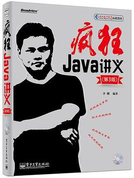
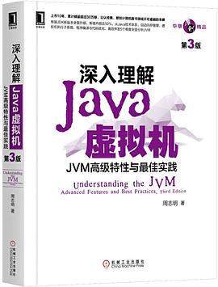
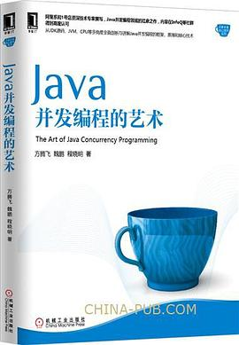
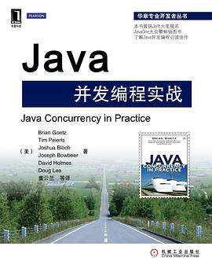
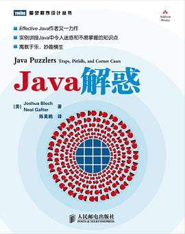
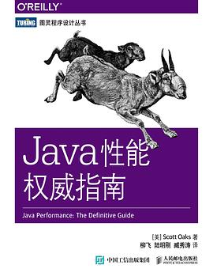

# 基础

## 《Head First Java》

（第二版·中文版） Kathy Sierra,BertBates 著 / 杨尊一编译，张然等改编 / 2007-2 / 中国电力出版社

[豆瓣](https://book.douban.com/subject/2000732/)，8.7 分，1231人评分。

  
 

真正的入门书籍，轻松搞笑，可以通过玩游戏、拼图、解谜题以及一些意想不到的方式与 Java 交互，再也不怕“从入门到放弃”。

## 《疯狂 Java 讲义》

 李刚 / 2008-10 / 电子工业出版社

第3版 李刚 / 2014-7-1 / 电子工业出版社

[豆瓣](https://book.douban.com/subject/25959184/)，8.0 分，128 人评分。

  
 

可以算是国人原创必读经典了，同样非常适合初学者。讲解内容细致全面，系统通俗，目录划分和查找非常方便

 

## 《Java 编程思想》（第 4 版）（1）

Thinking in Java

[美]Bruce Eckel / 2007-6 / 机械工业出版社

[豆瓣](https://book.douban.com/subject/2130190/)，9.1 分，3769 人评分。

  
 

**必读经典**，“Java 圣经”。所有的 Java 学习者都无法避开的经典之作，被誉为全球最好的 Java 书籍。

 

## 《 Java 核心技术》 卷1 基础知识（1）

[美]霍斯特曼 / [美]科奈尔 / 2006-5 / 机械工业出版社

原书第10版 [美]凯.S.霍斯特曼（CayS.Horstmann）/ 2016-9 / 机械工业出版社

原书第11版 [美]凯.S.霍斯特曼（CayS.Horstmann）/ 2019-11-25 / 机械工业出版社

[豆瓣](https://book.douban.com/subject/34898994/)，9.6 分，42 人评分。

  
 

与《 Java 编程思想》齐名的大全式图书，这本书的内容更加细致，偏重与讲解 Java 计数，举例说明了大量 API，内容翔实、客观准确，不拖泥带水，所以相比于《Java编程思想》，更注重于实用性。而且这本书全面而且易懂，放在案旁用到的时候查一查、看一看，也是 Java 初学者和 Java 程序员的必备参考书。

# 进阶

## 《 Java 核心技术 》卷2 高级特性

CayS.Horstmann/GaryCornell/ 2008-12 / 机械工业出版社

原书第9版 [美] Cay S. Horstmann / [美] Gary Cornell / 2014-3-1 / 机械工业出版社

原书第10版 [美] Cay S. Horstmann / [美] Gary Cornell / 2017-9 / 机械工业出版社

[豆瓣](https://book.douban.com/subject/27165931/)，7.5 分，67 人评分。

  
 

## 《Effective Java》（1）

中文版（第2版） [美]JoshuaBloch/ 2009-1-1 / 机械工业出版社

中文版（第3版） [美]JoshuaBloch/ 2018-12-11 / 机械工业出版社

[豆瓣](https://book.douban.com/subject/30412517/)，9.9 分，110 人评分。

  
 

尽量看原版。谷歌首席架构师的大作，也是一本经典。介绍了在 Java 编程中 78 条极具实用价值的经验规则，揭示了应该做什么，不应该做什么才能产生清晰、健壮和高效的代码，并通过例子代码加以进一步说明，这些经验规则涵盖了大多数开发人员每天所面临的问题的解决方案。

 

## 《深入理解 Java 虚拟机》JVM高级特性与最佳实践（1）

（第2版） 周志明 / 2013-9-1 / 机械工业出版社

（第3版） 周志明 / 2019-12 / 机械工业出版社

[豆瓣](https://book.douban.com/subject/34907497/)，9.7 分，138 人评分。

  
 

**必看。**

## 《 Java 并发编程的艺术》

方腾飞/魏鹏/程晓明 / 2015-7-1 / 机械工业出版社

[豆瓣](https://book.douban.com/subject/26591326/)，7.4 分，412 人评分。

  
 

## 《 Java 并发编程实战》 

BrianGoetz/TimPeierls/JoshuaBloch/JosephBowbeer/DavidHolmes/DougLea/ 2012-2 / 机械工业出版社华章公司

[豆瓣](https://book.douban.com/subject/10484692/)，9.0 分，1221 人评分。

  
 

作者都是 Java Community Process JSR 166专家组（并发工具）的主要成员，并在其他很多JCP专家组里任职。它深入浅出地介绍了Java线程和并发，是一本完美的 Java 并发参考手册，适合 Java 程序开发人员阅读。

## 《 Java 解惑 》

布洛赫/加夫特/ 2006-1 / 人民邮电出版社

(美)布洛克·加夫特 / 2010-11-22 / 人民邮电出版社

[豆瓣](https://book.douban.com/subject/5362860/)，9.1 分，74 人评分。

  
 

## 《 Java 性能权威指南》

奥克斯 (Scott Oaks) / 2016-3-1 / 人民邮电出版社 / 

[豆瓣](https://book.douban.com/subject/26740520/)，8.0 分，124 人评分。

  
 

Java 性能方面可能最好的一本书。深入介绍了 JIT 编译器、垃圾收集算法、线程同步等复杂问题，讲解了很多应用性能分析以及优化的方法，详尽讲解了 Java 性能调优的相关知识。

 

