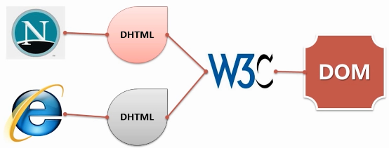

# 一、DOM


DOM（Document Object Model ，文档对象模型）是独立于平台和语言的一个 API，用于访问和操作 HTML 和 XML 文档。

DOM1 级将 HTML 和 XML 文档形象地看作一个层次化的节点树，允许开发人员添加、移除和修改页面的某一部分。可以使用 JavaScript 来操作这个节点树，进而改变底层文档的外观和结构。 

DOM 是 W3C 的标准。W3C DOM 标准分为以下 3 种。

- 核心 DOM －一针对任何结构化文档的标准模型。
- XML DOM －针对XML 文档的标准模型。
- HTML DOM －针对HTML 文档的标准模型。


为什么要使用 DOM？

<div align="center">  </div><br>

**DOM 级别**

- DOM1
  - DOM Core
  - DOM HTML
- DOM2
  - DOM Views
  - DOM Events
  - DOM Style
  - DOM Traversal and Range
- DOM3
  - DOM Load And Save
  - DOM Validation


## 1. 节点层次

节点分为几种不同的类型，每种类型分别表示文档中不同的信息及（或）标记。每个节点都拥有各自的特点、数据和方法。节点之间的关系构成了层次，而所有页面标记则表现为一个以特定节点为根节点的树形结构。

总共有 12 种节点类型，这些类型都继承自一个基类型。

- 整个文档是一个文档（ Document ）节点。
- 每个 HTML 标签是一个元素（ Element ）节点。
- 每一个 HTML 属性是一个属性（ Attribute ）节点。
- 包含在 HTML 元素中的文本是文本（ Text ）节点。

在 HTML 页面中，文档元素始终都是 `<html>` 元素。在 XML 中，没有预定义的元素，因此任何元素都可能成为文档元素。


### 1.1 Node 类型

DOM1 级定义了 Node 接口，该接口将由 DOM 中的所有节点类型实现。这个 Node 接口在 JavaScript 中是作为 Node 类型实现的。除了 IE 之外，其他所有浏览器都可以访问这个类型。

JavaScript 中的所有节点类型都继承自 Node 类型，因此所有节点类型都共享着相同的基本属性和方法。

**nodeType 属性**

每个节点都有一个 nodeType 属性，用于表明节点的类型。节点类型由在 Node 类型中定义的下列 12 个数值常量来表示，任何节点类型必居其一：

| 节点类型                     | 数值常量 | 字符常量                         |
| ---------------------------- | -------- | -------------------------------- |
| Element（元素节点）          | 1        | Node.ELEMENT_NODE                |
| Attr（属性节点）             | 2        | Node.ATTRIBUTE_NODE              |
| Text（文本节点）             | 3        | Node.TEXT_NODE                   |
| CdataSection                 | 4        | Node.CDATA_SECTION_NODE          |
| EntityReference              | 5        | Node.ENTITY_REFERENCE_NODE       |
| Entity                       | 6        | Node.ENTITY_NODE                 |
| ProcessingInstruction        | 7        | Node.PROCESSING_INSTRUCTION_NODE |
| Comment（注释节点）          | 8        | Node.COMMENT_NODE                |
| Document（文档节点）         | 9        | Node.DOCUMENT_NODE               |
| DocumentType（文档类型）     | 10       | Node.DOCUMENT_TYPE_NODE          |
| DocumentFragment（文档片段） | 11       | Node.DOCUMENT_FRAGMENT_NODE      |
| Notation                     | 12       | Node.NOTATION_NODE               |

通过比较字符常量，可以很容易地确定节点的类型。

```js
var someNode = document.getElementById("id");
if (someNode.nodeType == Node.ELEMENT_NODE){ 	// 在 IE 中无效
	alert("Node is an element.");
}
```

IE 没有公开 Node 类型的构造函数，所以为了确保跨浏览器兼容，最好还是将 nodeType 属性与数字值进行比较。

```js
if (someNode.nodeType == 1){ 				// 适用于所有浏览器
	alert("Node is an element.");
}
```


判断元素节点的类型

- isElement 是否是元素节点
- isHTML   是否是HTML的元素节点
- isXML   是否是XML的元素节点
- contains  是否是包含关系


**1.1.1 nodeName 和 nodeValue 属性**

要了解节点的具体信息，可以使用 nodeName 和 nodeValue 这两个属性。这两个属性值完全取决于节点的类型。使用这两个值前，最好先检测一下节点的类型。

- 对于元素节点，nodeName 的值始终为元素的标签名，nodeValue 的值始终为 null。
- 对于属性节点，nodeName 的值为属性名，nodeValue 的值为属性值。
- 对于文本节点，nodeName 的值为 #text，nodeValue 的值为节点包含的文本内容。
- 对于注释节点，nodeName 的值为 #comment，nodeValue 的值为注释内容。
- 对于文档类型节点，nodeName 的值为 doctype 的名称（html），nodeValue 的值为 null。
- 对于文档片段节点，nodeName 的值为 #document.fragment，nodeValue 的值为 null。


**1.1.2 节点关系**

NodeList 是一种类数组对象，用于保存一组有序的节点，可以通过位置来访问这些节点。

- 一些旧版本浏览器中的方法（如：getElementsByClassName()）返回的是 NodeList 对象，而不是 HTMLCollection 对象。
- 所有浏览器的 childNodes 属性返回的是 NodeList 对象。
- 大部分浏览器的 querySelectorAll() 返回 NodeList 对象。

NodeList 不是 Array 的实例。NodeList 对象的独特之处在于，它实际上是基于 DOM 结构动态执行查询的结果，因此 DOM 结构的变化能够自动反映在 NodeList 对象中。

**HTMLCollection 与 NodeList 的区别**

NodeList 与 HTMLCollection 都与数组对象有点类似，可以使用索引来获取元素。NodeList 与 HTMLCollection 都有 length 属性。

- HTMLCollection 是 HTML 元素的集合。NodeList 是一个文档节点的集合。

- HTMLCollection 元素可以通过 name，id 或索引来获取。NodeList 只能通过索引来获取。
- 只有 NodeList 对象有包含属性节点和文本节点。

**NodeList 与 Array**

可以通过方括号语法来访问 NodeList 的值，而且这个对象也有 length 属性，但它并不是 Array 的实例。NodeList 无法使用数组的方法。

对 arguments 对象使用 Array.prototype.slice() 方法可以将其转换为数组。而采用同样的方法，也可以将 NodeList 对象转换为数组。

```js
//在IE8 及之前版本中无效
var arrayOfNodes = Array.prototype.slice.call(someNode.childNodes,0);
```

要想在 IE 中将 NodeList 转换为数组，必须手动枚举所有成员。

```js
function convertToArray(nodes){
    var array = null;
    try {
        array = Array.prototype.slice.call(nodes, 0); //针对非IE 浏览器
    } catch (ex) {
        array = new Array();
        for (var i=0, len=nodes.length; i < len; i++){
            array.push(nodes[i]);
        }
    }
    return array;
}
```

**parentNode**

每个节点都有一个 parentNode 属性，该属性指向文档树中的父节点。

- 包含在 childNodes 列表中的所有节点都具有相同的父节点，因此它们的 parentNode 属性都指向同一个节点。
- 包含在 childNodes 列表中的每个节点相互之间都是同胞节点。通过使用列表中每个节点的 previousSibling 和 nextSibling 属性，可以访问同一列表中的其他节点。
- 列表中第一个节点的 previousSibling 属性值为null，而列表中最后一个节点的 nextSibling 属性的值同样也为null。

- 如果列表中只有一个节点，那么该节点的 nextSibling 和 previousSibling 都为 null。


firstChild

lastChild

nextSibling


**hasChildNodes()**

这个方法在节点包含一或多个子节点的情况下返回 true。这是比查询 childNodes 列表的 length 属性更简单的方法。

所有节点都有的最后一个属性是 ownerDocument，该属性指向表示整个文档的文档节点。这种关系表示的是任何节点都属于它所在的文档，任何节点都不能同时存在于两个或更多个文档中。通过这个属性，不必在节点层次中通过层层回溯到达顶端，而是可以直接访问文档节点。


**1.1.3 操作节点**

appendChild()：用于向 childNodes 列表的末尾添加一个节点

insertBefore()：现有的子元素之前插入一个新的子元素

removeChild()：删除一个子元素

replaceChild()：替换一个子元素


**1.1.4 其他方法**

cloneNode()：用于创建调用这个方法的节点的一个完全相同的副本。

normalize()：这个方法唯一的作用就是处理文档树中的文本节点。


### 1.2 Document 类型

JavaScript 通过 Document 类型表示文档。在浏览器中，document 对象 HTMLDocument（继承自 Document 类型）的一个实例，表示整个 HTML 页面。而且，document 对象是 window 对象的一个属性，因此可以将其作为全局对象来访问。

Document 节点具有下列特征：

- nodeType 的值为9；

- nodeName 的值为"#document"；

- nodeValue 的值为 null；

- parentNode 的值为 null；

- ownerDocument 的值为 null；


- 其子节点可能是一个 DocumentType（最多一个）、Element（最多一个）、ProcessingInstruction 或 Comment。


| 属性 / 方法                                                  | 描述                                                         |
| :----------------------------------------------------------- | :----------------------------------------------------------- |
| **document.activeElement**                                   | 返回当前获取焦点元素                                         |
| **document.anchors**                                         | 返回对文档中所有 Anchor 对象的引用。                         |
| **document.applets**                                         | 返回对文档中所有 Applet 对象的引用。**注意:** HTML5 已不支持 <applet> 元素。 |
| [document.baseURI](https://www.runoob.com/jsref/prop-doc-baseuri.html) | 返回文档的绝对基础 URI                                       |
| **document.body**                                            | 返回文档的body元素                                           |
| [document.cookie](https://www.runoob.com/jsref/prop-doc-cookie.html) | 设置或返回与当前文档有关的所有 cookie。                      |
| **document.doctype**                                         | 返回与文档相关的文档类型声明 (DTD)。                         |
| **document.documentElement**                                 | 返回文档的根节点                                             |
| [document.documentMode](https://www.runoob.com/jsref/prop-doc-documentmode.html) | 返回用于通过浏览器渲染文档的模式                             |
| [document.documentURI](https://www.runoob.com/jsref/prop-document-documenturi.html) | 设置或返回文档的位置                                         |
| **document.domain**                                          | 返回当前文档的域名。                                         |
| document.domConfig                                           | **已废弃**。返回 normalizeDocument() 被调用时所使用的配置。  |
| [document.embeds](https://www.runoob.com/jsref/coll-doc-embeds.html) | 返回文档中所有嵌入的内容（embed）集合                        |
| **document.forms**                                           | 返回对文档中所有 Form 对象引用。                             |
| **document.images**                                          | 返回对文档中所有 Image 对象引用。                            |
| **document.implementation**                                  | 返回处理该文档的 DOMImplementation 对象。                    |
| [document.inputEncoding](https://www.runoob.com/jsref/prop-document-inputencoding.html) | 返回用于文档的编码方式（在解析时）。                         |
| [document.lastModified](https://www.runoob.com/jsref/prop-doc-lastmodified.html) | 返回文档被最后修改的日期和时间。                             |
| **document.links**                                           | 返回对文档中所有 Area 和 Link 对象引用。                     |
| [document.readyState](https://www.runoob.com/jsref/prop-doc-readystate.html) | 返回文档状态 (载入中……)                                      |
| **document.referrer**                                        | 返回载入当前文档的文档的 URL。                               |
| [document.scripts](https://www.runoob.com/jsref/coll-doc-scripts.html) | 返回页面中所有脚本的集合。                                   |
| [document.strictErrorChecking](https://www.runoob.com/jsref/prop-document-stricterrorchecking.html) | 设置或返回是否强制进行错误检查。                             |
| [document.title](https://www.runoob.com/jsref/prop-doc-title.html) | 返回当前文档的标题。                                         |
| **document.URL**                                             | 返回文档完整的URL                                            |


| 属性 / 方法                                                  | 描述                                                         |
| :----------------------------------------------------------- | :----------------------------------------------------------- |
| [document.addEventListener()](https://www.runoob.com/jsref/met-document-addeventlistener.html) | 向文档添加句柄                                               |
| [document.adoptNode(node)](https://www.runoob.com/jsref/met-document-adoptnode.html) | 从另外一个文档返回 adapded 节点到当前文档。                  |
| **document.close()**                                         | 关闭用 document.open() 方法打开的输出流，并显示选定的数据。  |
| [document.createAttribute()](https://www.runoob.com/jsref/met-document-createattribute.html) | 创建一个属性节点                                             |
| [document.createComment()](https://www.runoob.com/jsref/met-document-createcomment.html) | createComment() 方法可创建注释节点。                         |
| [document.createDocumentFragment()](https://www.runoob.com/jsref/met-document-createdocumentfragment.html) | 创建空的 DocumentFragment 对象，并返回此对象。               |
| **document.createElement()**                                 | 创建元素节点。                                               |
| **document.createTextNode()**                                | 创建文本节点。                                               |
| [document.getElementsByClassName()](https://www.runoob.com/jsref/met-document-getelementsbyclassname.html) | 返回文档中所有指定类名的元素集合，作为 NodeList 对象。       |
| **document.getElementById**()                                | 返回对拥有指定 id 的第一个对象的引用。                       |
| **document.getElementsByName**()                             | 返回带有指定名称的对象集合。                                 |
| **document.getElementsByTagName**()                          | 返回带有指定标签名的对象集合。                               |
| [document.importNode()](https://www.runoob.com/jsref/met-document-importnode.html) | 把一个节点从另一个文档复制到该文档以便应用。                 |
| [document.normalize()](https://www.runoob.com/jsref/met-document-normalize.html) | 删除空文本节点，并连接相邻节点                               |
| [document.normalizeDocument()](https://www.runoob.com/jsref/met-document-normalizedocument.html) | 删除空文本节点，并连接相邻节点的                             |
| **document.open()**                                          | 打开一个流，以收集来自任何 document.write() 或 document.writeln() 方法的输出。 |
| [document.querySelector()](https://www.runoob.com/jsref/met-document-queryselector.html) | 返回文档中匹配指定的CSS选择器的第一元素                      |
| [document.querySelectorAll()](https://www.runoob.com/jsref/met-document-queryselectorall.html) | document.querySelectorAll() 是 HTML5中引入的新方法，返回文档中匹配的CSS选择器的所有元素节点列表 |
| [document.removeEventListener()](https://www.runoob.com/jsref/met-document-removeeventlistener.html) | 移除文档中的事件句柄(由 addEventListener() 方法添加)         |
| [document.renameNode()](https://www.runoob.com/jsref/met-document-renamenode.html) | 重命名元素或者属性节点。                                     |
| **document.write()**                                         | 向文档写 HTML 表达式 或 JavaScript 代码。                    |
| **document.writeln()**                                       | 等同于 write() 方法，不同的是在每个表达式之后写一个换行符。  |


**HTML 文档对象可以避免使用这些节点对象和属性：**

| 属性 / 方法              | 避免的原因                  |
| :----------------------- | :-------------------------- |
| document.attributes      | 文档没有该属性              |
| document.hasAttributes() | 文档没有该属性              |
| document.nextSibling     | 文档没有下一节点            |
| document.nodeName        | 这个通常是 #document        |
| document.nodeType        | 这个通常是 9(DOCUMENT_NODE) |
| document.nodeValue       | 文档没有一个节点值          |
| document.ownerDocument   | 文档没有主文档              |
| document.ownerElement    | 文档没有自己的节点          |
| document.parentNode      | 文档没有父节点              |
| document.previousSibling | 文档没有兄弟节点            |
| document.textContent     | 文档没有文本节点            |


**1.2.1 文档的子节点**


**1.2.2 文档信息**


**1.2.3 查找元素**


**（1）getElementById()** 

getElementById()，接收一个参数：要取得的元素的 ID。如果找到相应的元素则返回该元素，如果不存在，则返回 null。注意，这里的 ID 必须与页面中元素的 id 特性严格匹配，包括大小写。

如果页面中多个元素的 ID 值相同，getElementById() 只返回文档中第一次出现的元素。

JavaScript中document.getElementById的返回值的类型为Object


**（2）getElementsByTagName()** 

> document.getElementsByTagName(Tagname)

getElementsByTagName()，接受一个参数，即要取得元素的标签名，返回包含零或多个元素的 NodeList。在 HTML 文档中，返回一个 HTMLCollection 对象，作为一个“动态”集合，该对象与 NodeList 非常类似。

例如，下列代码会取得页面中所有的 `` 元素，并返回一个 HTMLCollection。

```js
var images = document.getElementsByTagName("img");
alert(images.length); 	//输出图像的数量
alert(images[0].src); 	//输出第一个图像元素的src 特性
aler t(images.item(0).src); //输出第一个图像元素的 src 特性
```


**（3）getElementsByName()** 

> document.getElementsByName(name)

getElementsByName()，返回带有给定 name 特性的所有元素。最常使用情况是取得单选按钮；为了确保发送给浏览器的值正确无误，所有单选按钮必须具有相同的name 特性，如下面的例子所示。


**4、特殊集合**

document 对象还有一些特殊的集合。这些集合都是HTMLCollection 对象，为访问文档常用的部分提供了快捷方式，包括：

-  document.anchors，包含文档中所有带name 特性的 `<a>` 元素；
-  document.applets，包含文档中所有的 `<applet>` 元素，因为不再推荐使用 `<applet>` 元素，所以这个集合已经不建议使用了；
-  document.forms，包含文档中所有的 `<form>` 元素，document.getElementsByTagName("form")得到的结果相同；
-  document.images，包含文档中所有的 `` 元素，与document.getElementsByTagName("img")得到的结果相同；
-  document.links，包含文档中所有带href 特性的 `<a>` 元素。


**5、DOM 一致性检测**


**6、文档写入**

4 个方法：write()、writeln()、open() 和 close()。

其中，write() 和 writeln() 方法都接受一个字符串参数，即要写入到输出流中的文本。write() 会原样写入，而 writeln() 则会在字符串的末尾添加一个换行符（\n）。在页面被加载的过程中，可以使用这两个方法向页面中动态地加入内容，

还可以使用 write() 和 writeln() 方法动态地包含外部资源。


### 1.3 Element 类型

| 属性                                                         | 描述                                                         |
| :----------------------------------------------------------- | :----------------------------------------------------------- |
| [*element*.accessKey](https://www.runoob.com/jsref/prop-html-accesskey.html) | 设置或返回accesskey一个元素                                  |
| ***element*.attributes**                                     | 返回一个元素的属性数组                                       |
| ***element*.childNodes**                                     | 返回元素的一个子节点的数组                                   |
| [*element*.children](https://www.runoob.com/jsref/prop-element-children.html) | 返回元素的子元素的集合                                       |
| [*element*.classList](https://www.runoob.com/jsref/prop-element-classList.html) | 返回元素的类名，作为 DOMTokenList 对象。                     |
| ***element*.className**                                      | 设置或返回元素的class属性                                    |
| *element*.clientHeight                                       | 在页面上返回内容的可视高度（不包括边框，边距或滚动条）       |
| *element*.clientWidth                                        | 在页面上返回内容的可视宽度（不包括边框，边距或滚动条）       |
| [*element*.contentEditable](https://www.runoob.com/jsref/prop-html-contenteditable.html) | 设置或返回元素的内容是否可编辑                               |
| ***element*.dir**                                            | 设置或返回一个元素中的文本方向                               |
| [*element*.firstChild](https://www.runoob.com/jsref/prop-node-firstchild.html) | 返回元素的第一个子节点                                       |
| ***element*.id**                                             | 设置或者返回元素的 id。                                      |
| [*element*.innerHTML](https://www.runoob.com/jsref/prop-html-innerhtml.html) | 设置或者返回元素的内容。                                     |
| [*element*.isContentEditable](https://www.runoob.com/jsref/prop-html-iscontenteditable.html) | 如果元素内容可编辑返回 true，否则返回false                   |
| ***element*.lang**                                           | 设置或者返回一个元素的语言。                                 |
| [*element*.lastChild](https://www.runoob.com/jsref/prop-node-lastchild.html) | 返回的最后一个子节点                                         |
| [*element*.namespaceURI](https://www.runoob.com/jsref/prop-node-namespaceuri.html) | 返回命名空间的 URI。                                         |
| [*element*.nextSibling](https://www.runoob.com/jsref/prop-node-nextsibling.html) | 返回该元素紧跟的一个节点                                     |
| [*element*.nextElementSibling](https://www.runoob.com/jsref/prop-element-nextelementsibling.html) | 返回指定元素之后的下一个兄弟元素（相同节点树层中的下一个元素节点）。 |
| ***element*.nodeName**                                       | 返回元素的标记名（大写）                                     |
| [*element*.nodeType](https://www.runoob.com/jsref/prop-node-nodetype.html) | 返回元素的节点类型                                           |
| [*element*.nodeValue](https://www.runoob.com/jsref/prop-node-nodevalue.html) | 返回元素的节点值                                             |
| *element*.offsetHeight                                       | 返回任何一个元素的高度包括边框和填充，但不是边距             |
| *element*.offsetWidth                                        | 返回元素的宽度，包括边框和填充，但不是边距                   |
| *element*.offsetLeft                                         | 返回当前元素的相对水平偏移位置的偏移容器                     |
| *element*.offsetParent                                       | 返回元素的偏移容器                                           |
| *element*.offsetTop                                          | 返回当前元素的相对垂直偏移位置的偏移容器                     |
| [*element*.ownerDocument](https://www.runoob.com/jsref/prop-node-ownerdocument.html) | 返回元素的根元素（文档对象）                                 |
| [*element*.parentNode](https://www.runoob.com/jsref/prop-node-parentnode.html) | 返回元素的父节点                                             |
| [*element*.previousSibling](https://www.runoob.com/jsref/prop-node-previoussibling.html) | 返回某个元素紧接之前元素                                     |
| [*element*.previousElementSibling](https://www.runoob.com/jsref/prop-element-previouselementsibling.html) | 返回指定元素的前一个兄弟元素（相同节点树层中的前一个元素节点）。 |
| *element*.scrollHeight                                       | 返回整个元素的高度（包括带滚动条的隐蔽的地方）               |
| *element*.scrollLeft                                         | 返回当前视图中的实际元素的左边缘和左边缘之间的距离           |
| *element*.scrollTop                                          | 返回当前视图中的实际元素的顶部边缘和顶部边缘之间的距离       |
| *element*.scrollWidth                                        | 返回元素的整个宽度（包括带滚动条的隐蔽的地方）               |
| *element*.style                                              | 设置或返回元素的样式属性                                     |
| [*element*.tabIndex](https://www.runoob.com/jsref/prop-html-tabindex.html) | 设置或返回元素的标签顺序。                                   |
| ***element*.tagName**                                        | 作为一个字符串返回某个元素的标记名（大写）                   |
| [*element*.textContent](https://www.runoob.com/jsref/prop-node-textcontent.html) | 设置或返回一个节点和它的文本内容                             |
| ***element*.title**                                          | 设置或返回元素的title属性                                    |
| [*nodelist*.length](https://www.runoob.com/jsref/prop-nodelist-length.html) | 返回节点列表的节点数目。                                     |


| 方法                                                         | 描述                                                         |
| :----------------------------------------------------------- | :----------------------------------------------------------- |
| [*element*.addEventListener()](https://www.runoob.com/jsref/met-element-addeventlistener.html) | 向指定元素添加事件句柄                                       |
| ***element*.appendChild()**                                  | 为元素添加一个新的子元素                                     |
| [*element*.cloneNode()](https://www.runoob.com/jsref/met-node-clonenode.html) | 克隆某个元素                                                 |
| [*element*.compareDocumentPosition()](https://www.runoob.com/jsref/met-node-comparedocumentposition.html) | 比较两个元素的文档位置。                                     |
| [*element*.focus()](https://www.runoob.com/jsref/met-html-focus.html) | 设置文档或元素获取焦点                                       |
| ***element*.getAttribute()**                                 | 返回指定元素的属性值                                         |
| [*element*.getAttributeNode()](https://www.runoob.com/jsref/met-element-getattributenode.html) | 返回指定属性节点                                             |
| [*element*.getElementsByTagName()](https://www.runoob.com/jsref/met-element-getelementsbytagname.html) | 返回指定标签名的所有子元素集合。                             |
| [*element*. getElementsByClassName()](https://www.runoob.com/jsref/met-element-getelementsbyclassname.html) | 返回文档中所有指定类名的元素集合，作为 NodeList 对象。       |
| *element*.getFeature()                                       | 返回指定特征的执行APIs对象。                                 |
| *element*.getUserData()                                      | 返回一个元素中关联键值的对象。                               |
| [*element*.hasAttribute()](https://www.runoob.com/jsref/met-element-hasattribute.html) | 如果元素中存在指定的属性返回 true，否则返回false。           |
| [*element*.hasAttributes()](https://www.runoob.com/jsref/met-node-hasattributes.html) | 如果元素有任何属性返回true，否则返回false。                  |
| [*element*.hasChildNodes()](https://www.runoob.com/jsref/met-node-haschildnodes.html) | 返回一个元素是否具有任何子元素                               |
| [*element*.hasFocus()](https://www.runoob.com/jsref/met-document-hasfocus.html) | 返回布尔值，检测文档或元素是否获取焦点                       |
| ***element*.insertBefore()**                                 | 现有的子元素之前插入一个新的子元素                           |
| [*element*.isDefaultNamespace()](https://www.runoob.com/jsref/met-node-isdefaultnamespace.html) | 如果指定了namespaceURI 返回 true，否则返回 false。           |
| [*element*.isEqualNode()](https://www.runoob.com/jsref/met-node-isequalnode.html) | 检查两个元素是否相等                                         |
| [*element*.isSameNode()](https://www.runoob.com/jsref/met-node-issamenode.html) | 检查两个元素所有有相同节点。                                 |
| [*element*.isSupported()](https://www.runoob.com/jsref/met-node-issupported.html) | 如果在元素中支持指定特征返回 true。                          |
| ***element*.normalize()**                                    | 使得此成为一个"normal"的形式，其中只有结构（如元素，注释，处理指令，CDATA节和实体引用）隔开Text节点，即元素（包括属性）下面的所有文本节点，既没有相邻的文本节点也没有空的文本节点 |
| [*element*.querySelector()](https://www.runoob.com/jsref/met-element-queryselector.html) | 返回匹配指定 CSS 选择器元素的第一个子元素                    |
| document.querySelectorAll()                                  | 返回匹配指定 CSS 选择器元素的所有子元素节点列表              |
| ***element*.removeAttribute()**                              | 从元素中删除指定的属性                                       |
| [*element*.removeAttributeNode()](https://www.runoob.com/jsref/met-element-removeattributenode.html) | 删除指定属性节点并返回移除后的节点。                         |
| [*element*.removeChild()](https://www.runoob.com/jsref/met-node-removechild.html) | 删除一个子元素                                               |
| [*element*.removeEventListener()](https://www.runoob.com/jsref/met-element-removeeventlistener.html) | 移除由 addEventListener() 方法添加的事件句柄                 |
| ***element*.replaceChild()**                                 | 替换一个子元素                                               |
| ***element*.setAttribute()**                                 | 设置或者改变指定属性并指定值。                               |
| [*element*.setAttributeNode()](https://www.runoob.com/jsref/met-element-setattributenode.html) | 设置或者改变指定属性节点。                                   |
| *element*.setIdAttribute()                                   |                                                              |
| *element*.setIdAttributeNode()                               |                                                              |
| *element*.setUserData()                                      | 在元素中为指定键值关联对象。                                 |
| *element*.toString()                                         | 一个元素转换成字符串                                         |
| [*nodelist*.item()](https://www.runoob.com/jsref/met-nodelist-item.html) | 返回某个元素基于文档树的索引                                 |


**1、HTML 元素**

**2、取得特性**

操作特性的 DOM 方法主要有三个，分别是 getAttribute()、setAttribute() 和 removeAttribute()。

**3、设置特性**

getAttribute()

> elementNode.getAttribute(name)

通过元素节点的属性名称获取属性的值。


setAttribute()


**4、attributes 属性**

**5、创建元素**

createElement


### 1.4 Text 类型

创建文本节点

createTextNode


### 1.5 Comment 类型

### 1.6 CDATASection 类型

### 1.7 DocumentType 类型

### 1.8 DocumentFragment 类型

### 1.9 Attr

| 属性 / 方法                                                  | 描述                                                        |
| :----------------------------------------------------------- | :---------------------------------------------------------- |
| [*attr*.isId](https://www.runoob.com/jsref/prop-attr-isid.html) | 如果属性是 ID 类型，则 isId 属性返回 true，否则返回 false。 |
| ***attr*.name**                                              | 返回属性名称                                                |
| ***attr*.value**                                             | 设置或者返回属性值                                          |
| ***attr*.specified**                                         | 如果属性被指定返回 true ，否则返回 false                    |
| [*nodemap*.getNamedItem()](https://www.runoob.com/jsref/met-namednodemap-getnameditem.html) | 从节点列表中返回的指定属性节点。                            |
| [*nodemap*.item()](https://www.runoob.com/jsref/met-namednodemap-item.html) | 返回节点列表中处于指定索引号的节点。                        |
| [*nodemap*.length](https://www.runoob.com/jsref/prop-namednodemap-length.html) | 返回节点列表的节点数目。                                    |
| [*nodemap*.removeNamedItem()](https://www.runoob.com/jsref/met-namednodemap-removenameditem.html) | 删除指定属性节点                                            |
| [*nodemap*.setNamedItem()](https://www.runoob.com/jsref/met-namednodemap-setnameditem.html) | 设置指定属性节点(通过名称)                                  |


**从长远的代码质量来考虑，在属性对象中你需要避免使用节点对象属性和方法：**

| 属性 / 方法            | 避免原因                   |
| :--------------------- | :------------------------- |
| *attr*.appendChild()   | 属性没有子节点             |
| *attr*.attributes      | 属性没有属性               |
| *attr*.baseURI         | 使用 document.baseURI 替代 |
| *attr*.childNodes      | 属性没有子节点             |
| *attr*.cloneNode()     | 使用 attr.value 替代       |
| *attr*.firstChild      | 属性没有子节点             |
| *attr*.hasAttributes() | 属性没有属性               |
| *attr*.hasChildNodes   | 属性没有子节点             |
| *attr*.insertBefore()  | 属性没有子节点             |
| *attr*.isEqualNode()   | 没有意义                   |
| *attr*.isSameNode()    | 没有意义                   |
| *attr*.isSupported()   | 通常为 true                |
| *attr*.lastChild       | 属性没有子节点             |
| *attr*.nextSibling     | 属性没有兄弟节点           |
| *attr*.nodeName        | 使用 *attr*.name 替代      |
| *attr*.nodeType        | 通常为 2 (ATTRIBUTE-NODE)  |
| *attr*.nodeValue       | 使用 *attr*.value 替代     |
| *attr*.normalize()     | 属性没有规范               |
| *attr*.ownerDocument   | 通常为你的 HTML 文档       |
| *attr*.ownerElement    | 你用来访问属性的 HTML 元素 |
| *attr*.parentNode      | 你用来访问属性的 HTML 元素 |
| *attr*.previousSibling | 属性没有兄弟节点           |
| *attr*.removeChild     | 属性没有子节点             |
| *attr*.replaceChild    | 属性没有子节点             |
| *attr*.textContent     | 使用 *attr*.value 替代     |


## 2. DOM 操作技术

### 2.1 动态脚本

动态脚本，指的是在页面加载时不存在，但将来的某一时刻通过修改 DOM 动态添加的脚本。跟操作 HTML 元素一样，创建动态脚本也有两种方式：插入外部文件和直接插入JavaScript 代码。

动态加载的外部 JavaScript 文件能够立即运行。

```HTML
<script type="text/javascript" src="client.js"></script>
```

创建、封装、调用这个节点的 DOM 代码如下所示：

```js
function loadScript(url){
    var script = document.createElement("script");
    script.type = "text/javascript";
    script.src = url;
    document.body.appendChild(script);
}
// loadScript("client.js");
```

但是不知道脚本加载何时完成。

另一种指定 JavaScript 代码的方式是行内方式

```html
<script type="text/javascript">
    function sayHi(){
        alert("hi");
    }
</script>
```

下面的代码在 Firefox、Safari、Chrome 和 Opera 中，可以正常运行。但在 IE 中，则会导致错误。IE 将 `<script>` 视为一个特殊的元素，不允许 DOM 访问其子节点。

```js
var script = document.createElement("script");
script.type = "text/javascript";
script.appendChild(document.createTextNode("function sayHi(){alert('hi');}"));
document.body.appendChild(script);
```

可以使用 `<script>` 元素的 text 属性来指定 JavaScript 代码

```js
var script = document.createElement("script");
script.type = "text/javascript";
script.text = "function sayHi(){alert('hi');}";		//
document.body.appendChild(script);
```

Safari 3.0 之前的版本虽然不能正确地支持 text 属性，但却允许使用文本节点技术来指定代码。如果需要兼容早期版本的 Safari，可以使用下列代码：

```js
var script = document.createElement("script");
script.type = "text/javascript";
var code = "function sayHi(){alert('hi');}";
try {
    script.appendChild(document.createTextNode("code"));
} catch (ex){
    script.text = "code";
}
document.body.appendChild(script);
```

封装及调用

```js
function loadScriptString(code){
    var script = document.createElement("script");
    script.type = "text/javascript";
    try {
        script.appendChild(document.createTextNode(code));
    } catch (ex){
        script.text = code;
    }
    document.body.appendChild(script);
}
loadScriptString("function sayHi(){alert('hi');}");
```

以这种方式加载的代码会在全局作用域中执行，而且当脚本执行后将立即可用。实际上，这样执行代码与在全局作用域中把相同的字符串传递给 eval() 是一样的。


### 2.2 动态样式

能够把CSS 样式包含到HTML 页面中的元素有两个：`<link>` 和 `<style>`。

动态样式是指在页面刚加载时不存在的样式，是在页面加载完成后动态添加到页面中的。

```js
function loadStyles(url){
    var link = document.createElement("link");
    link.rel = "stylesheet";
    link.type = "text/css";
    link.href = url;
    var head = document.getElementsByTagName("head")[0];
    head.appendChild(link);
}
loadStyles("styles.css");
```

另一种定义样式的方式是使用 `<style>` 元素来包含嵌入式 CSS。

```js
function loadStyleString(css){
    var style = document.createElement("style");
    style.type = "text/css";
    try{
        style.appendChild(document.createTextNode(css));
    } catch (ex){
        style.styleSheet.cssText = css;
    }
    var head = document.getElementsByTagName("head")[0];
    head.appendChild(style);
}
loadStyleString("body{background-color:red}");
```


### 2.3 操作表格


### 2.4 使用 NodeList

理解 NodeList 及其“近亲” NamedNodeMap 和 HTMLCollection，是从整体上透彻理解DOM 的关键所在。

这三个集合都是“动态的”；换句话说，每当文档结构发生变化时，它们都会得到更新。因此，它们始终都会保存着最新、最准确的信息。从本质上说，所有 NodeList 对象都是在访问 DOM文档时实时运行的查询。


# 参考资料


