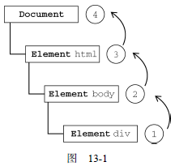
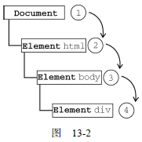

# 事件 

JavaScript 与 HTML 之间的交互是通过事件实现的。事件是文档或浏览器窗口中发生的一些特定的交互瞬间。


## 1. 事件流


什么是事件流？

事件流描述的是从页面中接收事件的顺序。IE 和 Netscape 开发团队提出了差不多完全相反的事件流的概念。IE 的事件流是事件冒泡流，而 Netscape Communicator 的事件流是事件捕获流。


### 事件冒泡

IE 的事件流叫做事件冒泡（event bubbling），即事件开始时由最具体的元素（文档中嵌套层次最深的那个节点）接收，然后逐级向上传播到较为不具体的节点（文档）。

对于 HTML 来说，当一个元素产生一个事件时，它会把这个事件传递给它的父元素，父元素接收到之后，还要继续传递给它的上一级元素，就这样一直传播到 document 对象（一些浏览器会传播到 window 对象） 。

```html
<!DOCTYPE html>
<html>
<head>
	<title>Event Bubbling Example</title>
</head>
<body>
	<div id="myDiv">Click Me</div>
</body>
</html>
```

上例中，click 事件首先在单击的元素上（ `<div>` 元素）发生，然后沿 DOM 树向上传播，在每一级节点上都会发生，直至传播到 document 对象。

<div align="center">  </div><br>

所有现代浏览器都支持事件冒泡，但在具体实现上有一些差别。IE5.5 及更早版本中的事件冒泡会跳过 `<html>` 元素（从 `<body>` 直接跳到 document）。IE9、Firefox、Chrome 和 Safari 则将事件一直冒泡到 window 对象。


### 事件捕获

Netscape Communicator 团队提出的事件流叫做事件捕获（event capturing）。事件捕获的思想是不太具体的节点应该更早接收到事件，而最具体的节点应该最后接收到事件。

事件捕获的用意在于在事件到达预定目标之前捕获它。与冒泡的过程正好相反，以前面的 HTML 页面作为例子，单击 `<div>` 元素触发 click 事件的顺序如下：

<div align="center">  </div><br>

虽然事件捕获是 Netscape 唯一支持的事件流模型，但 **IE9**、Safari、Chrome、Opera 和 Firefox 目前也都支持。<u>注意：IE6/7/8不支持事件捕获</u>。

尽管“DOM2 级事件”规范要求事件应该从 document 对象开始传播，但这些浏览器都是从 window 对象开始捕获事件的。

由于老版本的浏览器不支持，因此很少有人使用事件捕获。建议使用事件冒泡，在有特殊需要时再使用事件捕获。


### DOM 事件流

“DOM2级事件”规定的事件流包括三个阶段：事件捕获阶段、处于目标阶段和事件冒泡阶段。

首先发生的是事件捕获，为截获事件提供了机会。然后是实际的目标接收到事件。最后一个阶段是冒泡阶段，可以在这个阶段对事件做出响应。

<div align="center">  </div><br>

以前面的 HTML 页面为例，单击 `<div>` 元素会按照上图所示顺序触发事件。在 DOM 事件流中，实际的目标（ `<div>` 元素）在捕获阶段不会接收到事件。在捕获阶段，事件从 document 到 `<html>` 再到 `<body>` 后就停止了。下一个阶段是“处于目标”阶段，于是事件在 `<div>` 上发生，并在事件处理中被看成冒泡阶段的一部分。然后，冒泡阶段发生，事件又传播回文档。

IE9、Opera、Firefox、Chrome 和 Safari 都支持 DOM 事件流；IE8 及更早版本不
支持 DOM 事件流。


## 2. 事件处理程序

**什么是事件绑定？**

事件就是用户或浏览器自身执行的某种动作。诸如click、load 和mouseover，都是事件的名字。要想让 JavaScript 对用户的操作作出响应，首先要对 DOM 元素绑定事件处理函数。

**什么是事件处理程序？**

响应某个事件的函数就叫做事件处理程序（或事件侦听器）。

事件处理程序是对象的额外属性。此属性包括事件的名称和事件发生时采取的操作。事件处理程序的名字以"on"开头，比如，click 事件的事件处理程序就是 onclick。


为事件指定处理程序的方式有好几种。

- HTML 事件处理程序
- DOM0 级事件处理程序
- DOM2 级事件处理程序
- IE 事件处理程序
- 跨浏览器事件处理程序


IE 事件流指事件冒泡，Netscape 事件流指事件捕获。W3C 规范中定义了 3 个事件阶段，依次是捕获阶段、目标阶段、冒泡阶段。IE9 以后 IE 才支持 W3C 规范。

W3C 规范定义了 addEventListener() 处理添加事件操作，通过第三个参数规定事件在什么阶段执行。IE 定义了 attachEvent() 在冒泡阶段添加事件。

addEventListener() 和 attachEvent() 都可以为同一个对象的同一个事件绑定多个事件处理程序，但事件处理程序执行的顺序不一样。


**什么是事件解绑？**

一般情况下，执行过的代码内存会自动回收，但是事件在执行完后，内存没有自动回收，这样会导致内存一直占用，代码执行效率降低，所以我们就要手动回收这个事件，即事件解绑。


### HTML 事件处理程序

某个元素支持的每种事件，都可以使用一个与相应事件处理程序同名的 HTML 特性来指定。这个特性的值应该是能够执行的 JavaScript 代码。

```html
<input type="button" value="Click Me" onclick="alert('Clicked')" />
<input type="button" value="Click Me" onclick="showMessage()" />
```

事件处理程序中的代码在执行时，有权访问全局作用域中的任何代码。

通过 event 变量，可以直接访问事件对象。

```html
<!-- 输出 "click" -->
<input type="button" value="Click Me" onclick="alert(event.type)">
```

在这个函数内部，this 值等于事件的目标元素。

```html
<!-- 输出 "Click Me" -->
<input type="button" value="Click Me" onclick="alert(this.value)">
```

关于这个动态创建的函数，可以像访问局部变量一样访问 document 及该元素本身的成员。这个函数使用with 像下面这样扩展作用域：

```js
function(){
    with(document){
        with(this){
            //元素属性值
        }
    }
}
```


在HTML 中指定事件处理程序的缺点：

- 存在一个时差问题。
- 这样扩展事件处理程序的作用域链在不同浏览器中会导致不同结果
- 最大的缺点：HTML 与 JavaScript 代码紧密耦合


### DOM0 级事件处理程序

通过 JavaScript 指定事件处理程序的传统方式，就是将一个函数赋值给一个事件处理程序属性。

为事件处理程序赋值的方法的优点：简单，具有跨浏览器的优势。

要使用 JavaScript 指定事件处理程序，首先必须取得一个要操作的对象的引用。

每个元素（包括 window 和 document）都有自己的事件处理程序属性，这些属性通常全部小写，例如 onclick。将这种属性的值设置为一个函数，就可以指定事件处理程序。

使用 DOM0 级方法指定的事件处理程序被认为是元素的方法。因此，这时候的事件处理程序是在元素的作用域中运行；换句话说，程序中的 this 引用当前元素。

```js
var btn = document.getElementById("myBtn");	// 取得一个要操作的对象
btn.onclick = function(){					// 添加 onclick 属性
    alert(this.id); 			// "myBtn"
};
```

可以删除通过 DOM0 级方法指定的事件处理程序，只要像下面这样将事件处理程序属性的值设置为 null 即可：

```js
btn.onclick = null; // 删除事件处理程序
```


### DOM2 级事件处理程序

DOM 2 级事件定义了两个方法，用于处理添加事件和删除事件（事件句柄）的操作：  addEventListener() 和  removeEventListener()。


所有 DOM 节点中都包含这两个方法，并且它们都接受 3 个参数：

| 参数         | 描述                                                         |
| :----------- | :----------------------------------------------------------- |
| *event*      | 必需。描述事件名称的字符串。  **注意：** 不要使用 "on" 前缀。例如：click，mouseover,dbclick..... |
| *function*   | 必需。作为事件处理程序的函数。可以为匿名函数，也可以为命名函数。如果需要删除事件，必须是命名函数。 |
| *useCapture* | 可选。布尔值，指定事件是否在捕获或冒泡阶段执行。如果是 true，表示在捕获阶段调用事件处理程序；如果是 false（默认），表示在冒泡阶段调用事件处理程序。 |

> 大多数情况下，都是将事件处理程序添加到事件流的冒泡阶段，这样可以最大限度地兼容各种浏览器。最好只在需要在事件到达目标之前截获它的时候将事件处理程序添加到捕获阶段。如果不是特别需要，不建议在事件捕获阶段注册事件处理程序。

与 DOM0 级方法一样，这里添加的事件处理程序也是在其依附的元素的作用域中运行。

使用 DOM2 级方法添加事件处理程序的主要好处是可以添加多个事件处理程序。

```js
var btn = document.getElementById("myBtn");
// 添加了 onclick 事件处理程序
btn.addEventListener("click", function(){	// 注意 click 前面没有 on
    alert(this.id);
}, false);
btn.addEventListener("click", function(){
    alert("Hello world!");
}, false);
// id    Hello world!
```

**removeEventListener()** 

通过 addEventListener() 添加的事件处理程序只能使用 removeEventListener() 来移除；移除时传入的参数与添加处理程序时使用的参数相同。这也意味着通过 addEventListener() 添加的匿名函数将无法移除。

传入 removeEventListener() 中的事件处理程序函数必须与传入 addEventListener() 中的相同。

```js
var btn = document.getElementById("myBtn");
btn.addEventListener("click", function(){
    alert(this.id);
}, false);
// 这里省略了其他代码
btn.removeEventListener("click", function(){ // 没有用！
    alert(this.id);
}, false);

var handler = function(){
    alert(this.id);
};
btn.addEventListener("click", handler, false);
// 这里省略了其他代码
btn.removeEventListener("click", handler, false); 	// 有效！
```

IE9、Firefox、Safari、Chrome 和 Opera 支持 DOM2 级事件处理程序。


### IE 事件处理程序

IE 实现了与 DOM 中类似的两个方法：attachEvent() 和 detachEvent()。这两个方法接受相同的两个参数：事件处理程序名称与事件处理程序函数。

由于 IE8 及更早版本只支持事件冒泡，所以通过 attachEvent() 添加的事件处理程序都会被添加到冒泡阶段，不需要第三个参数。


#### attachEvent()

在 IE 中使用 attachEvent() 与使用 DOM0 级方法的主要区别在于事件处理程序的作用域。在使用 DOM0 级方法的情况下，事件处理程序会在其所属元素的作用域内运行；在使用 attachEvent() 方法的情况下，事件处理程序会在全局作用域中运行，因此 this 等于 window。

使用 attachEvent() 为按钮添加一个事件处理程序：

```js
var btn = document.getElementById("myBtn");
btn.attachEvent("onclick", function(){	// 注意 click 前面有 on
    alert("Clicked");
    alert(this === window); 		// true
});
```


与 addEventListener() 类似，attachEvent() 方法也可以用来为一个元素添加多个事件处理程序。

与 DOM 方法不同的是，这些事件处理程序不是以添加它们的顺序执行，而是以相反的顺序被触发。单击这个例子中的按钮，首先看到"Hello world!"，然后才是"Clicked"。

```js
var btn = document.getElementById("myBtn");
btn.attachEvent("onclick", function(){
    alert("Clicked");
});
btn.attachEvent("onclick", function(){
    alert("Hello world!");
});
// Hello world!  Clicked
```


#### detachEvent()

使用 attachEvent() 添加的事件可以通过 detachEvent() 来移除，条件是必须提供相同的参数。与DOM 方法一样，这也意味着添加的匿名函数将不能被移除。不过，只要能够将对相同函数的引用传给 detachEvent()，就可以移除相应的事件处理程序。

```js
var btn = document.getElementById("myBtn");
var handler = function(){
    alert("Clicked");
};
btn.attachEvent("onclick", handler);
//这里省略了其他代码
btn.detachEvent("onclick", handler);
```

支持 IE 事件处理程序的浏览器有 IE 和 Opera。


### 跨浏览器的事件处理程序

要保证处理事件的代码能在大多数浏览器下一致地运行，只需关注冒泡阶段。

**addHandler()**

职责是视情况分别使用 DOM0 级方法、DOM2 级方法或 IE 方法来添加事件。

这个方法属于 EventUtil 对象，使用这个对象来处理浏览器间的差异。addHandler() 方法接受 3 个参数：要操作的元素、事件名称和事件处理程序函数。

**removeHandler()**

与 addHandler() 对应的方法是 removeHandler()，它也接受相同的参数。这个方法的职责是移除之前添加的事件处理程序——无论该事件处理程序是采取什么方式添加到元素中的，如果其他方法无效，默认采用 DOM0 级方法。

EventUtil 的用法如下所示。

```js
var EventUtil = {
    addHandler: function(element, type, handler){
        // 检测传入的元素中是否存在 DOM2 级方法
        if (element.addEventListener){
            element.addEventListener(type, handler, false);
        } else if (element.attachEvent){
            element.attachEvent("on" + type, handler);
        } else {
            element["on" + type] = handler;
        }
    },
    removeHandler: function(element, type, handler){
        if (element.removeEventListener){
            element.removeEventListener(type, handler, false);
        } else if (element.detachEvent){
            element.detachEvent("on" + type, handler);
        } else {
            element["on" + type] = null;
        }
    }
};
```


### 小结

- onclick 事件在同一时间只能指向唯一对象，addEventListener 可以给一个事件注册多个 listener。
- addEventListener 对任何 DOM 都是有效的，而 onclick 仅限于 HTML。
- addEventListener 可以控制 listener 的触发阶段（捕获/冒泡）。对于多个相同的事件处理器，不会重复触发，不需要手动使用 removeEventListener 清除。


## 3. 事件对象

什么是事件对象？

在触发 DOM上的某个事件时，会产生一个事件对象 event。这个对象中包含着所有与事件有关的信息，包括导致事件的元素、事件的类型以及其他与特定事件相关的信息。

例如，鼠标操作导致的事件对象中，会包含鼠标位置的信息。所有浏览器都支持 event 对象，但支持方式不同。

只有在事件处理程序执行期间，event 对象才会存在；一旦事件处理程序执行完成，event 对象就会被销毁。


### DOM 中的事件对象

兼容 DOM 的浏览器会将一个 event 对象传入到事件处理程序中。无论指定事件处理程序时使用什么方法（DOM0 级或 DOM2 级），都会传入 event 对象。

| 属性/方法                      | 类型         | 读/写 | 说明                                                         |
| :----------------------------- | ------------ | ----- | ------------------------------------------------------------ |
| bubbles                        | Boolean      | 只读  | 表明事件是否冒泡                                             |
| cancelable                     | Boolean      | 只读  | 表明是否可以取消事件的默认行为                               |
| currentTarget                  | Element      | 只读  | 其事件处理程序当前正在处理事件的那个元素                     |
| defaultPrevented               | Boolean      | 只读  | 为true 表示已经调用了preventDefault()                        |
| detail                         | Integer      | 只读  | 与事件相关的细节信息                                         |
| eventPhase                     | Integer      | 只读  | 调用事件处理程序的阶段：1表示捕获阶段，2表示“处于目标”，3表示冒泡阶段 |
| **preventDefault()**           | Function     | 只读  | **取消事件的默认行为**。如果 cancelable是 true，则可以使用这个方法 |
| **stopImmediatePropagation()** | Function     | 只读  | 取消事件的进一步捕获或冒泡，同时阻止任何事件处理程序被调用（DOM3 级事件中新增） |
| **stopPropagation()**          | Function     | 只读  | 取消事件的进一步捕获或冒泡。如果bubbles 为 true，则可以使用这个方法 |
| target                         | Element      | 只读  | 事件的目标                                                   |
| trusted                        | Boolean      | 只读  | 为true表示事件是浏览器生成的。为false表示事件是由开发人员通过JavaScript 创建的（DOM3 新增） |
| type                           | String       | 只读  | 被触发的事件的类型                                           |
| view                           | AbstractView | 只读  | 与事件关联的抽象视图。等同于发生事件的 window对象            |


在事件处理程序内部，对象 this 始终等于 currentTarget 的值，而 target 则只包含事件的实际目标。如果直接将事件处理程序指定给了目标元素，则 this、currentTarget 和 target 包含相同的值。来看下面的例子。

```js
var btn = document.getElementById("myBtn");
btn.onclick = function(event){
    alert(event.currentTarget === this); 	// true
    alert(event.target === this); 			// true
};
```

如果事件处理程序存在于按钮的父节点中（例如 document.body），那么这些值是
不相同的。再看下面的例子。

this 和 currentTarget 都等于 document.body，因为事件处理程序是注册到这个元素上的。然而，target 元素却等于按钮元素，因为它是 click 事件真正的目标。由于按钮上并没有注册事件处理程序，结果 click 事件就冒泡到了 document.body，在那里事件才得到了处理。

```js
document.body.onclick = function(event){
    alert(event.currentTarget === document.body); 	// true
    alert(this === document.body); 					// true
    alert(event.target === document.getElementById("myBtn")); //true
};
```

**type 属性**

在需要通过一个函数处理多个事件时，可以使用 type 属性。

通过检测 event.type 属性，让函数能够确定发生了什么事件，并执行相应的操作。

**stopPropagation()**

stopPropagation() 方法用于立即停止事件在 DOM 层次中的传播，即取消进一步的事件捕获或冒泡。例如，直接添加到一个按钮的事件处理程序可以调用 stopPropagation()，从而避免触发注册在 document.body 上面的事件处理程序，如下面的例子所示。

```js
var btn = document.getElementById("myBtn");
btn.onclick = function(event){
    alert("Clicked");
    event.stopPropagation();
};
document.body.onclick = function(event){
    alert("Body clicked");
};
```

 **eventPhase 属性**

事件对象的 eventPhase 属性，可以用来确定事件当前正位于事件流的哪个阶段。注意，尽管“处于目标”发生在冒泡阶段，但 eventPhase 仍然一直等于 2。


### IE 中的事件对象

与访问 DOM 中的 event 对象不同，要访问IE 中的 event 对象有几种不同的方式，取决于指定事件处理程序的方法。在使用 DOM0 级方法添加事件处理程序时，event 对象作为 window 对象的一个属性存在。

IE 的 event 对象同样也包含与创建它的事件相关的属性和方法。其中很多属性和方法都有对应的或者相关的 DOM 属性和方法。

| 属性/方法    | 类 型   | 读/写 | 说 明                                                        |
| ------------ | ------- | ----- | ------------------------------------------------------------ |
| cancelBubble | Boolean | 读/写 | 默认为 false，但将其设置为 true 就可以**取消事件冒泡**（与 DOM 中的 stopPropagation()方法的作用相同） |
| returnValue  | Boolean | 读/写 | 默认为 true，但将其设置为 false 就可以**取消事件的默认行为**（与 DOM 中的preventDefault() 方法的作用相同） |
| srcElement   | Element | 只读  | 事件的目标（与 DOM 中的 target 属性相同）                    |
| type         | String  | 只读  | 被触发的事件的类型                                           |

 


### **跨浏览器的事件对象**

虽然 DOM 和 IE 中的 event 对象不同，但基于它们之间的相似性依旧可以拿出跨浏览器的方案来。IE 中 event 对象的全部信息和方法 DOM 对象中都有，只不过实现方式不一样。不过，这种对应关系让实现两种事件模型之间的映射非常容易。可以对前面介绍的 EventUtil 对象加以增强，添加方法以求同存异。


## 4. 事件类型

JavaScript 的事件有很多： 表单事件、窗口事件、触屏事件、剪贴板事件、打印事件、多媒体事件、CSS3 （动画、过渡等）事件、其他事件。


“DOM3 级事件”规定了以下几类事件。

- UI（User Interface，用户界面）事件，当用户与页面上的元素交互时触发；
- 焦点事件，当元素获得或失去焦点时触发；
- 鼠标事件，当用户通过鼠标在页面上执行操作时触发；
- 滚轮事件，当使用鼠标滚轮（或类似设备）时触发；
- 文本事件，当在文档中输入文本时触发；
- 键盘事件，当用户通过键盘在页面上执行操作时触发；
- 合成事件，当为IME（Input Method Editor，输入法编辑器）输入字符时触发；
- 变动（mutation）事件，当底层DOM 结构发生变化时触发。
- 变动名称事件，当元素或属性名变动时触发。此类事件已经被废弃。


### 4.1 UI 事件

- DOMActivate：表示元素已经被用户操作（通过鼠标或键盘）激活。这个事件在DOM3 级事件中被废弃，但 Firefox 2+ 和 Chrome 支持它。考虑到不同浏览器实现的差异，不建议使用这个事件。
- load：当页面完全加载后在 window 上面触发，当所有框架都加载完毕时在框架集上面触发，当图像加载完毕时在 `` 元素上面触发，或者当嵌入的内容加载完毕时在 `<object>` 元素上面触发。
- unload：当页面完全卸载后在 window 上面触发，当所有框架都卸载后在框架集上面触发，或者当嵌入的内容卸载完毕后在 `<object>` 元素上面触发。
- abort：在用户停止下载过程时，如果嵌入的内容没有加载完，则在 `<object>` 元素上面触发。
- error：当发生 JavaScript 错误时在 window 上面触发，当无法加载图像时在 `` 元素上面触发，当无法加载嵌入内容时在 `<object>` 元素上面触发，或者当有一或多个框架无法加载时在框架集上面触发。第17 章将继续讨论这个事件。
- select：当用户选择文本框（`<input>` 或 `<texterea>`）中的一或多个字符时触发。
- resize：当窗口或框架的大小变化时在 window 或框架上面触发。
- scroll：当用户滚动带滚动条的元素中的内容时，在该元素上面触发。`<body>` 元素中包含所加载页面的滚动条。


#### load 事件

#### unload 事件

#### resize 事件

#### scroll 事件


### 4.2 焦点事件

焦点事件会在页面元素获得或失去焦点时触发。利用这些事件并与document.hasFocus() 方法及 document.activeElement 属性配合，可以知晓用户在页面上的行踪。有以下6 个焦点事件。

- **blur**：在元素<u>失去焦点</u>时触发。不会冒泡；所有浏览器都支持。
- DOMFocusIn：在元素获得焦点时触发。这个事件与 HTML 事件 focus 等价，但它冒泡。只有 Opera 支持。DOM3 级事件废弃了 DOMFocusIn，选择了focusin。
- DOMFocusOut：在元素失去焦点时触发。这个事件是 HTML 事件 blur 的通用版本。只有 Opera 支持。DOM3 级事件废弃了 DOMFocusOut，选择了 focusout。
- **focus**：在元素获得焦点时触发。不会冒泡；所有浏览器都支持。
- focusin：在元素获得焦点时触发。这个事件与 HTML 事件 focus 等价，但它冒泡。支持这个事件的浏览器有 IE5.5+、Safari 5.1+、Opera 11.5+ 和 Chrome。
- focusout：在元素失去焦点时触发。这个事件是HTML 事件blur 的通用版本。支持这个事件的浏览器有 IE5.5+、Safari 5.1+、Opera 11.5+ 和 Chrome。


### 4.3 鼠标与滚轮事件

DOM3 级事件中定义了 9 个鼠标事件，简介如下。

- **click**：在用户单击主鼠标按钮（一般是左边的按钮）或者按下回车键时触发。这一点对确保易访问性很重要，意味着 onclick 事件处理程序既可以通过键盘也可以通过鼠标执行。
- dblclick：在用户双击主鼠标按钮（一般是左边的按钮）时触发。从技术上说，这个事件并不是 DOM2 级事件规范中规定的，但鉴于它得到了广泛支持，所以 DOM3 级事件将其纳入了标准。
- mousedown：在用户**按下了任意鼠标按钮**时触发。不能通过键盘触发。
- mouseenter：在鼠标光标从元素外部首次移动到元素范围之内时触发。这个事件不冒泡，而且在光标移动到后代元素上不会触发。DOM2 级事件并没有定义这个事件，但 DOM3 级事件将它纳入了规范。IE、Firefox 9+ 和 Opera 支持这个事件。
- mouseleave：在位于元素上方的鼠标光标移动到元素范围之外时触发。除了触发条件，其它方面类似 mouseenter。
- **mousemove**：当鼠标指针在元素内部移动时重复地触发。不能通过键盘触发。
- **mouseout**：在鼠标指针位于一个元素上方，然后用户将其移入另一个元素时触发。又移入的另一个元素可能位于前一个元素的外部，也可能是这个元素的子元素。不能通过键盘触发。
- mouseover：在鼠标指针位于一个元素外部，然后用户将其首次移入另一个元素边界之内时触发。不能通过键盘触发。
- mouseup：在用户释放鼠标按钮时触发。不能通过键盘触发。

页面上的所有元素都支持鼠标事件。除了 mouseenter 和 mouseleave，所有鼠标事件都会冒泡，也可以被取消，而取消鼠标事件将会影响浏览器的默认行为。取消鼠标事件的默认行为还会影响其他事件，因为鼠标事件与其他事件是密不可分的关系。


mouseover 和 mouseenter 的区别

从以下两个角度去思考：**是否支持冒泡**；**事件的触发时机**：

mouseover 鼠标覆盖，mouseenter 鼠标进入。

共同点：当二者都没有子元素时，两者的行为是一致的，但是二者内部都包含子元素时 ，行为就不同了。

mouseenter 不会冒泡，不会被它本身的子元素的状态影响到。但是 mouseover 会被它的子元素影响。想要阻止 mouseover 的冒泡事件就用 mouseenter。

<div align="center">  </div><br>


#### 客户区坐标位置

#### 页面坐标位置


#### 屏幕坐标位置


- screenX：鼠标事件发生时鼠标指针相对于整个屏幕的水平坐标。鼠标相对于显示器屏幕左上角 x 轴的坐标；

- clientX：事件发生时鼠标指针在视口中的水平坐标。鼠标相对于浏览器（浏览器的有效区域）左上角 x 轴的坐标； 不随滚动条滚动而改变；
- pageX：鼠标光标在页面中的位置，坐标是从页面本身而非视口的左边和顶边计算的。鼠标相对于浏览器（浏览器的有效区域）左上角 x 轴的坐标； 随滚动条滚动而改变；

在页面没有滚动的情况下，pageX 的值与 clientX 的值相等。


#### 修改键

#### **相关元素**

#### 鼠标按钮


### 4.4 键盘与文本事件

有 3 个键盘事件，简述如下。

- **keydown**：当用户按下键盘上的任意键时触发，而且如果按住不放的话，会重复触发此事件。

- keypress：当用户<u>按下键盘上的字符键</u>时触发，而且如果按住不放的话，会重复触发此事件。按下 Esc 键也会触发这个事件。Safari 3.1 之前的版本也会在用户按下非字符键时触发 keypress 事件。

- keyup：当用户释放键盘上的键时触发。

应用：

抽奖系统


### 4.5 复合事件

复合事件（composition event）用于处理 IME 的输入序列。IME（Input Method Editor，输入法编辑器）可以让用户输入在物理键盘上找不到的字符。

有以下三种复合事件。

- compositionstart：在 IME 的文本复合系统打开时触发，表示要开始输入了。
- compositionupdate：在向输入字段中插入新字符时触发。
- compositionend：在IME 的文本复合系统关闭时触发，表示返回正常键盘输入状态。


### 4.6 变动事件

DOM2 级的变动（mutation）事件能在 DOM 中的某一部分发生变化时给出提示。变动事件是为 XML 或 HTML DOM 设计的，并不特定于某种语言。DOM2 级定义了如下变动事件。

- DOMSubtreeModified：在 DOM 结构中发生任何变化时触发。这个事件在其他任何事件触发后都会触发。
- DOMNodeInserted：在一个节点作为子节点被插入到另一个节点中时触发。
- DOMNodeRemoved：在节点从其父节点中被移除时触发。
- DOMNodeInsertedIntoDocument：在一个节点被直接插入文档或通过子树间接插入文档之后触发。这个事件在 DOMNodeInserted 之后触发。
- DOMNodeRemovedFromDocument：在一个节点被直接从文档中移除或通过子树间接从文档中移除之前触发。这个事件在 DOMNodeRemoved 之后触发。
- DOMAttrModified：在特性被修改之后触发。
- DOMCharacterDataModified：在文本节点的值发生变化时触发。


### 4.7 HTML5 事件

**contextmenu 事件**

contextmenu  是当浏览者按下鼠标右键出现菜单时或者通过键盘的按键触发页面菜单时触发的事件。


**beforeunload 事件**


**DOMContentLoaded 事件**

IE9+、Firefox、Chrome、Safari 3.1+ 和 Opera 9+ 都支持 DOMContentLoaded  事件，通常这个事件既可以添加事件处理程序，也可以执行其他 DOM 操作。<u>这个事件始终都会在 load 事件之前触发</u>。


**readystatechange 事件**

在与 load 事件一起使用时，无法预测两个事件触发的先后顺序。在包含较多或较大的外部资源的页面中，会在 load 事件触发之前先进入交互阶段；而在包含较少或较小的外部资源的页面中，则很难说 readystatechange 事件会发生在 load 事件前面。


支持 readystatechange 事件的浏览器有 IE、Firfox 4+ 和 Opera。


**pageshow 和 pagehide 事件**


**hashchange 事件**


### 4.8 设备事件


### 4.9 触摸与手势事件

以下介绍的事件只针对触摸设备。

**触摸事件**

触摸事件会在用户手指放在屏幕上面时、在屏幕上滑动时或从屏幕上移开时触发。具体来说，<u>有以下几个触摸事件</u>。

- touchstart：当手指触摸屏幕时触发；即使已经有一个手指放在了屏幕上也会触发。
- touchmove：当手指在屏幕上滑动时连续地触发。在这个事件发生期间，调用preventDefault() 可以阻止滚动。
- touchend：当手指从屏幕上移开时触发。
- touchcancel：当系统停止跟踪触摸时触发。关于此事件的确切触发时间，文档中没有明确说明。

上面这几个事件都会冒泡，也都可以取消。虽然这些触摸事件没有在 DOM 规范中定义，但它们却是以兼容 DOM 的方式实现的。因此，每个触摸事件的 event 对象都提供了在鼠标事件中常见的属性。

除了常见的 DOM 属性外，触摸事件还包含下列三个用于跟踪触摸的属性。

- touches：表示当前跟踪的触摸操作的 Touch 对象的数组。
- targetTouchs：特定于事件目标的 Touch 对象的数组。
- changeTouches：表示自上次触摸以来发生了什么改变的 Touch 对象的数组。

**手势事件**

当两个手指触摸屏幕时就会产生手势，手势通常会改变显示项的大小，或者旋转显示项。有三个手势事件。

- gesturestart：当一个手指已经按在屏幕上而另一个手指又触摸屏幕时触发。
- gesturechange：当触摸屏幕的任何一个手指的位置发生变化时触发。
- gestureend：当任何一个手指从屏幕上面移开时触发。


### 小结

通过 event.bubbles 属性可以判断该事件是否可以冒泡

支持冒泡的事件：

- UI 事件：**scroll**
- 焦点事件：foucsin、foucsout
- 鼠标与滚轮事件：除了 mouseenter 和 mouseleave，所有鼠标事件都会冒泡。比如：click、mousedown、mousemove、mouseout、mouseover、mouseup
- 键盘与文本事件：**keypress**、keyup
- beforeinput、compositionstart、compositionupdate、compositionend、dblclick、inputkeydown、select、wheel

不支持冒泡的事件：

- UI 事件：**resize**
- 焦点事件：**blur**、**focus**
- 鼠标与滚轮事件：**mouseenter**、**mouseleave**
- abort、error、load、unload


## 5. 内存和性能

在 JavaScript 中，添加到页面上的事件处理程序数量将直接关系到页面的整体运行性能。导致这一问题的原因是多方面的。

- 首先，每个函数都是对象，都会占用内存；内存中的对象越多，性能就越差。
- 其次，必须事先指定所有事件处理程序而导致的 DOM 访问次数，会延迟整个页面的交互就绪时间。

事实上，从如何利用好事件处理程序的角度出发，还是有一些方法能够提升性能的。


### 事件委托

对“事件处理程序过多”问题的解决方案就是事件委托。

事件委托又称为事件代理（ Event Delegation ）， 是 JavaScript 中常用的绑定事件的方式。顾名思义，“ 事件代理”就是把原本需要绑定到子元素的事件委托给父元素， 让父元素承担事件监听的工作。

事件委托利用了事件冒泡，只需在 DOM 树中尽量最高的层次上添加一个事件处理程序，就可以管理某一类型的所有事件。


最适合采用事件委托技术的事件包括 click、mousedown、mouseup、keydown、keyup 和 keypress。虽然 mouseover 和 mouseout 事件也冒泡，但要适当处理它们并不容易，而且经常需要计算元素的位置。（因为当鼠标从一个元素移到其子节点时，或者当鼠标移出该元素时，都会触发 mouseout 事件。）


使用事件代理的好处有很多，如减少事件数量，预测未来元素，避免内存外泄等，有利于提高性能。

- 减少事件绑定，显著的提高事件的处理速度，减少内存的占用，提高 JavaScript 性能。
- 实现对未来元素事件的绑定，动态的添加 DOM 元素，不需要因为元素的改动而修改事件绑定。


- 部分事件（如 focus、blur 等）无冒泡机制，所以无法委托。
- 频繁触发的事件（如 mousemove、mouseout、mouseover等），不适合事件委托。
- 事件委托有对子元素的查找过程，委托层级过深，可能会有性能问题。


### 移除事件处理程序


## 6. 模拟事件

### DOM 中的事件模拟


**自定义 DOM 事件**

要创建新的自定义事件，可以调用 createEvent("CustomEvent")。返回的对象有
一个名为 initCustomEvent() 的方法，接收如下 4 个参数。

- type（字符串）：触发的事件类型，例如"keydown"。
- bubbles（布尔值）：表示事件是否应该冒泡。
- cancelable（布尔值）：表示事件是否可以取消。
- detail（对象）：任意值，保存在event 对象的detail 属性中。

像分派其他事件一样在 DOM 中分派创建的自定义事件对象。例如：

```js
var div = document.getElementById("myDiv"),
    event;
EventUtil.addHandler(div, "myevent", function(event){
    alert("DIV: " + event.detail);
});
EventUtil.addHandler(document, "myevent", function(event){
    alert("DOCUMENT: " + event.detail);
});
if (document.implementation.hasFeature("CustomEvents", "3.0")){
    event = document.createEvent("CustomEvent");
    event.initCustomEvent("myevent", true, false, "Hello world!");
    div.dispatchEvent(event);
}
```

这个例子创建了一个冒泡事件"myevent"。而 event.detail 的值被设置成了一个简单的字符串，然后在 `<div>` 元素和 document 上侦听这个事件。因为 initCustomEvent()方法已经指定这个事件应该冒泡，所以浏览器会负责将事件向上冒泡到 document。

支持自定义 DOM 事件的浏览器有 IE9+ 和 Firefox 6+。


### IE 中的事件模拟


# 参考资料

- [DOM 事件探秘 - 慕课网课程（2020.07.26）](https://www.imooc.com/learn/138)
- [mouseenter与mouseover为何这般纠缠不清？ - 掘金](https://juejin.im/post/5935773fa0bb9f0058edbd61)
- [模拟mouseenter事件和mouseover事件](https://qianlongo.github.io/zepto-analysis/example/event/mouseEnter-mouseOver.html)
- [能冒泡的事件](https://www.cnblogs.com/rubylouvre/p/5080464.html)
- [【JS】JS事件绑定、事件监听、事件委托](https://www.cnblogs.com/ITCSJ/p/10442618.html)


