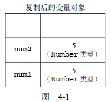
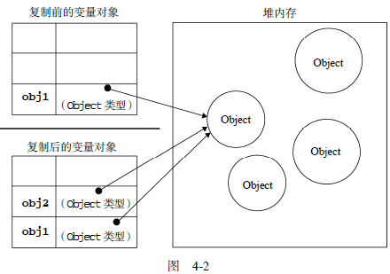
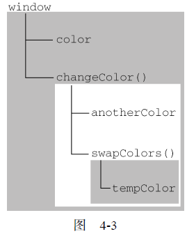

 


# 1. 基本类型和引用类型

JavaScript 变量可以用来保存两种类型的值：基本类型值和引用类型值。基本类型值指的是简单的数据段，而引用类型值指那些可能由多个值构成的对象。

- 基本数据类型：Undefined、Null、Boolean、Number 和 String。
- 引用类型：Object、Array、Date、RegExp、Function、基本包装类型。

基本类型与引用类型的区别

- 基本类型值在内存中占据固定大小的空间，因此被保存在栈内存中；引用类型的值是对象，保存在堆内存中。基本类型变量用 8 个字节存储。引用类型变量只保留引用类型的值的引用（即内存地址）。
- 可以为引用类型添加或删除属性和方法，不能给基本类型的值添加属性。
- 基本数据类型是按值访问的，可以操作保存在变量中的实际的值。引用类型的值是按引用访问的。包含引用类型值的变量实际上包含的并不是对象本身，而是一个指向该对象的指针。在操作对象时，实际上是在操作对象的引用而不是实际的对象。
- 复制基本类型的值，会创建这个值的一个副本；复制引用类型的值，复制的是指针，因此两个变量最终都指向同一个对象。
- 确定一个值是哪种基本类型可以使用 typeof 操作符，而确定一个值是哪种引用类型可以使用 instanceof 操作符。

详细区别见下文。


## **1.1 动态添加属性**

对于引用类型的值，可以为其添加或删除属性和方法。

```js
var person = new Object();
person.name = "Nicholas";			// 添加属性
alert(person.name); //"Nicholas"
```

不能给基本类型的值添加属性，尽管这样做不会导致任何错误。

```js
var name = "Nicholas";
name.age = 27;
alert(name.age); 	//undefined
```


## **1.2 复制变量值**

如果从一个变量向另一个变量复制基本类型的值，会在变量对象上创建一个新值，然后把该值复制到为新变量分配的位置上。

```js
var num1 = 5;
var num2 = num1;
console.log(num1,num2);		// 5 5
num2 = 10;
console.log(num1,num2);		// 5 10
```

<div align="center">  </div><br>

复制引用类型的值时，也会将存储在对象中的值复制一份到为新变量分配的空间中。不同的是，这个值的副本实际上是一个指针，而这个指针指向存储在堆中的一个对象。复制操作结束后，两个变量实际上将引用同一个对象。因此，改变其中一个变量，就会影响另一个变量。

```js
var obj1 = new Object();
var obj2 = obj1;
obj1.name = "Nicholas";
console.log(obj2.name); 	// "Nicholas"
```

<div align="center">  </div><br>


## **1.3 传递参数**

ECMAScript 中所有函数的参数都是按**值传递**的。也就是说，把函数外部的值复制给函数内部的参数，就和把值从一个变量复制到另一个变量一样。

在向参数传递基本类型的值时，被传递的值会被复制给一个局部变量（即命名参数，或arguments 对象中的一个元素）。

```js
function addTen(num) {
    num += 10;		// 参数实际上是函数的局部变量
    return num;
}
var count = 20;
var result = addTen(count);			// 传递参数
alert(count);	 // 20，没有变化
alert(result); 	 // 30
```

在向参数传递引用类型的值时，会把这个值在内存中的地址复制给一个局部变量，因此这个局部变量的变化会反映在函数的外部。

当在函数内部重写 obj 时，这个变量引用的就是一个局部对象了。而这个局部对象会在函数执行完毕后立即被销毁。

```js
function setName(obj) {
    obj.name = "Nicholas";
    console.log("1:"+obj.name);	// "Nicholas"
    obj = new Object();			// 重写 obj ，局部对象，函数执行完毕后销毁
    obj.name = "Greg";
    console.log("2:"+obj.name);	// "Greg"
}
var person = new Object();
console.log("3:"+person.name); 	// undefined
setName(person);
console.log("4:"+person.name); 	// "Nicholas"
// 3:undefined
// 1:Nicholas
// 2:Greg
// 4:Nicholas
```


## **1.4 检测类型**

### 1.4.1 判断基本类型

#### typeof

确定一个值是哪种基本类型可以使用 typeof 操作符。

typeof 返回一个字符串。返回情况：

- 值未定义，返回 “undifined”。
- 值是字符串，返回 “string”。注意，typeof 返回的是字符串。
- 值是布尔值，返回 “boolean”。
- 值是数值或 NaN 或 Infinity，返回 “number”。
- 值是对象（除了函数）或 null，返回 “object”。
- 值是函数，返回 "function"。
- 值是 Symbol()、Symbol('foo')、Symbol.iterator，返回 “symbol”。

```js
var s = "Nicholas",b = true,i = 22,u,n = null;
var o = new Object();
var f = new Function();
var sym1 = Symbol(),sym2 = Symbol('foo'),sym3 = Symbol.iterator;
console.log(
    typeof (typeof 1),	//“string”
    typeof 1, 			// “number”
    typeof("str"),		// “string”
    typeof "str",		// “string”
);
console.log(
    typeof s,	 // “string”
	typeof i,	 // “number”
	typeof b,	 // “boolean”
	typeof u,	 // “undefined”
	typeof n,	 // “object”
	typeof o,	 // “object”
	typeof f,	 // “function”
);
console.log(
    typeof sym1,	 // “symbol”
	typeof sym2,	 // “symbol”
	typeof sym3,	 // “symbol”
);
```

注意，typeof 是一个操作符而不是函数，因此例子中的圆括号可以使用，但不是必需的。typeof 操作符的操作数可以是变量，也可以是数值字面量。

**为什么 typeof 判断 null 为 object？**

> http://caibaojian.com/interview-map/frontend/

对于 `null` 来说，虽然它是基本类型，但是 typeof 会判断为 `object`，这是一个存在很久了的 Bug。

JS 的最初版本使用的是 32 位系统，为了性能考虑使用低位存储了变量的类型信息，`000` 开头代表是对象，然而 `null` 表示为全零，所以将它错误的判断为 `object` 。虽然现在的内部类型判断代码已经改变了，但是对于这个 Bug 却是一直流传下来。


####  `Object.prototype.toString()`

> [Object.prototype.toString() - MDN](https://developer.mozilla.org/zh-CN/docs/Web/JavaScript/Reference/Global_Objects/Object/toString)

可以通过 `toString()` 来获取每个对象的类型。为了每个对象都能通过 `Object.prototype.toString()` 来检测，需要以 `Function.prototype.call()` 或者 `Function.prototype.apply()` 的形式来调用，传递要检查的对象作为第一个参数，称为 `thisArg`。可以获得类似 `[object Type]` 的字符串。

```js
var toString = Object.prototype.toString;
console.log(
    toString.call(new Object), 	// [object Object]
	toString.call(new Date), 	// [object Date]
    toString.call(new String),	// [object String]
    toString.call(Math), 		// [object Math]
    toString.call(Global), 		// [object Math]
    toString.call(Window), 		// [object Math]
);
console.log(
    // Since JavaScript 1.8.5
    toString.call(undefined), 	// [object Undefined]
    toString.call(null), 		// [object Null]
);
console.log(
    toString.call(123),			// [object Number]
    toString.call("123"),		// [object String]
    toString.call(true),		// [object Boolean]
    toString.call(Symbol),		// [object Function] 
    toString.call(Symbol()),		// [object Symbol]
    toString.call(Symbol('foo')),	// [object Symbol]
    toString.call(Symbol.iterator),	// [object Symbol]
);
```


### 1.4.2 判断引用类型


确定一个值是哪种引用类型可以使用 instanceof 操作符。

> *result = variable instanceof constructor*

如果变量是给定引用类型的实例，那么 instanceof 操作符就会返回 true。

根据规定，所有引用类型的值都是 Object 的实例。检测一个引用类型值和 Object 构造函数时，instanceof 操作符始终会返回 true。

如果使用 instanceof 操作符检测基本类型的值，则该操作符始终会返回 false，因为基本类型不是对象。

```js
console.log(
    new Object() instanceof Object,
    new Array() instanceof Array,
    new RegExp() instanceof RegExp,
    new Function() instanceof Function,
    new RegExp() instanceof Object,
); 
// true true true true true
console.log(
    "123" instanceof Object,		// false
    null instanceof Object,			// false
    undefined instanceof Object,	// false
); 
```


# 2. 执行环境与作用域


所有变量都存在于一个执行环境（也称为作用域）当中，作用域决定了变量的生命周期，以及哪一部分代码可以访问其中的变量。

变量的作用域是指变量有效的范围，与变量定义的位置密切相关。作用域从空间角度来描述变量，也可以理解为变量的可见性。在某个范围内变量是可见的，也就是说，变量是可用的。

变量的执行环境有助于确定应该何时释放内存。


在 JavaScript 中，执行环境有全局执行环境（也称为全局环境，全局作用域）和函数执行环境（函数作用域，局部作用域）之分。

- 全局环境只能访问在全局环境中定义的变量和函数，不能直接访问局部环境中的任何数据；
- 函数的局部环境不仅有权访问函数作用域中的变量，而且有权访问其包含环境（父环境），乃至全局环境；

**VO 与 AO**

每个执行环境都有一个与之关联的变量对象（variable object，VO），环境中定义的所有变量和函数都保存在这个对象中。虽然代码无法访问这个对象，但解析器在处理数据时会在后台使用它。

VO 对应的是函数创建阶段。VO 存储着在上下文中声明的以下内容：

- 变量 (var / let / const, 变量声明)
- 函数声明 (FunctionDeclaration，FD)
- 函数的形参

```js
function add(a,b){
	var sum = a + b;
	function say(){
		alert(sum);
	}
	return sum;
}
// sum,say,a,b 组合的对象就是VO，不过该对象的值基本上都是 undefined
```

活动对象（activation object，AO） 对应的是函数执行阶段，当函数被调用执行时，会建立一个执行上下文，该执行上下文包含了函数所需的所有变量，该变量共同组成了一个新的对象就是 Activetion Object。该对象包含了：

- 函数的所有局部变量
- 函数的所有命名参数
- 函数的参数集合
- 函数的 this 指向

```js
add(4,5);
//  用 JS 对象来表示 AO
//  AO = {
//	    this : window,			//  this 指向
//	    arguments : [4,5],		// 参数集合
//	    a : 4,
//	    b : 5,
//	    say : ,
//	    sum : undefined
//  }
```


当代码在一个环境中执行时，会创建变量对象的一个作用域链（scope chain）来保证对执行环境有权访问的变量和函数的有序访问。**作用域链**用于搜索变量和函数。

作用域链的前端，始终都是当前执行的代码所在环境的变量对象（VO）。如果这个环境是函数，则将其活动对象（AO）作为变量对象。

如果函数是在全局作用域中创建的，在函数创建的时候，它的作用域链填入全局对象，此时的全局变量就是 VO。此时的作用域链只有一级：

```
scope(add) -> Global Object(VO)
VO = {
    this : window,
    add : 
}
```

在函数执行阶段，那么将其 AO 作为作用域链第一个对象，第二个对象是上级函数的执行上下文 AO，下一个对象依次类推。调用 add 后的作用域链有两级，第一级为 AO，然后 Global Object（VO）。

```
scope(add) -> AO -> VO
AO = {
    this : window,
    arguments : [4,5],
    a : 4,
    b : 5,
    sum : undefined
}
VO = {
    this : window,
    add : 
}
```

作用域链的作用是解析标识符。

在函数运行过程中，标识符解析是沿着作用域链一级一级地搜索标识符的过程。搜索过程始终从作用域链的前端开始，然后逐级地向后回溯，直至找到标识符为止（如果找不到标识符，通常会导致错误发生）。

下例中，函数 changeColor() 的作用域链包含两个对象：它自己的变量对象（其中定义着 arguments 对象）和全局环境的变量对象。

```js
var color = "blue";
function changeColor(){
    if (color === "blue"){
        color = "red";
    } else {
    	color = "blue";
    }
}
changeColor();
alert("Color is now " + color);
```

以下代码共涉及 3 个执行环境：全局环境、changeColor() 的局部环境和 swapColors() 的局部环境。全局环境中有一个变量 color 和一个函数 changeColor()。

```js
var color = "blue";
function changeColor(){
    var anotherColor = "red";
    function swapColors(){
        var tempColor = anotherColor;
        anotherColor = color;
        color = tempColor;
        // 这里可以访问 color、anotherColor 和 tempColor
    }
    // 这里可以访问 color 和 anotherColor，但不能访问 tempColor
    swapColors();
}
// 这里只能访问 color
changeColor();
```

下图形象地展示了前面这个例子的作用域链。

<div align="center">  </div><br>

函数参数也被当作变量来对待，因此其访问规则与执行环境中的其他变量相同。


## **2.1 局部变量 & 全局变量**

按照作用域的不同，变量可分为局部变量和全局变量。


局部作用域在函数内创建，在函数内可访问，函数外不可访问。在函数里面用 var/let/const 声明的变量，就是局部变量。

全局变量是整个代码中都可用的变量， 也就是说，这些变量没有任何作用域。一般来说以下几种情形拥有全局作用域：

- 程序最外层定义的函数或者变量。
- 所有末定义直接赋值的变量（不推荐）。
- 所有 window 对象的属性和方法。

在局部作用域中定义的全局变量很难维护，而且如果有意地忽略了 var 操作符，也会由于相应变量不会马上就有定义而导致不必要的混乱（局部变量和全局变量名称的冲突）。

```js
var vg = "var-global";		// 全局变量
let lg = "let-global";		// 全局变量
const cg = "const-global";	// 全局变量
function test(){
	fg = "function-global"; // 全局变量。不推荐。
    var vl = "var-local";		// 局部变量
    let ll = "let-local";		// 局部变量
    const cl = "const-local";	// 局部变量
}
test();
console.log(
    vg,lg,cg,fg
);		
// var-global let-global const-global function-global
console.log(
    vl,		// Uncaught ReferenceError: vl is not defined
    ll,		// Uncaught ReferenceError
    cl		// Uncaught ReferenceError
);	
```

末定义直接赋值不是一种声明方式，这仅仅是在全局对象上创建了新的属性（而不是变量）。

一般来说，变量不能删除，属性可以删除。

```js
a = 10;
console.log(
    window.a, delete a, window.a	// 10 true undefined
); 
var b = 20;
console.log(
    window.b, delete b,  window.b	// 20 false 20(变量是不能够删除的)
); 
```

特殊情况，在“eval”的上下文中，变量是可以删除的。有些 debug 工具也是可以删除的，因为它们使用了 eval() 方法来执行代码。

```js
eval('var a = 10;');
console.log(
    window.a, delete a, window.a	// 10 true undefined
); 
```


## **2.2 延长作用域链**

当执行流进入下列任何一个语句时，作用域链就会得到加长：

- try-catch 语句的 catch 块；

- with 语句。

这两个语句都会在作用域链的前端添加一个变量对象。对 with 语句来说，会将指定的对象添加到作用域链中。对 catch 语句来说，会创建一个新的变量对象，其中包含的是被抛出的错误对象的声明。

```js
function buildUrl() {
    var qs = "?debug=true";
    with(location){
        var url = href + qs;	// 实际引用的是 location.href
    }
    return url;
}
```


## **2.3 块级作用域**


在其他类 C 的语言中，由花括号封闭的代码块都有自己的作用域，因而支持根据条件来定义变量。var 没有块级作用域。在使用 for 语句时尤其要牢记这一差异。

```js
for (var i=0; i < 10; i++){
	doSomething(i);
}
alert(i); // 10
```

（1）声明变量

使用 var 声明的变量会自动被添加到最接近的环境中。

- 在函数内部，最接近的环境就是函数的局部环境；
- 在 with 语句中，最接近的环境是函数环境。

如果初始化变量时没有使用 var 声明，该变量会自动被添加到全局环境。

（2）查询标识符

当在某个环境中为了读取或写入而引用一个标识符时，必须通过搜索来确定该标识符实际代表什么。

搜索过程从作用域链的前端开始，向上逐级查询与给定名字匹配的标识符，一直追溯到全局环境的变量对象。如果在全局环境中也没有找到这个标识符，则意味着该变量尚未声明。

下例中， getColor() 为了确定变量 color 的值，将开始一个两步的搜索过程。首先，搜索 getColor() 的变量对象，查找其中是否包含一个名为 color 的标识符。在没有找到的情况下，搜索继续到下一个变量对象（全局环境的变量对象），然后找到了名为 color 的标识符。

```js
var color = "blue";
function getColor(){
	return color;
}
alert(getColor()); //"blue"
```

在这个搜索过程中，如果存在一个局部的变量的定义，则搜索会自动停止，不再进入另一个变量对象。换句话说，**如果局部环境中存在着同名标识符，就不会使用位于父环境中的标识符**。

```js
var color = "blue";
function getColor(){
	var color = "red";
	return color;
}
alert(getColor()); //"red"
```


# 3. 垃圾收集


JavaScript 具有自动垃圾收集机制，开发人员不必关心内存分配和回收问题。

垃圾收集机制的原理：找出那些不再继续使用的变量，然后释放其占用的内存。为此，垃圾收集器会按照固定的时间间隔（或代码执行中预定的收集时间），周期性地执行这一操作。

可以对 JavaScript 的垃圾收集例程作如下总结。

- 离开作用域的值将被自动标记为可以回收，因此将在垃圾收集期间被删除。
-  “标记清除”是目前主流的垃圾收集算法，这种算法的思想是给当前不使用的值加上标记，然后再回收其内存。
- 另一种垃圾收集算法是“引用计数”，这种算法的思想是跟踪记录所有值被引用的次数。JavaScript引擎目前都不再使用这种算法；但在 IE 中访问非原生 JavaScript 对象（如 DOM 元素）时，这种算法仍然可能会导致问题。
- 当代码中存在循环引用现象时，“引用计数”算法就会导致问题。
- 解除变量的引用不仅有助于消除循环引用现象，而且对垃圾收集也有好处。为了确保有效地回收内存，应该及时解除不再使用的全局对象、全局对象属性以及循环引用变量的引用。


## 3.1 标记清除

JavaScript 中最常用的垃圾收集方式是标记清除（mark-and-sweep）。

垃圾收集器在运行的时候会给存储在内存中的所有变量都加上标记。然后，它会去掉环境中的变量以及被环境中的变量引用的变量的标记。而在此之后再被加上标记的变量将被视为准备删除的变量，原因是环境中的变量已经无法访问到这些变量了。最后，垃圾收集器完成内存清除工作，销毁那些带标记的值并回收它们所占用的内存空间。

到 2008 年为止，IE、Firefox、Opera、Chrome 和 Safari 的 JavaScript 实现使用的都是标记清除式的垃圾收集策略（或类似的策略），只不过垃圾收集的时间间隔互有不同。


## 3.2 引用计数

另一种不太常见的垃圾收集策略叫做引用计数（reference counting）。

引用计数的含义是跟踪记录每个值被引用的次数。当声明了一个变量并将一个引用类型值赋给该变量时，则这个值的引用次数就是 1。如果同一个值又被赋给另一个变量，则该值的引用次数加 1。相反，如果包含对这个值引用的变量又取得了另外一个值，则这个值的引用次数减 1。当垃圾收集器下次再运行时，它就会释放那些引用次数为零的值所占用的内存。


### **循环引用**

当代码中存在循环引用现象时，“引用计数”算法就会导致问题。循环引用指的是对象 A 中包含一个指向对象 B 的指针，而对象 B 中也包含一个指向对象 A 的引用。

```js
function problem(){
    var objectA = new Object();
    var objectB = new Object();
    objectA.someOtherObject = objectB;
    objectB.anotherObject = objectA;
}
```

IE 中有一部分对象并不是原生 JS 对象。例如，其 BOM 和 DOM 中的对象就是使用 C++ 以COM（Component Object Model，组件对象模型）对象的形式实现的，而 COM 对象的垃圾收集机制采用的就是引用计数策略。因此，即使 IE 的 JavaScript 引擎是使用标记清除策略来实现的，但 JavaScript 访问的 COM 对象依然是基于引用计数策略的。换句话说，只要在 IE 中涉及 COM 对象，就会存在循环引用的问题。


为了解决上述问题，IE9 <u>把 BOM 和 DOM 对象都转换成了真正的 JavaScript 对象</u>。这样，就避免了两种垃圾收集算法并存导致的问题，也消除了常见的内存泄漏现象。


### **管理内存**

栈(stack)：自动分配内存空间，会自动释放，存放基本类型（简单的数据段），占据固定大小的空间。

- 存取速度比堆快，仅次于直接位于 CPU 中的寄存器，数据可以共享。
- 存在栈中的数据大小与生存期必须是确定的，缺乏灵活性。

堆(heap)：动态分配的内存，不会自动释放，存放引用类型（由多个值构成的对象），大小不定。引用类型保存在堆内存中，实际上保存的不是变量本身，而是指向该对象的指针。

- 对象不会随方法的结束而销毁。方法结束后，对象还可能被另一个引用变量所引用(参数传递)。创建对象是为了反复利用，这个对象将被保存到运行时数据区。


一旦数据不再有用，最好通过将其值设置为 null 来释放其引用——这个做法叫做解除引用（dereferencing）。

不过，解除一个值的引用并不意味着自动回收该值所占用的内存。解除引用的真正作用是让值脱离执行环境，以便垃圾收集器下次运行时将其回收。


## 内存泄漏


当程序运行需要的内存超过了剩余的内存时，就抛出内存溢出的错误。

- 栈溢出：栈可以递归调用方法，随着栈深度的增加，内存不够分配时，产生栈溢出。
- 堆溢出：循环创建对象，通俗点就是不断的 new 一个对象。


不再用到的内存，没有及时释放，就叫做内存泄漏（memory leak）。


怎样可以观察到内存泄漏呢？

[经验法则](https://www.toptal.com/nodejs/debugging-memory-leaks-node-js-applications)：如果连续五次垃圾回收之后，内存占用一次比一次大，就有内存泄漏。这就要求实时查看内存占用。


什么情况会内存泄漏？

提示：垃圾回收器定期扫描对象，并计算引用了每个对象的其他对象的数量。如果一个对象的引用数量为 0 （没有其他对象引用过该对象），或对该对象的唯一引用是循环的，那么该对象占用的内存立即被回收。

- 意外的全局变量
- 控制台日志 console.log
- 闭包
- 循环引用
- DOM 泄漏
- setTimeout 的第一个参数使用字符串而非函数。


# 参考资料

[深入了解 JavaScript，从作用域链开始（1） - 掘金](https://juejin.im/entry/57f5d492bf22ec006475238f)

[JavaScript 内存泄漏教程 - 阮一峰](http://www.ruanyifeng.com/blog/2017/04/memory-leak.html)