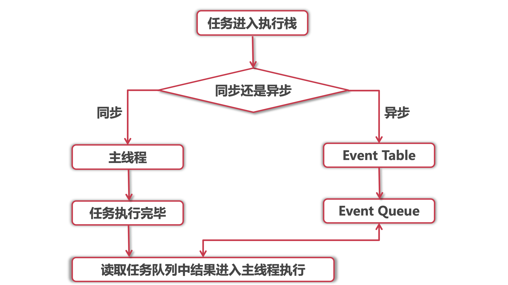

# 单线程


JavaScript 语言的执行环境是"单线程"（single thread）。

所谓"单线程"，就是指一次只能完成一件任务。如果有多个任务，就必须排队，前面一个任务完成，再执行后面一个任务，以此类推。


为什么 JS 是单线程的？

作为浏览器脚本语言，JavaScript 的主要用途是与用户互动，以及操作 DOM 。这决定了它只能是单线程，否则会带来很复杂的同步问题。

比如，假定 JavaScript 同时有两个线程，一个线程在某个 DOM 节点上添加内容，另一个线程删除了这个节点，这时浏览器应该以哪个线程为准？


单线程的优点和缺点：

- 实现简单，执行环境相对单纯；
- 坏处是只要有一个任务耗时很长，后面的任务都必须排队等着，会拖延整个程序的执行。比如：浏览器无响应（假死）。

为了解决这个问题，JavaScript 语言将任务的执行模式分成两种：

- 同步（Synchronous）：前一个任务结束后，执行后一个任务。程序的执行顺序与任务的排列顺序是一致的、同步的。
- 异步（Asynchronous）：每一个任务有一个或多个回调函数（callback），前一个任务结束后，执行回调函数。程序的执行顺序与任务的排列顺序是不一致的、异步的。

在浏览器端，耗时很长的操作都应该异步执行，避免浏览器失去响应，比如 Ajax 操作。

在服务器端，"异步模式"甚至是唯一的模式，因为执行环境是单线程的，如果允许同步执行所有 HTTP 请求，服务器性能会急剧下降，很快就会失去响应。

同步任务和异步任务的执行过程：

<div align="center">  </div><br>


# 异步

异步编程的方法

- 回调函数：最基本的方法。
- 事件监听
- 发布/订阅
- Promise 对象


## **回调函数**

什么是回调函数？

被作为实参传入另一函数，并在该外部函数内被调用，用以来完成某些任务的函数，称为回调函数。


**同步回调**

以下范例为 [同步](https://developer.mozilla.org/en-US/docs/Glossary/synchronous) 回调，它是立即执行的。

```js
function greeting(name) {
    console.log('Hello ' + name);
}

function processUserInput(callback) {
    var name = prompt('请输入你的名字。');
    callback(name);
}

processUserInput(greeting);
```

**异步回调**

回调函数经常被用于继续执行一个异步完成后的操作，它们被称为异步回调。


如果 f1 是一个很耗时的任务，可以考虑改写 f1，把另一个函数写成 f1 的回调函数。

```js
function f1(callback){
    setTimeout(function () {
        // f1 的任务代码
        callback();
    }, 1000);
}
```

优点是简单、容易理解和部署，

缺点是不利于代码的阅读和维护，各个部分之间高度[耦合](http://en.wikipedia.org/wiki/Coupling_(computer_programming))（Coupling），流程会很混乱，而且每个任务只能指定一个回调函数。


回调的四个问题

1. 嵌套层次很,难以维护
2. 无法正常使用 return 和 throw
3. 无法正常检索堆栈信息
4. 多个回调之间难以建立联系


### 回调地狱

当网络请求非常复杂时，会出现回调地狱。


### 回调与闭包


## **事件监听**

另一种思路是采用事件驱动模式。任务的执行不取决于代码的顺序，而取决于某个事件是否发生。

这种方法的优点是比较容易理解，可以绑定多个事件，每个事件可以指定多个回调函数，而且可以["去耦合"](http://en.wikipedia.org/wiki/Decoupling)（Decoupling），有利于实现[模块化](http://www.ruanyifeng.com/blog/2012/10/javascript_module.html)。

缺点是整个程序都要变成事件驱动型，运行流程会变得很不清晰。

## **发布/订阅**

假定，存在一个"信号中心"，某个任务执行完成，就向信号中心"发布"（publish）一个信号，其他任务可以向信号中心"订阅"（subscribe）这个信号，从而知道什么时候自己可以开始执行。这就叫做["发布/订阅模式"](http://en.wikipedia.org/wiki/Publish-subscribe_pattern)（publish-subscribe pattern），又称["观察者模式"](http://en.wikipedia.org/wiki/Observer_pattern)（observer pattern）。


## **Promises对象**

思想是，每一个异步任务返回一个 Promise 对象，该对象有一个 then 方法，允许指定回调函数。比如，f1的回调函数f2，可以写成：

```
f1().then(f2);
```

优点在于，回调函数变成了链式写法，程序的流程可以看得很清楚，而且有一整套的[配套方法](http://api.jquery.com/category/deferred-object/)，可以实现许多强大的功能。

还有一个前面三种方法都没有的好处：如果一个任务已经完成，再添加回调函数，该回调函数会立即执行。所以，不用担心是否错过了某个事件或信号。

这种方法的缺点就是编写和理解，都相对比较难。


## Generator


## Async/Await


# 参考资料

- [Javascript异步编程的4种方法 - 阮一峰](http://www.ruanyifeng.com/blog/2012/12/asynchronous%EF%BC%BFjavascript.html)
- [Asynchronous JS: Callbacks, Listeners, Control Flow Libs and Promises](http://sporto.github.io/blog/2012/12/09/callbacks-listeners-promises/)
- [JavaScript异步编程 - segmentfault](https://segmentfault.com/a/1190000015711829)
- [回调函数 - MDN](https://developer.mozilla.org/zh-CN/docs/Glossary/Callback_function)
- [JavaScript Callback Functions: An In-Depth Guide](https://dzone.com/articles/javascript-callback-functions-in-depth-guide-for-2)

