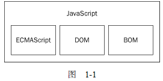

# JavaScript 简介

## 定义


JavaScript 是一种脚本语言（script language），可以实现网页交互。脚本语言不具备开发操作系统的能力，是只用来编写控制其他大型应用程序（比如浏览器）的“脚本”。

JavaScript 也是一种嵌入式（embedded）语言，依赖执行环境。目前，已经嵌入 JavaScript 的宿主环境有多种，最常见的环境就是浏览器，另外还有服务器环境，也就是 Node 项目。


## **JavaScript 简史**

JavaScript 由 Brendan Eich 发明，于 1995 年出现在 Netscape 中（该浏览器已停止更新），并于 1997 年被 ECMA（标准协会）采纳。

1996 年 11 月，Netscape 公司决定将 JavaScript 提交给标准化组织 ECMA，希望这种语言能够成为国际标准。1997 年，ECMA 发布 262 号标准文件（ECMA-262）的第一版，规定了浏览器脚本语言的标准，并将这种语言称为 ECMAScript，这个版本就是 1.0 版。

**ECMAScript 的版本**

| 年份 | 名称           | 描述                                              |
| :--- | :------------- | :------------------------------------------------ |
| 1997 | ECMAScript 1   | 第一个版本                                        |
| 1998 | ECMAScript 2   | 版本变更                                          |
| 1999 | ECMAScript 3   | 添加正则表达式 添加 try/catch                     |
|      | ECMAScript 4   | 没有发布                                          |
| 2009 | ECMAScript 5   | 添加 "strict mode"，严格模式 添加 JSON 支持       |
| 2011 | ECMAScript 5.1 | 版本变更                                          |
| 2015 | ECMAScript 6   | 添加类和模块                                      |
| 2016 | ECMAScript 7   | 增加指数运算符 (**) 增加 Array.prototype.includes |


**JavaScript 与 ECMAScript 的关系**

ECMAScript 是 JavaScript 的规格，JavaScript 是 ECMAScript 的一种实现（另外的实现还有 JScript 和 ActionScript）。在日常场合，这两个词是可以互换的。

ECMAScript 标准从一开始就是针对 JavaScript 语言制定的。之所以不叫 JavaScript，有两个原因。一是商标，Java 是 Sun 公司的商标。根据授权协议，只有 Netscape 公司可以合法地使用 JavaScript 这个名字，且 JavaScript 本身也已经被 Netscape 公司注册为商标。二是想体现这门语言的制定者是 ECMA，不是 Netscape，这样有利于保证这门语言的开放性和中立性。


## 与其他语言比较

**JavaScript 与 Java 的区别**

无论在概念上还是设计上，JavaScript 与 Java 都是两种完全不同的语言。Java，由 Sun 发明，是更复杂的编程语言。

|              | JavaScript                             | Java                               |
| ------------ | :------------------------------------- | :--------------------------------- |
| 完整性       | 可以被引入 HTML 页面                   | 十分完整、成熟                     |
| 面向对象     | 面向对象。不区分对象类型。             | 基于类系统。分为类和实例。         |
| 是否结构化   | 客户端脚本语言、非结构化编程。         | 面向对象、结构化编程语言           |
| **继承**     | 通过原型机制继承，                     | 通过类层级的定义实现继承。         |
| **动态添加** | 任何对象的属性和方法均可以被动态添加。 | 不能动态增加对象或类的属性或方法。 |
| **变量类型** | 不需要提前声明(动态类型)。             | 必须提前声明(静态类型)。           |
| **写入硬盘** | 不能直接自动写入硬盘。                 | 可以直接自动写入硬盘。             |


JavaScript 的对象可以被修改，可以添加新成员，也可以用 delete 运算符删除现有成员。但这违背“类可以被扩展，不应该被修改”的面向对象设计的原则，也是与 C++ 和 Java 等别的面向对象语言的区别之一。

- 部署环境：JavaScript 局限于 Web 浏览器或服务器环境。Java 理论上可以部署在任何环境。

- **基于对象和面向对象** 

  Java 是一种真正的面向对象的语言，在开发程序时必须要先设计对象。 

  JavaScript 是一种脚本语言，它是基于对象和事件驱动的编程语言，并且其本身也具有非常丰富的内部对象可以供使用。

- 解释和编译：

  两种语言在其浏览器中所执行的方式不一样。Java 的源代码在传递到客户端执行之前，必须经过编译。因而客户端上必须具有相应平台上的仿真器或解释器，它可以通过编译器或解释器实现独立于某个特定的平台编译代码的束缚。 

  JavaScript 是一种解释性的编程语言，其源代码在发往客户端执行之前不需经过编译，而是将文本格式的字符代码发送给客户编由浏览器解释执行。 

- 代码格式：

  Java 是一种与 HTML 无关的格式，必须通过像 HTML 中引用外媒体那样进行装载，其代码以字节代码形式保存在独立的文档中。

  JavaScript 代码是一种文本字符格式，可以直接嵌入 HTML 文档中，并且可动态装载。

- 在 HTML 中嵌入方式：

  在 HTML 中，Java 使用 `<applet>……</applet>` 来标识，JavaScript 使用 `<script>……</script>` 来标识。

- 强变量和弱变量 

  Java 采用强类型变量检查，即所有变量在编译之前必须作声明。 

  JavaScript 中变量声明，采用其弱类型。即变量在使用前不需作声明，而是解释器在运行时检查其数据类型。 

- 静态联编和动态联编 

  Java 采用静态联编，即 Java 的对象引用必须在编译时进行，以使编译器能够实现强类型检查。 

  JavaScript 采用动态联编，即 JavaScript 的对象引用在运行时进行检查，如不经编译则就无法实现对象引用的检查。

- 作用用途：

  Java 用以开发软件、手机、游戏等等。JavaScript 多用于网页或类似于网页的编程、可用于服务器或者客户端。

- 工作原理：

  Java 开发的产品需要编译成二进制代码后直接在系统平台级别上运行的，速度和效率高。

  JavaScript 多由浏览器逐级进行解释执行，所以速度和效率很慢。

- 内存管理：Java 和 JavaScript 依靠垃圾回收机制，C++ 手动管理内存。


JavaScript 和 ASP 脚本相比，哪个更快？

JavaScript 更快。JavaScript 是一种客户端语言，因此它不需要 Web 服务器的协助就可以执行； ASP 是服务器端语言，因此它总是比 JavaScript 慢。值得注意的是，JavaScript 现在也可用于服务器端语言（Node .js）。


## **JavaScript 的实现**

ECMA-262 是 JavaScript 标准的官方名称。但 JavaScript 的含义比 ECMA-262 中规定的多得多。一个完整的 JavaScript 实现由下列三个不同的部分组成：

- 核心（ECMAScript），由 ECMA-262 定义，提供核心语言功能；
- 文档对象模型（DOM），提供访问和操作网页内容的方法和接口；
- 浏览器对象模型（BOM），提供与浏览器交互的方法和接口。

<div align="center">  </div><br>


# JavaScript 使用

把 JavaScript 插入到 HTML 页面中要使用 `<script>` 元素。


##  `<script>` 元素

 **`<script>` 的属性**

| 属性                                                         | 值          | 描述                                                         |
| :----------------------------------------------------------- | :---------- | :----------------------------------------------------------- |
| async                                                        | async       | 规定异步执行脚本（仅适用于外部脚本 ）。（HTML5）             |
| [charset](https://www.runoob.com/tags/att-script-charset.html) | *charset*   | 规定在脚本中使用的字符编码（仅适用于外部脚本）。             |
| [defer](https://www.runoob.com/tags/att-script-defer.html)   | defer       | 延迟执行。规定当页面已完成解析后，执行脚本（仅适用于外部脚本）。 |
| [src](https://www.runoob.com/tags/att-script-src.html)       | *URL*       | 规定外部脚本的 URL。                                         |
| [type](https://www.runoob.com/tags/att-script-type.html)     | *MIME-type* | 规定脚本的 MIME 类型。                                       |
| xml:space                                                    | preserve    | HTML 5 不支持。规定是否保留代码中的空白。                    |


### **type 属性**

常用属性值： text/javascript。但 JS 是 HTML 中的默认脚本语言，type 属性不是必需的。


### 使用方式

**`<script>` 元素在 HTML 中的两种使用方式**

**方式一：直接在页面中嵌入 JavaScript 代码**

不要在 JavaScript 代码中的任何地方出现" `</script>` "，否则，浏览器会认为是结束的" `</script>` "标签。如果必须出现，可以通过转义字符“\”解决。

```html
<script type="text/javascript">
    function sayScript(){
    	alert("<\/script>");
    }
</script>
```

**方式二：包含外部 JavaScript 文件**

通过绝对 URL 或相对 URL 引用外部脚本，src 属性是必需的。

- 不能再包含额外的 JavaScript 代码。带有 src 属性的 `<script>` 元素只会下载并执行外部脚本文件，嵌入的代码会被忽略。

  ```html
  <script src="myScript.js"></script>
  ```

- 在 XHTML 文档中，可以省略 `</script>` 标签。但不能在 HTML 文档使用。因为这种语法不符合 HTML 规范，而且也得不到某些浏览器（IE 等）的正确解析。

  ```html
  <script type="text/javascript" src="example.js" />	
  ```

- 可以包含来自外部域的 JavaScript 文件。

  ```html
  <script src="http://www.somewhere.com/afile.js"></script>
  ```

- 外部 JavaScript 文件带有 .js 扩展名。扩展名不是必需的，因为浏览器不会检查。如果不使用 .js 扩展名，确保服务器能返回正确的 MIME 类型。

- 使用多个 script 标签，向一张页面添加多个脚本文件：

  ```html
  <script src="myScript1.js"></script>
  <script src="myScript2.js"></script>
  ```

**补充说明：内联 JavaScript 处理器**

在 HTML 文档中，onclick 属性可以包含 JavaScript 中的函数：

```html
<button onclick="createParagraph()">点我呀</button>
```

外部 JavaScript 文件对应部分：

```js
function createParagraph() {
  const para = document.createElement('p');
  para.textContent = '你点击了这个按钮！';
  document.body.appendChild(para);
}
```

**但不要这样做。** 这将使 JavaScript 污染到 HTML，而且效率低下。对于每个需要应用 JavaScript 的按钮，都得手动添加 `onclick="createParagraph()"` 属性。

可以使用纯 JavaScript 结构来通过一个指令选取所有按钮。

```js
const buttons = document.querySelectorAll('button');

for(let i = 0; i < buttons.length ; i++) {
    buttons[i].addEventListener('click', createParagraph);
}
```

乍看去比 `onclick` 属性要长一些，但是这样写会对页面上所有按钮生效，无论多少个，或添加或删除，完全无需修改 JavaScript 代码。


### **使用方式选择**

如果相同的脚本被用于许多不同的网页，外部脚本很实用。

一般认为最好的做法是尽可能使用外部文件来包含 JavaScript 代码。在外部文件中放置脚本有如下优势：

- 分离了 HTML 和 JavaScript 代码
- **可维护性**：把所有 JavaScript 文件都放在一个文件夹中，开发人员能够在不触及 HTML 标记的情况下，集中精力编辑 JavaScript 代码，使 HTML 和 JavaScript 更易于阅读和维护。
- **可缓存**：已缓存的 JavaScript 文件可加速页面加载。浏览器能够根据具体的设置缓存链接的所有外部JavaScript 文件。也就是说，如果多个页面都使用同一个文件，那么这个文件只需下载一次。因此，最终结果就是能够加快页面加载的速度。
- 适应未来。


###  **脚本位置**


在 `</body>` 标签结束前都可以插入 `<script>`。因此，`<script>` 可被放置于 HTML 页面的 `<body>` 或 `<head>` 部分中。

建议把脚本置于 `<body>` 元素的底部，可改善显示速度，因为脚本编译会拖慢显示。放置于 `<head>` 元素中，意味着必须等全部 JavaScript 代码都被下载、解析和执行完成，才能开始呈现页面的内容。

```html
<!DOCTYPE html>
<html>
    <head>
    	<title>Example HTML Page</title>
    </head>
    <body>
        <!-- 这里放内容 -->
        <script type="text/javascript" src="example1.js"></script>
        <script type="text/javascript" src="example2.js"></script>
    </body>
</html>
```


### **脚本调用策略**

在不使用 `defer` 和 `async` 属性的情况下，所有 `<script>` 元素都会按照它们在页面中出现的先后顺序依次被解析。 `<script>` 元素的 `defer` 属性和 `async` 属性都用于改变处理脚本的行为，都只适用于外部脚本文件。区别在于：

- `async`：脚本一旦可用，异步执行，不保证脚本的运行次序。适用于无依赖且独立运行的脚本。

  ```html
  <script async src="js/vendor/jquery.js"></script>
  <script async src="js/script2.js"></script>
  <script async src="js/script3.js"></script>
  ```

  上例中，三者的调用顺序是不确定的。`jquery.js` 可能在 `script2` 和 `script3` 之前或之后调用。后两个脚本中依赖 `jquery` 的函数将产生错误，因为脚本运行时 `jquery` 尚未加载。

- `defer`：延迟执行，页面解析完毕（遇到 `</html>` ）再运行脚本。适用于存在依赖关系的脚本，将关联的脚本按所需顺序置于 HTML 中。

  ```html
  <script defer src="js/vendor/jquery.js"></script>
  <script defer src="js/script2.js"></script>
  <script defer src="js/script3.js"></script>
  ```

  HTML5 规范要求脚本按照它们出现的先后顺序执行，因此第一个延迟脚本会先于第二个延迟脚本执行，而这两个脚本会先于 DOMContentLoaded 事件执行。

  在现实当中，延迟脚本并不一定会按照顺序执行，也不一定会在 DOMContentLoaded 事件触发前执行，因此最好只包含一个延迟脚本。


##  `<noscript>` 元素

当浏览器不支持 JavaScript 时如何让页面平稳地退化？

 `<noscript>` 元素在不支持 JavaScript 的浏览器中显示替代的内容，可以包含能够出现在 `<body>` 中的除了 `<script>` 元素之外的任何 HTML 元素。

包含在 `<noscript>` 元素中的内容只有在下列情况下才会显示出来：

- 浏览器不支持脚本；
- 浏览器支持脚本，但脚本被禁用。


