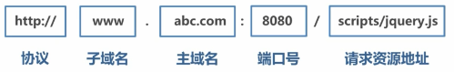

# 跨域 与 Comet

当协议、子域名、主域名、端口号中任意一个不相同时，都算作不同域。

跨域是指不同域名之间的相互访问。由于 JavaScript 同源策略的限制， A 域名下的 JavaScript 无法操作 B 或者 C 域名下的对象。

<div align="center">  </div><br>


通过 XHR 实现 Ajax 通信的一个主要限制，来源于跨域安全策略（同源策略）。

同源策略是客户端脚本（尤其是 JavaScript ）的重要安全度量标准。它最早出自 Netscape Navigator 2.0 ，目的是防止某个文档或脚本从多个不同源装载。

同源策略为通信设置了“相同的域、相同的端口、相同的协议”这一限制。试图访问上述限制之外的资源，都会引发安全错误，除非采用被认可的跨域解决方案。这种安全策略可以预防某些恶意行为。但是，实现合理的跨域请求对开发某些浏览器应用程序也是至关重要的。


跨域解决方案

- CORS
- 图像 Ping
- JSONP
- Commet
- SSE
- WebSocket
- 代理
- 


## 1. 跨源资源共享

CORS（Cross-Origin Resource Sharing，跨源资源共享）是 W3C 的一个工作草案，定义了在必须访问跨源资源时，浏览器与服务器应该如何沟通。CORS 背后的基本思想，就是使用自定义的 HTTP 头部让浏览器与服务器进行沟通，从而决定请求或响应是应该成功，还是应该失败。

IE8 通过 XDomainRequest 对象支持 CORS，其他浏览器通过 XHR 对象原生支持 CORS。


### IE 对 CORS 的实现

微软在 IE8 中引入了 XDR（XDomainRequest）类型。这个对象与 XHR 类似，但能实现安全可靠的跨域通信。XDR 对象的安全机制部分实现了 W3C 的 CORS 规范。以下是XDR 与XHR 的一些不同之处。

-  cookie 不会随请求发送，也不会随响应返回。
-  只能设置请求头部信息中的Content-Type 字段。
-  不能访问响应头部信息。
-  只支持GET 和POST 请求。


### 其它浏览器对 CORS

Firefox 3.5+、Safari 4+、Chrome、iOS 版 Safari 和 Android 平台中的 WebKit 都通过XMLHttpRequest 对象实现了对 CORS 的原生支持。在尝试打开不同来源的资源时，无需额外编写代码就可以触发这个行为。要请求位于另一个域中的资源，使用标准的 XHR 对象并在 open() 方法中传入绝对 URL 即可。


与 IE 中的 XDR 对象不同，通过跨域 XHR 对象可以访问 status 和 statusText 属性，而且还支持同步请求。跨域 XHR 对象也有一些限制，但为了安全这些限制是必需的。以下就是这些限制。

-  不能使用 setRequestHeader() 设置自定义头部。
-  不能发送和接收 cookie。
-  调用 getAllResponseHeaders() 方法总会返回空字符串。

由于无论同源请求还是跨源请求都使用相同的接口，因此对于本地资源，最好使用相对URL，在访问远程资源时再使用绝对URL。这样做能消除歧义，避免出现限制访问头部或本地cookie 信息等问题。


### Preflighted Reqeusts

CORS 通过 Preflighted Requests 透明服务器验证机制支持开发人员使用自定义的头部、
GET 或 POST 之外的方法，以及不同类型的主体内容。在使用下列高级选项来发送请求时，就会向服务器发送一个 Preflight 请求。这种请求使用 OPTIONS 方法，发送下列头部。

-  Origin：与简单的请求相同。
-  Access-Control-Request-Method：请求自身使用的方法。
-  Access-Control-Request-Headers：（可选）自定义的头部信息，多个头部以逗号分隔。

以下是一个带有自定义头部NCZ 的使用POST 方法发送的请求。

发送这个请求后，服务器可以决定是否允许这种类型的请求。服务器通过在响应中发送如下头部与浏览器进行沟通。

-  Access-Control-Allow-Origin：与简单的请求相同。
-  Access-Control-Allow-Methods：允许的方法，多个方法以逗号分隔。
-  Access-Control-Allow-Headers：允许的头部，多个头部以逗号分隔。

支持 Preflight 请求的浏览器包括 Firefox 3.5+、Safari 4+ 和 Chrome。IE 10 及更早版本都不支持。


### 带凭据的请求

默认情况下，跨源请求不提供凭据（cookie、HTTP 认证及客户端 SSL 证明等）。通过将
withCredentials 属性设置为 true，可以指定某个请求应该发送凭据。如果服务器接受带凭据的请求，会用下面的 HTTP 头部来响应。

```
Access-Control-Allow-Credentials: true
```

如果发送的是带凭据的请求，但服务器的响应中没有包含这个头部，那么浏览器就不会把响应交给 JavaScript（于是，responseText 中将是空字符串，status 的值为0，而且会调用onerror()事件处理程序）。另外，服务器还可以在Preflight 响应中发送这个HTTP 头部，表示允许源发送带凭据的请求。

支持 withCredentials 属性的浏览器有 Firefox 3.5+、Safari 4+ 和 Chrome。IE 10 及更早版本都不支持。


### 跨浏览器的CORS

检测 XHR 是否支持 CORS 的最简单方式，就是检查是否存在 withCredentials 属性。再结合检测 XDomainRequest 对象是否存在，就可以兼顾所有浏览器了。

Firefox、Safari 和 Chrome 中的 XMLHttpRequest 对象与 IE 中的 XDomainRequest 对象类似，都提供了够用的接口，因此以上模式还是相当有用的。这两个对象共同的属性/方法如下。

-  abort()：用于停止正在进行的请求。
-  onerror：用于替代onreadystatechange 检测错误。
-  onload：用于替代onreadystatechange 检测成功。
-  responseText：用于取得


图像 Ping 和 JSONP 是另外两种跨域通信的技术，但不如CORS 稳妥。


## 2. 图像 Ping

图像 Ping 是与服务器进行简单、单向的跨域通信的一种方式。

请求的数据是通过查询字符串形式发送的，而响应可以是任意内容，但通常是像素图或 204 响应。通过图像 Ping，浏览器得不到任何具体的数据，但通过侦听 load 和 error 事件，可以知道接收到响应的时间。

```js
var img = new Image();
// 将onload 和onerror 事件处理程序指定为同一个函数
img.onload = img.onerror = function(){	
    alert("Done!");
};
// 请求从设置 src 属性开始。该例在请求中发送了一个 name 参数。
img.src = "http://www.example.com/test?name=Nicholas";
```

图像 Ping 最常用于跟踪用户点击页面或动态广告曝光次数。

图像 Ping 有两个主要的缺点，一是只能发送 GET 请求，二是无法访问服务器的响应文本。因此，图像 Ping 只能用于浏览器与服务器间的单向通信。


## 3. JSONP


JSONP（JSON with padding，填充式 JSON 或参数式 JSON），是应用 JSON 的一种新方法，在后来的 Web 服务中非常流行。JSONP 看起来与 JSON 差不多，只不过是被包含在函数调用中的 JSON。顾名思议，就是把 JSON 填充到一个盒子里。

```js
callback({ "name": "Nicholas" });
```

JSONP 由两部分组成：回调函数和数据。回调函数是当响应到来时应该在页面中调用的函数。回调函数的名字一般是在请求中指定的。而数据就是传入回调函数中的 JSON 数据。

下面是一个典型的 JSONP 请求。这里指定的回调函数的名字叫 handleResponse()。

```
http://freegeoip.net/json/?callback=handleResponse
```

JSONP 是通过动态 `<script>` 元素来使用的，使用时可以为 src 属性指定一个跨域 URL。这里的 `<script>` 元素与 `` 元素类似，都有能力不受限制地从其他域加载资源。因为 JSONP 是有效的 JavaScript 代码，所以在请求完成后，即在 JSONP 响应加载到页面中以后，就会立即执行。

```js
function handleResponse(response){
    alert("You’re at IP address " + response.ip + ", which is in " +
          response.city + ", " + response.region_name);
}
var script = document.createElement("script");
script.src = "http://freegeoip.net/json/?callback=handleResponse";
document.body.insertBefore(script, document.body.firstChild);
```


## 4. Comet

Comet 是对 Ajax 的进一步扩展，让服务器几乎能够实时地向客户端推送数据。实现 Comet 的手段主要有两个：长轮询和 HTTP 流。所有浏览器都支持长轮询，而只有部分浏览器原生支持 HTTP 流。


## 5. 服务器发送事件 SSE

SSE（Server-Sent Events，服务器发送事件）是一种实现 Comet 交互的浏览器 API，既支持长轮询，也支持 HTTP 流。

支持SSE 的浏览器有Firefox 6+、Safari 5+、Opera 11+、Chrome 和iOS 4+版Safari。


## 6. Web Sockets

Web Sockets 是一种与服务器进行全双工、双向通信的信道。与其他方案不同，Web Sockets 不使用 HTTP 协议，而使用一种自定义的协议。这种协议专门为快速传输小数据设计。虽然要求使用不同的 Web 服务器，但却具有速度上的优势。


## 7. SSE 与 Web Sockets


## 6. 安全


## 代理

在同域名的 Web 服务器端创建一个代理


## XHR 2


# 总结

