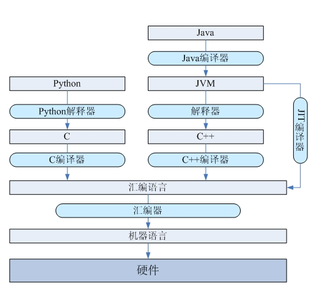

# 语言类型

## 解释型语言 vs 编译型语言

> https://juejin.im/post/594e77ef5188250d9e6504bc#heading-12

计算机只能理解机器语言，不能直接理解高级语言，所以必须要把高级语言翻译成机器语言。翻译的方式有两种，一个是编译，一个是解释。两种方式只是翻译的时间不同。

**编译型语言**

- 编译型语言是指程序在执行之前需要一个专门的编译过程，把程序源文件编译为机器语言的文件。只需编译一次，运行时不需要重新编译，执行效率高。缺点是，编译型语言依赖编译器，跨平台性差。
- 编译性语言代表：C、C++、Pascal/Object Pascal（Delphi）；比如 C 语言程序的执行过程，要先将后缀为 .c 的源文件通过编译、链接为后缀为 .exe 的可执行文件，才能运行。

- **不同平台对编译器影响较大**。 
  - 16 位系统下 int 是 2 个字节（16位），而 32 位系统下 int 占 4 个字节（32位）；
  - 32 位系统下 long 类型占 4 字节，而 64 位系统下 long 类型占 8 个字节；

**解释型语言**

一般来说，解释型语言也叫做脚本语言。

- 程序不需要编译，程序<u>在运行时才翻译成机器语言</u>，每执行一次都要翻译一次；

  ```
  源代码 -> 解释器 -> 运行结果
  ```

  解释器是一个黑盒，实现方式多种多样。比如，解释器里面可以包含一个编译器和虚拟机，编译器把源码转化成 AST 或者字节码(中间代码)然后交给虚拟机执行，比如 Ruby 1.9 以后版本的官方实现。

  虚拟机的内部可以编译执行，也可以解释执行。解释执行会逐条翻译字节码。

  虚拟机编译执行：把字节码编译成当前 CPU 下的机器码，然后统一执行。

  ```
  源代码 -> 中间代码 -> 目标代码 -> 运行结果
  ```

- 解释性语言代表：Python、**JavaScript**、Shell、Ruby、MATLAB 等；

- <u>运行效率一般相对比较低</u>，依赖解释器，**跨平台性好**；

<div align="center">  </div><br>

解释型语言和编译型语言的根本区别在于，对于用户来说，到底是直接从源码开始执行，还是从中间代码开始执行。C 语言中，所有的可执行程序都是二进制文件。而对于 Python 或者 JavaScript，用户并没有拿到中间代码，直接从源码开始执行。

从这个角度来看， Java 不可能是解释型语言，虽然 Java 虚拟机会解释字节码，但是对于用户来说，他们是从编译好的 .class 文件开始执行，而非源代码。

从本质上讲，**根本不存在解释型语言或者编译型语言这种说法**。如果一门语言是可以解释的，必然可以开发出这门语言的编译器。反过来说，如果一门语言是可编译的，只要把它的编译器放到解释器里，把编译推迟到运行时，这么语言就可以是解释型的。

两者都是语言的实现方案，是提前编译以获得最大的性能提高，还是运行时去解析以获得灵活性，往往取决于语言的应用场景。语言的应用场景决定了它的主流实现是编译型还是解释型。

## 静态语言 vs 动态语言

静态语言和动态语言的区别

- 静态语言：在编译时变量的数据类型即可确定的语言。多数静态类型语言要求在使用变量之前必须声明数据类型。 例如：C++、Java、Delphi、C# 等。

- 动态语言：在运行时确定数据类型的语言。变量使用之前不需要类型声明，通常变量的类型是被赋值的那个值的类型。 例如 PHP、ASP、Ruby、Python、Perl、ABAP、SQL、JavaScript、Unix Shell 等等。

## 强类型语言 vs 弱类型语言

强类型语言和弱类型语言的区别

- 强类型语言：强制数据类型定义的语言，是类型安全的语言。一个变量被指定了某个数据类型，如果不经过强制转换，数据类型不变。

- 弱类型语言：数据类型可以被忽略的语言。变量可以赋不同数据类型的值。一个变量的类型是由其应用上下文确定的。

强类型定义语言在速度上可能略逊色于弱类型定义语言，但是强类型定义语言带来的严谨性能够有效的避免许多错误。


# JavaScript 运行机制

JavaScript 是如何运行的？

JavaScript 和其它语言最大的区别在于部署环境。

其它语言都有一个编译器/解释器运行在操作系统上，直接把源码转换成机器码。而 JavaScript 的解释器一般内置在浏览器中（比如 Chrome 的 V8 引擎）或服务器环境（比如 Node.js）。因此 JavaScript 的能力实际上会受到宿主环境的影响，有一些限制和加强。


当宿主环境是浏览器时，DOM 操作相关的 API 没有定义在 ECMAScript 标准中， `window.xxx` 、 `window.document.xxx` 不是 JavaScript 自带的功能，这通常是由宿主平台通过 C/C++ 等语言实现，然后提供给 JavaScript 的接口。同样的，由于浏览器中的 JavaScript 只是一个轻量的语言，没有必要读写操作系统的文件，因此浏览器引擎一般不会向 JavaScript 提供文件读写的运行时组件，它也就不具备 IO 的能力。从这个角度来看，整个浏览器都可以看做 JavaScript 的虚拟机或者运行时环境。

当宿主环境是 Node.js 时，JavaScript 能力会发生变化。它不再具有 DOM API，但多了读写文件等能力。这时候，Node.js 更像是一个标准的 JavaScript 解析器。这也是为什么 Node.js 让 JavaScript 可以编写后端应用的原因。


## 变量提升

变量提升的原因

既不是 JavaScript 引擎解释同一脚本文件两次（第一次完成变量提升，第二次执行代码），也不是先编译整个代码再运行。

下面是 JavaScript 处理声明语句的过程：

- 一旦 V8 引擎进入一个执行具体代码的执行上下文（函数），它就对代码进行词法分析或者分词。这意味着代码将被分割成像 `foo=10` 这样的原子符号（atomic token）。
- 在对当前的整个作用域分析完成后，引擎将 token 解析翻译成一个 AST (抽象语法树)。
- 引擎每次遇到声明语句，就会把声明传到作用域（scope）中创建一个绑定。每次声明都会为变分配内存。只是分配内存，并不会修改源代码将变量声明语句提升。在 JS 中分配内存意味着将变量默认设为 undefined。
- 在这之后，引擎每一次遇到赋值或者取值，都会通过作用域（scope ）查找绑定。如果在当前作用域中没有查找到就接着向上级作用域查找直到找到为止。
- 接着引擎生成 CPU 可以执行的机器码。
- 最后，代码执行完毕。

变量提升是执行上下文的小把戏，而不是许多网站描述的源代码修改。在执行任何语句之前，解释器要从创建执行上下文后已经存在的作用域（scope ）中找到变量的值。


## JIT 优化

解释执行效率低的主要原因之一在于，相同的语句被反复解释，因此优化的思路是动态的观察哪些代码是经常被调用的。对于那些被高频率调用的代码，可以用编译器把它编译成机器码并且缓存下来，下次执行时不用重新解释，从而提升速度。这就是 JIT(Just-In-Time) 的技术原理。

基于缓存的优化，一定会涉及到缓存命中率的问题。在 JavaScript 中，即使是同一段代码，在不同上下文中生成的机器码也不一定相同。比如这个函数：

```
function add(a, b) {
    return a + b;
}
```

如果这里的 a 和 b 都是整数，最终的代码一定是汇编中的 `add` 命令。如果类似的加法运算调用了很多次，解释器可能会认为它值得被优化，于是编译了这段代码。但如果下一次调用的是 `add("hello", "world")`，之前的优化就无效了，因为字符串加法的实现和整数加法的实现完全不同。


于是优化后的代码（二进制格式）还得被还原成原先的形式（字符串格式），这样的过程被称为去优化。反复的优化 -> 去优化 -> 优化 …… 非常耗时，大大降低了引入 JIT 带来的性能提升。

JIT 理论上给传统的 JavaScript 带了了 20-40 倍的性能提升，但由于上述去优化的存在，在实际运行的过程中远远达不到这个理论上的性能天花板。


在 JavaScript 中如果一段代码运行超过一次，那么就称为 warm。如果一个函数开始变得 warmer （即运行更多次），JIT 将把这段代码送到编译器中编译并且保存一个编译后的版本。下一 次同样代码执行的时候，引擎会跳过翻译过程直接使用编译后的版本。

这将优化性能。在真正的编译器中，因为编译器能访问整个代码所以做了除此之外更多的事情。


如果一段 warm 的代码变得 hot 或者 hotter， JIT 会尝试更多的优化并且保存优化后的版本。在编译器进行优化的过程中会做一些关于变量类型和运行环境中值的假设，如果假设不成立就将这个优化的版本回退，如果假设成立的话，这将让代码性能更高。


总结

- JavaScript代码需要在机器( node或者浏览器)上安装-一个工具 (JS引擎)才能执行。这是解释型语言需要的。编译型语言程序能够自由地直接运行。
- 变量提升不是代码修改。在这个过程中没有生成中间代码。变量提升只是JS解释器处理事情的方式。
- JIT是唯一点我们可以对 JavaScript是否是一个解释型语言提出疑问的理由。 但是JIT 不是完整的编译器,它在执行前进行编译。而且JIT只是Mozilla和Google的开发人员为了提升浏览器性能才引入的。JavaScript 或TC39从来没有强制要求使用 JIT。


## 单线程


> https://blog.csdn.net/Febby_/article/details/94763441

JS 是**单线程**环境，同一个时间只能做一件事。

JavaScript 将所有任务分成两种：

- 同步任务：在主线程上排队执行的任务，只有前一个任务执行完毕，才能执行后一个任务；
- 异步任务：不进入主线程，而进入"任务队列"（task queue）的任务，只有"任务队列"通知主线程，某个异步任务可以执行了，该任务才会进入主线程执行。

**在所有同步任务执行完之前，任何的异步任务是不会执行的。**

异步执行的运行机制如下：

- 所有同步任务都在主线程上执行，形成一个执行栈（execution context stack）。

- 主线程之外，还存在一个"任务队列"（task queue）。只要异步任务有了运行结果，就在"任务队列"之中放置一个事件。

- 一旦"执行栈"中的所有同步任务执行完毕，系统就会读取"任务队列"，看看里面有哪些事件。那些对应的异步任务，于是结束等待状态，进入执行栈，开始执行。

- 主线程不断重复上面的第三步。

  主线程从"任务队列"中读取事件，这个过程是循环不断的，所以整个的这种运行机制又称为Event Loop（事件循环）。只要主线程空了，就会去读取"任务队列"，这就是JavaScript的运行机制。这个过程会循环反复。

一般来说，有以下四种会放入异步任务队列：

1. setTimeout 和 setlnterval
2. DOM 事件
3. ES6 中的 Promise
4. Ajax 异步请求


**在 for 循环中运行 setTimeout 的三种情况**

https://blog.csdn.net/Febby_/article/details/94763441

在 for 循环中使用 setTimeout 涉及到了异步机制。

第一种情况：

console.log() 是立即执行的也就是 IIFE，而 console.log 只是一个 function 函数名。所以 console.log() 是同步任务跟 for 循环是同步执行的，而 setTimeout() 是异步任务需要等到主线程的同步任务执行完毕后才能执行。

```js
// var i 和 let i的结果一样
for(var i=0;i<10;i++){
	setTimeout(console.log(i),0);	
    //0、1、2、3、4、5、6、7、8、9
}
```

第二种情况：

```js
// let i，输出：0、1、2、3、4、5、6、7、8、9
for(var i=0;i<10;i++){
    setTimeout(function(){
        console.log(i);  	//连续的 10 个 10
    },0);
}
```

第三种情况：

加了双引号的 console.log() 不再是立即执行函数。setTimeout() 会判断第一个参数是否是[function]，如果不是，则会尝试将它当做字符串处理。也就是说，console.log(i) 执行后的返回值转为字符串。

```js
// var i 和 let i的结果一样
for(var i=0;i<10;i++){
    setTimeout("console.log(i)",1000);	//连续的 10 个 10
}
```


# 参考资料

https://juejin.im/post/594e77ef5188250d9e6504bc#heading-12

[JavaScript到底是解释型语言还是编译型语言? - segmentfault](https://segmentfault.com/a/1190000013126460)

[Lin Clark 的 JIT 课程](https://hacks.mozilla.org/2017/02/a-crash-course-in-just-in-time-jit-compilers/)