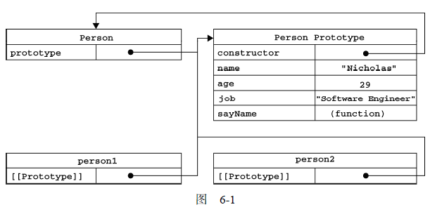

# 2. 创建对象

虽然 Object 构造函数或对象字面量都可以用来创建单个对象，但这些方式有个明显的缺点：使用同一个接口创建很多对象，会产生大量的重复代码。

在没有类的情况下，可以采用下列模式创建对象。

- 工厂模式，使用简单的函数创建对象，为对象添加属性和方法，然后返回对象。没有解决对象识别问题，后来被构造函数模式所取代。

- 构造函数模式，可以创建自定义引用类型，可以像创建内置对象实例一样使用 new 操作符。但是 它的每个成员都无法得到复用，包括函数。由于函数可以不局限于任何对象（即与对象具有松散耦合的特点），因此没有理由不在多个对象间共享函数。

- 原型模式，使用构造函数的 prototype 属性来指定那些应该共享的属性和方法。

- 组合使用构造函数模式和原型模式时，使用构造函数定义实例属性，而使用原型定义共享的属性和方法。

  

## 2.1 工厂模式

因为 ES 中无法创建类，用函数来封装以特定接口创建对象的细节。

```js
// 使用简单的函数创建对象
function createPerson(name, age, job){
    // 显式地创建对象
	var o = new Object();
    // 为对象添加属性和方法
    o.name = name;
    o.age = age;
    o.job = job;
    o.sayName = function(){
    	alert(this.name);
    };
    // 返回对象
    return o;
}
var person1 = createPerson("Nicholas", 29, "Software Engineer");
var person2 = createPerson("Greg", 27, "Doctor");
```

工厂模式虽然解决了创建多个相似对象的问题，但却没有解决对象识别的问题（即怎样知道一个对象的类型）。这个模式后来被构造函数模式所取代。


## 2.2 构造函数模式

构造函数模式，可以创建自定义引用类型，可以像创建内置对象实例一样使用 new 操作符。使用构造函数模式重写前面的例子：

```js
function Person(name, age, job){
    this.name = name;
    this.age = age;
    this.job = job;
    this.sayName = function(){
    	alert(this.name);	// 与声明函数在逻辑上是等价的
    };
}
var person1 = new Person("Nicholas", 29, "Software Engineer");
var person2 = new Person("Greg", 27, "Doctor");
```

与 createPerson() 的不同之处：

- 没有显式地创建对象；
- 直接将属性和方法赋给了this 对象；
- 没有 return 语句。

按照惯例，构造函数始终都以一个大写字母开头，而非构造函数应该以一个小写字母开头。主要是为了区别于 ECMAScript 中的其他函数。

要创建对象的新实例，必须使用 new 操作符。以这种方式调用构造函数实际上会经历以下 4 个步骤：

- 创建一个新对象；
- 将构造函数的作用域赋给新对象（因此 this 就指向了这个新对象）；
- 执行构造函数中的代码（为这个新对象添加属性）；
- 返回新对象。

创建自定义的构造函数意味着将来可以将它的实例标识为一种特定的类型，这正是构造函数模式胜过工厂模式的地方。

**将构造函数当作函数**

构造函数是一种特殊的方法，主要用来创建对象时初始化对象，经常与 new 运算符一起使用，创建对象的语句中构造函数的名称必须与类名完全相同。

与普通函数相比，区别如下。

- 构造函数只能由 new 关键字调用。
- 构造函数可以创建实例化对象。
- 构造函数是类的标志。类似于一个模板。
- 构造函数的函数名首字母大写。

构造函数与其他函数的唯一区别：调用方式不同。

任何函数，只要通过 new 操作符来调用，就可以作为构造函数；如果不通过 new 操作符来调用，那它跟普通函数也不会有什么两样。

```js
// 当作构造函数使用
var person = new Person("Nicholas", 29, "Software Engineer");
person.sayName(); //"Nicholas"

// 作为普通函数调用
Person("Greg", 27, "Doctor"); // 添加到window
window.sayName(); //"Greg"

// 在另一个对象的作用域中调用
var o = new Object();
Person.call(o, "Kristen", 25, "Nurse");
o.sayName(); //"Kristen"
```

**构造函数的缺点**

使用构造函数的主要问题，就是每个方法都要在每个实例上重新创建一遍。

每定义一个函数，也就是实例化了一个对象。每个 Person 实例都包含一个不同的 Function 实例。以这种方式创建函数，会导致不同的作用域链和标识符解析，但创建 Function 新实例的机制仍然是相同的。因此，不同实例上的同名函数是不相等的。

```js
alert(person1.sayName == person2.sayName); //false
```

通过把函数定义转移到构造函数外部来解决这个问题。

```js
function Person(name, age, job){
    this.name = name;
    this.age = age;
    this.job = job;
    this.sayName = sayName;	// 将 sayName 属性设置成全局的sayName 函数。
}
function sayName(){
	alert(this.name);
}
var person1 = new Person("Nicholas", 29, "Software Engineer");
var person2 = new Person("Greg", 27, "Doctor");
```

新问题：在全局作用域中定义的函数实际上只能被某个对象调用，这让全局作用域有点名不副实。并且如果对象需要定义很多方法，那么就要定义很多个全局函数。这个自定义的引用类型就丝毫没有封装性可言了。

这些问题可以通过使用原型模式来解决。


## 2.3 原型模式


**prototype**

每个函数都有一个 prototype（原型）属性，这个属性是一个指针，指向一个对象，而这个对象的用途是包含可以由特定类型的所有实例共享的属性和方法。按照字面意思来理解，prototype 就是通过调用构造函数而创建的那个对象实例的原型对象。

使用原型对象的好处是可以**让所有对象实例共享它所包含的属性和方法**。基于这一特点，可以利用原型创建对象、继承对象（下一节内容）。

创建对象时，不必在构造函数中定义对象实例的信息，而是可以将这些信息直接添加到原型对象中，如下面的例子所示。

```js
function Person(){
}

Person.prototype.name = "Nicholas";
Person.prototype.age = 29;
Person.prototype.job = "Software Engineer";
Person.prototype.sayName = function(){
	alert(this.name);
};

var person1 = new Person();
person1.sayName(); 				// "Nicholas"
var person2 = new Person();
person2.sayName(); 				// "Nicholas"
alert(person1.sayName == person2.sayName); // true
```


### **理解原型对象**

#### [[Prototype]] 和 `__proto__` 

只要创建了一个新函数，就会根据一组特定的规则为该函数创建一个 prototype 属性，这个属性指向函数的原型对象。

在默认情况下，所有原型对象都会自动获得一个 constructor（构造函数）属性，这个属性包含一个指向 prototype 属性所在函数的指针。通过这个构造函数，还可继续为原型对象添加其他属性和方法。

创建了自定义的构造函数之后，其原型对象默认只会取得 constructor 属性；其他方法都是从 Object 继承而来的。<u>当调用构造函数创建一个新实例后，该实例的内部将包含一个指针（内部属性），**指向构造函数的原型对象**</u>。ECMA-262 第 5 版中管这个指针叫[[Prototype]]。虽然在脚本中没有标准的方式访问 [[Prototype]]，但 Firefox、Safari 和Chrome 在每个对象上都支持一个属性 `__proto__`；而在其他实现中，这个属性对脚本则是完全不可见的。不过，要明确的真正重要的一点就是，这个连接存在于**实例与构造函数的原型对象**之间，而不是存在于实例与构造函数之间。

前面的例子中，各个对象之间的关系：

<div align="center">  </div><br>


`prototype` 和 `__proto__` 的区别

每个对象都具有一个名为 `__proto__` 的属性，指向自己构造函数的 prototype。

- `prototype` 是函数才有的属性（不是所有对象都有）
-  `__proto__` 是每个对象都有的属性。但 `__proto__` 不是一个规范属性，只有部分浏览器实现了该属性，对应的标准属性是 [[Prototype]]。
-  `__proto__` 是隐式原型，prototype 是显示原型。


prototype：一般情况下，函数的 prototype 属性是由 Object 函数生成的。

constructor：指向 prototype 属性所在函数。

 `__proto__`：大多数情况下，指向构造函数的原型对象。即： `__proto__ === constructor.prototype`。(通过 Object.create() 创建的对象不适用此等式)

```js
/* 1、字面量方式 */
var a = {};
console.log(a.constructor); // [Function: Object]
console.log(a.__proto__ === a.constructor.prototype); // true

/* 2、构造器方式 */
var A = function (){}; 
var a = new A();
console.log(a.constructor); // [Function: A]
console.log(a.__proto__ === a.constructor.prototype); // true

/* 3、Object.create()方式 */
var a1 = {a:1} 
var a2 = Object.create(a1);
console.log(a2.constructor); 		// [Function: Object]
console.log(a2.__proto__ === a1);	// true 
console.log(a2.__proto__ === a1.constructor.prototype);	// false 
console.log(a2.__proto__ === a2.constructor.prototype); // false
```


#### 访问 [[Prototype]] 

在所有实现中都无法访问到 [[Prototype]]，可以通过 isPrototypeOf() 方法来确定对象之间是否存在这种关系。如果 [[Prototype]] 指向调用 isPrototypeOf() 方法的对象，那么这个方法就返回 true。

```js
alert(Person.prototype.isPrototypeOf(person1)); // true
alert(Person.prototype.isPrototypeOf(person2)); // true
```

ECMAScript 5 增加了 Object.getPrototypeOf() 方法，在所有支持的实现中，这个方法返回 [[Prototype]] 的值。

使用 Object.getPrototypeOf() 可以方便地取得一个对象的原型，这在利用原型实现继承的情况下非常重要。支持这个方法的浏览器有 IE9+、Firefox 3.5+、Safari 5+、Opera 12+ 和 Chrome。

```js
alert(Object.getPrototypeOf(person1) == Person.prototype); // true
alert(Object.getPrototypeOf(person1).name); 	// "Nicholas"
```


#### 查找对象属性或方法

当调用一个对象的函数或者属性的时候，如果在当前对象里面找不到，那么就到原型对象里面逐级寻找。

虽然可以通过对象实例访问保存在原型中的值，但却不能通过对象实例重写原型中的值。当为对象实例添加一个属性时，这个属性就会**屏蔽**原型对象中保存的同名属性。换句话说，添加这个属性只会阻止访问原型中的同名属性，但不会修改属性。

使用 delete 操作符可以完全删除实例属性，能够重新访问原型中的属性。

```js
var A = {n:4399};
var B = function(){this.n = 9999};
var C = function(){var n = 8888;};
B.prototype = A;
C.prototype = A;
var b = new B();
var c = new C();
A.n++;
console.log(b.n);		// 9999——来自实例
console.log(c.n);		// 4400——来自原型
delete b.n; 			// 完全删除实例属性
console.log(b.n);		// 4400——来自原型
console.log(c.n);		// 4400——来自原型
```


ECMAScript 5 的 Object.getOwnPropertyDescriptor() 方法只能用于实例属性，要取得原型属性的描述符，必须直接在原型对象上调用 Object.getOwnPropertyDescriptor() 方法。


### 实例属性 or 原型属性？


- 判断自有属性：hasOwnProperty() 
- 判断原型属性：in + hasOwnProperty() 

如何判断某个对象是否包含指定成员？

- 使用 `obj.hasOwnProperty()` 。
- 使用 `"属性名" in 对象`。
- 直接使用 `obj. 属性名` 作为判断的条件：`if (obj.demo === undefined)`

**hasOwnProperty()**

`hasOwnProperty()` 方法会返回一个布尔值，指示对象自身属性中是否具有指定的属性（也就是，是否有指定的键）。这个方法是从 Object 继承来的，只在给定属性存在于对象实例中时，才会返回 true。

执行直接对象查找时，始终不会查找原型。

```js
obj.hasOwnProperty(prop)	// 要检测的属性的名称(String)，或者 Symbol。
```

**in 操作符**

in 操作符有两种使用方式：

- 单独使用。只要通过对象能够访问到属性就返回 true，无论该属性存在于实例中还是原型中。

- 在 for-in 循环中使用。返回所有能够通过对象访问的、可枚举的（enumerated）属性，其中既包括存在于实例中的属性，也包括存在于原型中的属性。屏蔽了原型中不可枚举属性（[[Enumerable]] 为 false 的属性）的实例属性也会在 for-in 循环中返回。

同时使用 hasOwnProperty() 方法和 in 操作符，就可以确定该属性是不是存在于原型中。

只要 in 操作符返回 true 而 hasOwnProperty() 返回 false，就可以确定属性是原型中的属性。

```js
function hasPrototypeProperty(object, name){
    return !object.hasOwnProperty(name) && (name in object);
}
```

### 获取属性


**Object.keys()** 

根据规定，所有开发人员定义的属性应该都是可枚举的。但是在 IE8 及更早版本中，屏蔽不可枚举属性的实例属性不会出现在 for-in 循环中。

要取得对象上所有可枚举的实例属性，可以使用 ECMAScript 5 的 Object.keys() 方法。这个方法接收一个对象作为参数，返回一个包含所有可枚举属性的字符串数组。

```js
var keys = Object.keys(Person.prototype);
```

**Object.getOwnPropertyNames()** 

如果想要得到所有实例属性，无论它是否可枚举（比如，不可枚举的 constructor 属性），都可以使用 Object.getOwnPropertyNames() 方法。

```js
var keys = Object.getOwnPropertyNames(Person.prototype);
alert(keys); //"constructor,name,age,job,sayName"
```

Object.keys() 和 Object.getOwnPropertyNames() 方法都可以用来替代 for-in 循环。支持这两个方法的浏览器有 IE9+、Firefox 4+、Safari 5+、Opera12+ 和 Chrome。


### **更简单的原型语法**

每添加一个属性和方法就要敲一遍 `构造函数.prototype`。为减少不必要的输入，也为了从视觉上更好地封装原型的功能，更常见的做法是用一个包含所有属性和方法的对象字面量来重写整个原型对象。

```js
function Person(){
}
Person.prototype = {
    name : "Nicholas",
    age : 29,
    job: "Software Engineer",
    sayName : function () {
    	alert(this.name);
    }
};
```

这种做法完全重写了默认的 prototype 对象，constructor 属性不再指向 Person，而是指向 Object 构造函数。尽管 instanceof 操作符还能返回正确的结果，但通过 constructor 已经无法确定对象的类型了。

```js
alert(friend instanceof Object); // true
alert(friend instanceof Person); // true
alert(friend.constructor == Person); // false
alert(friend.constructor == Object); // true
```

如果 constructor 的值真的很重要，可以像下面这样特意将它设置回适当的值。

注意，以这种方式重设 constructor 属性会导致它的 [[Enumerable]] 特性被设置为 true。默认情况下，原生的 constructor 属性是不可枚举的，因此如果使用兼容 ECMAScript 5 的 JavaScript 引擎，可以试一试 Object.defineProperty()。

```js
function Person(){
}
Person.prototype = {
    constructor : Person,
    // 其它属性和方法
};
// 重设构造函数，只适用于 ECMAScript 5 兼容的浏览器
Object.defineProperty(Person.prototype, "constructor", {
    enumerable: false,
    value: Person
});
```


### **原型的动态性**

尽管可以随时为原型添加属性和方法，并且修改能够立即在所有对象实例中反映出来，但是把原型修改为另外一个对象就等于切断了构造函数与最初原型之间的联系。

重写原型对象切断了现有原型与任何之前已经存在的对象实例之间的联系


### **原生对象的原型**

所有原生引用类型（Object、Array、String，等等）都在其构造函数的原型上定义了方法。

通过原生对象的原型，不仅可以取得所有默认方法的引用，而且也可以定义新方法。


### **原型对象的问题**

首先，它省略了为构造函数传递初始化参数这一环节，结果所有实例在默认情况下都将取得相同的属性值。

原型模式的最大问题是由其共享的本性所导致的。

```js
function Person(){
}
Person.prototype = {
    constructor: Person,
    name : "Nicholas",
    age : 29,
    job : "Software Engineer",
    friends : ["Shelby", "Court"],
    sayName : function () {
        alert(this.name);
    }
};
var person1 = new Person();
var person2 = new Person();
person1.friends.push("Van");
alert(person1.friends); 		// "Shelby,Court,Van"
alert(person2.friends); 		// "Shelby,Court,Van"
alert(person1.friends === person2.friends); 	// true
```


## 2.4 组合使用构造函数模式和原型模式

使用构造函数定义实例属性，而使用原型定义共享的属性和方法。

```js
function Person(name, age, job){
    this.name = name;
    this.age = age;
    this.job = job;
    this.friends = ["Shelby", "Court"];
}
Person.prototype = {
    constructor : Person,
    sayName : function(){
    	alert(this.name);
    }
}
var person1 = new Person("Nicholas", 29, "Software Engineer");
var person2 = new Person("Greg", 27, "Doctor");
person1.friends.push("Van");
alert(person1.friends); //"Shelby,Count,Van"
alert(person2.friends); //"Shelby,Count"
alert(person1.friends === person2.friends); //false
alert(person1.sayName === person2.sayName); //true
```

这种构造函数与原型混成的模式，是目前在 ECMAScript 中使用最广泛、认同度最高的一种创建自定义类型的方法。可以说，这是用来定义引用类型的一种默认模式。


## 2.5 动态原型模式

动态原型模式把所有信息都封装在了构造函数中，而通过在构造函数中初始化原型（仅在必要的情况下），又保持了同时使用构造函数和原型的优点。

换句话说，可以通过检查某个应该存在的方法是否有效，来决定是否需要初始化原型。

```js
function Person(name, age, job){
    // 属性
    this.name = name;
    this.age = age;
    this.job = job;
    // 方法，只在 sayName() 方法不存在的情况下，才会将它添加到原型中。
    if (typeof this.sayName != "function"){
        Person.prototype.sayName = function(){
            alert(this.name);
        };
    }
}
var friend = new Person("Nicholas", 29, "Software Engineer");
friend.sayName();
```

对于采用这种模式创建的对象，还可以使用 instanceof 操作符确定它的类型。

使用动态原型模式时，不能使用对象字面量重写原型。否则会切断现有实例与新原型之间的联系。


## 2.6 寄生构造函数模式

寄生（parasitic）构造函数模式的基本思想：创建一个函数，该函数的作用仅仅是封装创建对象的代码，然后再返回新创建的对象；但从表面上看，这个函数又很像是典型的构造函数。

除了使用 new 操作符并把使用的包装函数叫做构造函数之外，这个模式跟工厂模式一模一样。

```js
function Person(name, age, job){
    var o = new Object();
    o.name = name;
    o.age = age;
    o.job = job;
    o.sayName = function(){
    	alert(this.name);
    };
    return o;
}
var friend = new Person("Nicholas", 29, "Software Engineer");
friend.sayName(); 			// "Nicholas"
```

构造函数在不返回值的情况下，默认会返回新对象实例。而通过在构造函数的末尾添加一个return 语句，可以重写调用构造函数时返回的值。

关于寄生构造函数模式，有一点需要说明：首先，返回的对象与构造函数或者与构造函数的原型属性之间没有关系。为此，不能依赖 instanceof 操作符来确定对象类型。由于存在上述问题，建议在可以使用其他模式的情况下，不要使用这种模式。


## 2.7 稳妥构造函数模式

道格拉斯·克罗克福德（Douglas Crockford）发明了 JavaScript 中的稳妥对象（durable objects）概念。稳妥对象指的是没有公共属性，而且其方法也不引用 this 的对象。

稳妥对象最适合在一些安全的环境中（禁用 this 和 new），或者在防止数据被其他应用程序（如 Mashup 程序）改动时使用。

稳妥构造函数与寄生构造函数类似，但有两点不同：

- 一是新创建对象的实例方法不引用 this；
- 二是不使用 new 操作符调用构造函数。

按照稳妥构造函数的要求，可以将前面的 Person 构造函数重写如下。

```js
function Person(name, age, job){
    // 创建要返回的对象
    var o = new Object();
    // 在这里定义私有变量和函数
    // 添加方法。除了使用 sayName() 方法之外，没有其他办法访问 name 的值。
    o.sayName = function(){
        alert(name);
    };
    // 返回对象
    return o;
}
var friend = Person("Nicholas", 29, "Software Engineer");
friend.sayName(); 	// "Nicholas"
```

与寄生构造函数模式类似，使用稳妥构造函数模式创建的对象与构造函数之间也没有什么关系，因此 instanceof 操作符对这种对象也没有意义。


## 小结


| 创建方式               | 原理                                                     | 优点               | 缺点                                 |
| ---------------------- | -------------------------------------------------------- | ------------------ | ------------------------------------ |
| Object 构造函数        |                                                          |                    | 大量的重复代码                       |
| 对象字面量             |                                                          |                    | 大量的重复代码                       |
| 工厂模式               | 用函数来封装                                             |                    | 没有解决对象识别                     |
| 安全工厂模式           |                                                          |                    |                                      |
| 构造函数模式           | new 的原理                                               | 识别对象类型       | 每个方法在每个实例上都要重新创建一遍 |
| 原型模式               | 使用构造函数的 prototype 属性                            | 共享方法           | 所有实例的属性值也共享               |
| 混合构造函数和原型模式 | 使用构造函数定义实例属性，使用原型定义共享的属性和方法。 | 最广泛、认同度最高 |                                      |
| 动态原型模式           | 把所有信息封装在构造函数中，在构造函数中初始化原型       | 识别对象类型       | 不能使用对象字面量重写原型           |
| 寄生构造函数模式       | 工厂模式+构造函数模式                                    |                    | 没有解决对象识别                     |
| 稳妥构造函数模式       | 没有 new 和 this 的构造函数                              | 适合安全的环境     | 没有解决对象识别                     |

