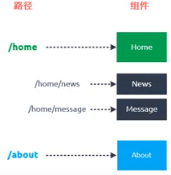

# 概述

> 关于“路由、前端路由、后端路由、前端渲染、后端渲染”的总结请看 [前端工程化思考.md](./前端工程化 - 思考.md)。


它是 Vue.js 的路由插件。组件包括 router- link 和 router-view 。


Vue Router 是 Vue.js 官方的路由管理器。它和 Vue.js 的核心深度集成，适合用于构建单页面应用。更多细节可以移步 [vue-router 文档](https://router.vuejs.org/zh/)。

vue-router 是基于路由和组件的：

- 路由用于设定访问路径，将路径和组件映射起来。
- 在 vue-router 的单页面应用中，页面的路径的改变就是组件的切换。

包含的功能有：

- 嵌套的路由/视图表
- 模块化的、基于组件的路由配置
- 路由参数、查询、通配符
- 基于 Vue.js 过渡系统的视图过渡效果
- 细粒度的导航控制
- 带有自动激活的 CSS class 的链接
- HTML5 历史模式或 hash 模式，在 IE9 中自动降级
- 自定义的滚动条行为


## 安装

**版本说明**

对于 TypeScript 用户来说，`vue-router@3.0+` 依赖 `vue@2.5+`，反之亦然。

### 直接下载 / CDN

https://unpkg.com/vue-router/dist/vue-router.js

[Unpkg.com](https://unpkg.com/) 提供了基于 NPM 的 CDN 链接。上面的链接会一直指向在 NPM 发布的最新版本。也可以像 `https://unpkg.com/vue-router@2.0.0/dist/vue-router.js` 这样指定 版本号 或者 Tag。

在 Vue 后面加载 `vue-router`，它会自动安装的：

```html
<script src="/path/to/vue.js"></script>
<script src="/path/to/vue-router.js"></script>
```

### NPM

```bash
npm install vue-router --save
```

如果在一个模块化工程中使用它，必须要通过 `Vue.use()` 明确地安装路由功能：

```js
import Vue from 'vue'
import VueRouter from 'vue-router'

Vue.use(VueRouter)
```

如果使用全局的 script 标签，则无须如此 (手动安装)。

### 构建开发版

如果想使用最新的开发版，就得从 GitHub 上直接 clone，然后自己 build 一个 `vue-router`。

```bash
git clone https://github.com/vuejs/vue-router.git node_modules/vue-router
cd node_modules/vue-router
npm install
npm run build
```


# 基本使用

在模块化工程中使用它：

- 第一步：通过 `import VueRouter from 'vue-router'` 导入路由对象。然后调用 `Vue.use(插件)`，安装路由插件。
- 第二步：创建**路由实例**，并且传入路由**映射配置**。
- 第三步：在 Vue 实例中挂载创建的路由实例。

前两步在 src/router/index.js 文件中完成。在 index.js 中导出路由实例，然后传入到 src/main.js 的 Vue 实例中。


配置路由映射的具体步骤：

- 第一步：创建路由组件，在 src/components 中完成。
- 第二步：配置路由映射：组件和路径映射关系。在 src/router/index.js 的路由实例的选项中完成。
- 第三步：使用路由：通过 `<router-link>` （链接）和 `<router-view>`（占位）。在 src/App.vue 的 `<template>` 中完成。


 `<router-link>`：该标签是一个 vue-router 中内置的组件，它会被渲染成一个 `<a>` 标签。

`<router-view>`：该标签会根据当前的路径，动态渲染出不同的组件。

网页的其他内容，比如顶部的标题/导航，或者底部的一些版权信息等会和 `<router-view>` 处于同一个等级。

在路由切换时，切换的是 `<router-view>` 挂载的组件，其他内容不会发生改变。


## 动态路由


## 路由懒加载

路由懒加载做了什么?

- 路由懒加载的主要作用就是将路由对应的组件打包成一个个的 JavaScript  代码块。
- 只有在这个路由被访问到的时候,才加载对应的组件


懒加载的方式

方式一：结合 Vue 的异步组件和 Webpack 的代码分析。（了解，不推荐）

```js
const Home = resolve => { require.ensure(['.. /components/Home.vue'], () =>
{ resolve(require('../components/Home.vue')) })};
```

方式二：AMD写法

```js
const About = resolve => require(['../components/About .vue'], resolve);
```

方式三：在 ES6 中，可以有更加简单的写法来组织 Vue 异步组件和 Webpack 的代码分割。

```js
const Home = () => import( '../components/Home.vue')
```


# 嵌套路由

嵌套路由是一个很常见的功能，比如在 home 页面中，我们希望通过 /home/news 和 /home/message 访问一些内容。一个路径映射一个组件，访问这两个路径也会分别渲染两个组件。

<div align="center">  </div><br>

实现嵌套路由有两个步骤

- 创建对应的子组件，并且在路由映射中配置对应的子路由。
- 在组件内部使用 `<router-view>` 标签。


# 参数传递


传递参数主要有两种类型: params和query

params的类型:

- 配置路由格式：`/router/:id`，在 src/router/index.js 中完成。

  ```js
  path: '/user/:abc',
  ```

- 传递的方式：在 path 后面跟上对应的值（'/user/'+userId），在src/App.vue 中完成。

  ```html
  <router-link v-bind:to="'/user/'+userId">用户</router-link>
  ```

- 传递后形成的路径：`/router/123`，`/router/abc`。在 src/components/User.vue 中可以获取参数。

  ```html
  <div>{{$route.params.abc}}</div>
  ```


query 的类型：

- 配置路由格式：/router，也就是普通配置

- 传递的方式：对象中使用 query 的 key 作为传递方式

  ```html
  <router-link v-bind:to="{path: '/profile',query:{name:'why',age:18,height:1.88}}" >
  ```

- 传递后形成的路径：/router?id=123, /router?id=abc

  ```
  http://localhost:8080/profile?name=why&age=18&height=1.88
  ```

  在 src/components/User.vue 中通过 `<div>{{$route.query}}</div>` 查看参数。


$router 和 $route 的区别

- $route：处于活跃的路由，可以获取 name、path、 query. params 等。
- $router：路由实例，src/router/index.js 中 new 出来的路由实例。想要导航到不同URL ，则使用 $router.push 方法。


# 导航守卫


vue-router 提供的导航守卫主要用来监听监听路由的进入和离开的。

vue-router 提供了 beforeEach 和 afterEach 的钩子函数,它们会在路由即将改变前和改变后触发。


导航钩子又称导航守卫，又分为全局钩子、单个路由独享钩子和组件级钩子。

全局钩子有 beforeEach 、beforeResolve ( Vue 2.5.0 新增）、afterEach 。

单个路由独享钩子有 beforeEnter。

组件级钩子有 beforeRouteEnter 、beforeRouteUpdate ( Vue 2.2 新增）、beforeRouteLeave。
它们有以下参数。

- to ：即将要进入的目标路由对象。
- from ：当前导航正要离开的路由。
- next ：一定要用这个函数才能到达下一个路由， 如果不用就会遭到拦截。


# keep-alive


当＜keep - alive＞ 包裹动态纽件时，会缓存不活动的组件实例，而不是销毁它们。

<keep - alive＞是一个抽象纽件，它自身不会渲染一个DOM 元素，也不会出现在父纽件链中。

当在＜keep-alive＞ 内切换组件时，它的activated 和deactivated 这两个生命周期钩子函数将会执行。

```
<keep-alive>
<component :is =” view ” ></component>
</keep- alive>
```


​		// 如果没有keep-alive，activated和deactivated不会起作用

​		// 这两个函数只有在保持了状态，使用了keep-alive时才有效


# 参考资料

- [vue-router 库 - github](https://github.com/vuejs/vue-router)
- [vue-router 文档](https://router.vuejs.org/zh/)


