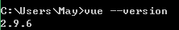
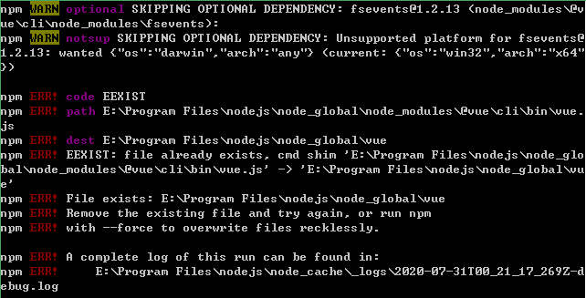
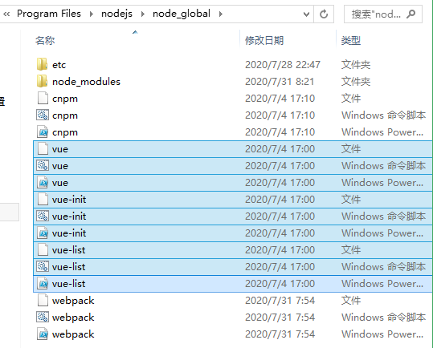
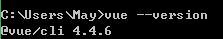

# 介绍

开发大型项目时需要使用 Vue CLI。

- 使用 Vue.js 开发大型应用时，需要考虑代码目录结构、项目结构和部署、热加载、代码单元测试等事情。
- 如果每个项目都要手动完成这些工作，效率会比较低效，所以通常我们会使用一些脚手架工具来帮助完成这些事情。


Vue CLI 是什么？

- CLI 是 Command-Line Interface，翻译为命令行界面，俗称脚手架。
- Vue CLI 是一个官方发布 Vue.js 项目脚手架
- 使用 vue-cli 可以快速搭建 Vue 开发环境以及对应的 webpack 配置。


vue-cli3 与 2 版本有很大区别

- vue-cli 3 是基于 webpack 4 打造，vue-cli 2 还是 webapck 3
- vue-cli 3 的设计原则是"0配置”，移除的配置文件根目录下的，build 和 config等目录
- vue-cli 3 提供了 vue ui 命令，提供了可视化配置，更加人性化
- 移除了 static 文件夹，新增了 public 文件夹，并且 index.html 移动到 public中。


# 安装

Vue CLI 使用前提

- Node
- webpack
  - 全局安装

**Node 版本要求**

Vue CLI 需要 [Node.js](https://nodejs.org/) 8.9 或更高版本 (推荐 8.11.0+)。你可以使用 [nvm](https://github.com/creationix/nvm) 或 [nvm-windows](https://github.com/coreybutler/nvm-windows) 在同一台电脑中管理多个 Node 版本。


**安装**

```bash
npm install -g @vue/cli
```

- 上面安装的是 Vue CLI >= 3 的版本，不可以按照 Vue CLI2 的方式初始化项目。但是可以通过拉取 2.x 模板，使用旧版本的 `vue init` 功能。
- Vue CLI 3.x 版本中，包名称由 `vue-cli` 改成了 `@vue/cli`。 如果已经全局安装了旧版本的 `vue-cli` (1.x 或 2.x)，需要先通过 `npm uninstall vue-cli -g` 或 `yarn global remove vue-cli` 卸载。

如何知道之前是否有安装旧版本的 `vue-cli` (1.x 或 2.x)？

- 方式一：通过 `vue --version` 命令查看（如果没有安装，不会出现版本信息）。

<div align="center">  </div>

- 方式二：安装过程是否出现以下类似错误：

  <div align="center">  </div>

  查看 nodejs 的 node_global 目录或者 node_global 目录的 node_nodules 目录。

  <div align="center">  </div>


**验证是否安装成功**

安装后，可以在命令行中访问 `vue` 命令。可以通过简单运行 `vue`，看看是否展示出了一份所有可用命令的帮助信息，来验证它是否安装成功。

还可以用这个命令来检查其版本是否正确：

```bash
vue --version
```

<div align="center">  </div><br>


# 基础


## 创建项目

### `vue create`

运行以下命令来创建一个新项目：

```
vue create my-project
```

初始化过程：（多个选项用键盘向上、向下和回车选择）

- 提示选取一个 preset：
  - 默认设置包含 Babel + ESLint，适合快速创建一个新项目的原型。
  - 手动设置（用空格键选中、取消）提供更多选项，它们是面向生产的项目更加需要的。
- 如何放置配置文件：可以选择单独的文件或 package.json。
- 是否将已选项保存为一个将来可复用的 preset：如果选择“是”，被保存的 preset 将会存在用户的 home 目录下的 `.vuerc.json` 文件里。如果想要修改被保存的 preset / 选项，可以编辑这个文件。

- 提示选择喜欢的包管理器或使用淘宝 npm 镜像源以更快地安装依赖。这些选择也将会存入 `~/.vuerc`。


`vue create` 命令有一些可选项，可以通过 `vue create --help` 命令进行探索。


**Vue CLI 3 中 webpack 的配置**

- 可以通过 `vue ui` 命令在 Configuration 中配置
- 也可以在项目的 node_modules/@vue/cli-service/webpack.config.js 和 node_modules/@vue/cli-service/lib/Service.js 中配置。
- 如果要自定义配置，可以在项目的根目录下新建 vue.config.js 文件。文件名不能更改。


### 使用图形化界面

也可以通过 `vue ui` 命令以图形化界面创建和管理项目：

```bash
vue ui
```

上述命令会打开一个浏览器窗口，并以图形化界面将你引导至项目创建的流程。

<div align="center">  </div><br>


### 拉取 2.x 模板 (旧版本)

Vue CLI >= 3 和旧版使用了相同的 `vue` 命令，所以 Vue CLI 2 (`vue-cli`) 被覆盖了。如果仍然需要使用旧版本的 `vue init` 功能，可以全局安装一个桥接工具：

```bash
npm install -g @vue/cli-init
```

通过以下 Vue CLI 2  命令创建一个项目：

```bash
# `vue init` 的运行效果将会跟 `vue-cli@2.x` 相同
vue init webpack my-project
```

初始化项目过程：

- Project name：项目名称。一般和 my-project 相同。小括号里面的数据是默认设置。（不能包含大写）
- Project description：项目描述。
- Author：默认从 git 的 .gitconfig 中获取。（`C:\Users\May\.gitconfig`）
- Vue build (Use arrow keys)：通过键盘的上下键选择。
  - Runtime + Compiler: recommended for most users
  - Runtime-only: about 6KB lighter min+gzip, but templates (or any Vue-specific HTML) are ONLY allowed in .vue files - render functions are required elsewhere。（更小，运行效率更高）
- ESLint：“代码限制”，检测代码规范
  - Standard
  - Airbnb
- unit tests：单元测试
- e2e tests：端到端测试，安装 Nightwatch（一个利用 selenium 或 webdriver 或 phantomjs 等进行自动化测试的框架）


**Vue CLI 2目录结构解析**

通过 package.json 文件的 scripts 进行解析

- build
- config
- node_modules
- src
  - asserts
  - components
- static
  - app.哈希码.js：业务代码，当前应用程序的所有代码。
  - manifest.哈希码.js：为打包的代码做底层支撑。运行时支撑。
  - vendor.哈希码.js：协助开发的第三方代码，比如 vue 等。


## 插件和 Preset

### 插件

Vue CLI 使用了一套基于插件的架构。如果你查阅一个新创建项目的 `package.json`，就会发现依赖都是以 `@vue/cli-plugin-` 开头的。插件可以修改 webpack 的内部配置，也可以向 `vue-cli-service` 注入命令。在项目创建的过程中，绝大部分列出的特性都是通过插件来实现的。

基于插件的架构使得 Vue CLI 灵活且可扩展。如果你对开发一个插件感兴趣，请翻阅[插件开发指南](https://cli.vuejs.org/zh/dev-guide/plugin-dev.html)。

提示

你可以通过 `vue ui` 命令使用 GUI 安装和管理插件。

### 在现有的项目中安装插件

每个 CLI 插件都会包含一个 (用来创建文件的) 生成器和一个 (用来调整 webpack 核心配置和注入命令的) 运行时插件。当你使用 `vue create` 来创建一个新项目的时候，有些插件会根据你选择的特性被预安装好。如果你想在一个已经被创建好的项目中安装一个插件，可以使用 `vue add` 命令：

```bash
vue add eslint
```

提示

`vue add` 的设计意图是为了安装和调用 Vue CLI 插件。这不意味着替换掉普通的 npm 包。对于这些普通的 npm 包，你仍然需要选用包管理器。

警告

我们推荐在运行 `vue add` 之前将项目的最新状态提交，因为该命令可能调用插件的文件生成器并很有可能更改你现有的文件。

这个命令将 `@vue/eslint` 解析为完整的包名 `@vue/cli-plugin-eslint`，然后从 npm 安装它，调用它的生成器。

```bash
# 这个和之前的用法等价
vue add cli-plugin-eslint
```

如果不带 `@vue` 前缀，该命令会换作解析一个 unscoped 的包。例如以下命令会安装第三方插件 `vue-cli-plugin-apollo`：

```bash
# 安装并调用 vue-cli-plugin-apollo
vue add apollo
```

你也可以基于一个指定的 scope 使用第三方插件。例如如果一个插件名为 `@foo/vue-cli-plugin-bar`，你可以这样添加它：

```bash
vue add @foo/bar
```

你可以向被安装的插件传递生成器选项 (这样做会跳过命令提示)：

```bash
vue add eslint --config airbnb --lintOn save
```

如果一个插件已经被安装，你可以使用 `vue invoke` 命令跳过安装过程，只调用它的生成器。这个命令会接受和 `vue add` 相同的参数。

提示

如果出于一些原因你的插件列在了该项目之外的其它 `package.json` 文件里，你可以在自己项目的 `package.json` 里设置 `vuePlugins.resolveFrom` 选项指向包含其它 `package.json` 的文件夹。

例如，如果你有一个 `.config/package.json` 文件：

```json
{
  "vuePlugins": {
    "resolveFrom": ".config"
  }
}
```

### 项目本地的插件

如果你需要在项目里直接访问插件 API 而不需要创建一个完整的插件，你可以在 `package.json` 文件中使用 `vuePlugins.service` 选项：

```json
{
  "vuePlugins": {
    "service": ["my-commands.js"]
  }
}
```

每个文件都需要暴露一个函数，接受插件 API 作为第一个参数。关于插件 API 的更多信息可以查阅[插件开发指南](https://cli.vuejs.org/zh/dev-guide/plugin-dev.html)。

你也可以通过 `vuePlugins.ui` 选项添加像 UI 插件一样工作的文件：

```json
{
  "vuePlugins": {
    "ui": ["my-ui.js"]
  }
}
```

更多信息请阅读 [UI 插件 API](https://cli.vuejs.org/zh/dev-guide/ui-api.html)。

## Preset

一个 Vue CLI preset 是一个包含创建新项目所需预定义选项和插件的 JSON 对象，让用户无需在命令提示中选择它们。

在 `vue create` 过程中保存的 preset 会被放在你的 home 目录下的一个配置文件中 (`~/.vuerc`)。你可以通过直接编辑这个文件来调整、添加、删除保存好的 preset。

这里有一个 preset 的示例：

```json
{
  "useConfigFiles": true,
  "cssPreprocessor": "sass",
  "plugins": {
    "@vue/cli-plugin-babel": {},
    "@vue/cli-plugin-eslint": {
      "config": "airbnb",
      "lintOn": ["save", "commit"]
    },
    "@vue/cli-plugin-router": {},
    "@vue/cli-plugin-vuex": {}
  }
}
```

Preset 的数据会被插件生成器用来生成相应的项目文件。除了上述这些字段，你也可以为集成工具添加配置：

```json
{
  "useConfigFiles": true,
  "plugins": {...},
  "configs": {
    "vue": {...},
    "postcss": {...},
    "eslintConfig": {...},
    "jest": {...}
  }
}
```

这些额外的配置将会根据 `useConfigFiles` 的值被合并到 `package.json` 或相应的配置文件中。例如，当 `"useConfigFiles": true` 的时候，`configs` 的值将会被合并到 `vue.config.js` 中。

### Preset 插件的版本管理

你可以显式地指定用到的插件的版本：

```json
{
  "plugins": {
    "@vue/cli-plugin-eslint": {
      "version": "^3.0.0",
      // ... 该插件的其它选项
    }
  }
}
```

注意对于官方插件来说这不是必须的——当被忽略时，CLI 会自动使用 registry 中最新的版本。不过**我们推荐为 preset 列出的所有第三方插件提供显式的版本范围**。

### 允许插件的命令提示

每个插件在项目创建的过程中都可以注入它自己的命令提示，不过当你使用了一个 preset，这些命令提示就会被跳过，因为 Vue CLI 假设所有的插件选项都已经在 preset 中声明过了。

在有些情况下你可能希望 preset 只声明需要的插件，同时让用户通过插件注入的命令提示来保留一些灵活性。

对于这种场景你可以在插件选项中指定 `"prompts": true` 来允许注入命令提示：

```json
{
  "plugins": {
    "@vue/cli-plugin-eslint": {
      // 让用户选取他们自己的 ESLint config
      "prompts": true
    }
  }
}
```

### 远程 Preset

你可以通过发布 git repo 将一个 preset 分享给其他开发者。这个 repo 应该包含以下文件：

- `preset.json`: 包含 preset 数据的主要文件（必需）。
- `generator.js`: 一个可以注入或是修改项目中文件的 [Generator](https://cli.vuejs.org/zh/dev-guide/plugin-dev.html#generator)。
- `prompts.js` 一个可以通过命令行对话为 generator 收集选项的 [prompts 文件](https://cli.vuejs.org/zh/dev-guide/plugin-dev.html#第三方插件的对话)。

发布 repo 后，你就可以在创建项目的时候通过 `--preset` 选项使用这个远程的 preset 了：

```bash
# 从 GitHub repo 使用 preset
vue create --preset username/repo my-project
```

GitLab 和 BitBucket 也是支持的。如果要从私有 repo 获取，请确保使用 `--clone` 选项：

```bash
vue create --preset gitlab:username/repo --clone my-project
vue create --preset bitbucket:username/repo --clone my-project
```

### 加载文件系统中的 Preset

当开发一个远程 preset 的时候，你必须不厌其烦的向远程 repo 发出 push 进行反复测试。为了简化这个流程，你也可以直接在本地测试 preset。如果 `--preset` 选项的值是一个相对或绝对文件路径，或是以 `.json` 结尾，则 Vue CLI 会加载本地的 preset：

```bash
# ./my-preset 应当是一个包含 preset.json 的文件夹
vue create --preset ./my-preset my-project

# 或者，直接使用当前工作目录下的 json 文件：
vue create --preset my-preset.json my-project
```


## CLI 服务

### 使用命令

在一个 Vue CLI 项目中，`@vue/cli-service` 安装了一个名为 `vue-cli-service` 的命令。你可以在 npm scripts 中以 `vue-cli-service`、或者从终端中以 `./node_modules/.bin/vue-cli-service` 访问这个命令。

这是你使用默认 preset 的项目的 `package.json`：

```json
{
  "scripts": {
    "serve": "vue-cli-service serve",
    "build": "vue-cli-service build"
  }
}
```

你可以通过 npm 或 Yarn 调用这些 script：

```bash
npm run serve
# OR
yarn serve
```

如果你可以使用 [npx](https://github.com/npm/npx) (最新版的 npm 应该已经自带)，也可以直接这样调用命令：

```bash
npx vue-cli-service serve
```

提示

你可以通过 `vue ui` 命令使用 GUI 运行更多的特性脚本。

这里有一个 GUI 的 webpack Analyzer：


### vue-cli-service serve

```text
用法：vue-cli-service serve [options] [entry]

选项：

  --open    在服务器启动时打开浏览器
  --copy    在服务器启动时将 URL 复制到剪切版
  --mode    指定环境模式 (默认值：development)
  --host    指定 host (默认值：0.0.0.0)
  --port    指定 port (默认值：8080)
  --https   使用 https (默认值：false)
```

`vue-cli-service serve` 命令会启动一个开发服务器 (基于 [webpack-dev-server](https://github.com/webpack/webpack-dev-server)) 并附带开箱即用的模块热重载 (Hot-Module-Replacement)。

除了通过命令行参数，你也可以使用 `vue.config.js` 里的 [devServer](https://cli.vuejs.org/zh/config/#devserver) 字段配置开发服务器。

命令行参数 `[entry]` 将被指定为唯一入口，而非额外的追加入口。尝试使用 `[entry]` 覆盖 `config.pages` 中的 `entry` 将可能引发错误。

### vue-cli-service build

```text
用法：vue-cli-service build [options] [entry|pattern]

选项：

  --mode        指定环境模式 (默认值：production)
  --dest        指定输出目录 (默认值：dist)
  --modern      面向现代浏览器带自动回退地构建应用
  --target      app | lib | wc | wc-async (默认值：app)
  --name        库或 Web Components 模式下的名字 (默认值：package.json 中的 "name" 字段或入口文件名)
  --no-clean    在构建项目之前不清除目标目录
  --report      生成 report.html 以帮助分析包内容
  --report-json 生成 report.json 以帮助分析包内容
  --watch       监听文件变化
```

`vue-cli-service build` 会在 `dist/` 目录产生一个可用于生产环境的包，带有 JS/CSS/HTML 的压缩，和为更好的缓存而做的自动的 vendor chunk splitting。它的 chunk manifest 会内联在 HTML 里。

这里还有一些有用的命令参数：

- `--modern` 使用[现代模式](https://cli.vuejs.org/zh/guide/browser-compatibility.html#现代模式)构建应用，为现代浏览器交付原生支持的 ES2015 代码，并生成一个兼容老浏览器的包用来自动回退。
- `--target` 允许你将项目中的任何组件以一个库或 Web Components 组件的方式进行构建。更多细节请查阅[构建目标](https://cli.vuejs.org/zh/guide/build-targets.html)。
- `--report` 和 `--report-json` 会根据构建统计生成报告，它会帮助你分析包中包含的模块们的大小。

### vue-cli-service inspect

```text
用法：vue-cli-service inspect [options] [...paths]

选项：

  --mode    指定环境模式 (默认值：development)
```

你可以使用 `vue-cli-service inspect` 来审查一个 Vue CLI 项目的 webpack config。更多细节请查阅[审查 webpack config](https://cli.vuejs.org/zh/guide/webpack.html#审查项目的-webpack-config)。

### 查看所有的可用命令

有些 CLI 插件会向 `vue-cli-service` 注入额外的命令。例如 `@vue/cli-plugin-eslint` 会注入 `vue-cli-service lint` 命令。你可以运行以下命令查看所有注入的命令：

```bash
npx vue-cli-service help
```

你也可以这样学习每个命令可用的选项：

```bash
npx vue-cli-service help [command]
```

### 缓存和并行处理

- `cache-loader` 会默认为 Vue/Babel/TypeScript 编译开启。文件会缓存在 `node_modules/.cache` 中——如果你遇到了编译方面的问题，记得先删掉缓存目录之后再试试看。
- `thread-loader` 会在多核 CPU 的机器上为 Babel/TypeScript 转译开启。

### Git Hook

在安装之后，`@vue/cli-service` 也会安装 [yorkie](https://github.com/yyx990803/yorkie)，它会让你在 `package.json` 的 `gitHooks` 字段中方便地指定 Git hook：

```json
{
  "gitHooks": {
    "pre-commit": "lint-staged"
  },
   "lint-staged": {
    "*.{js,vue}": [
      "vue-cli-service lint",
      "git add"
    ]
  }
}
```

注意

`yorkie` fork 自 [`husky`](https://github.com/typicode/husky) 并且与后者不兼容。

### 配置时无需 Eject

通过 `vue create` 创建的项目无需额外的配置就已经可以跑起来了。插件的设计也是可以相互共存的，所以绝大多数情况下，你只需要在交互式命令提示中选取需要的功能即可。

不过我们也知道满足每一个需求是不太可能的，而且一个项目的需求也会不断改变。通过 Vue CLI 创建的项目让你无需 eject 就能够配置工具的几乎每个角落。更多细节请查阅[配置参考](https://cli.vuejs.org/zh/config/)。


# 开发

## 浏览器兼容性

### browserslist

你会发现有 `package.json` 文件里的 `browserslist` 字段 (或一个单独的 `.browserslistrc` 文件)，指定了项目的目标浏览器的范围。这个值会被 [@babel/preset-env](https://new.babeljs.io/docs/en/next/babel-preset-env.html) 和 [Autoprefixer](https://github.com/postcss/autoprefixer) 用来确定需要转译的 JavaScript 特性和需要添加的 CSS 浏览器前缀。

现在查阅[这里](https://github.com/ai/browserslist)了解如何指定浏览器范围。

### Polyfill

#### useBuiltIns: 'usage'

一个默认的 Vue CLI 项目会使用 [@vue/babel-preset-app](https://github.com/vuejs/vue-cli/tree/dev/packages/%40vue/babel-preset-app)，它通过 `@babel/preset-env` 和 `browserslist` 配置来决定项目需要的 polyfill。

默认情况下，它会把 [`useBuiltIns: 'usage'`](https://new.babeljs.io/docs/en/next/babel-preset-env.html#usebuiltins-usage) 传递给 `@babel/preset-env`，这样它会根据源代码中出现的语言特性自动检测需要的 polyfill。这确保了最终包里 polyfill 数量的最小化。然而，这也意味着**如果其中一个依赖需要特殊的 polyfill，默认情况下 Babel 无法将其检测出来。**

如果有依赖需要 polyfill，你有几种选择：

1. **如果该依赖基于一个目标环境不支持的 ES 版本撰写:** 将其添加到 `vue.config.js` 中的 [`transpileDependencies`](https://cli.vuejs.org/zh/config/#transpiledependencies) 选项。这会为该依赖同时开启语法转换和根据使用情况检测 polyfill。

2. **如果该依赖交付了 ES5 代码并显式地列出了需要的 polyfill:** 你可以使用 `@vue/babel-preset-app` 的 [polyfills](https://github.com/vuejs/vue-cli/tree/dev/packages/%40vue/babel-preset-app#polyfills) 选项预包含所需要的 polyfill。**注意 `es.promise` 将被默认包含，因为现在的库依赖 Promise 是非常普遍的。**

   ```js
   // babel.config.js
   module.exports = {
     presets: [
       ['@vue/app', {
         polyfills: [
           'es.promise',
           'es.symbol'
         ]
       }]
     ]
   }
   ```

   提示

   我们推荐以这种方式添加 polyfill 而不是在源代码中直接导入它们，因为如果这里列出的 polyfill 在 `browserslist` 的目标中不需要，则它会被自动排除。

3. **如果该依赖交付 ES5 代码，但使用了 ES6+ 特性且没有显式地列出需要的 polyfill (例如 Vuetify)：\**请使用 `useBuiltIns: 'entry'` 然后在入口文件添加 `import 'core-js/stable'; import 'regenerator-runtime/runtime';`。这会根据 `browserslist` 目标导入\**所有** polyfill，这样你就不用再担心依赖的 polyfill 问题了，但是因为包含了一些没有用到的 polyfill 所以最终的包大小可能会增加。

更多细节可查阅 [@babel/preset-env 文档](https://new.babeljs.io/docs/en/next/babel-preset-env.html#usebuiltins-usage)。

#### 构建库或是 Web Component 时的 Polyfills

当使用 Vue CLI 来[构建一个库或是 Web Component](https://cli.vuejs.org/zh/guide/build-targets.html) 时，推荐给 `@vue/babel-preset-app` 传入 `useBuiltIns: false` 选项。这能够确保你的库或是组件不包含不必要的 polyfills。通常来说，打包 polyfills 应当是最终使用你的库的应用的责任。

### 现代模式

有了 Babel 我们可以兼顾所有最新的 ES2015+ 语言特性，但也意味着我们需要交付转译和 polyfill 后的包以支持旧浏览器。这些转译后的包通常都比原生的 ES2015+ 代码会更冗长，运行更慢。现如今绝大多数现代浏览器都已经支持了原生的 ES2015，所以因为要支持更老的浏览器而为它们交付笨重的代码是一种浪费。

Vue CLI 提供了一个“现代模式”帮你解决这个问题。以如下命令为生产环境构建：

```bash
vue-cli-service build --modern
```

Vue CLI 会产生两个应用的版本：一个现代版的包，面向支持 [ES modules](https://jakearchibald.com/2017/es-modules-in-browsers/) 的现代浏览器，另一个旧版的包，面向不支持的旧浏览器。

最酷的是这里没有特殊的部署要求。其生成的 HTML 文件会自动使用 [Phillip Walton 精彩的博文](https://philipwalton.com/articles/deploying-es2015-code-in-production-today/)中讨论到的技术：

- 现代版的包会通过 `<script type="module">` 在被支持的浏览器中加载；它们还会使用 `<link rel="modulepreload">` 进行预加载。
- 旧版的包会通过 `<script nomodule>` 加载，并会被支持 ES modules 的浏览器忽略。
- 一个针对 Safari 10 中 `<script nomodule>` 的修复会被自动注入。

对于一个 Hello World 应用来说，现代版的包已经小了 16%。在生产环境下，现代版的包通常都会表现出显著的解析速度和运算速度，从而改善应用的加载性能。

提示

<script type="module"> 需要配合始终开启的 CORS 进行加载。这意味着你的服务器必须返回诸如 Access-Control-Allow-Origin: * 的有效的 CORS 头。如果你想要通过认证来获取脚本，可使将 crossorigin 选项设置为 use-credentials。

同时，现代浏览器使用一段内联脚本来避免 Safari 10 重复加载脚本包，所以如果你在使用一套严格的 CSP，你需要这样显性地允许内联脚本：

```text
Content-Security-Policy: script-src 'self' 'sha256-4RS22DYeB7U14dra4KcQYxmwt5HkOInieXK1NUM
```


## HTML 和静态资源

### HTML

#### Index 文件

`public/index.html` 文件是一个会被 [html-webpack-plugin](https://github.com/jantimon/html-webpack-plugin) 处理的模板。在构建过程中，资源链接会被自动注入。另外，Vue CLI 也会自动注入 resource hint (`preload/prefetch`、manifest 和图标链接 (当用到 PWA 插件时) 以及构建过程中处理的 JavaScript 和 CSS 文件的资源链接。

#### 插值

因为 index 文件被用作模板，所以你可以使用 [lodash template](https://lodash.com/docs/4.17.10#template) 语法插入内容：

- `<%= VALUE %>` 用来做不转义插值；
- `<%- VALUE %>` 用来做 HTML 转义插值；
- `<% expression %>` 用来描述 JavaScript 流程控制。

除了[被 `html-webpack-plugin` 暴露的默认值](https://github.com/jantimon/html-webpack-plugin#writing-your-own-templates)之外，所有[客户端环境变量](https://cli.vuejs.org/zh/guide/mode-and-env.html#using-env-variables-in-client-side-code)也可以直接使用。例如，`BASE_URL` 的用法：

```html
<link rel="icon" href="<%= BASE_URL %>favicon.ico">
```

更多内容可以查阅：

- [publicPath](https://cli.vuejs.org/zh/config/#publicpath)

#### Preload

[``](https://developer.mozilla.org/zh-CN/docs/Web/HTML/Preloading_content) 是一种 resource hint，用来指定页面加载后很快会被用到的资源，所以在页面加载的过程中，我们希望在浏览器开始主体渲染之前尽早 preload。

默认情况下，一个 Vue CLI 应用会为所有初始化渲染需要的文件自动生成 preload 提示。

这些提示会被 [@vue/preload-webpack-plugin](https://github.com/vuejs/preload-webpack-plugin) 注入，并且可以通过 `chainWebpack` 的 `config.plugin('preload')` 进行修改和删除。

#### Prefetch

[``](https://developer.mozilla.org/en-US/docs/Web/HTTP/Link_prefetching_FAQ) 是一种 resource hint，用来告诉浏览器在页面加载完成后，利用空闲时间提前获取用户未来可能会访问的内容。

默认情况下，一个 Vue CLI 应用会为所有作为 async chunk 生成的 JavaScript 文件 ([通过动态 `import()` 按需 code splitting](https://webpack.js.org/guides/code-splitting/#dynamic-imports) 的产物) 自动生成 prefetch 提示。

这些提示会被 [@vue/preload-webpack-plugin](https://github.com/vuejs/preload-webpack-plugin) 注入，并且可以通过 `chainWebpack` 的 `config.plugin('prefetch')` 进行修改和删除。

示例：

```js
// vue.config.js
module.exports = {
  chainWebpack: config => {
    // 移除 prefetch 插件
    config.plugins.delete('prefetch')

    // 或者
    // 修改它的选项：
    config.plugin('prefetch').tap(options => {
      options[0].fileBlacklist = options[0].fileBlacklist || []
      options[0].fileBlacklist.push(/myasyncRoute(.)+?\.js$/)
      return options
    })
  }
}
```

当 prefetch 插件被禁用时，你可以通过 webpack 的内联注释手动选定要提前获取的代码区块：

```js
import(/* webpackPrefetch: true */ './someAsyncComponent.vue')
```

webpack 的运行时会在父级区块被加载之后注入 prefetch 链接。

提示

Prefetch 链接将会消耗带宽。如果你的应用很大且有很多 async chunk，而用户主要使用的是对带宽较敏感的移动端，那么你可能需要关掉 prefetch 链接并手动选择要提前获取的代码区块。

#### 不生成 index

当基于已有的后端使用 Vue CLI 时，你可能不需要生成 `index.html`，这样生成的资源可以用于一个服务端渲染的页面。这时可以向 [`vue.config.js`](https://cli.vuejs.org/zh/config/#vue-config-js) 加入下列代码：

```js
// vue.config.js
module.exports = {
  // 去掉文件名中的 hash
  filenameHashing: false,
  // 删除 HTML 相关的 webpack 插件
  chainWebpack: config => {
    config.plugins.delete('html')
    config.plugins.delete('preload')
    config.plugins.delete('prefetch')
  }
}
```

然而这样做并不是很推荐，因为：

- 硬编码的文件名不利于实现高效率的缓存控制。
- 硬编码的文件名也无法很好的进行 code-splitting (代码分段)，因为无法用变化的文件名生成额外的 JavaScript 文件。
- 硬编码的文件名无法在[现代模式](https://cli.vuejs.org/zh/guide/browser-compatibility.html#现代模式)下工作。

你应该考虑换用 [indexPath](https://cli.vuejs.org/zh/config/#indexpath) 选项将生成的 HTML 用作一个服务端框架的视图模板。

#### 构建一个多页应用

不是每个应用都需要是一个单页应用。Vue CLI 支持使用 [`vue.config.js` 中的 `pages` 选项](https://cli.vuejs.org/zh/config/#pages)构建一个多页面的应用。构建好的应用将会在不同的入口之间高效共享通用的 chunk 以获得最佳的加载性能。

### 处理静态资源

静态资源可以通过两种方式进行处理：

- 在 JavaScript 被导入或在 template/CSS 中通过相对路径被引用。这类引用会被 webpack 处理。
- 放置在 `public` 目录下或通过绝对路径被引用。这类资源将会直接被拷贝，而不会经过 webpack 的处理。

#### 从相对路径导入

当你在 JavaScript、CSS 或 `*.vue` 文件中使用相对路径 (必须以 `.` 开头) 引用一个静态资源时，该资源将会被包含进入 webpack 的依赖图中。在其编译过程中，所有诸如 ``、`background: url(...)` 和 CSS `@import` 的资源 URL **都会被解析为一个模块依赖**。

例如，`url(./image.png)` 会被翻译为 `require('./image.png')`，而：

```html

```

将会被编译到：

```js
h('img', { attrs: { src: require('./image.png') }})
```

在其内部，我们通过 `file-loader` 用版本哈希值和正确的公共基础路径来决定最终的文件路径，再用 `url-loader` 将小于 4kb 的资源内联，以减少 HTTP 请求的数量。

你可以通过 [chainWebpack](https://cli.vuejs.org/zh/config/#chainwebpack) 调整内联文件的大小限制。例如，下列代码会将其限制设置为 10kb：

```js
// vue.config.js
module.exports = {
  chainWebpack: config => {
    config.module
      .rule('images')
        .use('url-loader')
          .loader('url-loader')
          .tap(options => Object.assign(options, { limit: 10240 }))
  }
}
```

#### URL 转换规则

- 如果 URL 是一个绝对路径 (例如 `/images/foo.png`)，它将会被保留不变。

- 如果 URL 以 `.` 开头，它会作为一个相对模块请求被解释且基于你的文件系统中的目录结构进行解析。

- 如果 URL 以 `~` 开头，其后的任何内容都会作为一个模块请求被解析。这意味着你甚至可以引用 Node 模块中的资源：

  ```html
  
  ```

- 如果 URL 以 `@` 开头，它也会作为一个模块请求被解析。它的用处在于 Vue CLI 默认会设置一个指向 `<projectRoot>/src` 的别名 `@`。**(仅作用于模版中)**

#### `public` 文件夹

任何放置在 `public` 文件夹的静态资源都会被简单的复制，而不经过 webpack。你需要通过绝对路径来引用它们。

注意我们推荐将资源作为你的模块依赖图的一部分导入，这样它们会通过 webpack 的处理并获得如下好处：

- 脚本和样式表会被压缩且打包在一起，从而避免额外的网络请求。
- 文件丢失会直接在编译时报错，而不是到了用户端才产生 404 错误。
- 最终生成的文件名包含了内容哈希，因此你不必担心浏览器会缓存它们的老版本。

`public` 目录提供的是一个**应急手段**，当你通过绝对路径引用它时，留意应用将会部署到哪里。如果你的应用没有部署在域名的根部，那么你需要为你的 URL 配置 [publicPath](https://cli.vuejs.org/zh/config/#publicpath) 前缀：

- 在 `public/index.html` 或其它通过 `html-webpack-plugin` 用作模板的 HTML 文件中，你需要通过 `<%= BASE_URL %>` 设置链接前缀：

  ```html
  <link rel="icon" href="<%= BASE_URL %>favicon.ico">
  ```

- 在模板中，你首先需要向你的组件传入基础 URL：

  ```js
  data () {
    return {
      publicPath: process.env.BASE_URL
    }
  }
  ```

  然后：

  ```html
  
  ```

#### 何时使用 `public` 文件夹

- 你需要在构建输出中指定一个文件的名字。
- 你有上千个图片，需要动态引用它们的路径。
- 有些库可能和 webpack 不兼容，这时你除了将其用一个独立的 `<script>` 标签引入没有别的选择。


# 参考资料

- [Vue CLI 官网](https://cli.vuejs.org/zh/)
- [Vue CLI 指南 - 官网](https://cli.vuejs.org/zh/guide/)
- [Vue CLI 配置参考 - 官网](https://cli.vuejs.org/zh/config/#%E5%85%A8%E5%B1%80-cli-%E9%85%8D%E7%BD%AE)
- [Vue CLI 插件开发指南 - 官网](https://cli.vuejs.org/zh/dev-guide/plugin-dev.html)
- 

