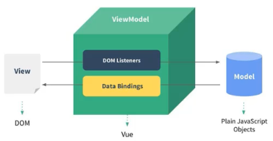

# 概述


## 安装

### **用 `<script>` 引入**

**直接下载**

直接下载并用 `<script>` 标签引入，`Vue` 会被注册为一个全局变量。有两种版本：

- 开发版本：包含完整的警告和调试模式。
- 生产版本：删除了警告，33.30KB min+gzip。在开发环境下不要使用压缩版本。


**CDN**

对于制作原型或学习，使用最新版本。通过如下方式引入：

```html
<!-- 开发环境版本，包含了有帮助的命令行警告 -->
<script src="https://cdn.jsdelivr.net/npm/vue/dist/vue.js"></script>
```

对于生产环境，推荐链接到一个明确的版本号和构建文件，以避免新版本造成的不可预期的破坏：

```html
<!-- 生产环境版本，优化了尺寸和速度 -->
<script src="https://cdn.jsdelivr.net/npm/vue@2.6.11"></script>
```

如果使用原生 ES Modules，有一个兼容 ES Module 的构建文件：

```html
<script type="module">
  import Vue from 'https://cdn.jsdelivr.net/npm/vue@2.6.11/dist/vue.esm.browser.js'
</script>
```

> 可以在 [cdn.jsdelivr.net/npm/vue](https://cdn.jsdelivr.net/npm/vue/) 浏览 NPM 包的源代码。
>
> 也可以在 [unpkg](https://unpkg.com/vue@2.6.11/dist/vue.js) 和 [cdnjs](https://cdnjs.cloudflare.com/ajax/libs/vue/2.6.11/vue.js) 上获取 (cdnjs 的版本更新可能略滞后)。


### NPM

用 Vue 构建大型应用时推荐使用 NPM 安装。

```shell
# 最新稳定版
$ npm install vue
```

NPM 能很好地和模块打包器配合使用。同时 Vue 也提供配套工具来开发[单文件组件](https://cn.vuejs.org/v2/guide/single-file-components.html)。

建议将 NPM 源设置为[国内的镜像](https://npm.taobao.org/)，可以大幅提升安装速度。


### 命令行工具（CLI）

Vue 提供了 `vue-cli`，为单页面应用 (SPA) 快速搭建繁杂的脚手架。

CLI 工具假定用户对 Node.js 和相关构建工具有一定程度的了解。**不推荐**新手直接使用。


## 介绍

Vue (读音 /vjuː/，类似于 **view**) 是一套用于构建用户界面的**渐进式框架**。

与其它大型框架不同的是，Vue 被设计为可以自底向上逐层应用。Vue 的核心库只关注视图层，不仅易于上手，还便于与第三方库或既有项目整合。另一方面，当与[现代化的工具链](https://cn.vuejs.org/v2/guide/single-file-components.html)以及各种[支持类库](https://github.com/vuejs/awesome-vue#libraries--plugins)结合使用时，Vue 也完全能够为复杂的单页应用提供驱动。

[与其它框架的对比](https://cn.vuejs.org/v2/guide/comparison.html)。


什么是渐进式框架？

可以将 Vue 作为应用的一部分嵌入其中，带来更丰富的交互体验。


说说vue的特性？Vue 框架的特点

- 解耦视图和数据
- 可复用的组件
- 前端路由技术
- 状态管理
- 虚拟DOM


**声明式渲染**

Vue.js 的核心是一个允许采用简洁的模板语法来声明式地将数据渲染进 DOM 的系统。

**条件与循环**

不仅可以把数据绑定到 DOM 文本或 attribute，还可以绑定到 DOM **结构**。控制切换一个元素：

`v-for` 指令可以绑定数组的数据来渲染一个项目列表：

**处理用户输入**

Vue 还提供了 `v-model` 指令，它能轻松实现表单输入和应用状态之间的双向绑定。

**组件化应用构建**

在 Vue 里，一个组件本质上是一个拥有预定义选项的一个 Vue 实例。在 Vue 中注册组件很简单：


为什么选择 vue？优点有哪些？ 

- 体积小：压缩后 33K。

- 更高的运行效率：基于虚拟 DOM。

- 双向数据绑定：让开发者不用再去操作 DOM 对象，把更多的精力投入到业务逻辑上。

- 生态丰富，轻量级框架，语法简单，学习成本低

- 组件化开发
- 数据和结构的分离
- 虚拟 DOM
- 运行速度快
- 灵活渐进式框架


缺点：

- 不支持IE8

- 生态环境差，不如angular和react

- 不适合偏大型的项目


## Vue 中的 MVVM

MVVM 模式即 Model-View-ViewModel 模式。

Vue.js 是通过数据驱动的， Vue.js 实例化对象将DOM 和数据进行绑定。一旦绑定，DOM 和数据将保持同步， 每当数据发生变化， DOM 也会随着变化。

View Model 是 Vue.js 的核心，它是 Vue.js 的一个实例。Vue.js 会针对某个 HTML 元素进行实例化，这个 HTML 元素可以是 body ，也可以是某个 css 选择器所指代的元素。DOM Listeners 和Data Bindings 是实现双向绑定的关键。DOM Listeners 监听页面所有 View 层中的 DOM 元素，当发生变化时， Model 层的数据随之变化。Data Bindings 会监听 Model 层的数据，当数据发生变化时， View 层的 DOM 元素也随之变化。


<div align="center">  


- View：视图层。在我们前端开发中，通常就是DOM层。主要的作用是给用户展示各种信息。
- Model层：
  - 数据层
  - 数据可能是我们固定的死数据，更多的是来自我们服务器，从网络上请求下来的数据。
  - 在我们计数器的案例中，就是后面抽取出来的obj，当然，里面的数据可能没有这么简单。
- VueModel层
  - 视图模型层
  - 视图模型层是View和Model沟通的桥梁。
  - 一方面它实现了DataBinding,也就是数据绑定，将Model的改变实时的反应到View中
  - 另一方面它实现了DOM Listener， 也就是DOM监听，当DOM发生一些事件(点击、滚动、touch等)时， 可以监听到，并在需要的情况下改变对应的Data。


## 版本

vue3.0 的改变 

- TypeScript


# 参考资料

- vue 对象实例的 options


