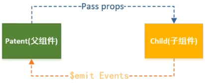

# 简介

**什么是组件化？**

将一个非常复杂的问题（页面）分解成多个可以处理的小问题（功能块）。小问题还可以继续细分。

组件化是 Vue 中的重要思想。它提供了一种抽象，让我们可以开发出一个个独立可复用的小组件来构建应用。任何的应用都会被抽象成一棵组件树。

通常一个应用会以一棵嵌套的组件树的形式来组织：

<div align="center">  </div><br>

组件化思想的应用

- 方便组合、管理代码，代码扩展性更强


# 组件注册

组件的使用分成三个步骤：

- 创建组件构造器，调用 Vue.extend() 方法
- 注册组件，调用 Vue.component() 方法
- 使用组件，在 Vue 实例的作用范围内使用。

**基本使用**

```js
// 1. 创建组件构造器对象（vue 2 版本中使用比较少）
const cpnConstructor = Vue.extend({
    // ES6 语法，使用 ` 可以换行
    template: '<button v-on:click="count++">You clicked me {{ count }} times.</button>',
    data: function () {
        return {
            count: 0
        }
    },
})

// 2. 定义一个名为 button-counter 的新组件
Vue.component('button-counter',cpnConstructor)
```

我们可以在一个通过 `new Vue` 创建的 Vue 根实例中，把这个组件作为自定义元素来使用：

```html
<div id="components-demo">
  <!-- 可以将组件进行任意次数的复用 -->
  <button-counter></button-counter>
  <button-counter></button-counter>
  <button-counter></button-counter>
</div>
```

```js
new Vue({ el: '#components-demo' })
```

因为组件是可复用的 Vue 实例（且带有一个名字），所以它们与 `new Vue` 接收相同的选项，例如 `data`、`computed`、`watch`、`methods` 以及生命周期钩子等。仅有的例外是像 `el` 这样根实例特有的选项。


## **语法糖**

Vue 提供了注册的语法糖，主要是省去了调用 Vue.extend() 的步骤，而是直接用一个对象来代替。

```js
// 定义一个名为 button-counter 的新组件
Vue.component('button-counter', {
  data: function () {
    return {
      count: 0
    }
  },
  template: '<button v-on:click="count++">You clicked me {{ count }} times.</button>'
})
```


## 注册方式

**全局注册**：

在注册后，可以用在任何新创建的 Vue 根实例 (`new Vue`) 的模板中。全局注册的组件在其子组件中可以相互使用。

```js
Vue.component('my-component-name', {
  // ... 选项 ...
})
```


**局部注册**：

全局注册所有的组件意味着即便已经不再使用一个组件了，它仍然会被包含在最终的构建结果中。这造成了用户下载的 JS 的无谓的增加。

可以通过一个普通的 JavaScript 对象来定义组件：

```js
var ComponentA = { /* ... */ }
var ComponentB = { /* ... */ }
var ComponentC = { /* ... */ }
```

然后在 Vue 实例的 `components` 选项中定义想要使用的组件：

```js
new Vue({
  el: '#app',
  components: {
    'component-a': ComponentA,
    'component-b': ComponentB
  }
})
```

**局部注册的组件在其子组件中不可用**。如果希望 `ComponentA` （子组件）在 `ComponentB` （父组件）中可用，则需要这样写：

```js
var ComponentA = { /* ... */ }

var ComponentB = {
  components: {
    'component-a': ComponentA
  },
  // ...
}
```

或者通过 Babel 和 webpack 使用 ES2015 模块：

```js
import ComponentA from './ComponentA.vue'

export default {
  components: {
    ComponentA
  },
  // ...
}
```


## 组件名

组件名就是 `Vue.component` 的第一个参数。

定义组件名的方式有两种：

- 使用 kebab-case（短横线分隔命名）

```js
Vue.component('my-component-name', { /* ... */ })
```

在引用这个自定义元素时使用 kebab-case，例如 `<my-component-name>`。

- 使用 PascalCase（首字母大写命名）

```js
Vue.component('MyComponentName', { /* ... */ })
```

在引用这个自定义元素时两种命名法都可以使用。 `<my-component-name>` 和 `<MyComponentName>` 都是可接受的。


# 分离组件模板

将组件模板放在 Vue.component() 中不方便组织和管理代码。有两种分离方法：`<script>` 标签和 `<template>` 标签。

通过 `<script>` 标签分离模板，注意类型必须是 `text/x-template`。

```html
<script src="text/x-template" id="cpn">
    <div>
        <h2>标题1</h2>
    	<p>内容1</p>
    </div>
</script>
```

```js
Vue.component('cpn',{
	template: '#cpn'
})
```

通过 `<template>` 标签分离模板

```html
<template id="cpn">
    <div>
        <h2>标题1</h2>
        <p>内容1</p>
    </div>
</template>
```


# 组件数据的存放

**组件可以访问 Vue 实例数据吗？**

- 不能。即使能访问，将所有数据都放在 Vue 实例中，Vue 实例会变得很拥挤。
- 子组件不能直接访问父组件的数据。
- Vue 组件应该有自己保存数据的地方。


**组件数据怎么存放？**

组件对象也有一个 data 属性，只是这个 data 属性是一个函数，必须返回一个对象，对象内部保存着数据。


**为什么组件中的 data 属性是函数而不是对象？**

组件可以复用任意次，组件之间的数据应该互不影响。

- 如果 data 属性是对象，则组件指向同一个内存地址的 data，组件间互相影响；
- 如果 data 属性是函数，则<u>每个实例可以维护一份被返回对象的独立的拷贝</u>，组件有各自的的数据，组件间互不影响；

复用组件：

```html
<div id="app">
    <cpn></cpn>
    <cpn></cpn>
    <cpn></cpn>
</div>
```

分离组件模板：

```html
<template id="cpn">
    <div>
        <h2>当前计数：{{counter}}</h2>
        <button @click="increment">+</button>
        <button @click="decrement">-</button>
    </div>
</template>
```

组件的注册方式 1：各个组件的 counter 是不同的。

```js
Vue.component('cpn',{
    template: `#cpn`,
    data(){
        // 计数器之间互不影响
        return{
            counter: 0
        }
    },
    methods: {
        increment(){
            this.counter++
        },
        decrement(){
            this.counter--
        }
    }
})
```

组件的注册方式 2：各个组件的 counter 是相同的。

```js
const obj = {
    counter: 0
}
Vue.component('cpn',{
    template: `#cpn`,
    data(){
        // 相当于 data 是对象的情形，每个计数器的结果都一样。
        return obj
    },
    methods: {
        increment(){
            this.counter++
        },
        decrement(){
            this.counter--
        }
    }
})
```


# 组件的通信方式


## 父子组件通信

子组件是不能引用父组件或者 Vue 实例的数据的。但是，在开发中，往往一些数据是需要从父组件传到子组件的。

父子组件间的通信：

- 通过 props 向子组件传递数据
- 通过事件（自定义事件）向父组件发送消息


<div align="center">  </div><br>

Vue 实例和子组件的通信和父组件和子组件的通信过程是一样的。


### Prop

在组件中，使用选项 props 来声明需要从父级接收到的数据。

props 的值有两种方式：

- 方式一：字符串数组，数组中的字符串就是传递时的名称。
- 方式二：对象，对象可以设置传递时的类型，也可以设置默认值等。

当需要对props进行类型验证时，需要对象写法。

当有自定义构造函数时，验证也支持自定义的类型。


### 自定义事件

- props用于父组件向子组件传递数据，还有一种比较常见的是子组件传递数据或事件到父组件中。
- 这个时候，我们需要使用自定义事件来完成。
- 什么时候需要自定义事件呢?
- 当子组件需要向父组件传递数据时,就要用到自定义事件了。
  口我们之前学习的v-on不仅仅可以用于监听DOM事件,也可以用于组件间的自定义事件。
- ■自定义事件的流程:
  - 在子组件中,通过$emit()来触发事件。
  - 在父组件中,通过v-on来监听子组件事件。
    


## 父子组件的访问方式

父组件访问子组件：使用 $children 或 $refs

子组件访问父组件：使用 $parent


this.$children 是一个数组类型，它包含所有子组件对象


ref 如果是绑定在组件中，那么 this.$refs.refName 获取到的是一个组件对象

ref 如果是绑定在普通的元素中，那么 this.$refs.refName 获取到的是一个元素对象


## 兄弟组件通信


# 动态组件 & 异步组件


# 处理边界情况


# 参考资料


