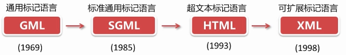

# 简介

W3C 指万维网联盟（*World Wide Web Consortium*），由 *Tim Berners-Lee* 于 1994 年 10 月创建。它是一个会员组织，工作是对 Web 进行标准化，创建并维护 *WWW 标准*。W3C 标准被称为 *W3C 推荐（W3C 规范）*。

W3C 的会员包括了：软件开发商、内容提供商、企业用户、通信公司、研究机构、研究实验室、标准化团体以及政府。

# 具体标准

目前流行的主要标准：

- HTML
- XHTML
- XML
- CSS

其它标准：

- XSL
- XML Schema
- XPath
- XQuery
- DOM
- SOAP
- WSDL
- RDF
- WAI：The Web Accessibility Initiative
- MathML：Mathematical Markup Language
- SVG：Scalable Vector Graphics
- InkML：Ink Markup Language
- VoiceXML
- CCXML

## XML

  
 

XML 指可扩展标记语言（Extensible Markup Language）。

在 JavaScript 里解析和处理 XML  数据时，因为浏览器的不同，其做法也不同。

- 在 IE 浏览器里处理 XML ，首先需要创建 ActiveXObject 对象。

**XML vs HTML**

XML 和 HTML 为不同的目的而设计，XML 不是 HTML 的替代，而是对 HTML 的补充。

- XML 被设计用来传输和存储数据，其焦点是数据的内容。
- HTML 被设计用来显示数据，其焦点是数据的外观。

