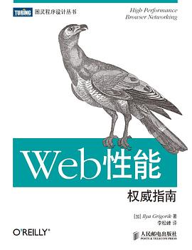

# Spring

## 《Spring Boot 实战》 

[美]克雷格·沃斯/ 2016-9 / 人民邮电出版社

[豆瓣](https://book.douban.com/subject/26857423/)，7.1 分，347 人评分。

  
 

## 《Spring 实战》

（第4版） CraigWalls沃尔斯 / 2016-4-1 / 人民邮电出版社

（第4版） [美] 克雷格·沃斯 /  2020-2 / 人民邮电出版社

[豆瓣](https://book.douban.com/subject/34949443/)，8.0 分，14 人评分。

  
 

# Web

## 《深入分析 Java Web 技术内幕》

（修订版） 许令波 / 2014-8-1 / 电子工业出版社

[豆瓣](https://book.douban.com/subject/25953851/)，7.5 分，247 人评分。

  
 

## 《Web性能权威指南》

Ilya Grigorik / 2013-9 / 人民邮电出版社

[豆瓣](https://book.douban.com/subject/25856314/)，8.8 分，305 人评分。

  
 

Google工程师教你优化web性能，听说讲得比较深。

