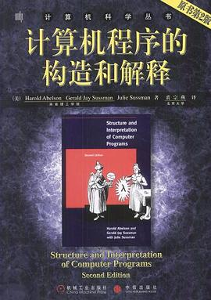
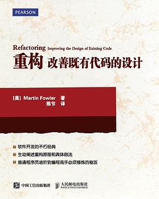
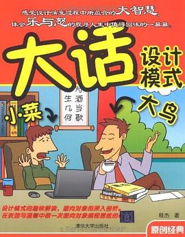
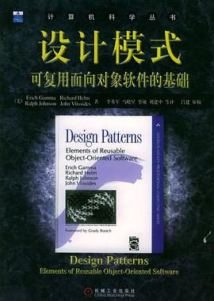
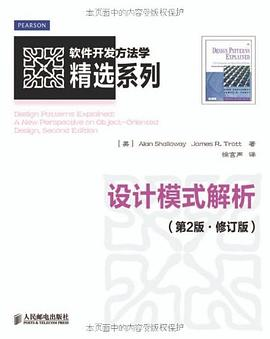
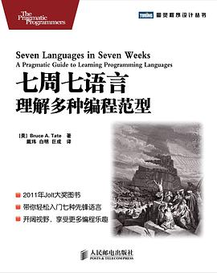
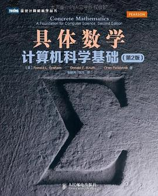

# 计算机组成原理

### 《计算机程序的构造和解释（SICP）》

（原书第2版）Harold Abelson / Gerald Jay Sussman / Julie Sussman / 2004-2 / 机械工业出版社 / 华章IT（出品）

[豆瓣](https://book.douban.com/subject/1148282/)，9.5 分，2330 人评分

  
 

# Python

### 《Python Cookbook》

（中文版，第 3 版） David M. Beazley / Brian K. Jones / 陈舸 / 2015-5-1 / 人民邮电出版社 / 华章IT（出品）

[豆瓣](https://book.douban.com/subject/26381341/)，9.3 分，266 人评分

  
 

# 测试

### 《软件测试》

 [美]RonPatton/ 2006-4 / 机械工业出版社

# 提升

##  重构

### 《重构：改善既有代码的设计》

[美]马丁•福勒（Martin Fowler） / 熊节 / 2015-8 / 人民邮电出版社

[豆瓣](https://book.douban.com/subject/26575459/)，9.3 分，66 人评分

  
 

**必读书目**。好的代码是重构出来的，而不是一开始就写出来的，除非你的代码不用于任何业务。本书从一个重构实例开始，用代码和实例配合讲解了各种耳熟能详的重构方法，非常到位，总之，是一本程序员必读书目，书中的示例代码都是 java 写的。

 

## 编程范式（设计模式）

作为一名工程师，从编写可读的代码，到重构现有的代码，再到设计模式，是编码的必备法则。

### 《大话设计模式》

程杰/ 2007-12-1 / 清华大学出版社

[豆瓣](https://book.douban.com/subject/2334288/)，8.3 分，1969 人评分。

  
 

用多个小故事或编程示例来组织讲解 GoF 总结的 23 个设计模式。其中，第 1、3、4、5 章着重讲解了面向对象的意义、好处以及几个重要的设计原则；第 2 章，以及第 6 到第 28 章详细讲解了 23 个设计模式；第 29 章是对设计模式的全面总结。附录部分是通过一个例子的演变为初学者介绍了面向对象的基本概念。

 

### 《 Head First 设计模式》

（中文版） [美]弗里曼/ 2007-9 / 中国电力出版社

[豆瓣](https://book.douban.com/subject/2243615/)，9.2 分，3066 人评分。

  
 

介绍了 23 个设计模式，同样采用场景对话、打比方的方式来讲解，巧妙地让设计模式的理论在实际应用中体现出来，淡化了抽象性。

 

### 《设计模式》

可复用面向对象软件的基础

 [美]ErichGamma/RichardHelm/RalphJohnson/JohnVlissides/ 2000-9 / 机械工业出版社

[豆瓣](https://book.douban.com/subject/1052241/)，9.0 分，2886 人评分。

  
 

**必读经典。**设计模式领域的开山鼻祖，必读，并且值得多读几遍。虽然其中的例子是 C++ 写的，但也很适合 Java 学习者读。

 

### 《设计模式解析》

Alan Shalloway / 徐言声 / 2013-1 / 人民邮电出版社

 [豆瓣](https://book.douban.com/subject/20406704/)，7.4 分，19 人评分。

  
 

### 《七周七语言——理解多种编程范型》

[美] Bruce A·Tate / 2012-5-8 / 人民邮电出版社

[豆瓣](https://book.douban.com/subject/10555435/)，8.1 分，782 人评分。

  
 

## 代码整洁

### 《代码整洁之道》

 

 

## 软件开发

### 《敏捷开发-敏捷软件开发：原则、模式与实践》(全)

 

 

## 经典书籍

### 《计算机科学导论(原书第2版)》 

佛罗赞 (Behrouz A.Forouzan), 莫沙拉夫 (Firouz Mosharraf) 机械工业出版社

 

### 《编程之美》

《编程之美》小组编/ 2008-3 / 电子工业出版社

## 数学

### 《具体数学：计算机科学基础》

（第2版） (美)Ronald L.Graham / Oren Patashnik / Donald E.Knuth / 张凡 / 张明尧  / 2013-4-1 / 人民邮电出版社 / 图灵教育（出品）

[豆瓣](https://book.douban.com/subject/21323941/)，9.6 分，311 人评分。

  
 

 

##  机器学习

### 《机器学习 》

周志华/ 2016-1-1 / 清华大学出版社

### 《百面机器学习》

诸葛越/葫芦娃/ 2018-8-1 / 人民邮电出版社

### 《深度学习》

[美]伊恩·古德费洛/[加]约书亚·本吉奥/[加]亚伦·库维尔/ 2017-7-1 / 人民邮电出版社

### 《统计学习方法》

李航 / 2012-3 / 清华大学出版社

### 《运营之光》

黄有璨/ 2016-9-1 / 电子工业出版社

### 《人人都是产品经理》

苏杰/ 2010年4月 / 电子工业出版社

### 《STL源码剖析》

侯捷/ 2002-6 / 华中科技大学出版社

### 《Spark快速大数据分析 》

[美]HoldenKarau/[美]AndyKonwinski/[美]PatrickWendell/[加]MateiZaharia/ 2015-10 / 人民邮电出版社

