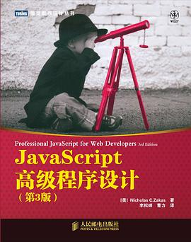
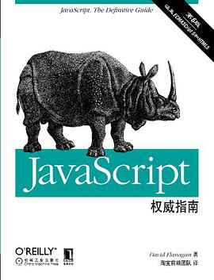

# 一、HTML

[HTML30分钟快速入门](https://deerchao.cn/tutorials/html/html.htm)

## 基础篇

- [HTML初学者教程| MDN](https://developer.mozilla.org/zh-CN/docs/Web/HTML)
- [HTML W3C教程](http://www.w3school.com.cn/html/index.asp)
- [HTML5-Web开发者指南| MDN](https://developer.mozilla.org/zh-CN/docs/Web/Guide/HTML/HTML5)
- [HTML5标签列表](https://developer.mozilla.org/zh-CN/docs/Web/Guide/HTML/HTML5/HTML5_element_list)
- [HTML meta标签总结与属性使用介绍](https://segmentfault.com/a/1190000004279791)

## 进阶篇

- [前端检查表| HTML](https://github.com/thedaviddias/Front-End-Checklist#html)
- [深入理解HTML5标签](https://segmentfault.com/a/1190000002695791)
- [如何写出高效率的HTML](https://segmentfault.com/a/1190000002680822)
- [戏说HTML5](http://www.cnblogs.com/dojo-lzz/p/5059316.html)
- [从一个事件绑定说起-DOM](https://qiutc.me/post/binding-event-of-dom.html)

- [MDN的HTML5入门教程](https://link.zhihu.com/?target=https%3A//developer.mozilla.org/zh-CN/docs/Web/Guide/HTML/HTML5/Introduction_to_HTML5)
- [网易云课堂HTML5入门](https://link.zhihu.com/?target=http%3A//study.163.com/course/introduction/171001.htm%23/courseDetail)

## 周边篇

- [samdutton / simpl](https://github.com/samdutton/simpl)：HTML，CSS和Javascript的最简单示例：[https](https://simpl.info/)：[//simpl.info](https://github.com/samdutton/simpl)
- [HTML 5.2的新增功能？](https://bitsofco.de/whats-new-in-html-5-2/)

# 二、CSS

## 基础篇

- [CSS入门教程| MDN](https://developer.mozilla.org/zh-CN/docs/Web/Guide/CSS/Getting_started)
- [CSS基础教程| MDN](https://developer.mozilla.org/zh-CN/docs/Learn/Getting_started_with_the_web/CSS_basics)
- [CSS基础教程| W3学校](https://www.w3school.com.cn/css/index.asp)

- [MDN的CSS入门教程](https://link.zhihu.com/?target=https%3A//developer.mozilla.org/zh-CN/docs/Web/Guide/CSS/Getting_started)
- [学习CSS布局](https://link.zhihu.com/?target=http%3A//zh.learnlayout.com/)

## 进阶篇

- [前端检查表| 的CSS](https://github.com/thedaviddias/Front-End-Checklist#css)
- [【CSS】常见的CSS布局](http://cherryblog.site/common-CSS-layout.html#more)
- [CSS实现水平| 垂直居中漫谈](https://jeffjade.com/2015/11/14/2015-11-14-css-achieve-horizontal_vertical_center/)
- [一劳永逸的搞定flex布局](https://juejin.im/post/58e3a5a0a0bb9f0069fc16bb)
- [CSS征途之背景点滴](https://jeffjade.com/2015/06/29/2015-06-29-css-background/)
- [使用纯CSS实现Google Photos照片列表布局](https://github.com/xieranmaya/blog/issues/4)
- [我如何开始绘制CSS图像](https://blog.prototypr.io/how-i-started-drawing-css-images-3fd878675c89)
- [CSS的形状 CSS技巧](https://css-tricks.com/examples/ShapesOfCSS/)
- [半深入理解CSS3 object-position / object-fit属性](https://www.zhangxinxu.com/wordpress/2015/03/css3-object-position-object-fit/)

- [CSS3菜鸟教程](https://link.zhihu.com/?target=http%3A//www.runoob.com/css3/css3-tutorial.html)
- [Gitbook的CSS3教程](https://link.zhihu.com/?target=https%3A//www.gitbook.com/book/waylau/css3-tutorial/)

- Responsive Design
  - [响应式设计指南](https://link.zhihu.com/?target=http%3A//geekplux.com/grid/)
  - [自适应网页设计——阮一峰](https://link.zhihu.com/?target=http%3A//www.ruanyifeng.com/blog/2012/05/responsive_web_design.html)
  - [什么是响应式web设计？怎样进行？](https://link.zhihu.com/?target=http%3A//beforweb.com/node/6)

## 动画篇

- [css-animation-101](https://github.com/cssanimation/css-animation-101)：了解如何将动画带入Web项目。https://cssanimation.rocks/
- [使用CSS动画](https://developer.mozilla.org/en-US/docs/Web/CSS/CSS_Animations/Using_CSS_animations)
- [CSS动画简介](http://www.ruanyifeng.com/blog/2014/02/css_transition_and_animation.html)
- [CSS3动画实践](https://aotu.io/notes/2016/01/04/css3-animation/index.html)
- [在自动尺寸上使用CSS过渡](https://css-tricks.com/using-css-transitions-auto-dimensions/)

- [CSS动画](https://link.zhihu.com/?target=http%3A//www.ruanyifeng.com/blog/2014/02/css_transition_and_animation.html)
- [Canvas动画教程](https://link.zhihu.com/?target=https%3A//developer.mozilla.org/zh-CN/docs/Web/API/Canvas_API/Tutorial)
- [Learn to Create Animations in JavaScript](https://link.zhihu.com/?target=https%3A//www.kirupa.com/javascript_animations/index.htm)

### CSS 动画库

- [**animate.css**](https://daneden.github.io/animate.css)：刚刚添加CSS动画
- [typed.js](https://github.com/mattboldt/typed.js)：JavaScript键入动画库
- [hint.css](https://github.com/chinchang/hint.css)：一个可爱的网站的[纯](https://github.com/chinchang/hint.css)CSS工具提示库。https://kushagragour.in/lab/hint
- [Balloon.css](https://github.com/kazzkiq/balloon.css)：由纯CSS组成的简单工具提示。https://kazzkiq.github.io/balloon.css
- [loaders.css](https://github.com/ConnorAtherton/loaders.css)：令人愉悦的，注重性能的纯css加载动画。
- [悬停](https://github.com/IanLunn/Hover)：一组CSS3供电的悬停效果，可应用于链接，按钮，徽标，SVG，特色图像等。轻松应用于您自己的元素，修改或仅用于启发。在CSS，Sass和LESS中可用。http://ianlunn.github.io/Hover/

### JS 动画库

- [**anime.js**](https://github.com/juliangarnier/anime)： JavaScript动画引擎[http://animejs.com](http://animejs.com/)
- [animateplus](https://github.com/bendc/animateplus)：现代网络的A +动画模块
- [vivus](https://github.com/maxwellito/vivus)：在SVG上制作绘图动画的JavaScript库
- [scenejs](https://github.com/daybrush/scenejs)：Scene.js是基于JavaScript和CSS时间轴的动画库http://daybrush.com/scenejs
- [奥拉](https://github.com/franciscop/ola)： 平滑的动画库用于内插数字
- [airbnb / lottie](https://github.com/airbnb/lottie/)：适用于Android，iOS，React Native和Web的Lottie
- [laxxx](https://github.com/alexfoxy/laxxx)：简单轻巧（压缩后压缩2kb）香草javascript插件，可在您滚动时创建平滑且精美的动画！利用最直观的交互的力量，使您的网站活跃起来！
- [popmotion](https://github.com/Popmotion/popmotion)：用于Popmotion和Pose动画包的Monorepo [https://popmotion.io](https://popmotion.io/)
- [VelocityJS](https://github.com/julianshapiro/velocity)：加速的JavaScript动画。[http://VelocityJS.org](http://velocityjs.org/)
- [tween.js](https://github.com/tweenjs/tween.js)：JavaScript补间引擎，用于简单动画，并结合了优化的Robert Penner方程。
- [WOW](https://github.com/matthieua/WOW)：在向下滚动页面[http://mynameismatthieu.com/WOW/时](http://mynameismatthieu.com/WOW/)显示CSS动画
- [hsnaydd / moveTo](https://github.com/hsnaydd/moveTo)：没有任何依赖关系的轻量级滚动动画javascript库

## 规范篇

- [编写灵活，稳定，规范的HTML和CSS代码的规范。](http://codeguide.bootcss.com/)
- [**如何编写可维护的CSS**](https://github.com/chadluo/CSS-Guidelines/blob/master/README.md)
- [CSS，JS，HTML编码规范](https://guide.aotu.io/docs/css/code.html)

## 周边篇

- [css-doodle](https://github.com/css-doodle/css-doodle)： 一个用于使用CSS绘制图案的Web组件。
- [CSS-Inspiration](https://github.com/chokcoco/CSS-Inspiration)：CSS灵感，在这里找到写CSS的灵感！
- [JNKKKK / MoreToggles.css](https://github.com/JNKKKK/MoreToggles.css)：一个纯CSS库，可为您提供各种美观的切换
- [css-blocks](https://github.com/linkedin/css-blocks)：高性能，可维护的样式表。http://css-blocks.com/
- [smooth-code / xstyled](https://github.com/smooth-code/xstyled)：基于样式主题和情感的基于主题的一致CSS
- [astrit / css.gg](https://github.com/astrit/css.gg)：500个+ CSS图标。可自定义，支持API和NPM的Retina Ready [https://css.gg](https://css.gg/)
- [pattle / simpsons-in-css](https://github.com/pattle/simpsons-in-css)：CSS中的Simpsons字符
- [bouncejs触摸库](http://bouncejs.com/)
- [浏览器黑客](http://browserhacks.com/)
- [腾讯css3动画制作工具](http://isux.tencent.com/css3/tools.html)
- [志爷css小工具集合](https://linxz.github.io/tianyizone)

### CSS 样式库

- [sanitize.css](https://github.com/csstools/sanitize.css)：最佳实践CSS基础https://csstools.github.io/sanitize.css
- [sindresorhus / github-markdown-css](https://github.com/sindresorhus/github-markdown-css)：复制GitHub Markdown样式的最少CSS
- [prime / css](https://github.com/primer/css)：为GitHub [https://primer.style/css提供支持](https://primer.style/css)的CSS设计系统
- [water.css](https://github.com/kognise/water.css)：一组刚刚添加的CSS样式，可以使简单的网站变得更好看
- [uncss](https://github.com/uncss/uncss)：从CSS删除未使用的样式
- [popmotion](https://popmotion.io/)：一个功能灵活的JavaScript运动库

### CSS 特效样式

- [cssfx](https://github.com/jolaleye/cssfx)：精美简单的点击复制CSS效果https://cssfx.lovejade.cn/
- [instagram.css](https://github.com/picturepan2/instagram.css)：Instagram.css-纯CSS的完整Instagram过滤器集
- [QiShaoXuan / css_tricks](https://github.com/QiShaoXuan/css_tricks)：一些CSS技巧，一些CSS常用样式

### CSS 框架

- [tailwindcss](https://github.com/tailwindcss/tailwindcss)：一种实用程序优先的CSS框架，用于快速UI开发。https://tailwindcss.com/
- [bulma](https://github.com/jgthms/bulma)：基于Flexbox的现代CSS框架[https://bulma.io](https://bulma.io/)
- [ajusa / lit](https://github.com/ajusa/lit)：世界上最小的响应式 CSS框架（395字节）

### JS 中的 CSS

- [咕](https://github.com/cristianbote/goober) :： goober，小于1KB 具有熟悉的API的css-in-js替代
- [nyancss / nyancss](https://github.com/nyancss/nyancss)：在获得CSS-in-JS好处的同时编写普通CSS [https://nyancss.com](https://nyancss.com/)

## 相关文章

- [Postcss](https://github.com/postcss/postcss)：使用JS插件转换样式http://postcss.org/
- [jss](https://github.com/cssinjs/jss)：JSS是CSS的创作工具，它使用JavaScript作为宿主语言。[https://cssinjs.org](https://cssinjs.org/)
- [css-modules](https://github.com/css-modules/css-modules)：有关css-modules的文档
- [postcss-cssnext](https://github.com/MoOx/postcss-cssnext)：PostCSS插件可在今天使用明天的CSS语法。http://cssnext.io/
- [normalize.css](https://github.com/necolas/normalize.css/)：CSS重置的一种现代替代方法http://necolas.github.io/normalize.css/
- [30秒的CSS](https://github.com/atomiks/30-seconds-of-css)：精选的有用CSS片段的精选集合。
- [**您需要了解CSS**](https://github.com/l-hammer/You-need-to-know-css)：Web开发人员需要知道的CSS技巧〜https [://lhammer.cn/You-need-to-know-css/](https://lhammer.cn/You-need-to-know-css/)
- [linkedin / css-blocks](https://github.com/linkedin/css-blocks)：高性能，可维护的样式表。http://css-blocks.com/
- [AllThingsSmitty / css-protips](https://github.com/AllThingsSmitty/css-protips)：一系列技巧帮助您掌握CSS技能
- [谈谈一些有趣的CSS主题](https://github.com/chokcoco/iCSS)：[https](https://github.com/chokcoco/iCSS) : [//github.com/chokcoco/iCSS](https://github.com/chokcoco/iCSS)
- [Houdini：CSS领域最令人振奋的革新](https://zhuanlan.zhihu.com/p/20939640)
- [linaria](https://github.com/callstack/linaria)：JS库[https://linaria.now.sh中的](https://linaria.now.sh/)零运行时CSS
- [csstree](https://github.com/csstree/csstree)：用于处理CSS的工具集，包括基于W3C规范和浏览器实现的快速详细的解析器，walker，生成器和lexer

# 三、JavaScript

## 基础篇

- [JavaScript 基础教程 | MDN](https://developer.mozilla.org/zh-CN/docs/Web/JavaScript)
- [JavaScript 指南 | MDN](https://developer.mozilla.org/zh-CN/docs/Web/JavaScript/Guide)
- [JavaScript 教程 | W3school](https://www.w3school.com.cn/js/index.asp)
- [阮一峰 JavaScript](http://javascript.ruanyifeng.com/)
- [阮一峰 ES66](http://es6.ruanyifeng.com/)
- [ECMAScript 6 Learning](https://github.com/ericdouglas/ES6-Learning)
- [JavaScript Promise 迷你书](https://github.com/liubin/promises-book/)
- [awesome-javascript](https://github.com/sorrycc/awesome-javascript):  A collection of awesome browser-side JavaScript libraries, resources and shiny things.
- [javascript-tutorial-en](https://github.com/javascript-tutorial/en.javascript.info): Modern JavaScript Tutorial [https://javascript.info](https://javascript.info/)
- [anbang/javascript-notes](https://github.com/anbang/javascript-notes): 安邦的 JavaScript 学习笔记

- [JavaScript菜鸟教程](https://link.zhihu.com/?target=http%3A//www.runoob.com/js/js-tutorial.html)
- [慕课网JavaScript入门篇](https://link.zhihu.com/?target=http%3A//www.imooc.com/view/36)

### 《JavaScript 高级程序设计》（1）

（第3版） [美]尼古拉斯·泽卡斯 / 2012-3-29 / 人民邮电出版社

[豆瓣](https://book.douban.com/subject/10546125/)，9.3 分，2328 人评分。

  
 

又称**红宝书**，雅虎首席前端架构师，YUI 的作者 Zakas 出品。虽然书名带了“高级”二字，但是讲得也很基础，而且行文风格很流畅，每一小节就像是一篇博客，读起来并不枯燥，个人感觉比犀牛书可读性更强。

全面深入 JavaScript，贴近实战，在详细讲解了 JavaScript 语言的核心之后，条分缕析地为读者展示了现有规范及实现为开发 Web 应用提供的各种支持和特性。

该书非常适合初级中级 JavaScript 开发者看，每章小结总结的干货也特别到位。但阅读需要耐心，刚开始看起来可能会有很多困扰。

### 《JavaScript权威指南》（1）

[美]DavidFlanagan / 2001-7 / 中国电力出版社

（第6版） [美]DavidFlanagan / 淘宝前端团队 / 2012-4-1 / 机械工业出版社

[豆瓣](https://book.douban.com/subject/10549733/)，8.8 分，682 人评分。

  
 

**犀牛书**，淘宝前端团队翻译。

第6版特别涵盖了 HTML5 和 ECMAScript5，是经典的 JavaScript 工具书，从 1996 年以来，本书已经成为 JavaScript 程序员心中的《圣经》，是程序员学习核心 JavaScript 语言和由 Web 浏览器定义的 JavaScript API 的指南和综合参考手册。

这本书适合有一定基础之后再来看，不太适合初学者，写的非常细，各种细节原理都巨细无遗，比较底层，和红宝书比起来有点难，当然也需要耐心去阅读。很多人都很难翻完一遍该书，拿来做工具书也非常不错。当有一定基础后再去翻该书，会有种醍醐灌顶的感觉。

### **《ES6标准入门（第3版）》**（）

**推荐理由：**

ES6是下一代JavaScript语言标准的统称，每年6月发布一次修订版，目前已经发布了ES2015、ES2016和ES2017，即将发布ES2018。书中介绍了新版本中新增的语法，对基本概念、设计目的和用法进行了讲解，给出了大量示例，适合对JavaScript语言有一定了解的读者，也可当作新语法的查阅工具。

前端工程师当然要关注ECMAScript的发展。阮老师的这本科普小书！短小精悍，通俗易懂。这本书也是开源的：[ECMAScript 6入门](https://link.zhihu.com/?target=http%3A//es6.ruanyifeng.com/)

### 《JavaScript DOM编程艺术》

作为初学者如果觉得上面两本书作为入门书来说太厚了，也可以看看这本，不厚，评价也很高，但是由于本人没看过，就不作过多评价了。

## 进阶篇

- [33-js-concepts](https://github.com/leonardomso/33-js-concepts):  33 concepts every JavaScript developer should know. [ 每个 JavaScript 工程师都应懂的 33 个概念](https://github.com/stephentian/33-js-concepts).
- [Front-End-Checklist Javascript](https://github.com/thedaviddias/Front-End-Checklist#javascript)
- [Web | Google Developers](https://developers.google.com/web/)
- [How JavaScript works: inside the V8 engine + 5 tips on how to write optimized code](https://blog.sessionstack.com/how-javascript-works-inside-the-v8-engine-5-tips-on-how-to-write-optimized-code-ac089e62b12e)
- [八段代码彻底掌握 Promise](https://juejin.im/post/597724c26fb9a06bb75260e8)
- [Understanding ECMAScript 6 - Nicholas C. Zakas](https://leanpub.com/understandinges6/read)
- [Await s return VS return await](https://jakearchibald.com/2017/await-vs-return-vs-return-await/)
- [How JavaScript works: memory management + how to handle 4 common memory leaks](https://blog.sessionstack.com/how-javascript-works-memory-management-how-to-handle-4-common-memory-leaks-3f28b94cfbec)
- [5 Tips and Thoughts on Async / Await Functions](https://start.jcolemorrison.com/5-tips-and-thoughts-on-async-await-functions/)
- [Parallel programming in JavaScript](https://itnext.io/achieving-parallelism-in-javascript-using-web-workers-8f921f2d26db)
- [The Comprehensive Guide to JavaScript Design Patterns](https://www.toptal.com/javascript/comprehensive-guide-javascript-design-patterns)
- [javascript-design-patterns-for-humans](https://github.com/sohamkamani/javascript-design-patterns-for-humans): An ultra-simplified explanation of design patterns implemented in javascript
- [jonasschmedtmann/complete-javascript-course](https://github.com/jonasschmedtmann/complete-javascript-course): Starter files, final projects and FAQ for my Complete JavaScript course

### 《Javascript语言精粹》

### 《高性能 Javascript》

### 《你不知道的 JavaScript》（1）

- jQuery
  - [jQuery菜鸟教程](https://link.zhihu.com/?target=http%3A//www.runoob.com/jquery/jquery-tutorial.html)
  - [慕课网jQuery基础](https://link.zhihu.com/?target=http%3A//www.imooc.com/course/list%3Fc%3Djquery%26is_easy%3D1)
- Ajax
  - [jQuery Ajax快速入门](https://link.zhihu.com/?target=http%3A//blog.qiubio.com%3A8080/archives/1467)
  - [jQuery Ajax全解析](https://link.zhihu.com/?target=http%3A//www.cnblogs.com/qleelulu/archive/2008/04/21/1163021.html)

- w3c标准
  - [Web Platform Docs](https://link.zhihu.com/?target=https%3A//docs.webplatform.org/wiki/Main_Page)
- ECMA6
  - [阮一峰ECMAScript6入门](https://link.zhihu.com/?target=http%3A//es6.ruanyifeng.com/)

## 相关篇

- [A list of funny and tricky JavaScript examples](https://github.com/denysdovhan/wtfjs#readme)
- [30 seconds of code](https://github.com/Chalarangelo/30-seconds-of-code): Curated collection of useful Javascript snippets that you can understand in 30 seconds or less. https://30secondsofcode.org/
- [azl397985856/leetcode](https://github.com/azl397985856/leetcode): LeetCode Solutions: A Record of My Problem Solving Journey.( leetcode 题解，记录自己的 leetcode 解题之路。)
- [javascript-questions](https://github.com/lydiahallie/javascript-questions): A long list of (advanced) JavaScript questions, and their explanations  Updated weekly!
- [JavaScript Factory Functions with ES6+](https://medium.com/javascript-scene/javascript-factory-functions-with-es6-4d224591a8b1)
- [Dynamic import()](https://developers.google.com/web/updates/2017/11/dynamic-import)
- [Why we have banned default exports in Javascript and you should do the same](https://blog.neufund.org/why-we-have-banned-default-exports-and-you-should-do-the-same-d51fdc2cf2ad)
- [A Brief History of Modularity](https://ponyfoo.com/articles/brief-history-of-modularity)
- [Familiarity Bias is Holding You Back: It’s Time to Embrace Arrow Functions](https://medium.com/javascript-scene/familiarity-bias-is-holding-you-back-its-time-to-embrace-arrow-functions-3d37e1a9bb75)
- [Can (a ==1 && a== 2 && a==3) ever evaluate to true?](https://stackoverflow.com/questions/48270127/can-a-1-a-2-a-3-ever-evaluate-to-true)
- [ES2018(ES9) Puzzlers](http://es2018puzzlers.justjavac.com/)
- [Here are examples of everything new in ECMAScript 2016, 2017, and 2018](https://medium.freecodecamp.org/here-are-examples-of-everything-new-in-ecmascript-2016-2017-and-2018-d52fa3b5a70e)

## 优化篇

- [Front-End-Performance-Checklist](https://github.com/thedaviddias/Front-End-Performance-Checklist): The only Front-End Performance Checklist that runs faster than the others [https://frontendchecklist.io(soon](https://frontendchecklist.io(soon/) on)
- [You Don't Need jQuery](https://github.com/nefe/You-Dont-Need-jQuery): Examples of how to do query, style, dom, ajax, event etc like jQuery with plain javascript.
- [You don't (may not) need Lodash/Underscore](https://github.com/you-dont-need/You-Dont-Need-Lodash-Underscore): List of JavaScript methods which you can use natively + ESLint Plugin
- [getify/You-Dont-Know-JS](https://github.com/getify/You-Dont-Know-JS): A book series on JavaScript. @YDKJS on twitter.
- [ 你可能不知道的前端知识点](https://github.com/justjavac/the-front-end-knowledge-you-may-not-know)
- [5 Tips to Write Better Conditionals in JavaScript](https://scotch.io/bar-talk/5-tips-to-write-better-conditionals-in-javascript)

## 规范篇

- [idiomatic.js](https://github.com/rwaldron/idiomatic.js): Principles of Writing Consistent, Idiomatic JavaScript
- [js-the-right-way](https://github.com/braziljs/js-the-right-way): An easy-to-read, quick reference for JS best practices, accepted coding standards, and links around the Web [http://jstherightway.org](http://jstherightway.org/)
- [clean-code-javascript](https://github.com/ryanmcdermott/clean-code-javascript):  Clean Code concepts adapted for JavaScript

## Pack JavaScript

- [parcel](https://github.com/parcel-bundler/parcel):  Blazing fast, zero configuration web application bundler [https://parceljs.org](https://parceljs.org/)
- [rollup](https://github.com/rollup/rollup): Next-generation ES module bundler [https://rollupjs.org](https://rollupjs.org/)
- [fastpack](https://github.com/fastpack/fastpack): Pack JS code fast & easy [http://fastpack.io](http://fastpack.io/)

------

## [TypeScript](https://github.com/Microsoft/TypeScript)

- [TypeScript - JavaScript that scales.](http://www.typescriptlang.org/): TypeScript is a superset of JavaScript that compiles to clean JavaScript output.
- [typescript-tutorial](https://github.com/xcatliu/typescript-tutorial): TypeScript 入门教程
- [TypeScript 中文网](https://www.tslang.cn/index.html): TypeScript 是 JavaScript 的超集，它编译为纯 JavaScript
- [TypeScript 入门教程](https://ts.xcatliu.com/)：从 JavaScript 程序员的角度总结思考，循序渐进的理解 TypeScript。
- [typescript-book](https://github.com/basarat/typescript-book):  The definitive guide to TypeScript and possibly the best TypeScript book . Free and Open Source 

# 四、框架

- [Bootstrap菜鸟教程](https://link.zhihu.com/?target=http%3A//www.runoob.com/bootstrap/bootstrap-tutorial.html)
- [慕课网玩转Bootstrap](https://link.zhihu.com/?target=http%3A//www.imooc.com/view/141)

- React
  - [入门实例教程](https://link.zhihu.com/?target=http%3A//www.ruanyifeng.com/blog/2015/03/react.html)
- Vue
  - [vue.js教程](https://link.zhihu.com/?target=http%3A//wiki.jikexueyuan.com/project/vue-js/)
- [Angular](https://link.zhihu.com/?target=http%3A//www.runoob.com/angularjs/angularjs-tutorial.html)

# 五、代码规范

- Style Guide
  - [腾讯alloteam前端代码规范](https://link.zhihu.com/?target=http%3A//alloyteam.github.io/CodeGuide/)
  - [百度ecomfe前端代码规范](https://link.zhihu.com/?target=https%3A//github.com/ecomfe/spec)
  - [Google HTML/CSS Style Guide](https://link.zhihu.com/?target=https%3A//google.github.io/styleguide/htmlcssguide.xml)
  - [Google JavaScript Style Guide](https://link.zhihu.com/?target=https%3A//google.github.io/styleguide/javascriptguide.xml)

# 七、其它

- 基础

  - [深入浅出HTML与CSS、XHTML](https://link.zhihu.com/?target=https%3A//book.douban.com/subject/1799652/)
  - [HTML & CSS设计与构建网站](https://link.zhihu.com/?target=https%3A//book.douban.com/subject/21338365/)
  - [Pro Git中文版](https://link.zhihu.com/?target=http%3A//iissnan.com/progit/)
  - [鸟哥的linux私房菜](https://link.zhihu.com/?target=https%3A//book.douban.com/subject/4889838/)

- 中级

  - [Head First HTML5 Programming](https://link.zhihu.com/?target=https%3A//book.douban.com/subject/19894872/)
  - [JavaScript权威指南](https://link.zhihu.com/?target=https%3A//book.douban.com/subject/10546125/)
  - [JavaScript语言精粹](https://link.zhihu.com/?target=https%3A//book.douban.com/subject/3590768/)
  - [JavaScript & jQuery交互式Web前端开发](https://link.zhihu.com/?target=https%3A//www.amazon.cn/JavaScript-jQuery%E4%BA%A4%E4%BA%92%E5%BC%8FWeb%E5%89%8D%E7%AB%AF%E5%BC%80%E5%8F%91-%E8%BE%BE%E5%85%8B%E7%89%B9/dp/B010L41T5O/)
  - [深入浅出Ajax](https://link.zhihu.com/?target=https%3A//book.douban.com/subject/3136781/)

- 高级

  - [JavaScript高级程序设计](https://link.zhihu.com/?target=https%3A//book.douban.com/subject/10546125/)
  - [HTML5高级程序设计](https://link.zhihu.com/?target=http%3A//book.douban.com/subject/5402708/)
  - [CSS权威指南](https://link.zhihu.com/?target=https%3A//book.douban.com/subject/2308234/)

- 测试
  - [FEX前端自动化测试探索](https://link.zhihu.com/?target=http%3A//fex.baidu.com/blog/2015/07/front-end-test/)
  - [测试框架Mocha实例教程](https://link.zhihu.com/?target=http%3A//www.ruanyifeng.com/blog/2015/12/a-mocha-tutorial-of-examples.html)
  - [Karma和Jasmine自动化单元测试](https://link.zhihu.com/?target=http%3A//blog.fens.me/nodejs-karma-jasmine/)
- 自动化构建
  - [流式自动化构建工具Gulp](https://link.zhihu.com/?target=http%3A//www.gulpjs.com.cn/)
  - [前端工程构建工具fis](https://link.zhihu.com/?target=http%3A//fex-team.github.io/fis3/)
  - Web项目脚手架生成工具Yeoman
    - [用Yeoman和AngularJS做Web应用](https://link.zhihu.com/?target=http%3A//blog.jobbole.com/65399/)
- 模块/包管理
  - npm
    - [npm使用介绍](https://link.zhihu.com/?target=http%3A//www.runoob.com/nodejs/nodejs-npm.html)
    - [快速搭建 Node.js 开发环境以及加速 npm](https://link.zhihu.com/?target=https%3A//cnodejs.org/topic/5338c5db7cbade005b023c98)
  - Sea.js
    - [5分钟上手Sea.js](https://link.zhihu.com/?target=http%3A//seajs.org/docs/%23quick-start)
  - [RequireJS](https://link.zhihu.com/?target=http%3A//www.requirejs.cn/)
  - [ES6模块](https://link.zhihu.com/?target=http%3A//www.infoq.com/cn/articles/es6-in-depth-modules)
- 预处理器
  - Haml
    - [Tutorial](https://link.zhihu.com/?target=http%3A//haml.info/tutorial.html)
    - [HTML代码简写法：Emmet和Haml](https://link.zhihu.com/?target=http%3A//www.ruanyifeng.com/blog/2013/06/emmet_and_haml.html)
  - Sass
    - [Sass入门](https://link.zhihu.com/?target=http%3A//www.w3cplus.com/sassguide/)
  - TypeScript
    - [TypeScript Handbook（中文版）](https://link.zhihu.com/?target=https%3A//www.gitbook.com/book/zhongsp/typescript-handbook/details)

## 服务器端

- Nodejs
  - [Node入门](https://link.zhihu.com/?target=http%3A//www.nodebeginner.org/index-zh-cn.html)
  - [7天学会NodeJS](https://link.zhihu.com/?target=https%3A//nqdeng.github.io/7-days-nodejs/)
- MongoDB
  - [NodeJS与MongoDB交互](https://link.zhihu.com/?target=http%3A//www.cnblogs.com/zhongweiv/p/node_mongodb.html)

## 技能图谱

- [StuQ技能图谱](https://link.zhihu.com/?target=http%3A//skill-map.stuq.org/)
- [Frontend Knowledge Structure](https://link.zhihu.com/?target=http%3A//html5ify.com/fks/)

## 在线资源

- [大前端导航](https://link.zhihu.com/?target=http%3A//www.daqianduan.com/nav)
- [Frontend Stuff](https://link.zhihu.com/?target=https%3A//github.com/moklick/frontend-stuff)
- [Frontend directory](https://link.zhihu.com/?target=https%3A//frontend.directory/)
- [Frontend Interview Questions](https://link.zhihu.com/?target=https%3A//github.com/h5bp/Front-end-Developer-Interview-Questions)

## 在线教程

- [菜鸟教程](https://link.zhihu.com/?target=http%3A//www.runoob.com/)
- [极客学院Wiki](https://link.zhihu.com/?target=http%3A//wiki.jikexueyuan.com/)
- [Mozilla开发者网络](https://link.zhihu.com/?target=https%3A//developer.mozilla.org/zh-CN/docs/Learn)
- [front-end-web-development on Treehouse](https://link.zhihu.com/?target=https%3A//teamtreehouse.com/tracks/front-end-web-development)
- [Learn to Code Advanced HTML/CSS](https://link.zhihu.com/?target=http%3A//learn.shayhowe.com/advanced-html-css/)

## 在线书籍

- [Front-end Developer HandBook](https://link.zhihu.com/?target=https%3A//www.gitbook.com/book/dwqs/frontenddevhandbook/)
- [Front-end Database](https://link.zhihu.com/?target=https%3A//leohxj.gitbooks.io/front-end-database/)
- [Frontend Notebook](https://link.zhihu.com/?target=https%3A//li-xinyang.gitbooks.io/frontend-notebook/)
