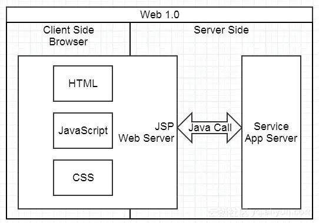
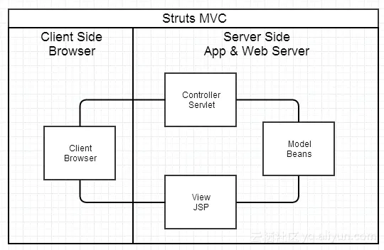
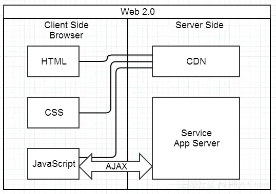
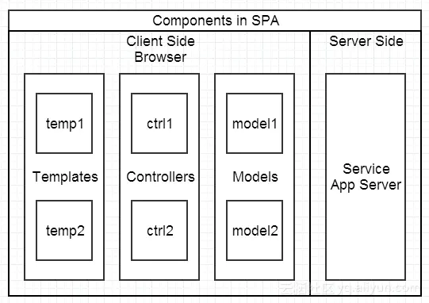
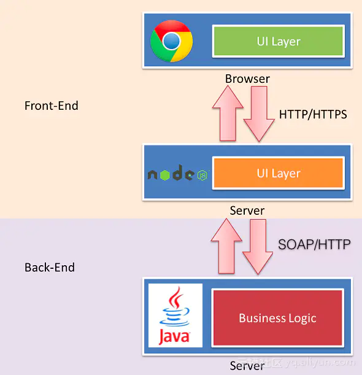
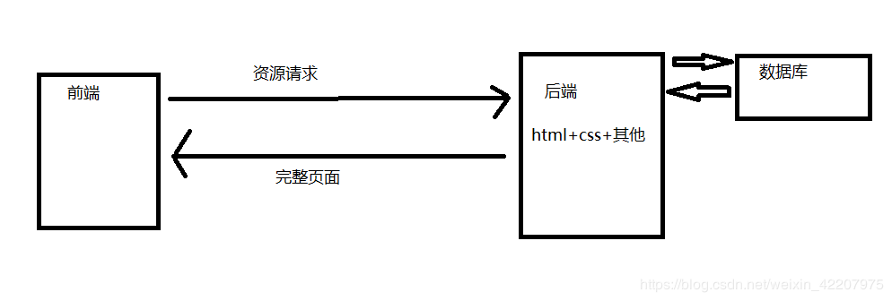
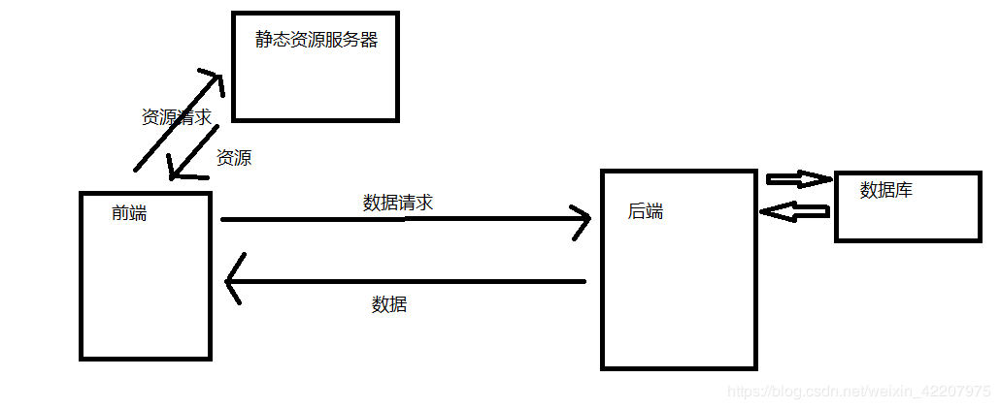
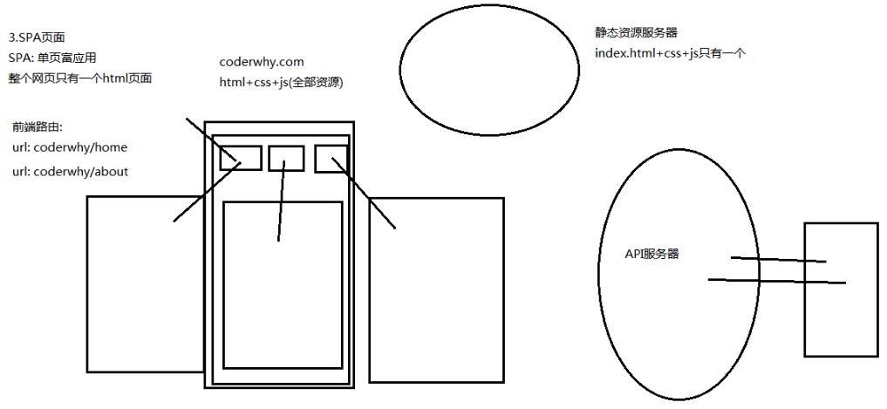

# 前端工程化


## 什么是工程化？

工程化即系统化、模块化、规范化的一个过程。

工程化解决的问题是，如何提高编码、测试、维护阶段的生产效率，提升前端工程师的开发效率和代码质量。


## 前端发展史

### 1. 简单明快的早期时代

适合小项目，不分前后端，页面由 JSP、PHP 等在服务端生成，浏览器负责展现。

<div align="center">  </div><br>


### 2. 后端为主的 MVC 时代

为了降低复杂度，以后端为出发点，有了 Web Server 层的架构升级，比如 Structs、Spring MVC 等。

<div align="center">  </div><br>
**前两个阶段存在的问题**

1. 前端开发重度依赖开发环境。
2. 前后端职责依旧纠缠不清，可维护性越来越差。


### 3. Ajax 带来的 SPA 时代

2005 年 Ajax 正式提出，前端开发进入 SPA（Single Page Application 单页面应用）时代。

<div align="center">  </div><br>

**Ajax 时代面临的挑战**

1. 前后端接口的约定。
2. 前端开发的复杂度控制。SPA应用大多以功能交互型为主，大量 JS 代码的组织，与 View 层的绑定等，都不是容易的事情。


### 4. 前端为主的 MVC、MV* 时代

为了降低前端开发复杂度，Backbone、EmberJS、KnockoutJS、AngularJS、React、Vue 等大量前端框架涌现。

<div align="center">  </div><br>

### 5. Node 带来的全栈时代

随着 Node.js 的兴起，为前端开发带来一种新的开发模式。

业界比较出名的实践是，阿里巴巴的中途岛计划。

<div align="center">  </div><br>

**后两个步骤带来的好处**

1. 前后端职责很清晰。
2. 前端开发的复杂度可控，通过合理的分层，让项目更可维护。
3. 部署相对独立，产品体验可以快速改进。


## **Web 路由**


**什么是路由？**

在计算机网络中，路由（routing）就是通过互联的网络把信息从源地址传输到目的地址的活动。

在 Web 开发过程中，路由就是 URL 到函数的映射，这个函数可以是后端的，也可以是前端的。路由就是在做一个匹配的工作。


在渲染页面方面，前端与后端的关系大概经历了三个主要的阶段：

1. 后端渲染 + 后端路由 
2. 前后端分离 + 前端渲染 
3. 前后端分离 + 前端渲染 + 前端路由

**第一个阶段：后端渲染阶段**

<div align="center">  </div><br>

过程：以 JSP 为例，当用户输入 URL 的时候，前端向后端服务器发起请求，后端会通过一个路由表，找到该 URL 对应的 HTML+CSS 资源，并配合 Java语言动态添加一些元素和数据，从而渲染好一个完整的页面返回给前端。因为渲染工作由后端完成，所以叫做**后端渲染**。

**在后端渲染中，服务器如何处理网站中的这么多页面？**

- 一个页面有自己对应的网址，也就是 URL。
- URL 会发送到服务器，服务器会通过正则对该 URL 进行匹配并且最后交给一个 Controller 进行处理。
- Controller 进行各种处理，最终生成 HTML 或者数据，返回给前端。
- 这就完成了一个 IO 操作。

后端路由的优点：

- 不需要单独加载任何的 JavaScript 和 CSS，可以直接交给浏览器展示。
- 有利于 SEO 的优化。

后端路由的缺点：

- 分工极为不明确。如果页面代码以及后台代码都由后端人员来编写，工作量会很大。但是如果将页面代码分给前端人员编写，前端人员又必须懂得后端技术。
- 前后端代码混在一起不便于后期维护。通常情况下 HTML 代码和数据以及对应的逻辑会混在一起， 编写和维护都是非常糟糕的事情。


**第二个阶段：前后端分离阶段**

<div align="center">  </div><br>

此时交互的角色除了前端与后端服务器，还多了一个静态资源服务器。

- 当用户输入 URL 时，前端会向静态资源服务器请求该 URL 对应的一套 HTML+CSS+JavaScript 资源，请求完成之后由前端渲染。
- 浏览器直接渲染 HTML+CSS，然后执行 JavaScript 代码，代码利用 Ajax 发送网络请求（向后端请求数据）。

- 此时不再需要后端来渲染页面，所以只有在需要数据的时候才会向后端发起请求，然后后端把相应的数据返回给前端。

因为前端只负责页面，后端只负责数据，所以实现了**前后端分离**。因为页面的渲染由前端来完成，所以叫做**前端渲染**。

总结：

- 随着 Ajax 的出现，有了前后端分离的开发模式。
- 后端只提供 API 来返回数据，前端通过 Ajax 获取数据，并且可以通过 JavaScript 将数据渲染到页面中。
- 这样做最大的优点就是前后端责任的清晰，后端专注于数据上，前端专注于交互和可视化上。
- 并且当移动端（iOS/Android）出现后，后端不需要进行任何处理，依然使用之前的一套 API 即可。
- 目前很多的网站依然采用这种模式开发。


**第三个阶段：SPA 单页面富应用阶段**

<div align="center">  </div><br>

SPA：整个网页只有一个 HTML 页面。

SPA 最主要的特点是：在前后端分离的基础上加了一层前端路由（有利于模块化开发）的技术。也就是前端来维护一套路由规则。

- 当用户输入 URL 时，前端不再是每次请求都分别向静态资源服务器请求网站的其中某一个**网页**的资源，而是直接一次（懒加载情况下需多次）请求有且仅有一份的该**网站**的资源，这份资源包含了该网站所有页面渲染时所需要的代码。
- 需要注意的是，前端把这一份包含了所有页面代码的资源请求下来之后，并不会把全部代码都渲染到页面上，而是会通过一个路由表，根据所输入的 URL 来判断该渲染哪一部分到页面上。每一个 URL 都对应一个组件。
- **前端路由**用来管理 URL 和页面的映射。


------

**什么是后端渲染，什么是前端渲染？**

- 后端渲染：渲染工作由后端完成，由服务器来渲染整个 HTML 页面。服务器直接生产渲染好对应的 HTML 页面，返回给客户端进行展示。比如：JSP、PHP等。
- 前端渲染：浏览器中显示的网页中的大部分内容，都是由前端写的 JavaScript 代码在浏览器中执行，最终渲染出来的网页。


**什么是后端路由，什么是前端路由？**

- 后端路由：后端处理 URL 和页面之间的映射关系。

  当页面中需要请求不同的路径内容时，交给服务器来进行处理，服务器渲染好整个页面，并且将页面返回给客户端。

- 前端路由：页面跳转的 URL 规则匹配由前端来控制。


前端路由的优点？

前端路由带来的最明显的好处就是，地址栏URL的跳转不会白屏了——这也得益于前端渲染带来的好处。

**前端路由的核心是什么？**

改变 URL，但是页面不进行整体的刷新。不刷新的好处就是不用从新向服务器发送请求。

**如何实现前端路由？**

前端路由应用最广泛的例子就是当今的 SPA 的 web 项目。目前前端流行的三大框架，都有相应配套的 router 工具。

- Angular 的 ngRouter
- React 的 ReactRouter
- Vue 的 vue-router

有两种方式实现前端路由。

- URL 的 hash：也就是锚点（#），本质上是改变 window.location 的 href 属性，可以通过直接赋值 location.hash 来改变 href，但是页面不发生刷新。

  ```js
  // 执行前的 URL：https://juejin.im/
  
  location.hash = 'home'
  // 执行后的 URL：https://juejin.im/#home
  location.hash = 'about'
  // 执行后的 URL：https://juejin.im/#about
  location.hash = '/aaa'
  // 执行后的 URL：https://juejin.im/#/aaa
  ```

  先清空 Network 面板，然后在 Console 中执行上面的代码，对比此时 Network 面板的变化和刷新页面的变化。

- HTML5 的 history 模式：history 结构是HTML 5 新增的，它有五种模式改变 URL 而不刷新。

  - history.pushState()，类似栈结构，先进后出。

  ```
  history.pushState(data,title,?url)
  ```

  例子：

  ```js
  // 执行前的 URL：https://juejin.im/
  
  history.pushState({},'','home')
  // 执行后的 URL：https://juejin.im/home
  history.pushState({},'','about')
  // 执行后的 URL：https://juejin.im/about
  history.pushState({},'','/aaa')
  // 执行后的 URL：https://juejin.im/aaa
  history.back()
  // 执行后的 URL：https://juejin.im/about
  ```

  - history.replaceStare()，类似 pushState，但是没有后退按钮，replace “替换”。
  - history.go(number)，
  - history.back()，等价于 history.go(-1) 。
  - history.forward()，等价于 history.go(1)。go、back、forward 等同于浏览器界面的前进后退。


## 为什么需要工程化？

- 提升开发效率
  - webpack-dev-server 热加载

  - 数据 mock

- 优化性能
  - 代码合并压缩，混淆加密
  - 减少小图片请求
  - 减少图片请求量
  - 部署静态文件缓存管理
- 提高代码质量（代码的可靠性，可维护性，可拓展性
  - 模块化

  - CSS 预处理
  - ES6 + babel 编译

  - eslint 代码检查

  - 单元测试

  - UI 自动化测试

  - web组件化


## 前端工程化要解决什么？

### 1. 规范

制定各项规范，让工作有章可循

- 统一团队成员的编码规范，便于团队协作和代码维护
  - 目录结构，文件命名规范
  - 编码规范：eslint, stylelint

- 开发流程的规范
  - 使用敏捷，增强开发进度管理和控制
  - 应对各项风险，需求变更等
  - code review 机制
  - UAT 提升发布的需求的质量

- 前后端接口规范，其他文档规范

### 2. 版本管理

使用版本控制工具，高效安全的管理源代码

- 使用 git 版本控制工具
- Git 分支管理
- Commit 描述规范，例如：task-number + task 描述
- 创建 merge request，code review 完毕之后方可合并代码

### 3. 前端技术和框架

使用合适的前端技术和框架，提高生产效率，降低维护难度

**目标：** 职责分离、降低耦合，增强代码的可读性、维护性和测试性。

1. 采用模块化的方式组织代码
   - JS 模块化：AMD、CommonJS、UMD、ES6 Module
   - CSS 模块化：less、sass、stylus、postCSS、css module
2. 采用组件化的编程思想，处理 UI 层
   - react、vue、angular
3. 将数据层分离管理
   - redux、mbox
4. 使用面向对象或者函数编程的方式组织架构


### 4. 测试

提高代码的可测试性，引入单元测试，提高代码质量

### 5. 自动化工具

通过使用各种自动化的工程工具，提升整个开发、部署效率


## 前端模块化


模块化开发其实就是将功能相关的代码封装在一起，方便维护和重用。另外，模块之间通过 API 进行通信。

- 高内聚低耦合，有利于团队开发。当项目很复杂时，将项目划分为子模块并分给不同的人开发，最后再组合在一起，这样可以降低模块与模块之间的依赖关系，实现低耦合，模块中又有特定功能体现高内聚特点。
- 可重用，<u>方便维护</u>。模块的特点就是有特定功能，当两个项目都需要某种功能时，定义一个特定的模块来实现该功能，这样只需要在两个项目中都引入这个模块就能够实现该功能， 不需要书写重复性的代码。另外，当需要变更该功能时， 直接修改该模块，这样就能够修改所有项目的功能，维护起来很方便。模块化有利于管理模块间的依赖，更依赖模块的维护。


前端模块化并不等同于 JavaScript 模块化。

- 在前端开发中，实现一个页面总是需要 JavaScript 、CSS 和 HTML。如果一个功能只有 JavaScript 实现了模块化，而 CSS 和 Template 还处于原始状态，那么这样的模块化方案是不完整的。所以我们真正需要的是一种可以将 JavaScript 、CSS 和 HTML 同时都考虑进去的模块化方案，而非只使用 JavaScript  模块化方案。
- JavaScript 也可以用于后端，比如 Node.js。


- 将功能分离出来。
- 具有更好的代码组织方式。
- 可以按需加载。
- 避免了命名冲突。各个模块的命名空间独立，A 模块的变量 x 不会覆盖 B 模块的变量 x。
- 解决了依赖管理问题。通过模块管理工具（如 webpack 、require.js 等）管理模块的依赖关系。


JavaScript 模块化并不等同于异步模块化。

主流的 JavaScript 模块化方案都使用“异步模块定义”的方式，这种方式给开发带来了极大的不便，所有的同步代码都需要修改为异步方式。当在前端开发中使用“ CommonJS ” 模块化开发规范时，开发者可以使用自然、容易理解的模块定义和调用方式，不需要关注模块是否异步，不需要改变开发者的开发行为。


## Mock 服务

前端 Mock 主要包括以下几种方式：

- 数据拦截型
- json-server 服务型
- 可视化接口管理平台


## 前端规范

随着前端工程化的日益成熟，代码规范化对于开发效率的提升起着很大的作用，包括后期的维护，统一的规范能节省交接的时间成本，而规范包括目录结构、代码质量（命名、注释、JS 规范、CSS 规范、缩进等）

### 目录结构

> 根据业务模型来规范项目的src目录

```
静态资源目录: assets
本地数据模拟目录: mocks
公共函数方法目录: utils 
单元测试目录: test
常量目录: consts
icon目录: icons
公共混合函数目录: mixin
路由目录: router
组件目录: components
页面目录： views
配置目录： config
服务api接口管理目录： api
vuex 状态管路目录： store
.env*: 项目中我们通常会使用环境变量来影响应用在不同运行环境下的行为. 从文件中读取环境变量
```

### 语法约束

- 组件化命名规则

1. 按照功能命名：比如头部就是 Header,就是头部导航栏
2. 按照页面来分组件：比如文章列表 NewsItem，即可用于文章列表，也可以用在详情页的内容推荐

```
1.组件的文件名始终是单词大写开头 如：(PascalCase)
2.在声明 prop 的时候，其命名应该始终使用 驼峰命名法
3.组件名应该是完整单词而不是缩写
```

- vue 规范

```
1.总是用 key 配合 v-for
2.不要把 v-if 和 v-for 同时用在同一个元素上。
3.Object.freeze 方法来冻结一个不会有任何改变的对象，减少组件初始化的时间
4.每个组件 export default {} 内的方法顺序一致，方便查找对应的方法。
按照 data、props、钩子、watch、computed、components
5.props里加数据类型，是否必传，以及默认值，便于排查错误，让传值更严谨
6.使用定时器，要在beforeDestroy()生命周期内清除定时器
```

- css 命名

> 随着项目模块增多，防止因为不同页面或者组件中定义的css冲突，所以规范css语法也变得至关重要，推荐:BEM，分别代表着:Block(块)、Element(元素)、Modifier(修饰符)

```
.user-info {} # user-info 是一个块，我理解是一个模块
.user-info--feature {} # user-info--feature 是一个修饰符，用来表示这个块的不同状态
.user-info__title{} # user-info__title 是一个元素，属于userinfo模块下的，多个元素组成块
```

### 开发工具规范

- eslint

> 一个插件化的 javascript 代码检测工具，它可以用于检查常见的 JavaScript 代码错误，也可以进行代码风格检查

推荐使用到两个扩展包（airbnb规范[官方文档链接  🚀](https://github.com/airbnb/javascript) & eslint-plugin-vue[ 官方文档链接🚀](https://user-gold-cdn.xitu.io/2020/2/25/1707b12c09353052)）

- Prettier

> 是格式化代码工具。用来保持团队的项目风格统一

- stylelint

> stylelint是的css代码审查工具供，用来约束css的书写规范，增强代码可读性，[官方文档](https://stylelint.io/🚀)


### Git commit 规范

> commit 规范可以更好的形成清晰的提交记录（changelog），通过制定 相应的 Commit Message 规范来约束开发人员根据不同的提交添加备注，常用的类别如下

- 约束定义

```
feature: 开发新的功能
fix: 修复bug
refactor: 代码重构
docs: 文档修改
style: 代码格式修改, 注意不是 css 修改
test: 测试用例修改
perf: 改善性能
build: 变更项目构建或外部依赖（例如scopes: webpack、gulp、npm等）
revert: 代码回退

比如：
git commit -m 'fix：修复某某bug'
复制代码
```

除了上面简单的规范，还可以通过集成Commitlint配置，下一节教你如何上手，感兴趣的童鞋可以查看更多官方文档信息[点我👈]([http://github.com/conventional-changelog/commitlint),

- 自动化检测

> 那如何在vue-cli上配置呢？这个时候就需要用到 Git Hook vue-cli3x的官方配置支持看这里 [点我👈]([https://cli.vuejs.org/zh/guide/cli-service.html#git-hook) 。他把yorkie（尤大改写）做了封装，yorkie本质上是通过fork husky的基础上做了一些定制化的改动，使得hook钩子能从package.json的 "gitHooks"属性中读取，我们可以通过gitHooks配置结合Commitlint来实现自动化检测commit的提交log，下面是流程图👇


安装commitlint

```
npm install -g @commitlint/cli @commitlint/config-conventional
复制代码
```

创建commitlint配置文件

```
// 新建 commitlint.config.js 
module.exports = {
  extends: ['@commitlint/config-conventional'],
  rules: {
    'type-enum': [
      2,
      'always',
      [
        'feature', // 开发新的功能
        'fix', // 修补bug
        'refactor', // 代码重构
        'docs', // 文档（documentation）
        'style', // 格式（不影响代码运行的变动）
        'test', // 增加测试
        'build', //  变更项目构建或外部依赖（例如: webpack、package等）
        'revert', // 回滚
        'perf', // 改善性能
      ],
    ],
    'type-empty': [2, 'never'], // 提交不符合规范时,也可以提交,但是会有警告
    'subject-empty': [2, 'never'], // 提交不符合规范时,也可以提交,但是会有警告
    'subject-full-stop': [0, 'never'],
    'subject-case': [0, 'never'],
  },
};

复制代码
```

配置gitHooks

```
// package.json
"gitHooks": {
    "pre-commit": "lint-staged",
    "commit-msg": "commitlint -E GIT_PARAMS"
  },
  "lint-staged": {
    "*.js": [
      "vue-cli-service lint"
    ],
    "*.vue": [
      "vue-cli-service lint"
    ]
  },
复制代码
```

### 文档约束

> 如果团队较小，可以参考一线互联网公司前端规范，统一代码风格、

- [京东凹凸实验室代码规范](https://guide.aotu.io/docs/index.html)
- [clean-code-javascript](https://github.com/ryanmcdermott/clean-code-javascript?utm_source=gold_browser_extension)
- [Airbnb团队](https://github.com/airbnb/javascript)
- [百度fex团队](https://github.com/fex-team/styleguide)


## 增强可测试性

1. 采用tdd的编程思想，引入单元测试
   - karma + mocha + chai、jest、ava
2. 使用各种调试工具
   - web devtools、finddle

## 自动化工程工具的使用

1. 使用前端构建工具
   
   - gulp、grunt、Broccoli
   
2. javascript 编译工具
   
   - Babel、Browserify、Webpack
   
3. 开发辅助工具
   
   - 数据 mock、livereload
   
4. 使用 CI 集成工具
   
   - jenkins、Travis CI
   
5. 使用脚手架工具
   
   脚手架用于快速生成新项目的目录模板，并集成一系列体系化工具的安装，能够提升前端开发人员的效率，减少copy操作
   
   - vue-cli、yeoman、create-app
   
   开发脚手架工具涉及的常用工具库如下：
   
   child_process：用于执行shell命令
   
   commander	：用于处理控制台命令 [🔗使用文档](https://github.com/tj/commander.js)
   
   inquirer：	用于控制台 [🔗使用文档](https://github.com/SBoudrias/Inquirer.js)
   
   semver：	用于版本检测提示 [🔗使用文档](https://github.com/npm/node-semver)
   
   fs-extra：	用于fs操作询问  [🔗使用文档](https://github.com/jprichardson/node-fs-extra)
   
   execa	：用于执行终端命令 [🔗使用文档](https://github.com/sindresorhus/execa)
   
   chalk	：用于五彩斑斓的控制台 [🔗使用文档](https://github.com/chalk/chalk)
   
   


## 项目部署

> 完成项目开发后，上线部署也是工程化一个重要的环节，而对于前端项目而言，部署并不是一件痛苦的事情

目前大部分SPA只是单纯的静态资源文件，直接打包，然后用nginx做代理就可以完成简单的部署，也可以结合docker和jenkins做自动化部署，持续部署、持续集成。

而对于服务端渲染的前端应用，部署相对而言环节多一些，还需要管理进程、监控服务是否正常等等，就涉及到其他工具的使用，下面是前端工程化项目部署涉及到的几个主流工具如下👇

- jenkins: 一个可扩展的自动化服务器，可以用作简单的 CI 服务器，具有自动化构建、测试和部署等功能
- docker: 虚拟环境容器,可以将环境、代码、配置文件等一并打包到这个容器中,最后发布应用
- npm : Node.js 官方提供的包管理工具，主要用来管理项目依赖，发布
- nginx: 可以作为 Web 服务器，也可以作为负载均衡服务器，具备高性能、高并发连接
- pm2: node进程管理工具，可以利用它来简化很多node应用管中繁琐任务

更多使用请阅读树酱的[《前端运维部署那些事》](https://juejin.im/post/5e88904bf265da47f517837c)


# 参考资料

- [浅谈前端架构的工程化、模块化、组件化、规范化 - 慕课网手记](http://www.imooc.com/article/48008)
- [前端工程化概述 - 掘金（阿里云栖号）](https://juejin.im/post/5ac9c6f451882555677ed301#heading-11)
- [我对前端工程化的理解 - 掘金](https://juejin.im/post/58ac334e8d6d810058c103e0#heading-4)
- [前端工程化/构建自动化 - segmentfault](https://segmentfault.com/a/1190000011095783)
- [前端工程化那些事 - 掘金](https://juejin.im/post/5e999cecf265da47cd357a24#heading-17)
- [关于前端工程化的一些思考 - 知乎专栏](https://zhuanlan.zhihu.com/p/42433919)
- [Vuejs教程 前端渲染、后端渲染（P100） - B站（coderwhy）](https://www.bilibili.com/video/BV15741177Eh?p=100)
- [前端路由和后端路由，前端渲染和后端渲染 - 慕课网手记](https://www.imooc.com/article/75144)
- [简单理解 后端渲染/后端路由/前后端分离/前端渲染/前端路由 - CSDN](https://blog.csdn.net/weixin_42207975/article/details/106967494)
- [理解Web路由（浅谈前后端路由与前后端渲染）](https://www.cnblogs.com/gopark/p/11457988.html)
- [通过前端的发展对于前后端分离、前后端渲染、前后端路由的理解](https://blog.csdn.net/qq_39773416/article/details/101791080)

