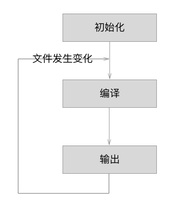
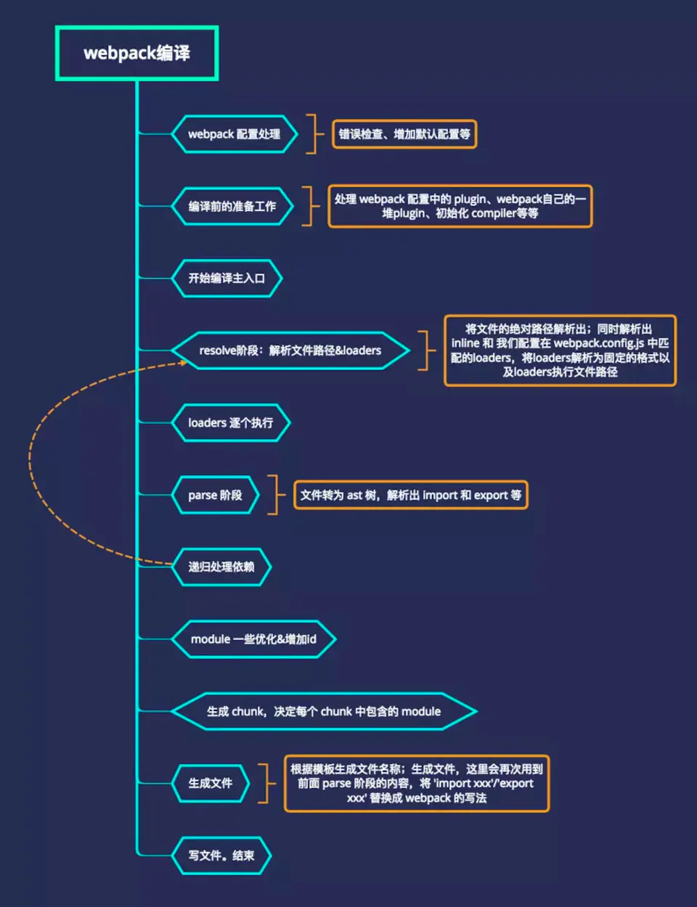

# webpack

关于 webpack 的介绍在 [前端工程化 - 构建工具.md]() 中。

## 安装

**前提条件**

webpack 为了可以正常运行，必须依赖于 Node 环境。

开始前，确保安装了 [Node.js](https://nodejs.org/en/) 的最新的长期支持版本（LTS，Long Term Support）。使用旧版本可能遇到各种问题。


**本地安装**（局部安装）

安装最新版本或特定版本，运行以下命令之一：

```bash
npm install --save-dev webpack
npm install --save-dev webpack@<version>
```

`--save-dev` 告诉项目说明书在开发的时候使用 webpack。项目发布后，不需要执行 webpack 命令。

使用 webpack 4+ 版本，还需要安装 CLI。

```bash
npm install --save-dev webpack-cli
```

建议本地安装，在引入破坏式变更（breaking change）的依赖时，更容易分别升级项目。通常，webpack 通过运行一个或多个 [npm scripts](https://docs.npmjs.com/misc/scripts)，会在本地 `node_modules` 目录中查找安装的 webpack：

```json
"scripts": {
    "start": "webpack --config webpack.config.js"
}
```


**全局安装**

使 `webpack` 在全局环境下可用：

```bash
npm install --global webpack
```

或者

```bash
npm install -g webpack@<version>
```

不推荐全局安装。这会将项目中的 webpack 锁定到指定版本，并且在使用不同的 webpack 版本的项目中，可能会导致构建失败。

- 在终端直接执行 webpack 命令，使用的全局安装的 webpack
-  当在 package.json中定义了 scripts 时，其中包含了webpack 命令，那么使用的是局部 webpack。


**最新体验版本**

直接从 webpack 的仓库中安装最新版本：

```bash
npm install webpack@beta
npm install webpack/webpack#<tagname/branchname>
```

最新体验版本可能仍然包含 bug，因此不应该用于生产环境。


**验证是否安装成功**

```bash
webpack --version
```


## 概念

- Entry：入口，Webpack 执行构建的第一步将从 Entry 开始，可抽象成输入。
- Module：模块，在 Webpack 里一切皆模块，一个模块对应着一个文件。 Webpack 会从配置的 Entry 开始递归找出所有依赖的模块。
- Chunk：代码块，一个 Chunk 由多个模块组合而成，用于代码合并与分割。
- Loader：模块转换器，用于把模块原内容按照需求转换成新内容。
- Plugin：扩展插件，在 Webpack 构建流程中的特定时机会广播出对应的事件，插件可以监听这些事件的发生，在特定时机做对应的事情。
- Mode：模式，设置 `mode` 参数，可以启用相应模式下的 webpack 内置的优化。模式有 `development` 和 `production`。


## entry

**入口起点（entry point）**指示 webpack 应该使用哪个模块来作为构建其内部*依赖图*的开始。进入入口起点后，webpack 会找出有哪些模块和库是入口起点（直接和间接）依赖的。

可以通过在配置文件中配置 `entry` 属性，来指定一个入口起点（或多个入口起点）。默认值为 `./src`。 


**单个入口语法**

用法：`entry: string|Array<string>`

```javascript
const config = {
  entry: './path/to/my/entry/file.js'
};
module.exports = config;
```


**绝对路径**

`__dirname` 表示当前文件所在目录，与后面的参数形成绝对目录。

```js
const path = require('path');
const config = {
  entry: path.join(__dirname, 'src/index.js'),
};
```


**对象语法**

用法：`entry: {[entryChunkName: string]: string|Array<string>}`

对象语法比较繁琐。然而，这是应用程序中定义入口的最可扩展的方式。

**分离应用程序(app)和第三方库(vendor)入口**：

```javascript
const config = {
  entry: {
    app: './src/app.js',
    vendors: './src/vendors.js'
  }
};
```

**多页面应用程序**：

```javascript
const config = {
  entry: {
    pageOne: './src/pageOne/index.js',
    pageTwo: './src/pageTwo/index.js',
    pageThree: './src/pageThree/index.js'
  }
};
```


## output

**output** 属性告诉 webpack 在哪里输出它所创建的 *bundles* 以及如何命名这些文件，默认值为 `./dist`。

配置 `output` 选项可以控制 webpack 如何向硬盘写入编译文件。在 webpack 中配置 `output` 属性的最低要求是，将它的值设置为一个对象，包括以下两点：

- `filename` 用于输出文件的文件名。
- 目标输出目录 `path` 的绝对路径。

```js
output: {
    filename: 'bundle.[hash:8].js',
    path: path.join(__dirname, 'dist'),
},
```


### 多个入口起点

注意，即使可以存在多个入口起点，但只指定一个输出配置。

如果配置创建了多个单独的 "chunk"（例如，使用多个入口起点或使用像 CommonsChunkPlugin 这样的插件），则应该使用[占位符（substitutions）](https://www.webpackjs.com/configuration/output#output-filename)来确保每个文件具有唯一的名称。

```javascript
{
  entry: {
    app: './src/app.js',
    search: './src/search.js'
  },
  output: {
    filename: '[name].js',
    path: __dirname + '/dist'
  }
}

// 写入到硬盘：./dist/app.js, ./dist/search.js
```

### 高级进阶

以下是使用 CDN 和资源 hash 的复杂示例：

```javascript
output: {
  path: "/home/proj/cdn/assets/[hash]",
  publicPath: "http://cdn.example.com/assets/[hash]/"
}
```

### output.publicPath


对于按需加载或加载外部资源（如图片、文件等）来说，output.publicPath 是很重要的选项。如果指定了一个错误的值，则在加载这些资源时会收到 404 错误。

此选项指定在浏览器中所引用的「此输出目录对应的**公开 URL**」。

- 相对 URL 会被相对于 HTML 页面（或 `<base>` 标签）解析。
- 相对于服务的 URL(Server-relative URL)，相对于协议的 URL(protocol-relative URL) 或绝对 URL(absolute URL) 也是可能用到的，或者有时必须用到，例如：当将资源托管到 CDN 时。

该选项的值是以 runtime(运行时) 或 loader(载入时) 所创建的每个 URL 为前缀。因此，在多数情况下，**此选项的值都会以 `/` 结束**。

默认值是一个空字符串 `""`。

```js
publicPath: "https://cdn.example.com/assets/", 	// CDN（总是 HTTPS 协议）
publicPath: "//cdn.example.com/assets/", 		// CDN (协议相同)
publicPath: "/assets/", 					// 相对于服务(server-relative)
publicPath: "assets/", 						// 相对于 HTML 页面
publicPath: "../assets/", 					// 相对于 HTML 页面
publicPath: "", 							// 相对于 HTML 页面（目录相同）
```


## 模式

| 选项        | 描述                                                         |
| ----------- | ------------------------------------------------------------ |
| development | 会将 `process.env.NODE_ENV` 的值设为 `development`。启用 `NamedChunksPlugin` 和 `NamedModulesPlugin`。 |
| production  | 会将 `process.env.NODE_ENV` 的值设为 `production`。启用 `FlagDependencyUsagePlugin`, `FlagIncludedChunksPlugin`, `ModuleConcatenationPlugin`, `NoEmitOnErrorsPlugin`, `OccurrenceOrderPlugin`, `SideEffectsFlagPlugin` 和 `UglifyJsPlugin`. |


## loader

使用多个loader时，从右往左读。


loader 使用过程：

- 步骤一：通过 npm 安装需要使用的 loader
- 步骤二：在 webpack.config.js 中的 modules 关键字下进行配置


loader 是转译模块源代码的转换规则。 


loader 接受源代码作为参数的函数， 并返回这些转换过的新版本代码。


*loader* 让 webpack 能够去处理那些非 JavaScript 文件（webpack 自身只理解 JavaScript）。loader 可以将所有类型的文件转换为 webpack 能够处理的**有效模块**（应用程序的依赖图和最终的 bundle 可以直接引用的模块），然后就可以利用 webpack 的打包能力，对它们进行处理。

loader 通过（loader）预处理函数，为 JavaScript 生态系统提供了更多能力。 用户可以更加灵活地引入细粒度逻辑，例如压缩、打包、语言翻译等。


常用的 loader。

**文件**

- [`raw-loader`](https://www.webpackjs.com/loaders/raw-loader) 加载文件原始内容（utf-8）
- [`val-loader`](https://www.webpackjs.com/loaders/val-loader) 将代码作为模块执行，并将 exports 转为 JS 代码
- [`url-loader`](https://www.webpackjs.com/loaders/url-loader) 与 file-loader 类似，区别是用户可以设置一个阈值，大于阈值会交给 file-loader 处理；小于阈值时返回 [data URL](https://tools.ietf.org/html/rfc2397)（文件 base64 形式编码 (处理图片和字体)）
- [`file-loader`](https://www.webpackjs.com/loaders/file-loader) 将文件发送到输出文件夹，并返回（相对）URL。在代码中通过相对 URL， 去引用输出的文件 (处理图片和字体)

**JSON**

- [`json-loader`](https://www.webpackjs.com/loaders/json-loader) 加载 [JSON](http://json.org/) 文件（默认包含）
- [`json5-loader`](https://www.webpackjs.com/loaders/json5-loader) 加载和转译 [JSON 5](https://json5.org/) 文件
- `cson-loader` 加载和转译 [CSON](https://github.com/bevry/cson#what-is-cson) 文件

**转换编译(Transpiling)**

- [`script-loader`](https://www.webpackjs.com/loaders/script-loader) 在全局上下文中执行一次 JavaScript 文件（如在 script 标签），不需要解析
- [`babel-loader`](https://www.webpackjs.com/loaders/babel-loader) 加载 ES2015+ 代码，然后使用 [Babel](https://babeljs.io/) 转译为 ES5
- `buble-loader` 使用 [Bublé](https://buble.surge.sh/guide/) 加载 ES2015+ 代码，并且将代码转译为 ES5
- `traceur-loader` 加载 ES2015+ 代码，然后使用 [Traceur](https://github.com/google/traceur-compiler#readme) 转译为 ES5
- [`ts-loader`](https://github.com/TypeStrong/ts-loader) 像 JavaScript 一样加载 [TypeScript](https://www.typescriptlang.org/) 2.0+，将 TypeScript 转换成 JavaScript。
-  [`awesome-typescript-loader`](https://github.com/s-panferov/awesome-typescript-loader) 将 TypeScript 转换成 JavaScript，性能优于 ts-loader。
- [`coffee-loader`](https://www.webpackjs.com/loaders/coffee-loader) 像 JavaScript 一样加载 [CoffeeScript](http://coffeescript.org/)

**模板(Templating)**

- [`html-loader`](https://www.webpackjs.com/loaders/html-loader) 导出 HTML 为字符串，需要引用静态资源
- `pug-loader` 加载 Pug 模板并返回一个函数
- `jade-loader` 加载 Jade 模板并返回一个函数
- `markdown-loader` 将 Markdown 转译为 HTML
- [`react-markdown-loader`](https://github.com/javiercf/react-markdown-loader) 使用 markdown-parse parser(解析器) 将 Markdown 编译为 React 组件
- `posthtml-loader` 使用 [PostHTML](https://github.com/posthtml/posthtml) 加载并转换 HTML 文件
- `handlebars-loader` 将 Handlebars 转移为 HTML， 将 Handlebars 模版编译成函数并返回。
- [`markup-inline-loader`](https://github.com/asnowwolf/markup-inline-loader) 将内联的 SVG/MathML 文件转换为 HTML。在应用于图标字体，或将 CSS 动画应用于 SVG 时非常有用。

**样式**

- [`style-loader`](https://www.webpackjs.com/loaders/style-loader) 将模块的导出作为样式添加到 DOM 中，把 CSS 代码注入到 JavaScript 中，通过 DOM 操作去加载 CSS。
- **`css-loader`** 解析 CSS 文件后，使用 import 加载，并且返回 CSS 代码。支持模块化、压缩、文件导入等特性。
- [`less-loader`](https://www.webpackjs.com/loaders/less-loader) 加载和转译 LESS 文件
- [`sass-loader`](https://www.webpackjs.com/loaders/sass-loader) 加载和转译 SASS/SCSS 文件，将 SCSS/SASS 代码转换成 CSS。
- [`postcss-loader`](https://www.webpackjs.com/loaders/postcss-loader) 使用 [PostCSS](http://postcss.org/) 加载和转译 CSS/SSS 文件。扩展 CSS 语法，使用下一代 CSS，可以配合 autoprefixer 插件自动补齐 CSS3 前缀。
- `stylus-loader` 加载和转译 Stylus 文件

**清理和测试(Linting && Testing)**

- [`mocha-loader`](https://www.webpackjs.com/loaders/mocha-loader) 使用 [mocha](https://mochajs.org/) 测试（浏览器/NodeJS）
- [`eslint-loader`](https://github.com/webpack-contrib/eslint-loader) PreLoader，使用 [ESLint](https://eslint.org/) 清理代码，通过 ESLint 检查 JavaScript 代码。
- [`jshint-loader`](https://www.webpackjs.com/loaders/jshint-loader) PreLoader，使用 [JSHint](http://jshint.com/about/) 清理代码
- `jscs-loader` PreLoader，使用 [JSCS](http://jscs.info/) 检查代码样式
- [`coverjs-loader`](https://www.webpackjs.com/loaders/coverjs-loader) PreLoader，使用 [CoverJS](https://github.com/arian/CoverJS) 确定测试覆盖率。

**框架(Frameworks)**

- **`vue-loader`** 加载和转译 [Vue 组件](https://vuejs.org/v2/guide/components.html)，加载 Vue.js 单文件组件。
- `polymer-loader` 使用选择预处理器(preprocessor)处理，并且 `require()` 类似一等模块(first-class)的 Web 组件
- `angular2-template-loader` 加载和转译 [Angular](https://angular.io/) 组件

**其它**

- `cache-loader`: 可以在一些性能开销较大的 Loader 之前添加，目的是将结果缓存到磁盘里

- `i18n-loader`: 国际化

- `image-loader`：加载并且压缩图片文件

- `source-map-loader`：加载额外的 Source Map 文件，以方便断点调试
- `svg-inline-loader`：将压缩后的 SVG 内容注入代码中
- `tslint-loader`：通过 TSLint检查 TypeScript 代码


### 样式相关的 loader

#### css-loader/style-loader


#### style-loader/less


### url-loader/file-loader


### babel-loader 


**安装**

> webpack 3.x | babel-loader 8.x | babel 7.x

```bash
npm install babel-loader@8.0.0-beta.0 @babel/core @babel/preset-env webpack
```

> webpack 3.x babel-loader 7.x | babel 6.x

```bash
npm install babel-loader babel-core babel-preset-env webpack
```

- 如果之前安装过 webpack，上面的命令要去掉后面的 webpack。


实际安装

```bash
npm install --save-dev babel-loader@7 babel-core babel-preset-es2015 
```


**用法**

在 webpack 配置对象中，需要添加 babel-loader 到 module 的 loaders 列表中，像下面这样：

```javascript
module: {
  rules: [
    {
      test: /\.js$/,
      exclude: /(node_modules|bower_components)/,
      use: {
        loader: 'babel-loader',
        options: {
          presets: ['@babel/preset-env'],
          plugins: [require('@babel/plugin-transform-object-rest-spread')]
        }
      }
    }
  ]
}
```


### webpack 中配置 Vue

vue-loader


### 编写 Loader

在应用程序中，有三种使用 loader 的方式：

- [配置](https://www.webpackjs.com/concepts/loaders/#configuration)（推荐）：在 **webpack.config.js** 文件中，`module.rules` 允许指定多个 loader。代码简洁，*并且可以在出错时，更快地调试和定位 loader 中的问题。*

  - `test` 属性，用于标识出应该被对应的 loader 进行转换的某个或某些文件。
  - `use` 属性，表示进行转换时，应该使用哪个 loader。

- [内联](https://www.webpackjs.com/concepts/loaders/#inline)：在 `import` 语句或任何等效于 "import" 的方式中显示指定 loader。使用 `!` 将资源中的 loader 分开，分开的每个部分都相对于当前目录解析，选项可以传递查询参数。

  ```css
  import Styles from 'style-loader!css-loader?modules!./styles.css';
  ```

- [CLI](https://www.webpackjs.com/concepts/loaders/#cli)：在 shell 命令中指定它们。

  对 `.jade` 文件使用 `jade-loader`，对 `.css` 文件使用 `style-loader` 和 `css-loader`：

  ```js
  webpack --module-bind jade-loader --module-bind 'css=style-loader!css-loader'
  ```


loader 特性

- loader 支持链式传递。能够对资源使用流水线(pipeline)。一组链式的 loader 将按照相反的顺序执行。loader 链中的第一个 loader 返回值给下一个 loader。在最后一个 loader，返回 webpack 所预期的 JavaScript。
- loader 可以是同步的，也可以是异步的。
- loader 运行在 Node.js 中，并且能够执行任何可能的操作。
- loader 接收查询参数。用于对 loader 传递配置。
- loader 也能够使用 `options` 对象进行配置。
- 除了使用 `package.json` 常见的 `main` 属性，还可以将普通的 npm 模块导出为 loader，做法是在 `package.json` 里定义一个 `loader` 字段。
- 插件(plugin)可以为 loader 带来更多特性。
- loader 能够产生额外的任意文件。


loader **总是**从右到左地被调用。在实际（从右到左）执行 loader 之前，会先**从左到右**调用 loader 上的 `pitch` 方法。对于以下 [`use`](https://www.webpackjs.com/configuration/module#rule-use) 配置：

```js
use: [
  'a-loader',
  'b-loader',
  'c-loader'
]
```

将会发生这些步骤：

```
|- a-loader `pitch`
  |- b-loader `pitch`
    |- c-loader `pitch`
      |- requested module is picked up as a dependency
    |- c-loader normal execution
  |- b-loader normal execution
|- a-loader normal execution
```


- Loader 支持链式调用，所以开发上需要严格遵循“单一职责”，每个 Loader 只负责自己需要负责的事情。


- Loader 运行在 Node.js 中，我们可以调用任意 Node.js 自带的 API 或者安装第三方模块进行调用
- Webpack 传给 Loader 的原内容都是 UTF-8 格式编码的字符串，当某些场景下 Loader 处理二进制文件时，需要通过 exports.raw = true 告诉 Webpack 该 Loader 是否需要二进制数据
- 尽可能的异步化 Loader，如果计算量很小，同步也可以
- Loader 是无状态的，我们不应该在 Loader 中保留状态
- 使用 loader-utils 和 schema-utils 为我们提供的实用工具
- 加载本地 Loader 方法
  - Npm link
  - ResolveLoader


## plugins

plugin 是插件的意思，通常是用于对某个现有的架构进行扩展。

webpack中的插件，就是对 webpack 现有功能的各种扩展，比如打包优化，文件压缩等等。


插件目的在于解决 loader 无法实现的**其他事**。插件可以用于执行范围更广的任务。插件的范围包括，从打包优化和压缩，一直到重新定义环境中的变量。

webpack 在运行的生命周期中会广播出特定的事件，Plugin 可以监听这些事件，在监听到感兴趣的事件后会执行特定的逻辑，可以调用 Webpack 提供的 API 改变 Webpack 的运行结果（在特定的阶段钩入想要添加的自定义功能）。Webpack 的 Tapable 事件流机制保证了插件的有序性，使得整个系统扩展性良好。


plugins 和 loader 有什么区别？

- 本质
  - `Loader` 本质就是一个函数，在该函数中对接收到的内容进行转换，返回转换后的结果。因为 Webpack 只认识 JavaScript，所以 Loader 就成了翻译官，对其他类型的资源进行转译的预处理工作。
  - `Plugin` （插件）基于事件流框架 `Tapable`，可以扩展 Webpack 的功能。
- Loader 转换器，Plugin 扩展器。
  
- 配置
  - `Loader` 在 module.rules 中配置，作为模块的解析规则，类型为数组。每一项都是一个 Object，内部包含了 test、loader、options 等属性。
  - `Plugin` 在 plugins 中单独配置，类型为数组，每一项是一个 Plugin 的实例，参数都通过构造函数传入。


plugin的使用过程：

- 步骤一：通过npm安装需要使用的 plugins(某些 webpack 已经内置的插件不需要安装)
- 步骤二：在 webpack.config.js 中的 plugins 中配置插件。


常用到的插件有哪些？

- `define-plugin`：定义环境变量 (Webpack4 之后指定 mode 会自动配置)
- `ignore-plugin`：忽略部分文件
- html-webpack-plugin：简化 HTML 文件创建 (依赖于 html-loader)
- `web-webpack-plugin`：可方便地为单页应用输出 HTML，比 html-webpack-plugin 好用
- `uglifyjs-webpack-plugin`：不支持 ES6 压缩 (Webpack4 以前)
- `terser-webpack-plugin`: 支持压缩 ES6 (Webpack4)
- `webpack-parallel-uglify-plugin`: 多进程执行代码压缩，提升构建速度
- `mini-css-extract-plugin`: 分离样式文件，CSS 提取为独立文件，支持按需加载 (替代extract-text-webpack-plugin)
- `serviceworker-webpack-plugin`：为网页应用增加离线缓存功能
- `clean-webpack-plugin`: 目录清理
- `ModuleConcatenationPlugin`: 开启 Scope Hoisting
- `speed-measure-webpack-plugin`: 可以看到每个 Loader 和 Plugin 执行耗时 (整个打包耗时、每个 Plugin 和 Loader 耗时)
- `webpack-bundle-analyzer`: 可视化 Webpack 输出文件的体积 (业务组件、依赖第三方模块)


### BannerPlugin

为打包的文件加上版权声明。


### clean-webpack-plugin


### html-webpack-plugin


在真实发布项目时，发布的是 dist 文件夹中的内容，但是 dist 文件夹中如果没有 index.html 文件，那么打包的 js 等文件也就没有意义了。使用 HtmlWebpackPlugin 插件可以将 index.html 文件打包到 dist 文件夹中。

依据一个简单的 index.html 模板（使用 lodash 模板提供模板，或使用自己的 loader），html-webpack-plugin 生成一个新的 index.html 文件，这个文件**自动引用打包后的 JavaScript 文件**。

简化了 HTML 文件的创建，以便为 webpack 包提供服务。这对于在文件名中包含每次会随着编译而发生变化哈希的 webpack bundle 尤其有用。 


```
npm install --save-dev html-webpack-plugin
```


### uglifyjs-webpack-plugin

ugly 丑化。

对打包的 JavaScript 文件进行压缩。在开发阶段，不建议丑化。

```
npm install uglifyjs-webpack-plugin@1.1.1 --save-dev
```


### 编写 Plugin

使用一个插件，只需要 `require('PluginName')` ，然后把它添加到 `plugins` 数组中。多数插件可以通过选项(option)自定义。也可以在一个配置文件中因为不同目的而多次使用同一个插件，这时需要通过使用 `new` 操作符来创建它的一个实例。


简单描述一下编写Plugin的思路？

- compiler 暴露了和 Webpack 整个生命周期相关的钩子
- compilation 暴露了与模块和依赖有关的粒度更小的事件钩子
- 插件需要在其原型上绑定 apply 方法，才能访问 compiler 实例
- 传给每个插件的 compiler 和 compilation 对象都是同一个引用，若在一个插件中修改了它们身上的属性，会影响后面的插件
- 找出合适的事件点去完成想要的功能
  - emit 事件发生时，可以读取到最终输出的资源、代码块、模块及其依赖，并进行修改(emit 事件是修改 Webpack 输出资源的最后时机)
  - watch-run 当依赖的文件发生变化时会触发
- 异步的事件需要在插件处理完任务时调用回调函数通知 Webpack 进入下一个流程，不然会卡住

## 配置


### devServer

webpack-dev-server（简写为：dev-server，`devServer`） 能够用于快速开发应用程序。

webpack 提供了一个可选的本地开发服务器，这个本地服务器基于 node.js搭建，内部使用 express 框架，可以实现浏览器自动刷新，显示修改后的结果。

```
npm install --save-dev webpack-dev-server
```

devServer 也是 webpack 中的一 个选项，选项本身可以设置如下属性：

- contentBase：为哪一个文件夹提供本地服务，默认是根文件夹
- port：端口号
- inline：页面实时刷新
- historyApiFallback：在 SPA 页面中，依赖 HTML5 的 history 模式


#### `devServer.proxy`

如果有单独的后端开发服务器 API，并且希望在同域名下发送 API 请求 ，那么代理某些 URL 会很有用。

dev-server 使用了非常强大的 [http-proxy-middleware](https://github.com/chimurai/http-proxy-middleware) 包。

在 `localhost:3000` 上有后端服务，可以这样启用代理：

```js
proxy: {
    "/api": "http://localhost:3000"
}
```

请求到 `/api/users` 现在会被代理到请求 `http://localhost:3000/api/users`。

如果不想始终传递 `/api` ，则需要重写路径：

```js
proxy: {
    "/api": {
        target: "http://localhost:3000",
        pathRewrite: {"^/api" : ""}
    }
}
```

默认情况下，不接受运行在 HTTPS 上且使用了无效证书的后端服务器。如果想要接受，修改配置如下：

```js
proxy: {
    "/api": {
        target: "https://other-server.example.com",
        secure: false
    }
}
```

不想代理所有的请求，可以基于一个函数的返回值绕过代理。

在函数中你可以访问请求体、响应体和代理选项。必须返回 `false` 或路径，来跳过代理请求。

例如：对于浏览器请求，想要提供一个 HTML 页面，但是对于 API 请求则保持代理。

```js
proxy: {
  "/api": {
    target: "http://localhost:3000",
    bypass: function(req, res, proxyOptions) {
      if (req.headers.accept.indexOf("html") !== -1) {
        console.log("Skipping proxy for browser request.");
        return "/index.html";
      }
    }
  }
}
```

If you want to proxy multiple, specific paths to the same target, you can use an array of one or more objects with a `context` property:

```js
proxy: [{
  context: ["/auth", "/api"],
  target: "http://localhost:3000",
}]
```


### modules

什么是 webpack 模块

对比 Node.js 模块，webpack *模块*能够以各种方式表达它们的依赖关系，几个例子如下：

- ES2015 `import` 语句
- CommonJS `require()` 语句
- AMD `define` 和 `require` 语句
- css/sass/less 文件中的 `@import` 语句。
- 样式(`url(...)`)或 HTML 文件(``)中的图片链接(image url)


支持的模块类型

webpack 通过 *loader* 可以支持各种语言和预处理器编写模块。 webpack 社区已经为各种流行语言和语言处理器构建了 *loader*，包括：

- [CoffeeScript](http://coffeescript.org/)
- [TypeScript](https://www.typescriptlang.org/)
- [ESNext (Babel)](https://babeljs.io/)
- [Sass](http://sass-lang.com/)
- [Less](http://lesscss.org/)
- [Stylus](http://stylus-lang.com/)


#### `Rule.enforce`

**如何保证各个 loader 按照预想方式工作？**

可以使用 `enforce` 强制执行 `loader` 的作用顺序，`pre` 代表在所有正常 loader 之前执行，`post` 是所有 loader 之后执行。(inline 官方不推荐使用)


## 优化

- 减少打包时间

- 减少打包后的文件体积


### 优化打包时间


**如何优化 Webpack 的构建速度？**

- 使用监听模式或热更新（开发环境）
- 生产环境：代码压缩、目录内容清理、计算文件hash、提取CSS文件
- babel-loader开启缓存
- 使用 CommonsChunkPlugin 提取公共的模块

- 优化 Loader 
- Happypack 
- DllPlugin 
- 代码压缩 


### 优化打包体积

- **配置全局变量**

  通过指定环境，告诉 webpack 我们当前处于 production 环境中，要按照 production 的方式去打包。

- **优化 devtool 中的 source-map**

- **剥离css文件，单独打包**

- 代码压缩

  - **使用 UglifyJSPlugin 压缩**

- **提取公共依赖**

- **开启gzip压缩**

- **开启html压缩，自动添加上面生成的静态资源**

- 去除不必要的插件

- 提取第三方库

- 代码分割

- 设置缓存


- 按需加载 
- Scope Hoisting 
- Tree Shaking 


### 模块热替换（HMR）

`Webpack` 的热更新又称热替换（`Hot Module Replacement`），缩写为 `HMR`。 这个机制可以做到不用刷新浏览器而将新变更的模块替换掉旧的模块。

HMR 的核心就是客户端从服务端拉去更新后的文件，准确的说是 chunk diff (chunk 需要更新的部分)，实际上 WDS 与浏览器之间维护了一个 `Websocket`，当本地资源发生变化时，WDS 会向浏览器推送更新，并带上构建时的 hash，让客户端与上一次资源进行对比。客户端对比出差异后会向 WDS 发起 `Ajax` 请求来获取更改内容(文件列表、hash)，这样客户端就可以再借助这些信息继续向 WDS 发起 `jsonp` 请求获取该chunk的增量更新。

后续的部分(拿到增量更新之后如何处理？哪些状态该保留？哪些又需要更新？)由 `HotModulePlugin` 来完成，提供了相关 API 以供开发者针对自身场景进行处理，像`react-hot-loader` 和 `vue-loader` 都是借助这些 API 实现 HMR。

> 细节请参考[Webpack HMR 原理解析](https://zhuanlan.zhihu.com/p/30669007)


### Scope hoisting


### 代码压缩


### 代码分隔

**代码分割的本质是什么？有什么意义？**

代码分割的本质其实就是在`源代码直接上线`和`打包成唯一脚本main.bundle.js`这两种极端方案之间的一种更适合实际场景的中间状态。

```
阿卡丽：荣耀剑下取，均衡乱中求
```

**「用可接受的服务器性能压力增加来换取更好的用户体验。」**

源代码直接上线：虽然过程可控，但是http请求多，性能开销大。

打包成唯一脚本：一把梭完自己爽，服务器压力小，但是页面空白期长，用户体验不好。


配置文件的分离

- 基本配置文件
- 生产时配置文件
- 开发时配置文件

```
npm install webpack-merge --save-dev
```


### tree shaking


*tree shaking* 是一个术语，通常用于描述移除 JavaScript 上下文中的未引用代码(dead-code)。它依赖于 ES2015 模块系统中的[静态结构特性](http://exploringjs.com/es6/ch_modules.html#static-module-structure)，例如 [`import`](https://developer.mozilla.org/en-US/docs/Web/JavaScript/Reference/Statements/import) 和 [`export`](https://developer.mozilla.org/en-US/docs/Web/JavaScript/Reference/Statements/export)。这个术语和概念实际上是兴起于 ES2015 模块打包工具 [rollup](https://github.com/rollup/rollup)。


为了学会使用 *tree shaking*，你必须……

- 使用 ES2015 模块语法（即 `import` 和 `export`）。
- 在项目 `package.json` 文件中，添加一个 "sideEffects" 入口。
- 引入一个能够删除未引用代码(dead code)的压缩工具(minifier)（例如 `UglifyJSPlugin`）。

你可以将应用程序想象成一棵树。绿色表示实际用到的源码和 library，是树上活的树叶。灰色表示无用的代码，是秋天树上枯萎的树叶。为了除去死去的树叶，你必须摇动这棵树，使它们落下。


### source-map

`source map` 是将编译、打包、压缩后的代码映射回源代码的过程。打包压缩后的代码不具备良好的可读性，想要调试源码就需要 soucre map。

map文件只要不打开开发者工具，浏览器是不会加载的。

线上环境一般有三种处理方案：

- `hidden-source-map`：借助第三方错误监控平台 Sentry 使用
- `nosources-source-map`：只会显示具体行数以及查看源代码的错误栈。安全性比 sourcemap 高
- `sourcemap`：通过 nginx 设置将 .map 文件只对白名单开放(公司内网)

注意：避免在生产中使用 `inline-` 和 `eval-`，因为它们会增加 bundle 体积大小，并降低整体性能。


### 配置文件的分离


## 原理


Webpack 实际上为每个模块创造了一个可以导出和导入的环境，本质上并没有修改 代码的执行逻辑，代码执行顺序与模块加载顺序也完全一致。


### 工作流程

WebPack 的工作方式是什么？

把项目当作一个整体， WebPack 将从入口文件开始找到项目的所有依赖，并使用 loader 来处理它们，最后打包为一个浏览器可识别的 JavaScript 文件。

说说 WebPack 打包的流程。

- 通过 entry 配置入口文件。
- 通过 output 指定输出的文件。
- 使用各种 loader 处理 CSS 、JavaScript 、image 等资源，并将它们编译与打包成浏览器可以解析的内容等。


Webpack 的运行流程是一个串行的过程，从启动到结束会依次执行以下流程：

- 1）初始化参数：解析 webpack 配置参数，合并 shell 传入和 webpack.config.js 文件配置的参数，形成最后的配置结果。

  每次在命令行输入 webpack 后，操作系统都会去调用 `./node_modules/.bin/webpack` （shell 脚本）。这个脚本会去调用 `./node_modules/webpack/bin/webpack.js` （webpack 的启动文件）并追加输入的参数，如 -p , -w 。

- 2）开始编译：用上一步得到的参数初始化 compiler 对象，注册/加载所有配置的插件，插件监听 webpack 构建生命周期的事件节点，做出相应的反应，执行对象的 run 方法开始执行编译。

- 3）确定入口：根据配置中的 entry 找出所有的入口文件。~~开始解析文件构建 AST 语法树，找出依赖，递归下去~~。

- 4）编译模块：从入口文件出发，调用所有配置的 Loader 对模块进行翻译，再找出该模块依赖的模块，再递归本步骤直到所有入口依赖的文件都经过了本步骤的处理。

- 5）完成模块编译：在经过第 4 步使用 Loader 翻译完所有模块后，得到了每个模块被翻译后的最终内容以及它们之间的依赖关系；

- 6）输出资源：根据入口和模块之间的依赖关系，组装成一个个包含多个模块的 Chunk，再把每个 Chunk 转换成一个单独的文件加入到输出列表，这步是可以修改输出内容的最后机会；

- 7）输出完成：输出所有的 chunk 到文件系统。在确定好输出内容后，根据配置确定输出的路径和文件名，把文件内容写入到文件系统。


Webpack 的构建流程可以分为以下三大阶段：

- 初始化：启动构建，读取与合并配置参数，加载 Plugin，实例化 Compiler。
- 编译：从 Entry 出发，针对每个 Module 串行调用对应的 Loader 去翻译文件内容,再找到该 Module 依赖的 Module，递归地进行编译处理。
- 输出：对编译后的 Module 组合成 Chunk ，把 Chunk 转换成文件，输出到文件系统。

如果只执行一次构建，以上阶段将会按照顺序各执行一次。但在开启监听模式下，流程将变为如下：

<div align="center">  </div><br>

在每个大阶段中会发生很多事件，Webpack 会把这些事件广播出来供给 Plugin 使用。

#### 初始化阶段

| 事件名          | 解释                                                         |
| --------------- | ------------------------------------------------------------ |
| 初始化参数      | 从配置文件和 Shell 语句中读取与合并参数，得出最终的参数。 这个过程中还会执行配置文件中的插件实例化语句 `new Plugin()`。 |
| 实例化 Compiler | 用上一步得到的参数初始化 Compiler 实例，Compiler 负责文件监听和启动编译。Compiler 实例中包含了完整的 Webpack 配置，全局只有一个 Compiler 实例。 |
| 加载插件        | 依次调用插件的 apply 方法，让插件可以监听后续的所有事件节点。同时给插件传入 compiler 实例的引用，以方便插件通过 compiler 调用 Webpack 提供的 API。 |
| environment     | 开始应用 Node.js 风格的文件系统到 compiler 对象，以方便后续的文件寻找和读取。 |
| entry-option    | 读取配置的 Entrys，为每个 Entry 实例化一个对应的 EntryPlugin，为后面该 Entry 的递归解析工作做准备。 |
| after-plugins   | 调用完所有内置的和配置的插件的 apply 方法。                  |
| after-resolvers | 根据配置初始化完 resolver，resolver 负责在文件系统中寻找指定路径的文件。 |

#### 编译阶段

| 事件名        | 解释                                                         |
| ------------- | ------------------------------------------------------------ |
| run           | 启动一次新的编译。                                           |
| watch-run     | 和 run 类似，区别在于它是在监听模式下启动的编译，在这个事件中可以获取到是哪些文件发生了变化导致重新启动一次新的编译。 |
| compile       | 该事件是为了告诉插件一次新的编译将要启动，同时会给插件带上 compiler 对象。 |
| compilation   | 当 Webpack 以开发模式运行时，每当检测到文件变化，一次新的 Compilation 将被创建。一个 Compilation 对象包含了当前的模块资源、编译生成资源、变化的文件等。Compilation 对象也提供了很多事件回调供插件做扩展。 |
| make          | 一个新的 Compilation 创建完毕，即将从 Entry 开始读取文件，根据文件类型和配置的 Loader 对文件进行编译，编译完后再找出该文件依赖的文件，递归的编译和解析。 |
| after-compile | 一次 Compilation 执行完成。                                  |
| invalid       | 当遇到文件不存在、文件编译错误等异常时会触发该事件，该事件不会导致 Webpack 退出。 |

在编译阶段中，最重要的是 compilation 事件，因为在 compilation 阶段调用了 Loader 完成了每个模块的转换操作，在 compilation 阶段又包括很多小的事件，它们分别是：

| 事件名               | 解释                                                         |
| -------------------- | ------------------------------------------------------------ |
| build-module         | 使用对应的 Loader 去转换一个模块。                           |
| normal-module-loader | 在用 Loader 对一个模块转换完后，使用 acorn 解析转换后的内容，输出对应的抽象语法树（AST），以方便 Webpack 后面对代码的分析。 |
| program              | 从配置的入口模块开始，分析其 AST，当遇到 `require` 等导入其它模块语句时，便将其加入到依赖的模块列表，同时对新找出的依赖模块递归分析，最终搞清所有模块的依赖关系。 |
| seal                 | 所有模块及其依赖的模块都通过 Loader 转换完成后，根据依赖关系开始生成 Chunk。 |

#### 输出阶段

| 事件名      | 解释                                                         |
| ----------- | ------------------------------------------------------------ |
| should-emit | 所有需要输出的文件已经生成好，询问插件哪些文件需要输出，哪些不需要。 |
| emit        | 确定好要输出哪些文件后，执行文件输出，可以在这里获取和修改输出内容。 |
| after-emit  | 文件输出完毕。                                               |
| done        | 成功完成一次完成的编译和输出流程。                           |
| failed      | 如果在编译和输出流程中遇到异常导致 Webpack 退出时，就会直接跳转到本步骤，插件可以在本事件中获取到具体的错误原因。 |

在输出阶段已经得到了各个模块经过转换后的结果和其依赖关系，并且把相关模块组合在一起形成一个个 Chunk。 在输出阶段会根据 Chunk 的类型，使用对应的模版生成最终要要输出的文件内容。


<div align="center">  </div><br>


# 参考资料

- [webpack 概念 - 官网](https://www.webpackjs.com/concepts/)
- [webpack 配置 - 官网](https://www.webpackjs.com/configuration/)
- [webpack API - 官网](https://www.webpackjs.com/api/)
- [webpack 指南 - 官网](https://www.webpackjs.com/guides/)
- [webpack Loaders - 官网](https://www.webpackjs.com/loaders/)
- [webpack 插件 - 官网](https://www.webpackjs.com/plugins/)
- [揭秘webpack插件工作流程和原理 - 掘金](https://juejin.im/post/5ec169786fb9a043721b46ad)
- [WebPack 插件机制探索 - 滴滴云博客](https://blog.didiyun.com/index.php/2019/03/01/webpack/)
-  [webpack整体流程图](https://img.alicdn.com/tps/TB1GVGFNXXXXXaTapXXXXXXXXXX-4436-4244.jpg) 
- [细说webpack之流程篇](https://www.cnblogs.com/yxy99/p/5852987.html)
- [webpack原理 - segmentfault](https://segmentfault.com/a/1190000015088834)
- [webpack系列--浅析webpack的原理](https://www.cnblogs.com/chengxs/p/11022842.html)
- [webpack: webpack命令的使用 - 知乎](https://zhuanlan.zhihu.com/p/77302774)
- [Webpack打包构建太慢了？试试几个方法](https://www.cnblogs.com/imwtr/p/7801973.html)
- [webpack打包之后的文件过大的解决方法 - 掘金](https://juejin.im/post/5a9d17446fb9a028d374e733)
- [解决webpack打包文件过大的问题 - CSDN](https://blog.csdn.net/itKingOne/article/details/70145793)

