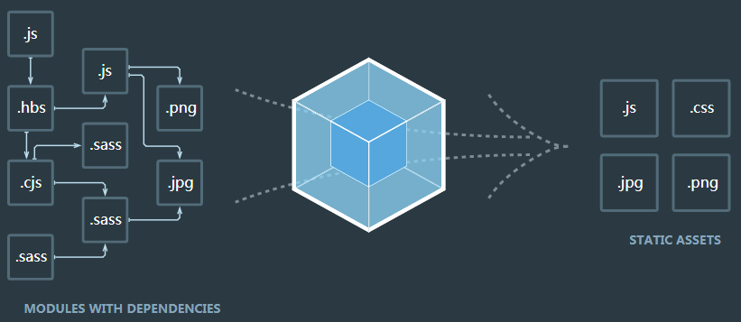

# 简介

## 定义

**什么是构建工具？**

构建工具是一个将源代码生成可执行应用程序的过程自动化的程序。构建过程：编译、连接、把代码打包成可用的或可执行的形式。


**为何要用自动化构建工具？**

对于需要反复重复的任务，例如压缩（minification）、编译、单元测试、linting 等，自动化工具可以减轻你的劳动，简化你的工作。


**构建工具的用途**

- 代码转换：TypeScript 编译成 JavaScript；SCSS 编译成 CSS 等。
- 文件优化：压缩 JavaScript、CSS、HTML 代码，压缩合并图片等。
- 代码分割：提取多个页面的公共代码、提取首屏不需要执行部分的代码让其异步加载。
- 模块合并：在采用模块化的项目里会有很多个模块和文件，需要构建功能把模块分类合并成一个文件。
- 自动刷新：监听本地源代码的变化，自动重新构建、刷新浏览器。
- 代码校验：在代码被提交到仓库前需要校验代码是否符合规范，以及单元测试是否通过。
- 自动发布：更新完代码后，自动构建出线上发布代码并传输给发布系统。


## 构建工具

与前端相关的构建工具

- 任务管理器：npm scripts、**Gulp**、**Grunt**、Broccoli
- 模块打包器：**Webpack**、Rollup、Parcel、Browserify
- 编译工具：Babel


任务管理器 vs 模块打包器/捆绑器

- 任务运行器：用于定义不同的任务，定义它们的调用方式、执行顺序以及它们具有的依赖关系。
- 打包器或捆绑器：基本上执行单个任务：构建/捆绑。可以使用插件告诉他们如何完成工作，但几乎无法控制执行顺序，也无法以任务的方式运行流程的特定子集。


### npm scripts

npm 是在安装 Node.js 时附带的包管理器，npm script 是 npm 内置的一个功能，允许在 package.json 文件里面使用 scripts 字段定义任务。

scripts 字段是一个对象，每个属性对应一段 Shell 脚本。

```
"scripts": {
	"start": "cross-env node build/devServer.js",
	"dev": "cross-env node build/devServer.js",
}
```

### **Grunt**

Grunt 和 npm Script 类似，也是一个任务执行者。Grunt 有大量现成的插件封装了常见的任务，也能管理任务之间的依赖关系，自动化执行依赖的任务，每个任务的具体执行代码和依赖关系写在配置文件 `Gruntfile.js` 里。

- 优点：灵活，只负责执行用户定义的任务；大量的可复用插件封装好了常见的构建任务。
- 缺点：集成度不高，配置复杂，无法做到开箱即用。


Grunt 生态系统非常庞大，并且一直在增长。由于拥有数量庞大的插件可供选择，因此，可以利用 Grunt 自动完成任何事，并且花费最少的代价。


### **Gulp**

Gulp 是一个基于流（stream）的自动化构建工具。 除了可以管理和执行任务，还支持监听文件、读写文件。Gulp 被设计得非常简单，只通过下面 5 种个方法就可以胜任几乎所有构建场景：

-  `gulp.task` 注册一个任务；
-  `gulp.run` 执行任务；
-  `gulp.watch` 监听文件变化；
-  `gulp.src` 读取文件；
-  `gulp.dest` 写文件。

Gulp 的优点是：

- 简单：代码优于配置、node 最佳实践、精简的 API 集。既可以单独完成构建也可以和其它工具搭配使用。
- 高效：基于 node 强大的流能力，gulp 在构建过程中并不把文件立即写入磁盘，从而提高了构建速度。
- 生态：遵循严格的准则，确保插件结构简单、运行结果可控。

Gulp 的缺点是：集成度不高，配置复杂，无法做到开箱即用。


### webpack

*webpack* 是一个前端资源加载/打包工具、静态模块打包器（module bundler）。当 webpack 处理应用程序时，它会递归地构建一个*依赖关系图(dependency graph)*，其中包含应用程序需要的每个模块，然后将所有这些模块打包成一个或多个 *bundle*。

它将根据模块的依赖关系进行静态分析，然后将这些模块按照指定的规则生成对应的静态资源。

在 webpack 里一切文件皆模块，通过 Loader 转换文件，通过 Plugin 注入钩子，最后输出由多个模块组合成的文件。

<div align="center">  </div><br>


WebPack 的优势是什么？

- WebPack 以 CommonJS 的形式书写脚本， 对 AMD/CMD 的支持也很全面， 方便对旧项目进行代码迁移。
- 绝大部分前端资源都可以模块化。
- 开发便捷，能替代 grunt/gulp 的部分工作，如程序打包、压缩混淆、图片转 base64 编码等。
- 扩展性强，插件机制完善，特别是支持 React 热插拔功能。
- 专注于处理模块化的项目，能做到开箱即用一步到位；
- 通过 Plugin 扩展，完整好用又不失灵活；
- 使用场景不仅限于 Web 开发；
- 社区庞大活跃，经常引入紧跟时代发展的新特性，能为大多数场景找到已有的开源扩展；
- 良好的开发体验。


 Webpack 的缺点是只能用于采用模块化开发的项目。


### **Rollup**

Rollup 是一个 JavaScript 模块打包器，可以将小块代码编译成大块复杂的代码，例如 library 或应用程序。

Rollup 对代码模块使用新的标准化格式，这些标准都包含在 JavaScript 的 ES6 版本中。Rollup 的亮点在于能针对 ES6 源码进行 Tree Shaking 以去除那些已被定义但没被使用的代码，以及 Scope Hoisting 以减小输出文件大小提升运行性能。 然而 Rollup 的这些亮点随后就被 Webpack 模仿和实现。

Rollup 在用于打包 JavaScript 库时比 Webpack 更加有优势，因为其打包出来的代码更小更快。 但功能不够完善，很多场景都找不到现成的解决方案。


### Babel


**Babel原理**

大多数 JavaScript Parser 遵循 `estree` 规范，Babel 最初基于 `acorn` 项目(轻量级现代 JavaScript 解析器) Babel大概分为三大部分：

- 解析：将代码转换成 AST
  - 词法分析：将代码(字符串)分割为token流，即语法单元成的数组
  - 语法分析：分析token流(上面生成的数组)并生成 AST
- 转换：访问 AST 的节点进行变换操作生产新的 AST
  - [Taro](https://github.com/NervJS/taro/blob/master/packages/taro-transformer-wx/src/index.ts#L15)就是利用 babel 完成的小程序语法转换
- 生成：以新的 AST 为基础生成代码


### 比较

Webpack 已经成为构建工具中的首选，这是有原因的：

大多数团队在开发新项目时会采用紧跟时代的技术，这些技术几乎都会采用“模块化+新语言+新框架”，Webpack 可以为这些新项目提供一站式的解决方案；

Webpack 有良好的生态链和维护团队，能提供良好的开发体验和保证质量；

Webpack 被全世界的大量 Web 开发者使用和验证，能找到各个层面所需的教程和经验分享。


grunt/gulp的核心是 Task

- 我们可以配置一系列的tasky 并且定义task要处理的事务(例如ES6、ts转化 ,图片压缩, scss转成css )
- 之后让grunt/gulp来依次执行这些task ,而且让整个流程自动化。
- 所以grunt/gulp也被称为前端自动化任务管理工具。


什么时候用grunt/gulp呢?

- 如果工程模块依赖非常简单,甚至是没有用到模块化的概念。
- 只需要进行简单的合并、压缩,就使用grunt/gulp即可。
- 但是如果整个项目使用了模块化管理,而且相互依赖非常强,我们就可以使用更加强大的webpack了.


webpack 和 gulp 的区别（模块化与流的区别）

- **用途不同**。gulp 是工具链， 可以配合各种插件使用，例如对 JavaScript 、CSS 文件进行压缩，对 less 进行编译等；而 WebPack 能把项目中的各种 JavaScript 、CSS 文件等打包合并成一个或者多个文件，主要用于模块化开发。
  - gulp是基于流的构建工具：all in one的打包模式，输出一个js文件和一个css文件，优点是减少http请求，万金油方案。 
  - webpack是模块化管理工具，使用webpack可以对模块进行压缩、预处理、打包、按需加载等。
- **侧重点不同**。gulp 侧重于整个过程的控制管理（像是流水线），通过配置不同的任务，构建整个前端开发流程，并且 gulp 的打包功能是通过安装 `gulp-webpack` 来实现的； WebPack 则侧重于模块打包。
- WebPack 能够按照模块的依赖关系构建文件组织结构。


# 参考资料

- [浅谈前端架构的工程化、模块化、组件化、规范化 - 慕课](http://www.imooc.com/article/48008)

- [我对前端工程化的理解 - 掘金](https://juejin.im/post/58ac334e8d6d810058c103e0#heading-4)

- [前端工程化概述 - 掘金（阿里云栖号）](https://juejin.im/post/5ac9c6f451882555677ed301#heading-11)

- [What is a build tool? - stackoverflow](https://stackoverflow.com/questions/7249871/what-is-a-build-tool)

- [常见的构建工具及对比 - 简书](https://www.jianshu.com/p/93fac69d50dc)

- [Grunt 中文文档 - 官网](https://www.gruntjs.net/)

- [Gulp 中文文档 - 官网](https://www.gulpjs.com.cn/)

- [Rollup 中文文档 - 官网](https://www.rollupjs.com/guide/introduction/)

  


