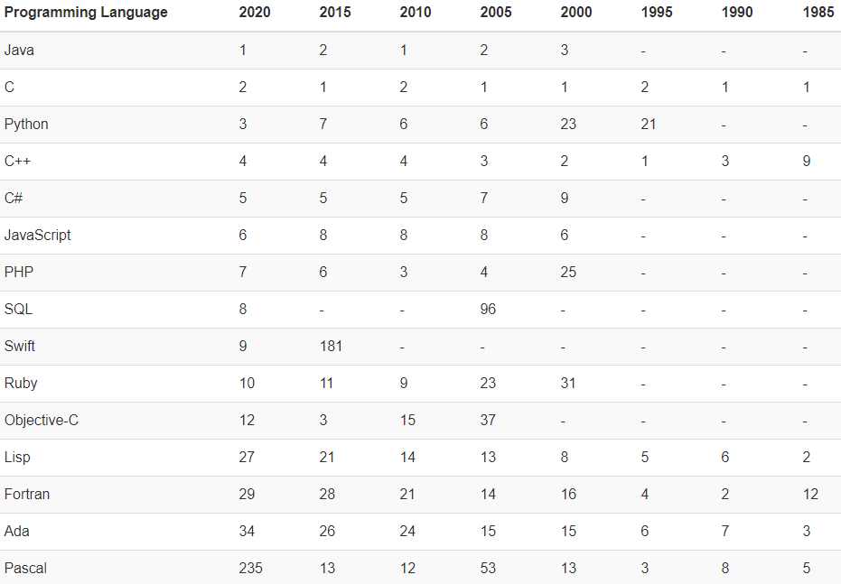

# 选项

## C

1972年

底层系统交互，编译型语言

## C++

1983年  

## C#

2000年

## Go

2007年

## Java（*）

1995年

面向对象，集合，多线程，虚拟机

## lua

## Node.js（*）

## Perl

1987年

## PHP

1994年

## Python

1991年

## Ruby

1996年

## Rust

## Scala

2001年

# 比较

## 按推出年份

## 按流行程度

TIOBE 编程语言排行榜

  
 