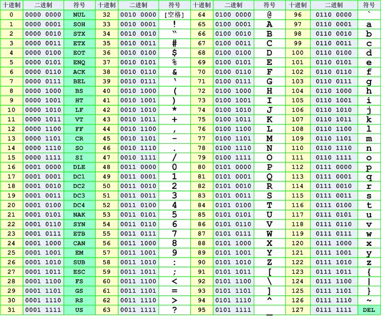

# 概念

计算机只能处理 0 和 1 组成的二进制数据。

最早的计算机在设计时采用 8 个比特（bit）作为一个字节（byte），所以，一个字节能表示的最大的整数就是 255（二进制11111111），如果要表示更大的整数，就必须用更多的字节。比如两个字节可以表示的最大整数是 `65535`，4 个字节可以表示的最大整数是 `4294967295`。

**编码**：encode，把数据从一种形式转换为另外一种形式的过程。例如，A->01000001。

**解码**：decode，编码的逆过程。

**字符集**：各种文字和符号的总称。

常见的字符集种类包括 ASCII 字符集、GBK 字符集、Unicode 字符集等。不同的字符集规定了有限个字符，比如：ASCII 字符集只含有拉丁文字字母，GBK 包含了汉字，而 Unicode 字符集包含了世界上所有的文字符号。

# 字符集、字符编码

**字符集与字符编码**：通常来说，字符集同时定义了一套同名的字符编码规则。例如 ASCII。当然这不是绝对的，比如 Unicode 只定义了字符集，而对应的字符编码是 UTF-8，UTF-16。

## ASCII

1945 年，ASCII（American Standard Code for Information Interchange，美国信息交换标准代码）。一共规定了 128 个字符及对应的二进制转换关系，128 个字符包括了可显示的26个字母（大小写）、10个数字、标点符号以及特殊的控制符，也就是英语与西欧语言中常见的字符。

  
 

## EASCII：扩展的ASCII

## GB2312

满足国人需求的字符集

1981 年国家标准化管理委员会定了一套字符集叫 **GB2312**，每个汉字符号由两个字节组成，理论上它可以表示 65536 个字符，不过它只收录了 7445 个字符，6763 个汉字和 682 个其他字符，同时它能够兼容 ASCII，ASCII 中定义的字符只占用一个字节的空间。

## GBK

GBK是汉字编码，是双字节码，可表示繁体字和简体字。 

## Unicode 字符集

全世界有上百种语言，各国有各国的标准。`ASCII` 英文；`GB2312` 中文；`Shift_JIS` 日文；`Euc-kr` 韩文……在多语言混合的文本中，显示出来会有乱码。

Unicode 应运而生。Unicode 把所有语言都统一到一套编码里，这样就不会再有乱码问题了。

目前的Unicode字符分为 17 组编排，0x0000 至 0x10FFFF，每组称为平面（Plane），而每平面拥有 65536 个码位，共 1114112 个。然而目前只用了少数平面。UTF-8、UTF-16、UTF-32 都是将数字转换到程序数据的编码方案。

### UTF-8 编码

> http://blog.guqiankun.com/post-258

UTF-8（8-bit Unicode Transformation Format，万国码）。用在网页上可以同一页面显示中文简体繁体及其它语言。  

UTF-8 编码把一个 Unicode 字符根据不同的数字大小编码成 1-6 个字节，常用的英文字母被编码成 1 个字节，汉字通常是 3 个字节，只有很生僻的字符才会被编码成 4-6 个字节。如果传输的文本包含大量英文字符，用 UTF-8 编码能节省空间。

UTF-8 编码有一个额外的好处，就是 ASCII 编码实际上可以被看成是 UTF-8 编码的一部分，所以，大量只支持 ASCII 编码的历史遗留软件可以在 UTF-8 编码下继续工作。

为什么 UTF-8 不需要考虑大小端问题？

UTF-8 的编码单元是 1个字节，所以就不用考虑字节序问题。而 UTF-16 是用 2个字节来编码 Unicode 字符，编码单位是两个字节，因此需要考虑字节序问题，因为 2 个字节哪个存高位哪个存低位需要确定。

## ISO8859-2 字符集

也称为 Latin-2，收集了 东欧 字符。

# 前端开发中的字符编码

## URL 编码

### base64 编码

### 前端 UTF-8 与后端 GBK 的兼容

## HTML 实体编码与进制编码

## JS 编码

# 参考资料

- [字符编码的前世今生 - 掘金](https://juejin.im/entry/59c1c61cf265da06434b801a)
- [前端开发中的字符编码 - 掘金](https://juejin.im/entry/57353de72e958a0069b2bbfb)