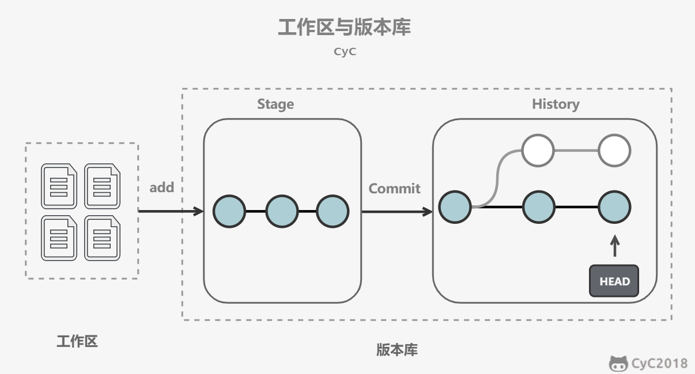
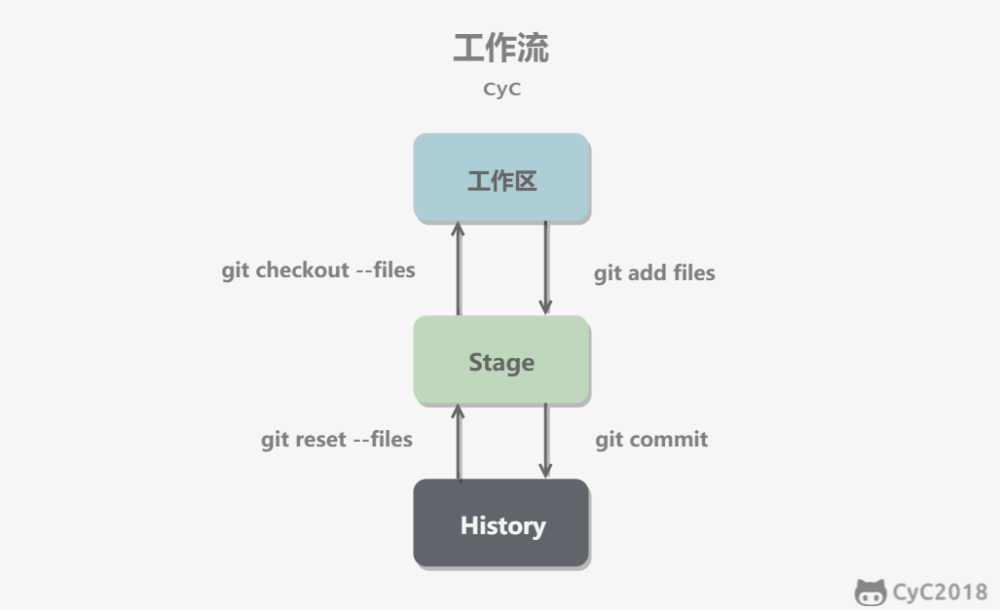
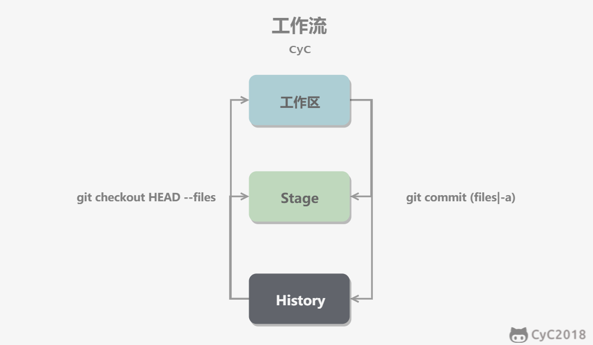
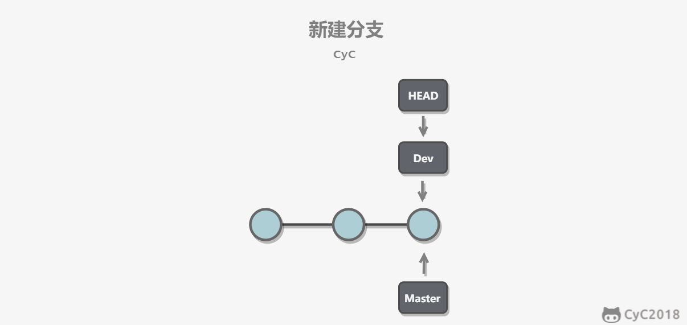
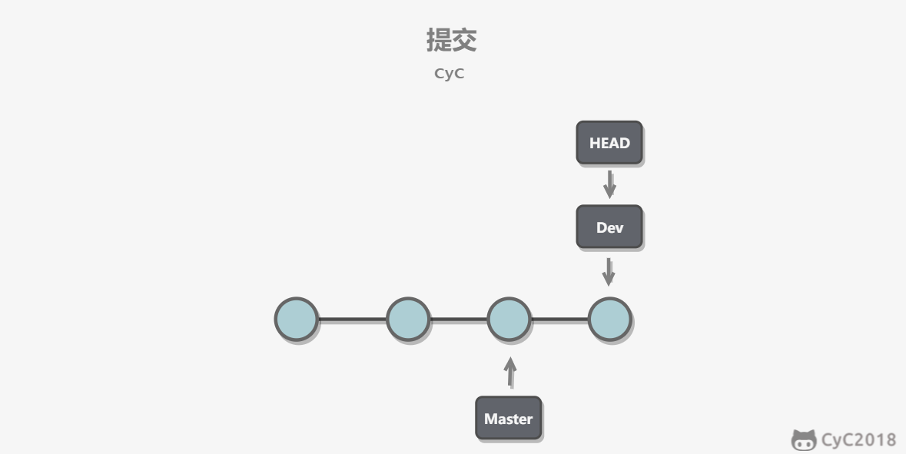
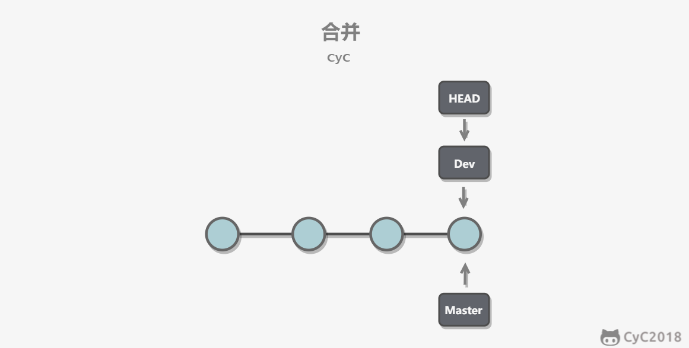
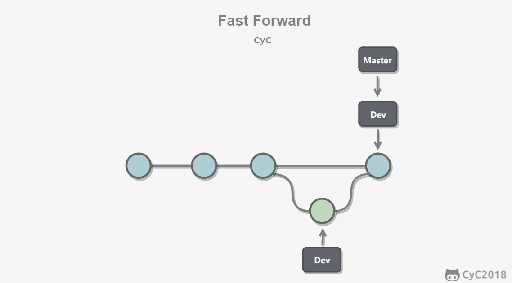

# 版本控制简介

## 定义

**什么是版本控制？**

版本控制系统（VCS）会记录所有对项目文件的更改，可以完整地保存一个项目的快照。当需要查看之前的快照（或称“版本” ）时，版本控制系统可以显示出当前版本与上一个版本之间的所有替换的细节。

**为什么要使用版本控制系统？**

- 协同合作：每一个团队成员都可以在任何时间对任何文件毫无顾虑的进行修改，版本控制系统可以把之后所有的改动合并成一个共同的版本。
- 版本存储：改动了什么？如何命名版本？
  - 恢复之前的版本：撤销功能。
- 备份：分布式版本控制系统（例如 Git）提供。每一个团队成员都会在自己的本地有一个完整的项目副本，包括整个项目的历史记录。

## **分类**

### 本地控制

在此之前，一般习惯用复制整个项目目录的方式来保存不同的版本，或许还会修改目录名加上备份时间以示区别。虽然简单，但是特别容易犯错。比如，混淆所在的工作目录，写错文件或者覆盖预料外的文件。

本地版本控制系统可以解决上述问题。原理是采用某种简单的数据库来记录文件的历次更新差异。代表：RCS。

<div align="center">  </div><br>

[RCS](https://www.gnu.org/software/rcs/) 的工作原理是在硬盘上保存补丁集（补丁是指文件修订前后的变化）；通过应用所有的补丁，可以重新计算出各个版本的文件内容。


### 集中式

新问题：如何让在不同系统上的开发者协同工作？ 

集中化的版本控制系统（Centralized Version Control Systems，简称 CVCS）都有一个单一的集中管理的服务器，保存所有文件的修订版本，而协同工作的人们都通过客户端连到这台服务器，取出最新的文件或者提交更新。 多年以来，这已成为版本控制系统的标准做法。代表：CVS、Subversion 以及 Perforce 等。

<div align="center">  </div><br>

好处：相较于老式的本地 VCS 来说，每个人都可以在一定程度上看到项目中的其他人正在做些什么。 而管理员也可以轻松掌控每个开发者的权限。

缺点：中央服务器的单点故障。宕机时，谁都无法提交更新，也就无法协同工作。 如果中心数据库所在的磁盘发生损坏，又没有做恰当备份，将丢失所有数据——包括项目的整个变更历史，只剩下在各自机器上保留的单独快照。 

本地版本控制系统也存在类似问题，只要整个项目的历史记录被保存在单一位置，就有丢失所有历史更新记录的风险。分布式版本控制系统可以解决这类问题。


### 分布式

在分布式版本控制系统（Distributed Version Control System，简称 DVCS）中，客户端并不只提取最新版本的文件快照， 而是把代码仓库完整地镜像下来，包括完整的历史记录。

任何一处协同工作用的服务器发生故障，事后都可以用任何一个镜像出来的本地仓库恢复。 因为每一次的克隆操作，实际上都是一次对代码仓库的完整备份。

代表：Git、Mercurial、Bazaar 以及 Darcs 等。

<div align="center">  </div><br>


## **版本控制工具**

- 主要有哪些版本控制工具？

  - CVS：集中式版本控制系统
  - SVN：开源，集中式版本控制系统
  - Git：开源，分布式版本控制系统
  - Mercurial：轻量级分布式版本控制系统，采用 Python 语言实现。


### SVN

**什么是 SVN？**

Subversion（SVN） 在 2000 年由 CollabNet Inc 开发，现在发展成为 Apache 软件基金会的一个项目，是一个开源的版本控制系统。

SVN 相对于的 RCS、CVS，采用了分支管理系统，它的设计目标就是取代 CVS。互联网上免费的版本控制服务多基于 Subversion。


SVN 优于 CVS 之处

- 1、原子提交。一次提交不管是单个还是多个文件，都是作为一个整体提交的。在这当中发生的意外例如传输中断，不会引起数据库的不完整和数据损坏。
- 2、重命名、复制、删除文件等动作都保存在版本历史记录当中。

- 3、对于二进制文件，使用了节省空间的保存方法。（简单的理解，就是只保存和上一版本不同之处）

- 4、目录也有版本历史。整个目录树可以被移动或者复制，操作很简单，而且能够保留全部版本记录。

- 5、分支的开销非常小。

- 6、优化过的数据库访问，使得一些操作不必访问数据库就可以做到。这样减少了很多不必要的和数据库主机之间的网络流量。


### Git

**什么是 Git？**

Git 是 Linus Torvalds 为了帮助管理 Linux 内核开发而开发的，是一个开源的分布式版本控制系统，用于敏捷高效地处理任何或小或大的项目。

Git 与常用的版本控制工具 CVS, Subversion 等不同，它采用了分布式版本库的方式，不需要服务器端软件支持。


## **可视化客户端**

版本控制工具的可视化客户端

- Gitkraken
- Tower
- Sourcetree


## 集中式 vs 分布式

<div align="center">  </div><br>

集中式版本控制只有中心服务器拥有一份代码，而分布式版本控制每个人的电脑上就有一份完整的代码。

集中式版本控制有安全性问题，当中心服务器挂了所有人都没办法工作了。

集中式版本控制需要连网才能工作，如果网速过慢，那么提交一个文件会慢的无法让人忍受。而分布式版本控制不需要连网就能工作。

分布式版本控制新建分支、合并分支操作速度非常快，而集中式版本控制新建一个分支相当于复制一份完整代码。


**SVN vs Git**

- **最核心的区别**：Git 属于分布式版本控制系统，而 SVN 属于集中式。

  SVN 是集中式版本控制系统，版本库集中放在中央服务器，开发时，用的都是自己的 PC 端。所以，首先要从中央服务器那里得到最新的版本，然后开发，一旦开发任务完成后， 需要把自己开发的文件推送到中央服务器。集中式版本控制系统必须联网才能工作，如果在局域网环境下带宽够大，速度够快，还是很方便的。但如果网速很慢，就会严重影响开发效率。

  Git 是分布式版本控制系统，它没有中央服务器，每个人的 PC 就是一个完整的版本库，因此，开发时不需要联网。当多人协作开发的时候，只须把各自的修改文件推送给对方，就可以互相看到对方的修改了。

- **Git 把内容按元数据方式存储，而 SVN 是按文件。**

- **Git 分支和 SVN 的分支不同。**Git 分支廉价，SVN 分支昂贵。Git 分支是指针指向某次提交，而 SVN 分支是拷贝的目录。Git 有本地分支，SVN 无本地分支。分支在 SVN 中一点都不特别，就是版本库中的另外一个目录。

- **Git 没有一个全局的版本号，而 SVN 有：**目前为止这是跟 SVN 相比，Git 缺少的最大的一个特征。

- **Git 的内容完整性要优于 SVN：**Git 的内容存储使用的是 SHA-1 哈希算法。这能确保代码内容的完整性，确保在遇到磁盘故障和网络问题时降低对版本库的破坏。

- Git 不仅仅是版本控制系统，也是内容管理系统（CMS），工作管理系统等。

- Git 的命令较多（但功能也多），SVN 简单易上手，对新手很友好。


# Git

## 安装

Git 目前支持 Linux/Unix、Solaris、Mac 和 Windows 平台上运行。

Git 各平台安装包下载地址为：http://git-scm.com/downloads


**windows 环境下配置 Git**

开始菜单->"Git"->"Git Bash"，可以在弹出的 Git 命令窗口进行 Git 操作。

 `git config` 命令专门用来配置或读取相应的工作环境变量。这些环境变量，决定了 Git 在各个环节的具体工作方式和行为。这些变量可以存放在以下三个不同的地方：

- `/etc/gitconfig` 文件：系统中对所有用户都普遍适用的配置。若使用 `git config` 时用 `--system` 选项，读写的就是这个文件。（`E:\Program Files\Git\etc\gitconfig`）
- `~/.gitconfig` 文件：用户目录下的配置文件只适用于该用户。若使用 `git config` 时用 `--global` 选项，读写的就是这个文件。（`C:\Users\May\.gitconfig`）
- 当前项目的 Git 目录中的配置文件（也就是工作目录中的 `.git/config` 文件）：这里的配置仅仅针对当前项目有效。每一个级别的配置都会覆盖上层的相同配置，所以 `.git/config` 里的配置会覆盖 `/etc/gitconfig` 中的同名变量。（`G:\Offer\DIY-总结\Front-end-Notes\.git\config`）

在 Windows 系统上，Git 会寻找用户主目录下的 `.gitconfig` 文件。主目录即 `$HOME` 变量指定的目录，一般都是 `C:\Documents and Settings\$USER`。

此外，Git 还会尝试找寻 `/etc/gitconfig` 文件，只不过看当初 Git 装在什么目录，就以此作为根目录来定位。

**配置用户信息**

配置个人的用户名称和电子邮件地址：

```bash
# `--global` 选项表示选中所有的项目。
$ git config --global user.name "CodeCat2020"
$ git config --global user.email "2795425529@qq.com"
```

> 以“ $”符号开始的代码，表示它是一个在“ Terminal”或“ Git Bash”里能被执行的命令。

**配置文本编辑器**

设置 Git 默认使用的文本编辑器，一般可能会是 Vi 或者 Vim。如果有其他偏好，比如 Emacs ，可以重新设置：

```bash
$ git config --global core.editor emacs
```

**配置差异分析工具**

差异分析工具可用于解决合并冲突。比如要改用 vimdiff ：

```bash
$ git config --global merge.tool vimdiff
```

**查看配置信息**

```bash
$ git config --list 
```

重复的变量名说明它们来自不同的配置文件，Git 实际采用的是最后一个。这些配置也可以在 ~/.gitconfig 或 /etc/gitconfig 看到

```
vim ~/.gitconfig 
```

也可以直接查阅某个环境变量的设定，只要把特定的名字跟在后面即可

```bash
$ git config user.name
```


## 工作流程

一般工作流程如下：

- 克隆 Git 资源作为工作目录。
- 在克隆的资源上添加或修改文件。
- 如果其他人修改了，可以更新资源。
- 在提交前查看修改。
- 提交修改。
- 在修改完成后，如果发现错误，可以撤回提交并再次修改并提交。

<div align="center">  </div><br>

## 基本概念

### 中心服务器

中心服务器用来交换每个用户的修改，没有中心服务器也能工作，但是中心服务器能够 24 小时保持开机状态，这样就能更方便的交换修改。

Github 就是一个中心服务器。


### 工作流

**工作区、暂存区和版本库**

新建一个仓库之后，当前目录就成为了工作区，工作区下有一个隐藏目录 .git，它属于 Git 的版本库。

Git 的版本库有一个称为 Stage 的暂存区以及最后的 History 版本库。暂存区一般存放在 .git/index 中，暂存区有时也叫作索引（index）。History 存储所有分支信息，使用一个 HEAD 指针指向当前分支。

本地仓库由 Git 维护的三棵“树”组成：

- 工作目录：持有实际文件；
-  暂存区（Index）：缓存区域，临时保存改动；
-  HEAD：指向最后一次提交的结果。

<div align="center">  </div><br>

- git add files 把文件的修改添加到暂存区
- git commit 把暂存区的修改提交到当前分支，提交之后暂存区就被清空了
- git reset -- files 使用当前分支上的修改覆盖暂存区，用来撤销最后一次 git add files
- git checkout -- files 使用暂存区的修改覆盖工作目录，用来撤销本地修改

<div align="center">  </div><br>

可以跳过暂存区域直接从分支中取出修改，或者直接提交修改到分支中。

- git commit -a 直接把所有文件的修改添加到暂存区然后执行提交
- git checkout HEAD -- files 取出最后一次修改，可以用来进行回滚操作

<div align="center">  </div><br>


## 基本操作

### `git init`

**创建新仓库**

使用当前目录作为 Git 仓库，只需使它初始化。初始化版本库：

```bash
$ git init	
```

使用指定目录作为 Git 仓库。

```bash
$ git init newrepo
```

初始化后，Git 仓库会生成一个 .git 目录，该目录包含了资源的所有元数据，其他的项目目录保持不变。（SVN 会在每个子目录生成 .svn 目录，Git 只在仓库的根目录生成 .git 目录）。

### `git clone`

克隆仓库的命令格式为：

```
git clone <repo>
```

克隆到指定的目录，可以使用以下命令格式：

```
git clone <repo> <directory>
```

- repo：Git 仓库。
- directory：本地目录。

比如，要克隆 Ruby 语言的 Git 代码仓库 Grit，可以用下面的命令：

```bash
$ git clone git://github.com/schacon/grit.git
```

执行该命令后，会在当前目录下创建一个名为 grit 的目录，其中包含一个 .git 的目录，用于保存下载下来的所有版本记录。

在上面的命令末尾指定新的名字，可以自定义要新建的项目目录名称。

```bash
$ git clone git://github.com/schacon/grit.git mygrit
```

创建一个本地仓库的克隆版本：`git clone /path/to/repository`

克隆远端服务器上的仓库：`git clone username@host:/path/to/repository`


### `git add`

**添加文件到版本库**

使用 git add 命令将想要快照的内容写入缓存区

```
git add
git add . 	// 添加当前项目的所有文件。
git add *
```


### `git commit`

**提交文件到仓库**

git commit 将缓存区内容添加到仓库中（HEAD），但还没到远程仓库中。


### `git status`

**查看仓库状态**

```
git status
git status -s		// 简短输出
```

- "AM" 状态：将文件添加到缓存之后又有改动。


### `git diff` 

**查看执行 git status 的结果的详细信息**

git diff 命令显示已写入缓存与已修改但尚未写入缓存的改动的区别。git diff 有两个主要的应用场景。

- 尚未缓存的改动：**git diff**
- 查看已缓存的改动： **git diff --cached**
- 查看已缓存的与未缓存的所有改动：**git diff HEAD**
- 显示摘要而非整个 diff：**git diff --stat**


### `git reset HEAD`

git reset HEAD 命令用于取消已缓存的内容。


### `git rm`

从 Git 中移除某个文件，就必须要从已跟踪文件清单中移除，然后提交。可以用以下命令完成此项工作

```
git rm <file>
```

如果删除之前修改过并且已经放到暂存区域的话，则必须要用强制删除选项 **-f**

```
git rm -f <file>
```

如果把文件从暂存区域移除，但仍然希望保留在当前工作目录中，换句话说，仅是从跟踪清单中删除，使用 **--cached** 选项即可

```
git rm --cached <file>
```


### `git mv`

git mv 命令用于移动或重命名一个文件、目录、软连接。


### `git log`

查看提交历史

- --oneline ：查看历史记录的简洁的版本。
- --graph ：拓扑图选项。
- --reverse ：逆向显示所有日志。
- --author：查找指定用户的提交日志。
- --since：
- --before：
- --until：
- --after


### `git tag`

如果你达到一个重要的阶段，并希望永远记住那个特别的提交快照，你可以使用 git tag 给它打上标签。

发布新版本时，一般会打上标签。

- -a 选项：创建一个带注解的标签。

```bash
$ git tag -a v1.0 
```


## 分支管理

几乎每一种版本控制系统都以某种形式支持分支。使用分支意味着你可以从开发主线上分离开来，然后在不影响主线的同时继续工作。

### 实现原理

使用指针将每个提交连接成一条时间线，HEAD 指针是指向当前分支指针。

<div align="center">  </div><br>

新建分支是新建一个指针指向时间线的最后一个节点，并让 HEAD 指针指向新分支，表示新分支成为当前分支。

<div align="center">  </div><br>

每次提交只会让当前分支指针向前移动，而其它分支指针不会移动。

<div align="center">  </div><br>

合并分支也只需要改变指针即可。

<div align="center">  </div><br>

### 分支命令

#### `git branch`

**列出分支命令**：

```
git branch
```

执行 `git init` 以创建仓库时，默认情况下 Git 会创建 **master** 分支。

**手动创建分支命令**：

```
git branch (branchname)
```

**删除分支命令**：

```
git branch -d (branchname)
```


**切换分支命令**：

```
git checkout (branchname)
```

切换分支时，Git 会用该分支的最后提交的快照替换工作目录的内容， 所以多个分支不需要多个目录。


#### `git merge` 

**合并分支命令**：

```
git merge 
```

可以多次合并到统一分支， 也可以选择在合并之后直接删除被并入的分支。


#### `git rebase`

在 Git 中， merge 和 rebase 从最终效果来看没有任何区别，都是将不同分支的代码融合在一起，但是生成的代码树稍有不同。rebase 操作不会生成新的节点， 而是将两个分支融合成一个线性的提交。而 merge 操作生成的代码树会显得比较乱。


### 合并冲突

当两个分支都对同一个文件的同一行进行了修改，在分支合并时就会产生冲突。

<div align="center">  </div><br>

Git 会使用 <<<<<<< ，======= ，>>>>>>> 标记出不同分支的内容，只需要把不同分支中冲突部分修改成一样就能解决冲突。

```
<<<<<<< HEAD
Creating a new branch is quick & simple.
=======
Creating a new branch is quick AND simple.
>>>>>>> feature1
```


### Fast forward

"快进式合并"（fast-farward merge），会直接将 master 分支指向合并的分支，在这种模式下进行分支合并会丢失分支信息，也就不能在分支历史上看出分支信息。

可以在合并时加上 --no-ff 参数来禁用 Fast forward 模式，并且加上 -m 参数让合并时产生一个新的 commit。

```bash
$ git merge --no-ff -m "merge with no-ff" dev
```

<div align="center">  </div><br>

### `git stash`

在一个分支上操作之后，如果还没有将修改提交到分支上，此时进行切换分支，那么另一个分支上也能看到新的修改。这是因为所有分支都共用一个工作区的缘故。

可以使用 git stash 将当前分支的修改储藏起来，此时当前工作区的所有修改都会被存到栈中，也就是说当前工作区是干净的，没有任何未提交的修改。此时就可以安全的切换到其它分支上了。

```bash
$ git stash
Saved working directory and index state \ "WIP on master: 049d078 added the index file"
HEAD is now at 049d078 added the index file (To restore them type "git stash apply")
```

该功能可以用于 bug 分支的实现。如果当前正在 dev 分支上进行开发，但是此时 master 上有个 bug 需要修复，但是 dev 分支上的开发还未完成，不想立即提交。在新建 bug 分支并切换到 bug 分支之前就需要使用 git stash 将 dev 分支的未提交修改储藏起来。


## 远程仓库

Git 并不像 SVN 那样有个中心服务器。

如果希望通过 Git 分享代码或者与其他开发人员合作，需要将数据放到一台其他开发人员能够连接的服务器上。

GitHub 是基于 Git 实现的代码托管。使用步骤：

- 登录 GitHub，创建新存储库（以”mall“为例）。

- 指定要管理的存储库

  - 本地没有项目，在本地创建项目，推送到 GitHub。在命令行执行以下命令：

    ```cmd
    echo "# mall" >> README.md
    git init
    git add README.md
    git commit -m "first commit"
    git remote add origin https://github.com/CodeCat2020/mall.git
    git push -u origin master
    ```

  - 本地已有项目，可以从这个仓库克隆出新的仓库。

    ```
    git clone https://github.com/CodeCat2020/mall.git
    ```

    注意：如果仓库名和项目名重复，先修改项目名（比如 mall1）。

    找到克隆下来的仓库 mall。复制本地项目 mall1 的目录和文件（除了 .git 等目录），粘贴到 mall。

    将上述文件和目录加入管理：

    ```
    git add .
    ```

    提交修改：

    ```
    git commit -m '初始化项目'
    ```

  - 本地已有项目，也可以把本地仓库的内容推送到 GitHub 仓库。在命令行执行以下命令：

    ```cmd
    git remote add origin https://github.com/CodeCat2020/mall.git
    git push -u origin master
    ```

  - 从另一个存储库导入


### `git remote`

`git remote` 管理远程仓库。

**查看当前配置的远程仓库**

执行时加上 -v 参数，还可以看到每个别名的实际链接地址。

```bash
git remote
git remote -v
```

**添加一个新的远程仓库**

可以指定一个简单的名字，以便将来引用：

```bash
git remote add [shortname] [url]
```

**删除远程仓库**

```bash
git remote rm [别名]
```

实例

```bash
$ git remote
origin

$ git remote -v
origin    git@github.com:tianqixin/runoob-git-test.git (fetch)
origin    git@github.com:tianqixin/runoob-git-test.git (push)

# 添加仓库 origin2
$ git remote add origin2 git@github.com:tianqixin/runoob-git-test.git

$ git remote -v
origin    git@github.com:tianqixin/runoob-git-test.git (fetch)
origin    git@github.com:tianqixin/runoob-git-test.git (push)
origin2    git@github.com:tianqixin/runoob-git-test.git (fetch)
origin2    git@github.com:tianqixin/runoob-git-test.git (push)

# 删除仓库 origin2
$ git remote rm origin2
$ git remote -v
origin    git@github.com:tianqixin/runoob-git-test.git (fetch)
origin    git@github.com:tianqixin/runoob-git-test.git (push)
```


### SSH 传输设置

Git 仓库和 Github 中心仓库之间的传输是通过 SSH 加密。

**创建 SSH Key**

如果工作区下没有 .ssh 目录，或者 .ssh 目录下没有 id_rsa 和 id_rsa.pub 这两个文件，可以在 Git bash 中通过以下命令指定 rsa 算法创建 SSH Key：

```bash
$ ssh-keygen -t rsa -C "youremail@example.com"
```

在 C 盘目录（比如 `C:\Users\.ssh` ）会生成两个文件 id_rsa （密钥）和 id_rsa.pub （公钥）。

**设置 SSH key**

打开 id_rsa.pub，复制里面的 key。

回到 Github上，进入 "Account => Settings" 。选择 ”SSH and GPG keys“，然后点击 ”New SSH key“ 按钮，设置标题后粘贴 key。

**验证**

为了验证是否成功，输入以下命令：

```bash
$ ssh -T git@github.com
Hi xxxx!You've successfully authenticated, but GitHub does not provide shell access.
```


### 提取远程仓库

Git 有两个命令用来提取远程仓库的更新。

#### `git fetch`

1、从远程仓库下载新分支与数据：

```
git fetch
```

2、从远端仓库提取数据并尝试合并到当前分支：

```
git merge
```

在执行 git fetch 之后，紧接着执行 git merge 远程分支到你所在的任意分支。


#### `git pull`

git pull 相当于从远程获取最新版本并合并到本地； Git fetch 相当于从远程获取最新版本并存放到本地，而不会自动合并。


### `git push`

推送新分支与数据到某个远端仓库命令：

```
git push [alias] [branch]
```

除非将分支推送到远端仓库，不然该分支就是 *不为他人所见的*。


## 搭建服务器

Git 没有中心服务器，除了使用 Github 远程仓库，还可以自己搭建服务器。

以 Centos 为例搭建 Git 服务器。

**1、安装Git**

```bash
$ yum install curl-devel expat-devel gettext-devel openssl-devel zlib-devel perl-devel
$ yum install git
```

接下来创建一个 git 用户组和用户，用来运行 git 服务：

```bash
$ groupadd git
$ useradd git -g git
```

**2、创建证书登录**

收集所有需要登录的用户的公钥，公钥位于 id_rsa.pub 文件中，把公钥导入到 /home/git/.ssh/authorized_keys 文件里，一行一个。

如果没有该文件创建它：

```bash
$ cd /home/git/
$ mkdir .ssh
$ chmod 755 .ssh
$ touch .ssh/authorized_keys
$ chmod 644 .ssh/authorized_keys
```

**3、初始化Git仓库**

首先，选定一个目录作为 Git 仓库，假定是 /home/gitrepo/runoob.git，在 /home/gitrepo 目录下输入命令：

```bash
$ cd /home
$ mkdir gitrepo
$ chown git:git gitrepo/
$ cd gitrepo

$ git init --bare runoob.git
Initialized empty Git repository in /home/gitrepo/runoob.git/
```

以上命令 Git 创建一个空仓库，服务器上的 Git 仓库通常都以 .git 结尾。然后，把仓库所属用户改为 git：

```bash
$ chown -R git:git runoob.git
```

**4、克隆仓库**

```bash
$ git clone git@192.168.45.4:/home/gitrepo/runoob.git
Cloning into 'runoob'...
warning: You appear to have cloned an empty repository.
Checking connectivity... done.
```

192.168.45.4 为 Git 所在服务器 ip ，需要将其修改为自己的 Git 服务 ip。


## .gitignore 文件

.gitignore 文件用来配置不需要版本管理的文件和文件夹。

忽略以下文件：

- 操作系统自动生成的文件，比如缩略图；
- 编译生成的中间文件，比如 Java 编译产生的 .class 文件；
- 自己的敏感信息，比如存放口令的配置文件。

不需要全部自己编写，可以到 [https://github.com/github/gitignore](https://github.com/github/gitignore) 中进行查询。


## Git 命令一览

<div align="center">  </div><br>

比较详细的地址：http://www.cheat-sheets.org/saved-copy/git-cheat-sheet.pdf


# 参考资料

- [Git - 简明指南](http://rogerdudler.github.io/git-guide/index.zh.html)
- [Git - 简明指南 - 菜鸟教程](https://www.runoob.com/manual/git-guide/)
- [图解 Git](http://marklodato.github.io/visual-git-guide/index-zh-cn.html)
- [廖雪峰 : Git 教程](https://www.liaoxuefeng.com/wiki/0013739516305929606dd18361248578c67b8067c8c017b000)
- [Learn Git Branching](https://learngitbranching.js.org/)
- [Git 教程 - 菜鸟教程](https://www.runoob.com/git/git-tutorial.html)
- [SVN 教程 - 菜鸟教程](https://www.runoob.com/svn/svn-tutorial.html)
- [Learn Version Control with Git](https://www.git-tower.com/learn/git/ebook/cn/command-line/basics/what-is-version-control)
- [常用版本控制工具 - 简书](https://www.jianshu.com/p/47f79a13524f)
- [Git 中文文档](https://git-scm.com/book/zh/v2)
- [Git 完整命令手册 - 官网](https://git-scm.com/docs)
- [PDF 版命令 - 菜鸟教程](https://www.runoob.com/manual/github-git-cheat-sheet.pdf)
