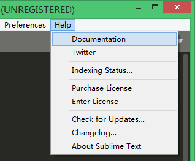
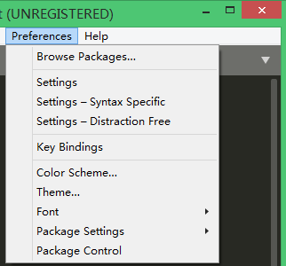
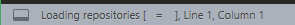
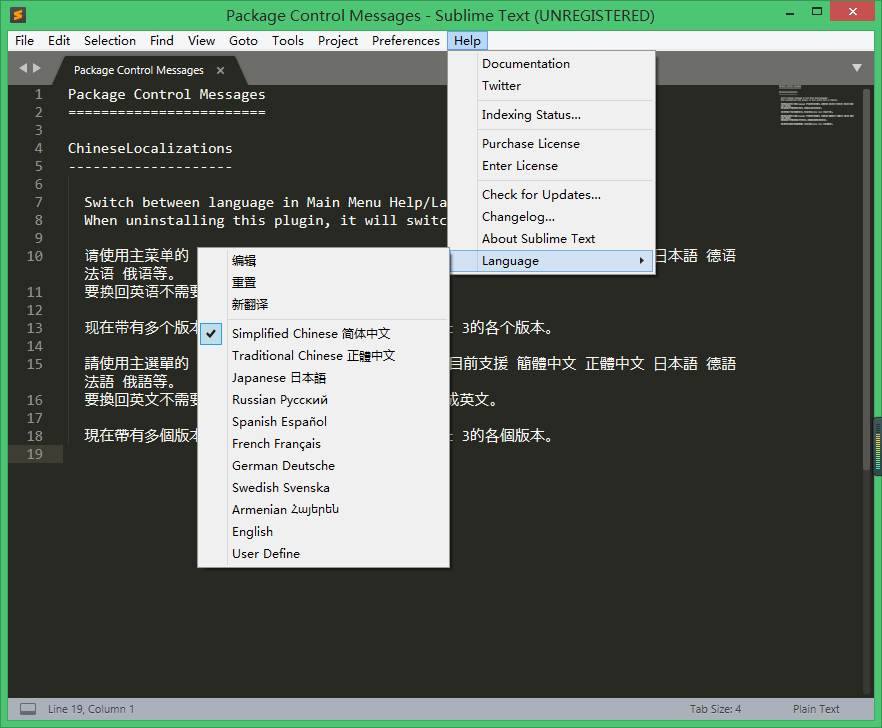
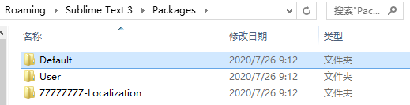
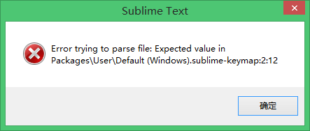

# 安装及配置

**安装 sublime3** 

去[官网](http://www.sublimetext.com/)下载 sublime3 安装包。

Sublime Text 可以免费下载和评估，但是必须[购买](https://www.sublimehq.com/store/text)许可证才能继续使用。目前没有强制的评估期限。

打开 sublime 之后，窗口顶端会出现 **UNREGISTERED**；并且在使用 sublime 的过程中出时不时跳出窗口让你注册/购买。但是你依然可以正常使用它。

**安装插件**

方式一：

直接下载安装包解压缩到 Packages 目录（preferences->Browse Packages）。比较麻烦。卸载时也不能直接删除目录下载。

方式二：

通过 package control 来进行查找，安装，或者卸载插件

**安装 package control**

方式一：

点击 tools->install package control，会自动安装 package control，如果preferences 有 package control 即安装成功。

方式二：

https://packagecontrol.io/installation


## 汉化

汉化前：

<div align="center">  </div><br>

<div align="center">  </div><br>

汉化：

Preference->Package Control->install package

<div align="center">  </div><br>

等待系统自动搜索完成，弹出安装对话框。

在搜索框中输入“chinese”，找到“ChineseLocalizations”。等待系统自动安装完成。

汉化后：

可能需要重启 sublime

<div align="center">  </div><br>

首选项->浏览插件目录

<div align="center">  </div><br>

## 插件

**打开 Package Control 窗口**

Tools 工具->Command Paletter 命令面板（Ctrl+Shift+P），Package Control，或者 Preference->Package Control。

**安装插件**

输入查询 Install Package，进入安装页面，然后就可以安装插件包了。

推荐安装插件：

- [Emmet](https://sublime.wbond.net/packages/Emmet)：zen coding 的升级版，[使用教程](http://docs.emmet.io/cheat-sheet/)。
- **[JSFormat](https://sublime.wbond.net/packages/JsFormat) / CodeFormatter**：JavaScript 的代码格式化插件。
- **[LESS](https://sublime.wbond.net/packages/LESS)**：LESS 高亮插件。
- **Sublimerge**：文本对比。安装后，同时打开两个文件，右击其中一个文件，选择 Sublimerge --> Compare To...
- **[Bracket Highlighter](https://github.com/facelessuser/BracketHighlighter)**：代码匹配，高亮标记。
- **[AutoFileName](https://sublime.wbond.net/packages/AutoFileName)**：


**卸载插件**

输出 remove package。选择要删除的插件。


## 运行

### JavaScript

**安装 node.js** 

通过命令行 node -v 查看是否安装 node.js。

**查看  node.js 安装目录**

通过命令行 where node 查看安装目录。

**配置 sublime** 

Tools ->Build System ->new Build System，工具 ->编译系统 ->新建编译系统，修改代码：

```
{
   "cmd": ["E:/Program Files/nodejs/node.exe", "$file"],
   "selector": "source.js"
}
```

注意斜杠的方向！

保存为 .sublime-build 文件，自定义文件名。（比如：JavaScript.sublime-build），可以在相应的目录中（Preference ->Browse Packages ->user）查看和修改 


**进行验证** 

新建一个 JavaScript 文件，选择编辑系统 Tools -> Build System -> Build System -> JavaScript。

使用快捷键 Ctrl+b 或 f7 运行


### HTML

安装 **view in browser** 插件。

**配置用户自定义文件**

Preferences->Package Settings->View in Browser->Settings-User。

Settings-User 里的内容可仿照 Settings-Default 写，只需要修改默认项。

**验证**

新建一个 HTML 文件，输入内容并保存。

使用快捷键：ctrl+alt+v，在浏览器中预览 HTML 文件。


# 报错

## **打开软件**

Error trying to parset file: Expecteed value in Packages\User\Default(Windows).sublime-keymap:2:12

<div align="center">  </div><br>

方法一：

出现这个错误的原因一般是配置文件出现语法错误，可根据提示进行修改或者删除。

文件目录一般在C:\Users\Administrator\AppData\Roaming\Sublime Text 3\Packages\User下面


方法二：

1、进入sublime，然后 Preferences->Browse Packages（首选项->浏览插件目录），删除 User 文件夹

2、在安装包的 packages 文件夹下，删除 User 文件夹


## 安装插件

Error while loading PyV8 binary: exit code 1 Try to manually install PyV8 from https://github.com/emmetio/pyv8-binaries


根据提示，打开上面链接，然后下载适合的版本如图：

（如果不能单个下载，就直接 clone）


解压下载好的文件，在插件目录下新建“PyV8”文件夹，将解压文件粘贴至 PyV8 中，重启 sublime。

```
C:\Users\May\AppData\Roaming\Sublime Text 3\Packages\PyV8
```


# 参考链接

- [非常实用的Sublime插件集合 – sublime推荐必备插件](https://www.cnblogs.com/tangbohu2008/p/10895160.html)