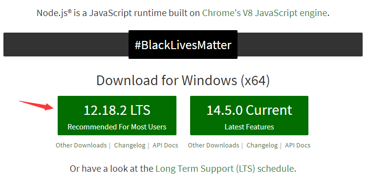
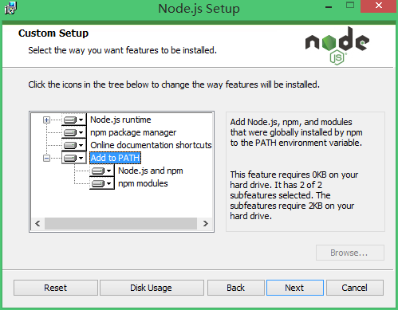
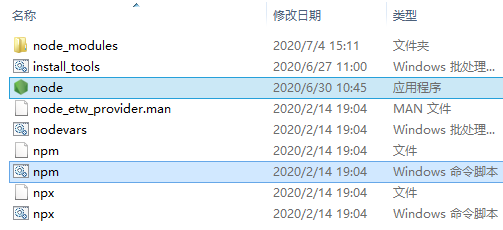
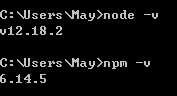
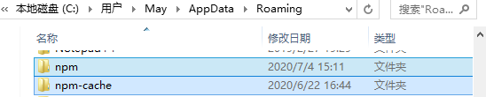
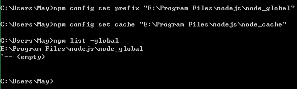
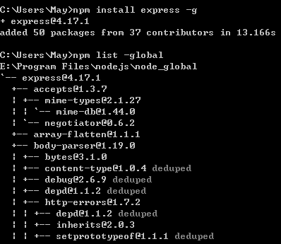
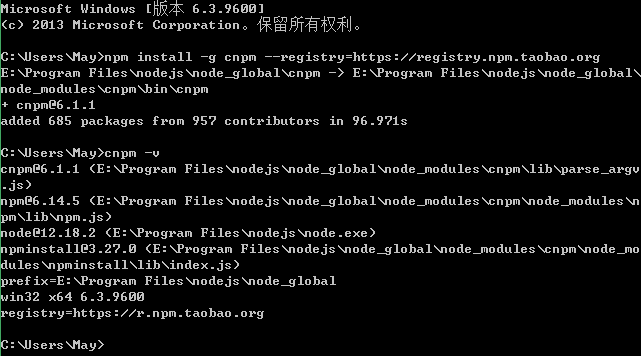

# npm

Npm(Node Package Manager) 是 node 的包管理工具，每个包都是一个模块，所以也可以说 npm 是 node 的模块管理工具。

npm 可用于安装、卸载、发布、查看包等。


通过 npm ， 可以安装和管理项目的依赖，还可以指明依赖项的具体版本号。


常见的使用场景有以下几种。

- 允许用户从 npm 服务器下载别人编写的第三方包到本地。
- 允许用户从 npm 服务器下载并安装别人编写的命令行程序到本地。
- 允许用户将自己编写的包或命令行程序上传到 npm 服务器供别人使用。


## 安装

### 安装 nodejs

**下载**

新版的 NodeJS 已经集成了 npm。但 node 自带的 npm 可能不是最新的。

node 官网：https://nodejs.org/en/

<div align="center">  </div><br>

也可以用过淘宝 NPM 镜像下载 node。[淘宝 NPM 镜像](https://developer.aliyun.com/mirror/NPM?from=tnpm)。

**安装过程**

“Add to PATH”默认会添加 node 到 path 环境变量中。

<div align="center">  </div><br>

**安装完成**

<div align="center">  </div><br>

**安装后测试**

输入 CMD（win+r）命令 `node -v`，或 `npm -v` 查看版本。

<div align="center">  </div><br>


### 配置

在 CMD 输入 `echo %PATH%` 命令查看环境变量。可以发现 npm 的本地仓库跑到了系统盘中。

```
C:\Users\May\AppData\Roaming
```

<div align="center">  </div><br>


**配置全局模块路径和缓存路径**

把全局模块目录以及缓存目录移到 nodejs 的安装目录中：

- 在 nodejs 的安装目录下（`E:\Program Files\nodejs`）创建两个目录：“node_cache”（缓存目录）和“node_global”（全局模块目录）。

- 根据 nodejs 的安装目录，运行以下 CMD 命令。

  ```
  npm config set prefix "E:\Program Files\nodejs\node_global"
  npm config set cache "E:\Program Files\nodejs\node_cache"
  ```

  如果出现错误，如：operation not permitted, mkdir 'C:\Program Files\nodejs'，使用管理员身份打开 CMD。

- 输入 CMD 命令 `npm list -global`，发现 npm 的本地仓库目录改变了。

  <div align="center">  </div><br>


**配置镜像站**

镜像站可以提升速度，输入以下命令配置：

```
npm config set registry=http://registry.npm.taobao.org
```

输入命令 `npm config list` 显示所有配置信息，关注到一个 .npmrc 配置文件，使用文本编辑器编辑，可以看到 `npm config list` 的配置信息。

```
C:\Users\Administrator\.npmrc
```

**检查一下镜像站是否可行**

命令1：`npm config get registry`，返回 `http://registry.npm.taobao.org`。

命令2：`npm info vue` 看能否获得 vue 的信息。


**测试1：更新 npm 模块**

输入 CMD 命令 `npm install npm -g`，其中 `npm install` 是安装/更新命令，后面的 `npm` 是模块名称，`-g` 表示安装到 `安装目录\node_global` 下。

（其实，这时安装到 `安装目录\node_global\node_modules` 。）

输入 CMD 命令 `npm -v`，发现 npm 版本已更新。

输入 `npm list -global`，发现目录不为空。（但实际上 `安装目录\node_global` 还是空的）。


**测试2：安装模块**

安装 express，输入命令 `npm install express -g`。

输入 `npm list -global`，发现 `E:\Program Files\nodejs\node_global\node_modules` 不为空。

<div align="center">  </div><br>


**配置 node_modules 目录**

增加环境变量 `NODE_PATH`，值为 `E:\Program Files\nodejs\node_global\node_modules`。

"PATH"后面增加 `;E:\Program Files\nodejs\node_global`。不然使用 module 的时候会导致输入命令出现“xxx不是内部或外部命令，也不是可运行的程序或批处理文件”这个错误。

**注意**：不能将原来 `E:\Program Files\nodejs` 修改为 `E:\Program Files\nodejs\node_global`，不然不能识别 npm 命令。

重新打开 CMD 让之前设置的环境变量生效。

**测试**

命令：`npm install vue-router -g`

运行 `npm install vue-cli -g` 安装 vue 脚手架。vue 脚本在 `\nodejs\node_global` 目录，不在 `\nodejs` 目录。所以，上面要添加 Path 变量。


### 安装 cnpm

输入 CMD 命令：

```
npm install -g cnpm --registry=https://registry.npm.taobao.org
```

安装后测试  `cnpm -v`：

<div align="center">  </div><br>


## 使用/命令

### `npm -v`

**查看 npm 版本**

```
npm -v
```


### `npm init`

进入项目目录，执行 `npm init` 命令**初始化项目**，输入一些项目的基本信息（可忽略，回车即可）。

文件目录下生成 package.json 文件，说明项目初始化完成。 package.json 保存着项目的依赖信息。


### `npm install`

**安装/卸载第三方库**

`npm install` 是安装/更新命令，后面是模块名称，`-g` 表示安装到 `\node_global` 目录下。

比如，安装并写在 uni-migration：

```
npm install -g uni-migration
npm uninstall -g uni-migration
```

备注：在“ HBuilderX->菜单->工具->插件安装”中可直接安装各种相关插件。


**升级到最新版**

```
npm install vue-loader@latest --save-dev-g
```

**生产环境安装/卸载**

```
npm install module_name -S
npm install module_name --save 写入dependencies

npm uninstall module_name -S
npm uninstall module_name --save 写入dependencies
```

**开发环境安装/卸载**

```
npm install module_name -D
npm install module_name --save-dev 写入devDependencies

npm uninstall module_name -D
npm uninstall module_name --save-dev 写入devDependencies
```

**查看模块**

- 查看所有全局安装的模块： npm ls -g
- 查看 npm 默认设置（部分）： npm config ls
- 查看 npm 默认设置（全部）： npm config ls -l

**修改默认安装目录**

```
npm config set prefix “D:\ProgramFiles\npm_global_modules\node_modules”
```


### `npm i`

`npm i` 是 `npm install` 的缩写，使用区别(windows 下)： 

- 用 `npm i` 安装的模块无法用 `npm uninstall` 删除，用 `npm uninstall i` 才卸载掉 
- `npm i` 会帮助检测与当前 node 版本最匹配的 npm 包版本号，并匹配出来相互依赖的 npm 包应该提升的版本号 
- 部分 npm 包在当前 node 版本下无法使用，必须使用建议版本。 
- 安装报错时，intall 肯定会出现 npm-debug.log 文件，`npm i` 不一定


### **`npm-check` **

**检查更新**

```
npm install -g npm-check
npm-check
```

### **`npm-upgrade` **

**更新**

```
https://www.npmjs.com/package/npm-upgrade

npm install -g npm-upgrade
npm-upgrade
```

更新全局包：npm update -g

更新生产环境依赖包：npm update --save

更新开发环境依赖包：npm update --save-dev


# 参考资料

- [npm 安装详细教程(cnpm) - CSDN](https://blog.csdn.net/u011342720/article/details/81267908)
- [npm安装教程](https://www.cnblogs.com/lgx5/p/10732016.html)
- [npm基本命令 - 博客](https://www.cnblogs.com/zjl-712/p/11469433.html)

