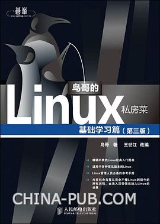

# 操作系统

## 《深入理解计算机系统》（原书第3版） 

RandalE.Bryant/DavidO'Hallaron / 2016-11 / 机械工业出版社

[豆瓣](https://book.douban.com/subject/26912767/)，9.8 分，1004 人评分。

  
 

可以当做计算机导论来看，涉及方方面面的内容。豆瓣评分数 9.7 分的书没几本，真的算是神书了。第三四章可以先不看，因为面试和工作中涉及到的体系结构内容比较少。

## 《现代操作系统》

[美] Andrew S·Tanenbaum / 2009-7 / 机械工业出版社

[豆瓣](https://book.douban.com/subject/3852290/) 8.9 分，753 人评分。

  
 

建议重点阅读：进程与线程、死锁、存储管理章节。

# Linux

## 《UNIX 环境高级编程》

W.Richard Stevens / Stephen A.Rago / 2006年 / 人民邮电出版社

[豆瓣](https://book.douban.com/subject/1788421/) 9.4 分，2266 人评分。

  
 

APUE，和 UNP 类似，都是 C++ 岗位必备书籍。

## 《Unix/Linux 编程实践教程》

Bruce Molay / 2004-10-1 / 清华大学出版社

[豆瓣](https://book.douban.com/subject/1219329/) 9.2 分，422 人评分。

  
 

非常适合当作 Unix/Linux 系统编程的入门书籍，比 APUE 更容易理解。

## 《鸟哥的 Linux 私房菜》基础学习篇

鸟哥 / 2010-6-28 / 人民邮电出版社

[豆瓣](https://book.douban.com/subject/4889838/) 9.1 分，3010 人评分。

  
 

适合当做 Linux 的入门书籍，通俗易懂，不过太过通俗有点啰嗦了。

 

## 《Linux 内核设计与实现》（原书第3版）

Robert Love / 2011-4-30 / 机械工业出版社华章公司

[豆瓣](https://book.douban.com/subject/6097773/)，8.6 分，466 人评分。

  
 

## 《The Linux Command Line》

William E. Shotts Jr. / 2012-1-17 / No Starch Press, Incorporated

[豆瓣](https://book.douban.com/subject/6806862/) 9.3 分，352 人评分。

  
 

比鸟哥的书简洁很多，有 [中文版](http://billie66.github.io/TLCL/book/) 可以阅读。

 

