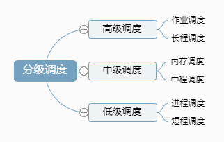

# 概述

处理机调度的核心是对 CPU 资源进行合理的分配使用。

系统如何提高并发性？ 

- 1)    提高CPU并发计算能力
  - a)    多进程&多线程
  - b)    减少进程切换，使用线程，考虑进程绑定CPU
  - c)    减少使用不必要的锁，考虑无锁编程
  - d)    考虑进程优先级
  - e)    关注系统负载
- 2)    改进I/O模型
  - a)    DMA技术
  - b)    异步I/O
  - c)    改进多路I/O就绪通知策略，epoll
  - d)    Sendfile
  - e)    内存映射
  - f)     直接I/O

 

 

# 一、分级调度

调度层次

  
 

作业的状态及转换

- 提交状态：一个作业处于从输入设备进入外部存储设备的过程时所处的状态
- 后备状态：作业的全部信息都已通过输入设备输入到外存输入井中，等待进入内存
- 执行状态：作业一旦被作业调度程序选中，则为其分配所需的资源，并创建进程，送入内存中投入运行
- 完成状态：作业运行完毕，准备退出系统时的状态（所占用的资源尚未全部被系统回收）

 

状态转换及分级调度

  （调度队列模型）

\4.    作业和进程的关系

\5.    调度性能的衡量

- 1)    周转时间：作业从提交到完成（得到结果）所经历的时间。包括：在收容队列中等待，CPU上执行，就绪队列和阻塞队列中等待，结果输出等待等
  - 周转时间 = 作业完成时间 - 作业提交时间 
  - 带权周转时间 = 作业周转时间 / 作业实际运行时间 
  - 平均带权周转时间=(作业1的带权周转时间+作业2的带权周转时间+……+作业n的带权周转时间)/n 
  - 最好的情况是：周转时间等于实际运行时间，那么平均带权周转时间的最小值是n/n=1
- 2)    响应时间：用户发出命令（如击键，输入一个请求）到系统响应给出执行结果（如屏幕显示）所经历的时间
- 3)    吞吐量：给定时间内所完成的作业总数。跟作业本身特性和调度算法都有关系
- 平均周转时间不是吞吐量的倒数，因为并发执行的作业在时间上可以重叠
- 4)    设备（处理机）利用率
- 5)    设备的均衡利用：如CPU繁忙的作业和I/O繁忙的作业搭配
- 6)    公平性：避免某些作业的等待时间过长
- 7)    优先级：可以使关键任务达到更好的指标

 

 

# 二、 作业调度

\6.    作业控制块

\7.    作业调度及功能

\8.    作业调度目标与性能衡量

- 平均周转时间
- 平均带权周转时间
- 平均响应时间

 

# 三、 进程调度

\9.    进程调度要解决的问题：

进程调度的关键问题是调度算法的选择。

- 1)    WHAT：按什么原则分配CPU —— 进程调度算法

- 2)    WHEN：何时分配CPU —— 进程调度的时机

- 3)    HOW：如何分配CPU —— 进程调度过程（进程上下文切换）

\10.  进程调度的功能

进程调度又称为低级调度，其主要功能是将一个就绪的进程投入运行。

- 1)    记录所有进程的执行状况（静态和动态）
- 2)    按一定策略，选择一个就绪进程

- 3)    完成进程上下文切换
  - a)    检查是否可以进行进程切换（如:原语执行时不可）
  - b)    保存被切换进程的现场（如：程序计数器、寄存器），并移至合适的（就绪、阻塞）队列
  - c)    选取一个新进程
  - d)    恢复被选中进程的现场：装配该进程的正文，使其获得CPU控制权

\11.  进程调度的时机

\12.  进程调度的方式

- 1)    非抢占式Non-preemptive（非剥夺式）

- 2)    抢占式Preemptive（可剥夺式）：系统强行剥夺正在执行进程的CPU。当进程/线程正在处理器上运行时，系统可根据所规定的原则剥夺分配给此进程/线程的处理器，并将其移入就绪列队，选择其他进程/线程运行。
  - a)    优先权原则： 优先权高的进程可以剥夺优先权低的进程而运行
  - b)    短进程优先原则：短进程到达后可以剥夺长进程的运行
  - c)    时间片原则： 一个时间片用完后重新调度

\13.  进程调度性能衡量

- 1)    定性衡量
  - 􀂃 公平性
  - 􀂃 可靠性（避免因调度引起的破坏）
  - 􀂃 简洁性（避免调度程序消耗较大的系统开销）
- 2)    定量评价
  - 􀂃 CPU利用率
  - 􀂃 响应时间（交互式系统）
  - 􀂃 吞吐量（批处理系统）

 

# 四、 调度算法

不同环境的调度算法目标不同，因此需要针对不同环境来讨论调度算法。

\14.  饥饿现象

资源在其中两个或以上线程或进程相互使用，第三方线程或进程始终得不到，造成饥饿现象。静态优先及调度、非抢占式作业优先、抢占式短作业优先：这三个具有优先级的，可以提高系统的效率，但并不是公平的，有可能一直被抢占发生饥饿甚至饿死。

只有时间片转移是公平的，大家轮流执行，不会饿着。

## I、批处理系统

批处理系统没有太多的用户操作，在该系统中，调度算法目标是保证吞吐量和周转时间（从提交到终止的时间）。

### **1.1 先来先服务**  

> （First Come First Serve，FCFS）——作业调度、进程调度

- 基本思想：选择最先进入后备/就绪队列的作业/进程，入主存/分配CPU 。

- 非抢占式的调度算法，按照请求的顺序进行调度。

  换句话说，调度程序每次选择的作业/进程是等待时间最久的，不管其运行时间的长短。

- 有利于长作业，但不利于短作业，因为短作业必须一直等待前面的长作业执行完毕才能执行，而长作业又需要执行很长时间，造成了短作业等待时间过长。

### **1.2 短作业优先 **  

> （Shortest Job First，SJF）P36——作业调度、进程调度

非抢占式的调度算法，按估计运行时间最短的顺序进行调度。

长作业有可能会饿死，处于一直等待短作业执行完毕的状态。因为如果一直有短作业到来，那么长作业永远得不到调度。

又称为“短进程优先” (SPN，Shortest Process Next)；是对 FCFS 算法的改进，其目标是减少平均周转时间。

- 基本思想：对预计执行时间短的作业（进程）优先处理。通常后来的短作业不抢先正在执行的作业。非抢占式的调度算法，按估计运行时间最短的顺序进行调度。
- 优点：**平均周转时间短**，吞吐量大，效率高
- 缺点：对长进程不利，执行时间的估计及算法实现相对较困难；如果作业的到来顺序及运行时间不合适，长进程可能会出现饿死现象（如果不断地有短作业到来，运行时间长的作业有可能一直得不到调度执行）。
  - 对长作业非常不利，可能长时间得不到执行，处于一直等待短作业执行完毕的状态。
  - 未能依据作业的紧迫程度来划分执行的优先级
  - 难以准确估计作业（进程）的执行时间，从而影响调度性能

### **1.3 最短剩余时间优先**  

> （shortest remaining time next ，SRTN）

最短作业优先的抢占式版本，按剩余运行时间的顺序进行调度。 当一个新的作业到达时，其整个运行时间与当前进程的剩余时间作比较。如果新的进程需要的时间更少，则挂起当前进程，运行新的进程。否则新的进程等待。

## II、交互式系统

交互式系统有大量的用户交互操作，在该系统中调度算法的目标是快速地进行响应。

### **2.1 时间片轮转**  

> RR 法(Round Robin)（P34）

1)    基本思想：（使等待时间与享受服务的时间成正比）

2)    对时间片长度的要求：q (时间片长度) = R(要求的响应时间) / N (最大进程数)

将所有就绪进程按 FCFS 的原则排成一个队列，每次调度时，把 CPU 时间分配给队首进程，该进程可以执行一个时间片。当时间片用完时，由计时器发出时钟中断，调度程序便停止该进程的执行，并将它送往就绪队列的末尾，同时继续把 CPU 时间分配给队首的进程。

时间片轮转算法的效率和时间片的大小有很大关系：

- 因为进程切换都要保存进程的信息并且载入新进程的信息，如果时间片太小，会导致进程切换得太频繁，在进程切换上就会花过多时间。
- 而如果时间片过长，那么实时性就不能得到保证。

  
 

### **2.2 优先级调度**

> （Priority Scheduling）——作业调度、进程调度

为每个进程分配一个优先级，按优先级进行调度。

为了防止低优先级的进程永远等不到调度，可以随着时间的推移增加等待进程的优先级。

- 1)    基本思想：选择优先权最高的后备/ 就绪队列的作业/ 进程，入主存/ 分配CPU。分为：抢夺法和非抢夺式。
- 2)    静态优先级
- 3)    动态优先级
- 4)    线性优先级调度算法（Selfish Round Robin，SRR)

### **2.3 多级反馈队列**  

> (Round Robin with Multiple Feedback)——作业调度、进程调度

一个进程需要执行 100 个时间片，如果采用时间片轮转调度算法，那么需要交换 100 次。

多级队列是为这种需要连续执行多个时间片的进程考虑，它设置了多个队列，每个队列时间片大小都不同，例如 1,2,4,8,..。进程在第一个队列没执行完，就会被移到下一个队列。这种方式下，之前的进程只需要交换 7 次。

每个队列优先权也不同，最上面的优先权最高。因此只有上一个队列没有进程在排队，才能调度当前队列上的进程。

可以将这种调度算法看成是时间片轮转调度算法和优先级调度算法的结合。

  
 

## III、实时系统

实时系统要求一个请求在一个确定时间内得到响应。

分为硬实时和软实时，前者必须满足绝对的截止时间，后者可以容忍一定的超时。

 

### 3.1 最高响应比优先法

> （Highest Response_Ratio Next，HRN）P40——作业调度、进程调度

1)    基本思想：（FCFS和SJF的折衷）选择响应比最高的作业/进程。

a)    先来先服务和短作业优先算法都有其片面性。

•   FCFS算法只考虑作业的等待时间，而忽视了作业的运行时间

•   SJF算法则相反，只考虑了作业的运行时间，而忽视了作业的等待时间

b)    响应比高者优先调度算法是介于这两种算法之间的一种拆衷的算法，同时考虑每个作业的等待时间和估计需要的运行时间，从中选出响应比最高的作业投入运行。

 

