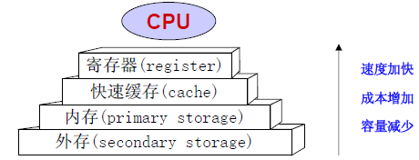
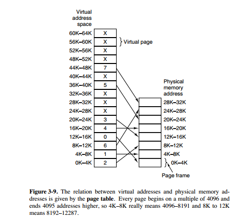

# 概述

存储层次结构

<div align="center">  </div><br>

- 1)    内存储器（内存/主存）
  - CPU能直接访问的存储器。用来存放系统和用户的程序和数据；
  - 其特点是存取速度快，存储方式是以新换旧，断电信息丢失
  - 常见主存有：CPU的高速缓存，电脑的内存条。
- 2)    外存储器（外存/辅存）
  - CPU不能直接访问的存储器。用来存放用户的各种信息；
  - 存取速度对于内存要慢得多，但可用来长期保存用户信息
  - 常见辅存有：硬盘、光盘、U盘、磁盘、移动硬盘等等。


\1.    内存的物理组织

1)    内存地址：把内存分成若干个大小相等的存储单元，每个单元占8位，即1字节。每个存储单元给一个编号，称为内存地址（物理地址、绝对地址、实地址）。

2)    内存地址空间：内存地址的集合称为内存地址空间。一个一维的线性空间。

​                               

\2.    程序的逻辑结构

1)    程序地址：用户编程时所用的地址。

2)    程序地址空间：用户的程序地址的集合称为程序地址空间，它的编址总是从0开始的，可以是一维线性空间，也可以是多维空间。

 

3)    用户程序的主要处理阶段：

l 编辑：形成源文件

l 编译：形成目标文件

l 链接：由多个目标文件或程序库生成可执行文件

l 装入：构造PCB，形成进程。程序必须装到内存才能运行，这需要根据内存的使用情况和分配策略，进行内存空间分配

l 运行：建立的进程获得CPU执行

\3.    操作系统为什么有物理地址和逻辑地址，为什么分页管理内存 （考）（字节一面）

我们编程一般只有可能和逻辑地址打交道，比如在 C 语言中，指针里面存储的数值就可以理解成为内存里的一个地址，这个地址也就是我们说的逻辑地址，逻辑地址由操作系统决定。物理地址指的是真实物理内存中地址，更具体一点来说就是内存地址寄存器中的地址。物理地址是内存单元真正的地址。

\4.    逻辑地址、物理地址、地址映射

1)    逻辑地址（相对地址、虚地址）

用户的程序经过汇编或编译后形成目标代码，目标代码通常采用相对地址的形式。

– 其首地址为0，其余指令中的地址都相对于首地址来编址

– 不能用逻辑地址在内存中读取信息

2)    物理地址（绝对地址，实地址）：内存中存储单元的地址。物理地址可直接寻址。

3)    地址映射

将用户程序中的逻辑地址转换为运行时由机器直接寻址的物理地址。

当程序装入内存时，操作系统为该程序分配一个内存空间，由于程序的逻辑地址与分配到的内存物理地址不一致，而CPU执行指令时，是按物理地址进行的，所以需要进行地址转换。

\5.    存储管理的功能 

1)    存储分配和回收

malloc 函数：申请内存，free 函数：释放内存

按照一定的策略为并发进程分配内存空间，并回收系统或用户释放的空间。

2)    地址变换：将程序地址空间中使用的逻辑地址变换成主存中的地址

–程序加载(装入)时的**重定位技术**

–运行时硬件和软件的**地址变换机构和技术**

3)    存储共享和保护

–代码和数据的共享，提高内存的利用率

–限制只在各自的存储区域内操作，互不干扰

4)    存储器扩充方式：覆盖、交换、请求调入/预调入

\6.    内存的分配和回收

1)    分配结构

2)    放置策略：即选择内存空闲区的策略。

3)    交换策略

4)    调入策略

5)    回收策略：包括回收的时机，及对所回收的内存空闲区和已存在的内存空闲区的调整

\7.    存储分配的方式

1)    直接分配：程序员在编写程序时，或编译编程对源程序进行编译时，直接使用实际的存储地址。

2)    静态分配：程序装入内存时才确定在内存中的位置，且在整个运行期间不能再内存中移动，也不能再申请内存空间。

3)    动态分配：程序装入内存时才确定它们在内存中的位置，但在其整个运行期间可以申请内存空间，也可在内存中移动。一个程序已占有的存储区不再需要时，可以归还给系统。

\8.    重定位（地址映射）：把作业地址空间中使用的逻辑地址变换为存储空间的物理地址的过程

重定位就是建立虚实地址的对应关系，有三种实现方式：

1)    绝对装入：编程或编译时确定地址映射关系。

装入过程简单；不灵活、不适于多道程序系统

2)    **静态地址重定位**（静态地址映射）：程序执行前，由装入程序负责完成地址映射。

在装入作业时，将作业中指令地址和数据地址全部转换为绝对地址。

实现简单，不要硬件的支持；一个程序通常需要占用连续的内存空间、程序装入内存后不能移动，不易实现共享。

3)    动态地址重定位（动态地址映射）：处理机执行程序指令时，由动态地址变换机构（硬件）自动完成地址映射。

动态重定位过程依赖于：重定位寄存器、地址变换机构、目标程序。在装入作业时不进行转换，而是在执行过程中将每一条指令都由硬件的地址转换机构转换成绝对地址。有以下两种实现方式：

a)    重定位寄存器（一般用在段页式存储中）：即基址寄存器，将指令中的有效地址与重定位寄存器中的基址相加得到访问地址，从而实现地址动态修改；

b)    采用页表描述虚、实页面的对应关系。

\9.    内存信息的共享和保护

1)    共享的目的：提供内存利用率

2)    存储保护的目的：保护系统程序区不被用户侵犯；不允许用户程序读写不属于自己地址空间的数据。

3)    存储保护类型：

l 界限保护：上界/下界寄存器或基址/限长寄存器

l 访问方式保护

\10.  内存连续分配方式采用的几种算法及各自优劣。

 

\11.  操作系统的内存管理机制了解吗？内存管理有哪几种方式？

简单分为连续分配管理方式和非连续分配管理方式这两种。连续分配管理方式是指为一个用户程序分配一个连续的内存空间，比如：块式管理 。同样地，非连续分配管理方式允许一个程序使用的内存分布在离散或者说不相邻的内存中，比如：页式管理 和 段式管理。

块式管理 ： 远古时代的计算机操系统的内存管理方式。将内存分为几个固定大小的块，每个块中只包含一个进程。如果程序运行需要内存的话，操作系统就分配给它一块，如果程序运行只需要很小的空间的话，分配的这块内存很大一部分几乎被浪费了。这些在每个块中未被利用的空间，我们称之为碎片。

页式管理 ：把主存分为大小相等且固定的一页一页的形式，页较小，相对相比于块式管理的划分力度更大，提高了内存利用率，减少了碎片。页式管理通过页表对应逻辑地址和物理地址。

段式管理 ： 页式管理虽然提高了内存利用率，但是页式管理其中的页实际并无任何实际意义。 段式管理把主存分为一段段的，每一段的空间又要比一页的空间小很多 。但是，最重要的是段是有实际意义的，每个段定义了一组逻辑信息，例如，有主程序段 MAIN、子程序段 X、数据段 D 及栈段 S 等。 段式管理通过段表对应逻辑地址和物理地址。

段页式管理机制：结合了段式管理和页式管理的优点，把主存先分成若干段，每个段又分成若干页，也就是说 段页式管理机制 中段与段之间以及段的内部的都是离散的。


# 虚拟内存


假如你在玩游戏，你的电脑可能只有2G内存，但你发现依然可以使用，因为操作系统会将你的硬盘进行内存的虚拟化，这样就相当于你在硬盘上可以模拟内存（硬盘的速度很慢，所以你的程序启动的速度也很慢）。

从Java 8开始取消了永久代，使用元空间来进行操作，也就是说Java可以直接使用操作系统的内存进行处理，这个时候就有可能导致每一个线程分配的真实的主机内存空间越大，如果内存不足，操作系统会进行虚拟内存的控制，对于虚拟内存不需要做特别多的处理。

当线程访问量追加，JVM就有可能不断的进行内存申请以及内存回收。

 

虚拟内存是计算机系统内存管理的一种技术。它使得应用程序认为它拥有连续的可用的内存（一个连续完整的地址空间），而实际上，它通常是被分隔成多个物理内存碎片，还有部分暂时存储在外部磁盘存储器上，在需要时进行数据交换。目前，大多数操作系统都使用了虚拟内存，如Windows家族的“虚拟内存”；Linux的“交换空间”等。


虚拟存储器是存储管理的核心概念。

虚拟内存的目的是为了让物理内存扩充成更大的逻辑内存，从而让程序获得更多的可用内存。

为了更好的管理内存，操作系统将内存抽象成地址空间。每个程序拥有自己的地址空间，这个地址空间被分割成多个块，每一块称为一页。这些页被映射到物理内存，但不需要映射到连续的物理内存，也不需要所有页都必须在物理内存中。当程序引用到不在物理内存中的页时，由硬件执行必要的映射，将缺失的部分装入物理内存并重新执行失败的指令。

从上面的描述中可以看出，虚拟内存允许程序不用将地址空间中的每一页都映射到物理内存，也就是说一个程序不需要全部调入内存就可以运行，这使得有限的内存运行大程序成为可能。例如有一台计算机可以产生 16 位地址，那么一个程序的地址空间范围是 0\~64K。该计算机只有 32KB 的物理内存，虚拟内存技术允许该计算机运行一个 64K 大小的程序。

<div align="center">  </div><br>

1)    虚拟存储器（虚存/虚拟存储技术）：为用户提供一种不受物理存储器结构和容量限制的存储技术。现代计算机操作系统都采用了虚拟存储技术。

2)    虚拟存储器的物质基础

虚拟存储器是用户能作为可编址内存对待的虚拟存储空间，它使用户逻辑存储器与物理存储器分离，是操作系统给用户提供一个比真实内存空间大得多的地址空间。

所以物质基础是二级存储器结构（辅存）、动态地址转换机构（DAT）、主存。

3)    虚拟存储的基本原理

要求程序运行前不必全部装入内存且在运行过程中不必一直驻留在内存。

l 在程序装入时**不必**将其全部读到内存，而只需将当前需要执行的部分读入到内存，就可让程序开始执行。

l 在程序执行过程中，如果需执行的指令或访问的数据尚未在内存，则由处理器通知操作系统将相应的程序段或数据调入到内存，然后继续执行程序。

l 另一方面，操作系统将内存中暂时不使用的程序段或数据调出保存在外存上，从而腾出空间存放将要调入的页或段

静态页式管理内存管理方法不能实现虚存。

4)    虚拟存储器的特征

l 虚拟性：能从逻辑上扩充内存容量

l 离散分配：内存空间可非连续分配

l 部分分配：可分成多次调入内存运行

l 多次对换：允许在作业的运行过程中进行换进、换出

5)    虚拟存储器容量的限制

l 用户的地址空间大小受地址字长的限制

l 外存容量

l 虚拟存储器总容量

6)    虚拟存储技术的分类（根据地址空间结构的不同）

l 页式管理

l 段式管理

l 段页式管理

而分区分配是指为如何用户程序分配内存空间的策略。


# 存储管理基本技术

\1.    内外存数据传输的控制

1)    由应用程序控制：覆盖Overlay（同一进程的不同部分）

2)    由操作系统控制（不同一进程之间）

l 交换Swapping（整个进程空间）

l 虚拟存储Virtual store（部分进程空间）：请求调入；预调入

\2.    覆盖（Overlay）

1)    原理：一个程序的几个代码段或数据段，按照时间先后来占用公共的内存空间。

可与分区存储管理配合使用

2)    缺点：用户负担大、程序段的最大长度仍受内存容量限制、不能实现虚拟存储器

\3.    交换（Swapping）

1)    原理：将暂时不能执行的程序或就绪状态的进程送到外存中，从而获得空闲内存空间来装入新程序。

l 程序暂时不能执行的原因：处于阻塞状态，低优先级

l 交换单位为整个进程的地址空间

2)    换出（swap out）：暂停内存中进程的执行，将其整个地址空间保存到外存的交换区中

3)    换入（swap in）：将外存中由阻塞变为就绪的进程的地址空间读入到内存中，并将该进程送到就绪队列

\4.    虚拟存储

1)    请求调入（on demand）

在程序执行时，如果所要访问的程序段或数据段不在内存中，则操作系统自动地从外存将有关的程序段和数据段调入内存。

2)    预调入（on prefetch）

由操作系统预测在不远的将来会访问到的那些程序段和数据段部分，并在它们被访问之前系统选择适当的时机将它们调入内存。


# 分区存储管理

\1.    分区(partition)

1)    原理：把内存分为一些大小**相等或不等**的分区，除操作系统占用一个分区外，其余分区用来存放进程的程序和数据。

2)    特点：适用于多道程序系统和分时系统（最简单）

3)    问题：可能存在内碎片和外碎片

l 内碎片：占用分区之内未被利用的空间

l 外碎片：占用分区之间难以利用的空闲分区（通常是小空闲分区）。

4)    分类：按分区的时机，分区管理可以分为：

l 固定分区法：作业执行前把内存固定地划分区域

l 动态分区法：在作业的处理过程中划分区域（根据需要确定大小）

\2.    固定分区存储管理

1)    基本思想：将内存划分成若干固定大小的分区，每个分区中最多只能装入一个作业。当作业申请内存时，系统按一定的算法为其选择一个适当的分区，并装入内存运行。由于分区大小是事先固定的，因而可容纳作业的大小受到限制，而且当用户作业的地址空间小于分区的存储空间时，造成存储空间浪费。

2)    原理

l 分区大小可以相等，也可以不相等

l 分区个数不变，大小不变

3)    空间的分配与回收

系统设置一张“分区分配表”来描述各分区的使用情况，登记的内容应包括：分区号、起始地址、长度和占用标志。其中占用标志为“0”时，表示目前该分区空闲；否则登记占用作业名（或作业号）。有了“分区分配表”，空间分配与回收工作是比较简单的。

4)    地址转换和存储保护

l 每个分区（一道程序）对应一对界地址寄存器：“下限寄存器”“上限寄存器”。当一个已经被装入主存储器的作业能够得到处理器运行时，进程调度应记录当前运行作业所在的分区号，且把该分区的下限地址和上限地址分别送入下限寄存器和上限寄存器中。处理器执行该作业的指令时必须核对其要访问的绝对地址是否越界。

l 采用静态重定位方式，即由链接/装入程序完成。

5)    优点：简单，要求的硬件支持少

6)    缺点：存在大的碎片，主存利用率低

7)    多作业队列的固定分区管理

为避免小作业被分配到大的分区中造成空间的浪费，可采用多作业队列的方法。即系统按分区数设置多个作业队列，将作业按其大小排到不同的队列中，一个队列对应某一个分区，以提高内存利用率。

\3.    可变分区存储管理

1)    思想：位置和大小都不固定，应作业的要求而设置。不是预先将内存划分分区，而是在作业装入内存时建立分区，使分区的大小正好与作业要求的存储空间相等。这种处理方式使内存分配有较大的灵活性，也提高了内存利用率。但是随着对内存不断地分配、释放操作会引起存储碎片的产生。

2)    数据结构的三种形式

a)    空闲分区表（可用表）

b)    空闲分区链（自由链）

c)    请求表：描述请求内存资源的作业或进程号及所请求的内存大小

3)    空间的分配与回收

a)    分配算法

l 从可用表/自由链中找到一个足以容纳该作业的可用空白区

l 若这个空白区比所需求大，则将它分成2个部分：一部分成为已分配区，剩下部分仍为空白区

l 修改可用表或自由链，并回送一个所分配区的序号或该分区的始址

b)    空闲区表（可用表/自由链）的组织方式

l 按空闲区大小的升序（降序）组织

l 按空闲区首址升序（降序）组织

c)    寻找合适的空闲区是关键，有三种方法：

l 最先适应法(first-fit)：按分区起始地址的递增次序，从头查找，找到符合要求的第一个分区。

l 最佳适应法(best-fit)：按分区大小的递增次序，查找，找到符合要求的第一个分区。

l 最坏适应法(worst-fit)：按分区大小的递减次序，从头查找，找到符合要求的第一个分区。

​                               

 

 

采用可变分区存储管理，系统中的分区个数与分区的大小都在不断地变化，系统利用“空闲区表”来管理内存中的空闲分区，其中登记空闲区的起始地址、长度和状态。当有作业要进入内存时，在“空闲区表”中查找状态为“未分配”且长度大于或等于作业的空闲分区分配给作业，并做适当调整；当一个作业运行完成时，应将该作业占用的空间作为空闲区归还给系统。

在可变式分区分配方案中，某一作业完成后，系统收回其主存空间，并与相邻空闲区合并，为此需修改空闲区表，造成空闲区数减 1 的情况是有上邻空闲区，也有下邻空闲区。

d)    回收算法：

l 检查回收的分区是否与空白区邻接，如有则加以合并，使之成为一个连续的大空白区；

l 修改可用表或自由链

4)    地址转换和存储保护

可变分区存储管理一般采用动态重定位的方式，为实现地址重定位和存储保护，系统设置相应的硬件：基址/限长寄存器（或上界/下界寄存器）、加法器、比较线路等。

基址寄存器用来存放程序在内存的起始地址，限长寄存器用来存放程序的长度。处理机在执行时，用程序中的相对地址加上基址寄存器中的基地址，形成一个绝对地址，并将相对地址与限长寄存器进行计算比较，检查是否发生地址越界。

5)    存储碎片与程序的移动

所谓碎片（内/外零头）是指内存中出现的一些零散的小空闲区域。由于碎片都很小，无法再利用。如果内存中碎片很多，将会造成严重的存储资源浪费。解决碎片的方法是移动所有的占用区域，使所有的空闲区合并成一片连续区域，这一技术称为移动技术（内存紧缩，紧凑/拼接技术）。移动技术除了可解决碎片问题还使内存中的作业进行扩充。显然，移动带来系统开销加大，并且当一个作业如果正与外设进行I/O时，该作业是无法移动的。

a)    紧缩时机：每个分区释放后，或内存分配找不到满足条件的空闲分区时

b)    额外开销：内存搬移占用CPU时间；程序“浮动”，其重定位需要硬件支持

 

内存碎片分为：内部碎片和外部碎片。

内部碎片就是已经被分配出去（能明确指出属于哪个进程）却不能被利用的内存空间；

内部碎片是处于区域内部或页面内部的存储块。占有这些区域或页面的进程并不使用这个存储块。而在进程占有这块存储块时，系统无法利用它。直到进程释放它，或进程结束时，系统才有可能利用这个存储块。

单道连续分配只有内部碎片。多道固定连续分配既有内部碎片，又有外部碎片。

外部碎片指的是还没有被分配出去（不属于任何进程），但由于太小了无法分配给申请内存空间的新进程的内存空闲区域。

外部碎片是出于任何已分配区域或页面外部的空闲存储块。这些存储块的总和可以满足当前申请的长度要求，但是由于它们的地址不连续或其他原因，使得系统无法满足当前申请。

使用伙伴系统算法。

 

三种分配算法的比较

• 最先（首次）适应算法

– 尽可能地利用了低地址空间，从而保证高地址有较大的空闲区来放置要求内存较多的进程或作业。

– 该算法的分配和释放的时间性能较好

• 最佳适应算法

– 利用最接近于所要求的内存大小。若存储空间中有正好等于所要求大小的空白区，则必然被选中。

– 由于空白区一般不可能正好和要求的的相等，这往往使剩下的空白区都比较小，形成“碎片”。

– 寻找一个较大空白区时，要花费较多的时间；回收一个分区时，为了把它插入到空白区链中合适的位置上开销较大。

• 最坏适应算法

– 避免了空闲区越分越小、留下碎片的问题，即每次分配时，总是将最大的空闲区切去一部分分配给请求者（使分配后的剩余部分可能仍是一个较大的空闲区，仍能进行再分配）。


# 页式管理

## 分页系统地址映射

内存管理单元（MMU）管理着地址空间和物理内存的转换，其中的页表（Page table）存储着页（程序地址空间）和页框（物理内存空间）的映射表。

一个虚拟地址分成两个部分，一部分存储页面号，一部分存储偏移量。

下图的页表存放着 16 个页，这 16 个页需要用 4 个比特位来进行索引定位。例如对于虚拟地址（0010 000000000100），前 4 位是存储页面号 2，读取表项内容为（110 1），页表项最后一位表示是否存在于内存中，1 表示存在。后 12 位存储偏移量。这个页对应的页框的地址为 （110 000000000100）。

<div align="center">  </div><br>

\1.    请求页式存储管理

1)    问题的提出：纯页式（静态）存储管理提高了内存的利用效率，但并不为用户提供虚存

2)    请求分页的实现思想

1)    和纯分页的相同点：逻辑空间分页，内存空间分块。

2)    和纯分页的不同点：请求分页技术当一个用户程序要调入内存时，不是将该程序全部装入内存，而是只装入部分页到内存，就可启动程序运行，在运行的过程中，如果发现要运行的程序或要访问数据不在内存，则向系统发出缺页中断请求，系统在处理这个中断时，将在外存相应的页调入内存，该程序继续运行。

3)    请求分页要解决的问题

1)    如何发现执行的程序或访问的数据不在内存

2)    调入策略：程序或数据什么时候调入内存

3)    淘汰策略：当一些页调入内存时，内存没有空闲内存时，将淘汰哪些页

4)    数据结构

为了实现请求分页技术，页表应增加相应的内容，反映该页是否在内存，在外存的位置，在内存的时间的长短等。

1)    中断位（状态位）：表示该页是否在内存（1表示不在）

2)    引用位：表示最近是否有进程访问过（1表示有）

3)    修改位： 表示该页调入内存后是否有修改（1表示修改过）

\2.    调入策略

1)    预调：系统根据作业（进程）运行的情况，预测哪些页将要运行，在其运行之前先行调入内存（系统很难完全预计作业的运行情况，因此难以实现）。

2)    请调：进程在执行的过程中，发现要执行的程序或要处理的数据不在内存时，产生缺页中断（此时用户进程被中断，转OS的调页程序把外存中相应的页面调入内存）。

\3.    淘汰策略

1)    OS的调页程序把外存上的页调入到内存时，如果此时内存无空闲块，必须把已在内存中的某一页淘汰掉。用来选择淘汰哪一页的规则叫置换算法。

2)    刚被淘汰出去的页，不久又要访问，而调入不久又被淘汰，然后又要访问，又调入，如此反复，使得系统把大部分时间开销在了页面的调入和调出上的现象——抖动、颠簸。

在请求分页存储管理中，从主存（DRAM）中刚刚换出（Swap Out）某一页面后（换出到Disk），根据请求马上又换入（Swap In）该页，这种反复换出换入的现象，称为系统颠簸，也叫**系统抖动**。

页式管理中也是虚拟地址变换为内存页面物理地址的方式采用的是动态地址重定位技术。

页式管理把页式虚拟地址与内存页面为ulidizhi建立--对应的页表，并用相应的硬件地址变换机构来解决离散地址变换问题。

页式管理采用请求调页或预调页技术实现了内外存储器的统一管理。所以也是管理时内存页面的分配与回收己和页面淘汰计数及缺页处理技术结合起来，所以是内存动态分配。

 

不需要换页就不会发生抖动。

 

3)    评价指标：缺页次数和缺页率（缺页率为缺页次数与总访问次数之比）


## 页面置换算法

在程序运行过程中，如果要访问的页面不在内存中，就发生缺页中断从而将该页调入内存中。此时如果内存已无空闲空间，系统必须从内存中调出一个页面到磁盘对换区中来腾出空间。

页面置换算法和缓存淘汰策略类似，可以将内存看成磁盘的缓存。在缓存系统中，缓存的大小有限，当有新的缓存到达时，需要淘汰一部分已经存在的缓存，这样才有空间存放新的缓存数据。

页面置换算法的主要目标是使页面置换频率最低（也可以说缺页率最低）。


 

\1.    请求页式存储管理常见的置换算法有四种：

1)    随机淘汰算法

2)    理想型淘汰算法（最佳，OPT）：预测哪个页面最晚出现，就替换哪个页面。

3)    最近最久未使用页面置换算法（**近期最少使用算法**）LRU：Least Recently Used

根据数据的历史访问记录来进行淘汰数据，其核心思想是“如果数据最近被访问过，那么将来被访问的几率也更高”。

4)    最近未使用NRU

5)    先进先出（First In First Out ，FIFO）：

选择换出的页面是最先进入的页面。

该算法会将那些经常被访问的页面也被换出，从而使缺页率升高。

6)    第二次机会算法

7)    时钟法

8)    轮转法（RR）

9)    最常使用页面置换算法（MFU）：Most Frequently Used 

10)  最不经常使用算法（LFU）：Least Frequently Used。


### 1. 最佳

> OPT, Optimal replacement algorithm

所选择的被换出的页面将是最长时间内不再被访问，通常可以保证获得最低的缺页率。

是一种理论上的算法，因为无法知道一个页面多长时间不再被访问。

举例：一个系统为某进程分配了三个物理块，并有如下页面引用序列：

```html
7，0，1，2，0，3，0，4，2，3，0，3，2，1，2，0，1，7，0，1
```

开始运行时，先将 7, 0, 1 三个页面装入内存。当进程要访问页面 2 时，产生缺页中断，会将页面 7 换出，因为页面 7 再次被访问的时间最长。

### 2. 最近最久未使用

> LRU, Least Recently Used

虽然无法知道将来要使用的页面情况，但是可以知道过去使用页面的情况。LRU 将最近最久未使用的页面换出。

为了实现 LRU，需要在内存中维护一个所有页面的链表。当一个页面被访问时，将这个页面移到链表表头。这样就能保证链表表尾的页面是最近最久未访问的。

因为每次访问都需要更新链表，因此这种方式实现的 LRU 代价很高。

```html
4，7，0，7，1，0，1，2，1，2，6
```

<div align="center">  </div><br>

### 3. 最近未使用

> NRU, Not Recently Used

每个页面都有两个状态位：R 与 M，当页面被访问时设置页面的 R=1，当页面被修改时设置 M=1。其中 R 位会定时被清零。可以将页面分成以下四类：

- R=0，M=0
- R=0，M=1
- R=1，M=0
- R=1，M=1

当发生缺页中断时，NRU 算法随机地从类编号最小的非空类中挑选一个页面将它换出。

NRU 优先换出已经被修改的脏页面（R=0，M=1），而不是被频繁使用的干净页面（R=1，M=0）。

###  4. 先进先出

> FIFO, First In First Out

选择换出的页面是最先进入的页面。

该算法会将那些经常被访问的页面也被换出，从而使缺页率升高。

### 5. 第二次机会算法

FIFO 算法可能会把经常使用的页面置换出去，为了避免这一问题，对该算法做一个简单的修改：

当页面被访问 (读或写) 时设置该页面的 R 位为 1。需要替换的时候，检查最老页面的 R 位。如果 R 位是 0，那么这个页面既老又没有被使用，可以立刻置换掉；如果是 1，就将 R 位清 0，并把该页面放到链表的尾端，修改它的装入时间使它就像刚装入的一样，然后继续从链表的头部开始搜索。

<div align="center">  </div><br>

### 6. 时钟

> Clock

第二次机会算法需要在链表中移动页面，降低了效率。时钟算法使用环形链表将页面连接起来，再使用一个指针指向最老的页面。

<div align="center">  </div><br>

\1.    静态页面管理

1)    页式地址转换：用户作业的地址空间被分割成若干大小相等的区域，称作页或页面。相应的，将内存的存储空间也分为也页大小相等的区域，称作块（Page Frame）。在作业分配存储空间时，总是以块为单位分配，简单说就是将任意页分配到任意块中。（注意：作业调度时必须一次将全部页一次调度，故内存中块不足时等待）

2)    段式地址转换：简单与页式相区别在于段式按照逻辑关系将作业进行分段，使每一段逻辑关系完整，不会像页式那样，可能由于页面大小固定的原因，使一个作业被分成两半、多半。段式中，每段被分配一个连续的存储空间，各段之间是独立的，每段均有自己的地址。


# 分段

\1.    段式存储管理的实现原理：段式管理的内存分配与释放；段式管理的地址变换。

\2.    段的共享和保护

\3.    段式存储管理的优缺点


虚拟内存采用的是分页技术，也就是将地址空间划分成固定大小的页，每一页再与内存进行映射。

下图为一个编译器在编译过程中建立的多个表，有 4 个表是动态增长的，如果使用分页系统的一维地址空间，动态增长的特点会导致覆盖问题的出现。

<div align="center">  </div><br>

分段的做法是把每个表分成段，一个段构成一个独立的地址空间。每个段的长度可以不同，并且可以动态增长。

<div align="center">  </div><br>

# 段页式

程序的地址空间划分成多个拥有独立地址空间的段，每个段上的地址空间划分成大小相同的页。这样既拥有分段系统的共享和保护，又拥有分页系统的虚拟内存功能。

# 分页与分段的比较

- 对程序员的透明性：分页透明，但是分段需要程序员显式划分每个段。

- 地址空间的维度：分页是一维地址空间，分段是二维的。

- 大小是否可以改变：页的大小不可变，段的大小可以动态改变。

- 出现的原因：分页主要用于实现虚拟内存，从而获得更大的地址空间；分段主要是为了使程序和数据可以被划分为逻辑上独立的地址空间并且有助于共享和保护。


\1.    分页和分段的异同之处

1)    对程序员的透明性：分页透明，但是分段需要程序员显式划分每个段。段是信息的逻辑单位，它是根据用户的需要划分的，因此段对用户是可见的；页是信息的物理单位，是为了管理主存的方便而划分的，对用户是透明的。

2)    大小是否可变：页大小固定，由系统决定；段的大小可动态改变，由它完成的功能决定。

3)    地址空间的维度：页向用户提供的是一维地址空间；段向用户提供二维地址空间。

4)    保护和共享：页的保护和共享受限；段是信息的逻辑单位，便于存储保护和信息的共享

5)    出现的原因：分页主要用于实现虚拟内存，从而获得更大的地址空间；分段主要是为了使程序和数据可以被划分为逻辑上独立的地址空间并且有助于共享和保护。


# 物理地址和抖动问题

\1.    局部性原理

\2.    抖动（thrashing）（颠簸）

1)    抖动的原因（缺页率或缺段率过高）：

l 页面淘汰算法不合理

l 分配给进程的物理页面数太少

 

 

使用malloc系统调用分配的内存是在堆上分配的。

 

RAID 10 、RAID 30 、RAID 50 为 RAID0 与 RAID 1 、3、 5组合。RAID 0 并行磁盘，不减容量，提高读写速度。RAID 1 镜像盘，如其名，可用容量一半，没有冗余校验功能，写速度较 RAID 0 慢。RAID 5 （有效容量 3//4 ?）是 RAID 3 、4的改良版，使用奇偶冗余校验、以及大条带交叉存储的办法突破 校验盘 i/o瓶颈。RAID 2 为海明校验 ，控制复杂，成本高等，很少使用。

 

在虚拟内存管理中，地址变换机构将逻辑地址变为物理地址，形成该逻辑地址的阶段是链接。

 

实现虚拟存储的目的是扩充主存容量。

2、什么是虚拟存储：

根据程序执行的互斥性和局部性两个特点，我们允许作业装入的时候只装入一部分，另一部分放在磁盘上，当需要的时候再装入到主存，这样以来，在一个小的主存空间就可以运行一个比它大的作业。同时，用户编程的时候也摆脱了一定要编写小于主存容量的作业的限制。也就是说，用户的逻辑地址空间可以比主存的绝对地址空间要大。对用户来说，好像计算机系统具有一个容量很大的主存储器，称为“虚拟存储器”。

虚拟存储（Storage Virtualization）是指将多个不同类型、独立存在的物理存储体，通过软、硬件技术，集成转化为一个逻辑上的虚拟的存储单元，集中管理供用户统一使用。这个虚拟逻辑存储单元的存储容量是它所集中管理的各物理存储体的存储量的总和，而它具有的访问带宽则在一定程度上接近各个物理存储体的访问带宽之和。

 

\3.    虚拟内存的定义及实现方式。

虚拟内存的作用同物理内存一样，只不过是从**硬盘存储空间**划出的部分，来完成内存的工作，由于不是真正的内存，所以被称为虚拟内存。因为计算机所支持的最大内存是由该计算机的地址位数决定的，也就是计算机的最大寻址能力。例如，32位机的寻址能力为2的32次方，大约为4G。所以虚拟内存的大小也受**计算机地址位数**的限制。


