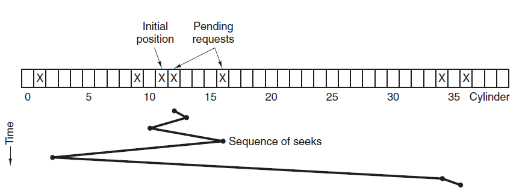

# 一、概念

\1.    文件：

一段程度或数据的集合

在计算机系统中，文件被解释为一组赋名的相关联字符流的集合，或是相关联记录的集合。


\2.    文件系统：操作系统中与管理文件有关的软件和数据称为文件系统。

文件系统负责为用户建立、撤销、读写、修改和复制文件；还负责完成对文件的按名存取和存取控制。

\3.    文件系统的功能

- 1)    系统的角度
  - l 文件空间管理
  - l 逻辑结构
  - l 物理结构
  - l 信息查找
  - l 信息共享和保护
- 2)    用户的角度：按名存取

\4.    文件的类型：

分类的目的：对不同文件进行管理，提高系统效率。

- 1)    按文件性质和用途分类
  - l 系统文件
  - l 用户文件
  - l 库文件
- 2)    按文件的保护方式分类
  - l 只读文件
  - l 读写文件
  - l 可执行文件
  - l 不保护文件
- 3)    按文件组合和处理方式分类
  - l 普通文件
  - l 目录文件
  - l 特殊文件
- 4)    按信息流分类
  - l 输入文件
  - l 输出文件
  - l 输入/输出文件
- 5)    按文件中的数据形式分类
  - l 源文件
  - l 目标文件
  - l 可执行文件

# 二、 文件的组织结构

\5.    文件的逻辑结构和存取方法

- 1)    文件的逻辑结构：用户的可见结构，它独立于在外存上的物理存储。
- 2)    文件的逻辑结构有两种形式：字符流式的无结构文件；记录式的有结构文件
- 3)    记录式结构文件：
  - l 连续结构
  - l 多重结构
  - l 转置结构
  - l 顺序结构
- 4)    文件的存取方法
  - l 顺序存取方式
  - l 随机（直接）存取方式
  - l 按键存取方式

\6.    文件的物理结构和存储设备

- 5)    文件的物理结构：文件在外存上的存储结构。它依赖于外存的物理存储介质。

  - l 顺序结构（连续文件）
  - l 链接结构（串联文件）
  - l 索引结构（索引文件）

- 6)    文件存储设备

  存储设备的特性决定了文件的存取设备和方法。

  - l 顺序存取设备：磁带
  - l 直接存取设备：磁盘

 

## I、磁盘结构

<div align="center">  </div><br>

- 盘面（Platter）：一个磁盘有多个盘面；
- 磁道（Track）：盘面上的圆形带状区域，一个盘面可以有多个磁道；
- 扇区（Track Sector）：磁道上的一个弧段，一个磁道可以有多个扇区，它是最小的物理储存单位，目前主要有 512 bytes 与 4 K 两种大小；
- 磁头（Head）：与盘面非常接近，能够将盘面上的磁场转换为电信号（读），或者将电信号转换为盘面的磁场（写）；
- 制动手臂（Actuator arm）：用于在磁道之间移动磁头；
- 主轴（Spindle）：使整个盘面转动。

 

 

## II、磁盘调度算法

\7.    磁盘调度算法

读写一个磁盘块的时间的影响因素有：

- 旋转时间（主轴转动盘面，使得磁头移动到适当的扇区上）
- 寻道时间（制动手臂移动，使得磁头移动到适当的磁道上）
- 实际的数据传输时间

其中，寻道时间最长，因此磁盘调度的主要目标是使磁盘的平均寻道时间最短。


1)    先来先服务

> （First Come First Served ，FCFS）

按照磁盘请求的顺序进行调度。

优点是公平和简单。缺点也很明显，因为未对寻道做任何优化，使平均寻道时间可能较长。

2)    最短寻道时间优先

> （Shortest Seek Time First ，SSTF）

优先调度与当前磁头所在磁道距离最近的磁道。

虽然平均寻道时间比较低，但是不够公平。如果新到达的磁道请求总是比一个在等待的磁道请求近，那么在等待的磁道请求会一直等待下去，也就是出现饥饿现象。具体来说，两端的磁道请求更容易出现饥饿现象。

<div align="center">  </div><br>

 

3)    扫描算法

> （SCAN，电梯算法） 

电梯总是保持一个方向运行，直到该方向没有请求为止，然后改变运行方向。

电梯算法（扫描算法）和电梯的运行过程类似，总是按一个方向来进行磁盘调度，直到该方向上没有未完成的磁盘请求，然后改变方向。

因为考虑了移动方向，因此所有的磁盘请求都会被满足，解决了 SSTF 的饥饿问题。

 <div align="center">  </div><br>

 

 

# 三、 文件存储空间管理

\8.    常用的空闲空间的管理方法

1)    空闲文件目录法（空闲块表）

将所有空闲块记录在一个表中，即空闲块表

2)    空闲块链法

把所有空闲块链成一个链

3)    成组链接法

把文件存储设备中的所有空闲块按50块分为一组

成组链接法是Unix系统中常见的管理空闲盘区的方法。

当系统要为用户分配文件所需的盘块时，须调用盘块分配过程来完成。该过程首先检查空闲盘块号栈是否上锁，如未上锁，便从栈顶取出一空闲盘块号，将与之对应的盘块分配给用户，然后将栈顶指针下移一格。若该盘块号已是栈底，即S.free(0)，这是当前栈中最后一个可分配的盘块号。由于在该盘块号所对应的盘块中记有下一组可用的盘块号，因此，须调用磁盘读过程，将栈底盘块号所对应盘块的内容读入栈中，作为新的盘块号栈的内容，并把原栈底对应的盘块分配出去(其中的有用数据已读入栈中)。然后，再分配一相应的缓冲区(作为该盘块的缓冲区)。最后，把栈中的空闲盘块数减1并返回。

 

在系统回收空闲盘块时，须调用盘块回收过程进行回收。它是将回收盘块的盘块号记入空闲盘块号栈的顶部，并执行空闲盘块数加1操作。当栈中空闲盘块号数目已达100时，表示栈已满，便将现有栈中的100个盘块号，记入新回收的盘块中，再将其盘块号作为新栈底。

4)    位示图链接法

用一串二进制位反映磁盘空间的分配使用情况, 每个物理块对应一位, 分配物理块为1，否则为0。

 

## I、编译系统

以下是一个 hello.c 程序：

```C
#include <stdio.h>

int main()
{
    printf("hello, world\n");
    return 0;
}
```

在 Unix 系统上，由编译器把源文件转换为目标文件。

```bash
gcc -o hello hello.c
```

这个过程大致如下：

<div align="center">  </div><br>

- 预处理阶段：处理以 # 开头的预处理命令；
- 编译阶段：翻译成汇编文件；
- 汇编阶段：将汇编文件翻译成可重定位目标文件；
- 链接阶段：将可重定位目标文件和 printf.o 等单独预编译好的目标文件进行合并，得到最终的可执行目标文件。

## II、静态链接

静态链接器以一组可重定位目标文件为输入，生成一个完全链接的可执行目标文件作为输出。链接器主要完成以下两个任务：

- 符号解析：每个符号对应于一个函数、一个全局变量或一个静态变量，符号解析的目的是将每个符号引用与一个符号定义关联起来。
- 重定位：链接器通过把每个符号定义与一个内存位置关联起来，然后修改所有对这些符号的引用，使得它们指向这个内存位置。

<div align="center">  </div><br>

 

 

## III、目标文件

- 可执行目标文件：可以直接在内存中执行；
- 可重定位目标文件：可与其它可重定位目标文件在链接阶段合并，创建一个可执行目标文件；
- 共享目标文件：这是一种特殊的可重定位目标文件，可以在运行时被动态加载进内存并链接；

 

## IV、动态链接

静态库有以下两个问题：

- 当静态库更新时那么整个程序都要重新进行链接；
- 对于 printf 这种标准函数库，如果每个程序都要有代码，这会极大浪费资源。

共享库是为了解决静态库的这两个问题而设计的，在 Linux 系统中通常用 .so 后缀来表示，Windows 系统上它们被称为 DLL。它具有以下特点：

- 在给定的文件系统中一个库只有一个文件，所有引用该库的可执行目标文件都共享这个文件，它不会被复制到引用它的可执行文件中；
- 在内存中，一个共享库的 .text 节（已编译程序的机器代码）的一个副本可以被不同的正在运行的进程共享。

<div align="center">  </div><br>

 

 

# 四、 文件目录的管理

\9.    文件组成

一个文件包括两部分：文件体和文件说明

文件体：文件本身的信息

文件说明（文件控制块FCB）：存放了为管理文件所需的相关信息，包括文件名、第一个物理块的地址、存取控制和管理信息等。


\10.  文件的目录

把文件说明按一定的逻辑结构存放到物理存储块的一个表目中，该表目称为文件目录。

5)    单级目录

6)    二级目录

7)    多级目录


\11.  便于共享的文件目录

- 8)    绕道法
- 9)    链接法
- 10)  基本文件目录表BFD
- \12.  目录管理
- 11)  目录文件：目录以文件的形式存储在外存上

# 五、 文件存取控制

\13.  控制验证模块验证用户权限的方式

12)  存取控制矩阵

13)  存取控制表

14)  口令

15)  密码术

 

# 六、 文件的使用

\14.  建立

\15.  删除

\16.  打开

\17.  关闭

\18.  读文件

\19.  写文件

 

 

\20.  文件系统的层次模型


**以下部分待整理**

文件系统在创建一个文件时，为它建立一个文件目录项

文件目录项包含有关文件的信息，包括属性、位置和所有权等，这些信息主要由操作系统进行管理。

 

顺序文件是指按记录进入文件的先后顺序存放、其**逻辑顺序和物理顺序一致**的文件。

一切存储在顺序存取存储器(如磁带)上的文件，都只能是顺序文件。

插入新的记录时需要将整个文件复制。插入新纪录时不能插入到已经有顺序的文件的中间，只能在末尾。

用顺序查找法存取第i个记录，必须先搜索在它之前的i-1个记录。如果查找第i个记录，必须从头找起。

如要更新文件中的记录，必须将整个文件复制。如果要更新，必须复制整个文件，更新，然后在放到另外一块顺序存储器上。

 

文件系统中实现按名存取的功能是通过查找**文件目录**来实现的。


