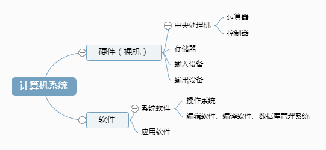
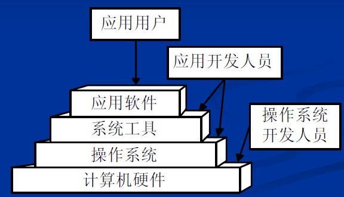

# 概念

计算机系统的组成

  
 

操作系统与硬件和其它软件的关系

  
 

操作系统的定义

操作系统是计算机系统中的一个系统软件，它是这样一些程序模块的集合——它们管理和控制计算机系统中的硬件及软件**资源**，合理地组织计算机工作流程，以便有效地利用这些资源为用户提供一个具有足够的功能、使用方便、可扩展、安全和可管理的工作环境，从而在计算机与其用户之间起到接口的作用。

 

操作系统的作用

- 从用户观点看，操作系统是用户与计算机硬件之间的接口。系统命令、系统调用。
- 从系统观点看，操作系统是计算机资源的管理者。
- 从软件观点看，操作系统是程序和数据结构的集合。
- 从进程观点（运行的角度）看，操作系统是由一些可同时独立运行的进程和一个对这些进程进行协调的核心组成

 

# 历史

> 和 ENIAC 相比，EDVAC 的重大改进主要有两方面：
>
> - 把十进制改成二进制，这可以充分发挥电子元件高速运算的优越性；
> - 把程序和数据一起存储在计算机内，这样就可以使全部运算成为真正的自动过程。

 

\5.    手工操作阶段

\6.    早期批处理(Simple Batch Processing System)

\7.    多道批处理系统/多道程序系统（Multiprogrammed Batch Processing System/Multiprogramming System）

多道程序设计：两个或两个以上程序在计算机系统中同处于开始到结束之间的状态。

l 多道程序设计的基本思想：在内存中同时存放多道程序，在管理程序的控制下交替执行，这些作业共享CPU和系统其他资源。指在一台处理机上**并发**运行多个程序。

l 多道程序运行的特点

Ø 多道：内存中同时存放几道独立的程序

Ø 宏观上并行：多道程序都处于运行状态，但都未运行完

Ø 微观上串行：多道程序交替使用CPU

引入**多道程序设计**技术的根本目的是为了**提高****CPU****的利用率**，充分发挥计算机系统部件的并行性，现代计算机系统都采用了多道程序设计技术。

l 多道批处理系统的特征

Ø 多道性

Ø 无序性

Ø 调度性

l 多道程序系统和多处理系统的区别：前者指多个程序同时在内存中交替运行；后者指系统配置多个CPU处理器。

\8.    分时操作系统(Time-sharing System)

分时操作系统是一种联机的多用户交互式的操作系统。一般采用时间片轮转的方式使一台计算机为多个终端服务。对每个用户能保证足够快的响应时间，并提供交互会话能力。分时操作系统感觉每个用户独占操作系统一样。

分时操作系统允许在一台主机上同时连接多台终端，多个用户可以通过各自的终端同时交互地使用计算机。

一般情况下，分时系统中处于就绪状态的进程最多。

\9.    实时操作系统(Real-time System)

\10.  通用操作系统

\11.  操作系统的进一步发展

一、 操作系统的基本类型

\1.    批处理操作系统

\2.    分时系统

分时操作系统是一个联机的多用户交互式的操作系统。例如：UNIX、CTSS、MUTIS

l 特征：多路性；交互性；独立性；及时性

Ø 多路性（多用户同时性）：多用户同时在各自终端上使用同一CPU和其他资源，充分发挥系统的效率。

Ø 交互性（同时性）：用户与系统进行人机对话。用户在终端上可以直接输入、调试和运行自己的程序，在本机上是修改程序中的错误，直接获得结果

Ø 独立性：用户可彼此独立操作，互不干扰，互不混淆。

Ø 及时性：用户在短时间内可得到系统的及时回答。

\3.    实时系统

\4.    通用操作系统

\5.    个人计算机上的操作系统

Windows系列和Linux系统

linux不属于任何一个公司，这是一个完全开放源代码的操作系统，目前由全球程序员和爱好者共同维护和更新

\6.    网络操作系统

Novell公司的Netware

\7.    分布式操作系统

分布式系统：系统的各组件分布于网络上多台计算机，各组件彼此直接仅仅通过消息传递来通信并协调行动。

# 基本特征

## 1. 并发

并发：

- **并发**指两个或多个事件在**同一时间间隔内**发生。操作系统的并发性是指计算机系统中同时存在多个运行着的程序，因此它应该具有处理和调度多个程序同时执行的能力。
- 在这种多道程序环境下，一段时间内，宏观上有多个程序在同时运行，而每一时刻，单处理器环境下实际仅能有一道程序执行，故微观上这些程序还是在分时地交替执行。操作系统的并发性是通过分时得以实现的。
- 操作系统通过引入进程和线程，使得程序能够并发运行。

并行：

- 并行性是指计算机系统具有可以**同时**进行运算或操作的特性，同一时刻能运行多个指令，在同一时间完成两种或两种以上的工作。
- 并行性需要有相关硬件的支持，如多流水线、多处理器硬件环境或者分布式计算系统。

## 2. 共享

共享指系统中的资源（硬件资源和信息资源）可以被多个并发执行的程序共同使用，而不是被其中一个独占。

资源共享有两种方式：互斥访问和同时访问。

互斥共享的资源称为临界资源，例如打印机等，在同一时刻只允许一个进程访问，需要用同步机制来实现互斥访问。（指路：进程互斥）

并发和共享是操作系统的最基本特征，互为依存。并发执行的要求引出了资源的共享；而资源共享的管理又直接影响到程序的并发执行。

## 3. 虚拟

虚拟性是一种管理技术，<u>把物理上的一个实体变成逻辑上的多个对应物</u>，或把物理上的多个实体变成逻辑上的一个对应物的技术。采用虚拟技术的目的是为用户提供易于使用、方便高效的操作环境。

主要有两种虚拟技术：时（时间）分复用技术和空（空间）分复用技术。

多个进程能在同一个处理器上并发执行使用了时分复用技术，让每个进程轮流占用处理器，每次只执行一小个时间片并快速切换。

虚拟内存使用了空分复用技术，它将物理内存抽象为地址空间，每个进程都有各自的地址空间。地址空间的页被映射到物理内存，地址空间的页并不需要全部在物理内存中，当使用到一个没有在物理内存的页时，执行页面置换算法，将该页置换到内存中。

## 4. 异步

> asynchronism

在多道程序环境下，允许多个程序并发执行，但由于资源有限，进程的执行不是一贯到底。而是走走停停，以不可预知的速度向前推进，这就是进程的异步性。

异步性使得操作系统运行在一种随机的环境下，可能导致进程产生与时间有关的错误。但是只要运行环境相同，操作系统必须保证多次运行程序，都获得相同的结果。

# 基本功能（#）

<table><tr><td bgcolor=yellow>操作系统的核心内容  </td></tr></table>

（美团一面） 

## 1. 进程管理

处理机管理（进程管理）

处理机的分配和运行都是以进程为基本单位的。

- 进程控制：创建和撤销进程；创建进程
- 进程同步：对多个进程的运行进行协调。协调方式有：进程互斥方式和进程同步方式
- 进程通信：实现进程之间的信息交换
- 死锁处理
- 处理机调度：可按照一定的算法将处理机分配给各个进程。包括作业调度和进程调度

## 2. 内存管理

存储管理（内存管理）

- 主要任务：为多道程序的运行提供良好的环境，方便用户使用存储器，提高存储器的利用率以及可以为这些程序从逻辑上扩充内存。
- 主要功能：内存分配、内存保护与共享、地址映射和内存扩充（虚拟内存）。

## 3. 文件管理

信息管理（文件管理）

- 主要任务是对用户文件和系统文件进行管理以方便用户使用，并保证文件的安全性。
- 文件管理应具有对文件存储空间的管理、目录管理、文件的读/写管理以及文件的共享与保护等功能。

## 4. 设备管理

- 主要任务：
  - 完成用户进程提出的 I/O 请求；为用户进程分配其所需的 I/O 设备；
  - 提高 CPU 和 I/O 设备的利用率；提高 I/O 速度；方便用户使用 I/O 设备。
- 功能：缓冲管理、设备分配、设备处理、虚拟设备等。

## 5. 用户接口

# 系统调用

系统调用（system call），又称为系统呼叫，指运行在使用者空间的程序向操作系统内核请求需要更高权限运行的服务。

如果一个进程在用户态需要使用内核态的功能，就进行系统调用从而陷入内核，由操作系统代为完成。

  
 

Linux 的系统调用主要有以下这些：

| Task | Commands |
| :---: | --- |
| 进程控制 | fork(); exit(); wait(); |
| 进程通信 | pipe(); shmget(); mmap(); |
| 文件操作 | open(); read(); write(); |
| 设备操作 | ioctl(); read(); write(); |
| 信息维护 | getpid(); alarm(); sleep(); |
| 安全 | chmod(); umask(); chown(); |

\1.    系统调用与普通过程调用的不同之处

- 1)    系统调用是动态调用，而CALL调用方式是静态调用；
- 2)    执行状态不同
- 3)    进入方式不同
- 4)    与进程调度的关系不同
- 5)    嵌套或递归调用

\2.    处理机的执行状态

在UNIX/Linux系统中，执行状态分为两种：管态和目态。

1)    目态（用户态）：是用户程序执行时机器所处的状态。

l 在此状态下禁止使用特权指令，不能直接取用系统资源与改变机器状态，并且只允许用户程序访问自己的存储区域。

l 机器处于目态时，程序只能执行非特权指令。用户程序只能在目态下运行，如果用户程序在目态下执行特权指令，硬件将发生中断，由操作系统获得控制，特权指令执行被禁止，这样可以防止用户程序有意或无意的破坏系统。

2)    管态（系统态，核心态或特权状态）：

当CPU处理系统程序的时候，CPU会转为管态，CPU在管态下可以执行指令系统的全集。（包括特权指令与非特权指令）。

\3.    用户态和核心态的区别。

两者的主要区别：进程能否获取计算机的所有资源（核心态可以，用户态则受到限制）。

凡是涉及到计算机根本运行的事情都应该在内核态下执行，而中断、时钟日期、存储映象图都属于系统级（相对应的是用户级）的资源，对这些资源的修改都必须在核心态，但是读取则没有强制要求。

\4.    管态与目态转换

1)    从管态到目态可通过修改程序状态字来实现，这将伴随由操作系统程序到用户程序的转换。CPU的状态属于程序状态字PSW的一位：系统模式(0)，用户模式(1)。

2)    从目态转换为管态的唯一途径是中断(访管指令或系统调用)。

\5.    特权指令：

特权指令指具有特殊权限的指令。

这类指令只用于操作系统或其他系统软件，一般不直接提供给用户使用。在多用户、多任务的计算机系统中特权指令必不可少。主要用于系统资源的分配和管理，包括改变系统工作方式，检测用户的访问权限，修改虚拟存储器管理的段表、页表，完成任务的创建和切换等。

特权指令可以在任意的时间执行。

# 大内核和微内核

## 1. 大内核

大内核是将操作系统功能作为一个紧密结合的整体放到内核。

由于各模块共享信息，因此有很高的性能。

## 2. 微内核

由于操作系统不断复杂，因此将一部分操作系统功能移出内核，从而降低内核的复杂性。移出的部分根据分层的原则划分成若干服务，相互独立。

在微内核结构下，操作系统被划分成小的、定义良好的模块，只有微内核这一个模块运行在内核态，其余模块运行在用户态。

因为需要频繁地在用户态和核心态之间进行切换，所以会有一定的性能损失。

  
 

# 总结

操作系统本质是什么 

（阿里三面） 

你觉得操作系统这门课在讲什么 

（阿里三面） 

操作系统运行程序时是怎么加载到内存的

（美团一面） 