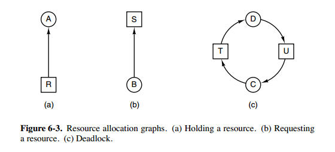

# 进程的描述

**程序执行的两种方式**

- 程序的顺序执行：单道批处理系统的执行方式，也用于简单的单片机系统
- 程序的并发执行：现代操作系统多为并发执行，引入目的是为了提高资源利用率

**顺序执行的特征**

- 顺序性：处理机严格按照程序结构所指定的顺序执行。（可能有分支或循环）
- 封闭性：程序一旦开始运行就独占全部资源，计算机的状态只由该程序的控制逻辑决定。
- 可再现性：程序的执行结果与程序运行的速度无关（即与时间无关）。当机器在同一数据集上重复执行同一程序，均可得到相同的结果。

**并发执行所带来的影响**

- 失去程序的封闭性和可再现性
- 程序与计算不再一一对应：在顺序执行时一个程序只能对应唯一的一个计算，而在并发执行时一个程序可以对应多个计算。
- 并发程序在执行期间可以相互制约

**进程的概念**

进程是资源分配的基本单位。

进程控制块 (Process Control Block, PCB) 描述进程的基本信息和运行状态，所谓的创建进程和撤销进程，都是指对 PCB 的操作。

下图显示了 4 个程序创建了 4 个进程，这 4 个进程可以并发地执行。

<div align="center">  </div><br>

进程和程序的区别

- 进程是动态的，程序是静态的

  程序本身可作为软件资源而长期存在；进程是程序的一次执行过程，有一定的生命期。

- 进程具有并发特征，而程序没有

  进程是一个能够独立运行的单位，是作为资源申请和调度单位存在的，能与其他进程并发执行；程序不能作为一个独立运行的单位而并发执行。

- 程序和进程没有一一对应关系

  通过多次执行，一个程序可对应多个进程；通过调用关系，一个进程可包括多个程序。

- 各个进程在并发执行过程中会产生相互制约关系

  进程是竞争资源的基本单位，从而其并发性受到系统自己的制约，而程序却没有。


进程和作业的区别

- 作业是用户向计算机提交任务的任务实体，进程则是完成用户任务的执行实体

  用户向计算机提交作业后，进入外存，在作业等待队列中等待执行；

  进程是系统分配资源的基本单位，任一进程只要被创建，总有相应的部分存在于内存中。

- 一个作业可由多个进程组成，且至少必须由一个进程组成，但反过来不成立。

- 作业的概念主要在批处理系统中，在分时系统中没有作业的概念，而进程的概念则是用在几乎所有的多道系统中。


进程的特征

- 1)    并发性
- 2)    动态性
- 3)    调度性
- 4)    交互性
- 5)    异步性
- 6)    结构性


进程的组成

进程通常由程序、数据集合和进程控制块 PCB 三部分组成。程序和它操作的数据是进程存在的静态实体，而专门的数据结构 PCB 用来描述进程当前的状态、本身的特性等。这三部分构成进程在系统中存在和活动的实体，有时也称为“进程映像”。

进程控制块：是用来存放进程的管理和控制信息的专门的数据结构（PCB是系统感知进程存在的唯一实体，进程与PCB是一一对应的。）


进程上下文

对进程执行活动全过程的静态描述，包括 PCB 结构、与执行该进程有关的各种寄存器的值、正文集（程序段在经过编译之后形成的机器指令代码集）、数据集及各种堆栈值。


# 进程状态及其转换

**进程的三种基本状态**

- 就绪状态（ready）：等待被调度。

  进程已获得除 CPU 以外的所需资源，等待分配 CPU 资源。

- 运行状态（running）

  占用处理机资源运行，处于此状态的进程数小于等于CPU 数。

- 阻塞状态（waiting）：等待资源。

  又称为等待、睡眠、挂起，进程等待某种条件，在条件满足之前无法执行。


**状态转换及导致转换的事件**

<div align="center">  </div><br>

应该注意以下内容：

- 只有就绪态和运行态可以相互转换，其它的都是单向转换。

  就绪状态的进程通过调度算法从而获得 CPU 时间，转为运行状态；而运行状态的进程，在分配给它的 CPU 时间片用完之后就会转为就绪状态，等待下一次调度。

- 阻塞状态是缺少需要的资源从而由运行状态转换而来，但是该资源不包括 CPU 时间，缺少 CPU 时间会从运行态转换为就绪态。


# 进程控制


# 进程互斥

进程的相互作用

- 间接制约（“互斥”问题）：资源共享——独占分配到的部分或全部共享资源
- 直接制约（“同步”问题）：进程合作——等待来自其他进程的信息

进程互斥可以通过临界区和信号量实现。

## I、临界区

**临界资源**

临界资源（Critical Resource）：每次仅允许一个进程访问的资源。

临界资源是互斥共享的资源。临界资源是定义在共享资源上的，临界资源一定是共享资源，共享资源不一定是临界资源。

属于临界资源的硬件有**打印机**、磁带机等，软件有消息缓冲队列、**变量**、数组、**缓冲区**等。 诸进程间应采取互斥方式，实现对这种资源的共享。


**临界区**

临界区（CS区）：每个进程中访问临界资源的那段程序段。

把不允许多个并发进程交叉执行的一段程序称为临界部分（critical section）或临界区（critical region）。

临界区是由属于不同并发进程的程序段共享公用数据或公用数据变量而引起的。临界区不可能用增加硬件的方法来解决。因此，临界区也可以被称为访问公用数据的那段程序。

进程对临界区的访问必须互斥，每次只允许一个进程进去临界区，其他进程等待。<u>为了互斥访问临界资源，每个进程在进入临界区之前，需要先进行检查</u>。

```
// entry section
// critical section;
// exit section
```


**互斥**

在操作系统中，当某一进程正在访问某临界区时，就不允许其它进程进入，进程之间的这种相互制约的关系称为互斥。多个进程在同一时刻只有一个进程能进入临界区。

（不允许两个以上的共享某临界资源的并发进程同时进入临界区称为互斥。）


**进入临界区的准则**

- 忙则等待：每次至多有一个进程处于临界区。
- 有限等待：进程在临界区内仅逗留有限的时间，以便其他进程能及时进入自己的临界区。
- 让权等待：进程不能进入自己的临界区时，应让出CPU，避免进程出现“忙等”现象。 
- 空闲让进：当无进程处于临界区时，必须让一个要求进入临界区的进程立即进入，以有效地利用临界资源。 


互斥的加锁实现

解决进程互斥的最简单的办法是加锁。在系统中为每个临界资源设置一个锁位：

0 / ture ： 表示资源可用（锁打开）

1 / false： 表示资源不可用（锁关闭）

```
int pthread_mutex_destroy(pthread_mutex_t *mutex); //销毁互斥锁

int pthread_mutex_lock(pthread_mutex_t *mutex); //以原子操作方式给互斥锁加锁

int pthread_mutex_trylock(pthread_mutex_t *mutex); //非阻塞版本

int pthread_mutex_unlock(pthread_mutex_t *mutex); // 以原子操作方式给互斥锁解锁
```

 

## II、信号量

信号量的定义

- 信号量（Semaphore）管理相应临界区的公有资源，它代表可用资源实体的数量，是一个具有非负**初值**的整型变量（在实际应用中应准确地说明信号量的意义和初值）。每个信号量都对应一个等待队列，其初始状态为空。
- 信号量 sem 的物理含义：信号量 sem 是一个整数。当  时，代表可供并发进程使用的资源实体数；当  时，表示正在等待使用临界区的进程数。
- 信号量只能通过P、V原语操作来访问（初始化除外）。


P，V 原语

信号量（Semaphore）是一个整型变量，可以对其执行 down 和 up 操作，也就是常见的 P 和 V 操作。

- down：执行 P 操作，申请资源，当资源不足时，进程会被阻塞。
  - 如果信号量大于 0，信号量减 1；
  - 若相减结果>=0，则进程继续执行；（？）如果信号量等于 0，进程睡眠，等待信号量大于 0
  - 若结果<0，则该进程**挂起**：调用P操作的进程被阻塞，并插入到该信号量的等待队列中，然后转进程调度程序。
- up：执行 V 操作，释放资源，进程是不会阻塞的；
  - 信号量加1；
  - 若相加结果大于0，进程继续执行；（？）唤醒睡眠的进程让其完成 down 操作
  - 否则，**唤醒**在信号量等待队列上的一个进程，再返回原进程继续执行或转进程调度。
- down 和 up 操作需要被设计成原语，不可分割，通常的做法是在执行这些操作的时候屏蔽中断。P、V操作应该作为一个整体来实施，不允许只有P操作，而无V操作。
- 两个P操作在一起时，P操作的顺序至关重要：同步P操作在互斥P操作之前。而两个V操作的顺序无关紧要。


-   **down**   : 如果信号量大于 0 ，执行 -1 操作；如果信号量等于 0，进程睡眠，等待信号量大于 0；
-   **up**  ：对信号量执行 +1 操作，唤醒睡眠的进程让其完成 down 操作。

down 和 up 操作需要被设计成原语，不可分割，通常的做法是在执行这些操作的时候屏蔽中断。

如果信号量的取值只能为 0 或者 1，那么就成为了   **互斥量（Mutex）**  ，0 表示临界区已经加锁，1 表示临界区解锁。


 信号量的应用

- 1)    互斥，使诸进程互斥地进入临界区，它们处于同一进程中，公用信号量；
- 如果信号量的取值只能为 0 或者 1，那么就成为了 互斥量（Mutex） ，0 表示临界区已经加锁，1 表示临界区解锁。

```c
typedef int semaphore;
semaphore mutex = 1;
void P1() {
    down(&mutex);
    // 临界区
    up(&mutex);
}

void P2() {
    down(&mutex);
    // 临界区
    up(&mutex);
}
```

- 2)    同步，使相互合作的进程协调运行，在不同进程中出现，私有信号量；
- 3)    描述进程的执行顺序（前趋关系）


# 进程同步

同步的定义：

异步环境下的一组并发进程互相发送消息而进行互相合作、互相等待，使得各进程在执行速度上相互协调，这样的相互制约关系称为进程同步。多个进程因为合作产生的直接制约关系，使得进程有一定的先后执行关系。


同步与互斥间的关系：

进程的同步与进程的互斥都涉及到并发进程共享资源的问题，实际上进程的互斥是同步的一种特殊情况。区别在于：

互斥的概念来自于诸进程对独占使用资源的竞争，同步来源于多个进程的合作。

- 进程互斥是进程间竞争共享资源的使用权，这种竞争没有固定的必然关系，各进程的执行顺序可以是任意的。哪个进程先竞争到使用权就归哪个进程先使用。
- 进程同步是共享资源的并发进程间的一种合作关系。此时，即使无进程在使用共享资源，尚未得到同步消息的进程也不能去使用这个资源。


说一说进程同步有哪几种机制 P59。

原子操作、信号量机制、自旋锁管程、会合、分布式系统


经典进程同步问题 

- 1)    生产者 —— 消费者问题
- 2)    读者 —— 写者问题

- 3)    哲学家就餐问题


## 管程

Pascal 描述管程，实现同步

使用信号量机制实现的生产者消费者问题需要客户端代码做很多控制，而管程把控制的代码独立出来，不仅不容易出错，也使得客户端代码调用更容易。

c 语言不支持管程，下面的示例代码使用了类 Pascal 语言来描述管程。示例代码的管程提供了 insert() 和 remove() 方法，客户端代码通过调用这两个方法来解决生产者-消费者问题。

```C
monitor ProducerConsumer
    integer i;
    condition c;

    procedure insert();
    begin
        // ...
    end;

    procedure remove();
    begin
        // ...
    end;
end monitor;

```

管程有一个重要特性：在一个时刻只能有一个进程使用管程。进程在无法继续执行的时候不能一直占用管程，否则其它进程永远不能使用管程。

管程引入了 条件变量 以及相关的操作：wait() 和 signal() 来实现同步操作。对条件变量执行 wait() 操作会导致调用进程阻塞，把管程让出来给另一个进程持有。signal() 操作用于唤醒被阻塞的进程。


## 1. 生产者-消费者问题

<font size=3>   **使用信号量实现生产者-消费者问题**   </font> </br>

问题描述：使用一个缓冲区来保存物品，只有缓冲区没有满，生产者才可以放入物品；只有缓冲区不为空，消费者才可以拿走物品。

因为缓冲区属于临界资源，因此需要使用一个互斥量 mutex 来控制对缓冲区的互斥访问。

为了同步生产者和消费者的行为，需要记录缓冲区中物品的数量。数量可以使用信号量来进行统计，这里需要使用两个信号量：empty 记录空缓冲区的数量，full 记录满缓冲区的数量。其中，empty 信号量是在生产者进程中使用，当 empty 不为 0 时，生产者才可以放入物品；full 信号量是在消费者进程中使用，当 full 信号量不为 0 时，消费者才可以取走物品。

注意，不能先对缓冲区进行加锁，再测试信号量。也就是说，不能先执行 down(mutex) 再执行 down(empty)。如果这么做了，那么可能会出现这种情况：生产者对缓冲区加锁后，执行 down(empty) 操作，发现 empty = 0，此时生产者睡眠。消费者不能进入临界区，因为生产者对缓冲区加锁了，消费者就无法执行 up(empty) 操作，empty 永远都为 0，导致生产者永远等待下，不会释放锁，消费者因此也会永远等待下去。

```c
#define N 100
typedef int semaphore;
semaphore mutex = 1;
semaphore empty = N;
semaphore full = 0;

void producer() {
    while(TRUE) {
        int item = produce_item();
        down(&empty);
        down(&mutex);
        insert_item(item);
        up(&mutex);
        up(&full);
    }
}

void consumer() {
    while(TRUE) {
        down(&full);
        down(&mutex);
        int item = remove_item();
        consume_item(item);
        up(&mutex);
        up(&empty);
    }
}
```

使用管程实现

```pascal
monitor ProducerConsumer
    integer i;
    condition c;

    procedure insert();
    begin
        // ...
    end;

    procedure remove();
    begin
        // ...
    end;
end monitor;
```

管程有一个重要特性：在一个时刻只能有一个进程使用管程。进程在无法继续执行的时候不能一直占用管程，否则其它进程永远不能使用管程。

管程引入了   **条件变量**   以及相关的操作：**wait()** 和 **signal()** 来实现同步操作。对条件变量执行 wait() 操作会导致调用进程阻塞，把管程让出来给另一个进程持有。signal() 操作用于唤醒被阻塞的进程。

<font size=3>  **使用管程实现生产者-消费者问题**  </font><br>

```pascal
// 管程
monitor ProducerConsumer
    condition full, empty;
    integer count := 0;
    condition c;

    procedure insert(item: integer);
    begin
        if count = N then wait(full);
        insert_item(item);
        count := count + 1;
        if count = 1 then signal(empty);
    end;

    function remove: integer;
    begin
        if count = 0 then wait(empty);
        remove = remove_item;
        count := count - 1;
        if count = N -1 then signal(full);
    end;
end monitor;

// 生产者客户端
procedure producer
begin
    while true do
    begin
        item = produce_item;
        ProducerConsumer.insert(item);
    end
end;

// 消费者客户端
procedure consumer
begin
    while true do
    begin
        item = ProducerConsumer.remove;
        consume_item(item);
    end
end;
```


## 2. 哲学家进餐问题

<div align="center">  </div><br>

五个哲学家围着一张圆桌，每个哲学家面前放着食物。哲学家的生活有两种交替活动：吃饭以及思考。当一个哲学家吃饭时，需要先拿起自己左右两边的两根筷子，并且一次只能拿起一根筷子。

下面是一种错误的解法，如果所有哲学家同时拿起左手边的筷子，那么所有哲学家都在等待其它哲学家吃完并释放自己手中的筷子，导致死锁。

```c
#define N 5

void philosopher(int i) {
    while(TRUE) {
        think();
        take(i);       // 拿起左边的筷子
        take((i+1)%N); // 拿起右边的筷子
        eat();
        put(i);
        put((i+1)%N);
    }
}
```

为了防止死锁的发生，可以设置两个条件：

- 必须同时拿起左右两根筷子；
- 只有在两个邻居都没有进餐的情况下才允许进餐。

```c
#define N 5
#define LEFT (i + N - 1) % N // 左邻居
#define RIGHT (i + 1) % N    // 右邻居
#define THINKING 0
#define HUNGRY   1
#define EATING   2
typedef int semaphore;
int state[N];                // 跟踪每个哲学家的状态
semaphore mutex = 1;         // 临界区的互斥，临界区是 state 数组，对其修改需要互斥
semaphore s[N];              // 每个哲学家一个信号量

void philosopher(int i) {
    while(TRUE) {
        think(i);
        take_two(i);
        eat(i);
        put_two(i);
    }
}

void take_two(int i) {
    down(&mutex);
    state[i] = HUNGRY;
    check(i);
    up(&mutex);
    down(&s[i]); // 只有收到通知之后才可以开始吃，否则会一直等下去
}

void put_two(i) {
    down(&mutex);
    state[i] = THINKING;
    check(LEFT); // 尝试通知左右邻居，自己吃完了，你们可以开始吃了
    check(RIGHT);
    up(&mutex);
}

void eat(int i) {
    down(&mutex);
    state[i] = EATING;
    up(&mutex);
}

// 检查两个邻居是否都没有用餐，如果是的话，就 up(&s[i])，使得 down(&s[i]) 能够得到通知并继续执行
void check(i) {         
    if(state[i] == HUNGRY && state[LEFT] != EATING && state[RIGHT] !=EATING) {
        state[i] = EATING;
        up(&s[i]);
    }
}
```

## 3. 读者-写者问题

允许多个进程同时对数据进行读操作，但是不允许读和写以及写和写操作同时发生。

一个整型变量 count 记录在对数据进行读操作的进程数量，一个互斥量 count_mutex 用于对 count 加锁，一个互斥量 data_mutex 用于对读写的数据加锁。

```c
typedef int semaphore;
semaphore count_mutex = 1;
semaphore data_mutex = 1;
int count = 0;

void reader() {
    while(TRUE) {
        down(&count_mutex);
        count++;
        if(count == 1) down(&data_mutex); // 第一个读者需要对数据进行加锁，防止写进程访问
        up(&count_mutex);
        read();
        down(&count_mutex);
        count--;
        if(count == 0) up(&data_mutex);
        up(&count_mutex);
    }
}

void writer() {
    while(TRUE) {
        down(&data_mutex);
        write();
        up(&data_mutex);
    }
}
```

以下内容由 [@Bandi Yugandhar](https://github.com/yugandharbandi) 提供。

The first case may result Writer to starve. This case favous Writers i.e no writer, once added to the queue, shall be kept waiting longer than absolutely necessary(only when there are readers that entered the queue before the writer).

```c
int readcount, writecount;                   //(initial value = 0)
semaphore rmutex, wmutex, readLock, resource; //(initial value = 1)

//READER
void reader() {
<ENTRY Section>
 down(&readLock);                 //  reader is trying to enter
 down(&rmutex);                  //   lock to increase readcount
  readcount++;                 
  if (readcount == 1)          
   down(&resource);              //if you are the first reader then lock  the resource
 up(&rmutex);                  //release  for other readers
 up(&readLock);                 //Done with trying to access the resource

<CRITICAL Section>
//reading is performed

<EXIT Section>
 down(&rmutex);                  //reserve exit section - avoids race condition with readers
 readcount--;                       //indicate you're leaving
  if (readcount == 0)          //checks if you are last reader leaving
   up(&resource);              //if last, you must release the locked resource
 up(&rmutex);                  //release exit section for other readers
}

//WRITER
void writer() {
  <ENTRY Section>
  down(&wmutex);                  //reserve entry section for writers - avoids race conditions
  writecount++;                //report yourself as a writer entering
  if (writecount == 1)         //checks if you're first writer
   down(&readLock);               //if you're first, then you must lock the readers out. Prevent them from trying to enter CS
  up(&wmutex);                  //release entry section

<CRITICAL Section>
 down(&resource);                //reserve the resource for yourself - prevents other writers from simultaneously editing the shared resource
  //writing is performed
 up(&resource);                //release file

<EXIT Section>
  down(&wmutex);                  //reserve exit section
  writecount--;                //indicate you're leaving
  if (writecount == 0)         //checks if you're the last writer
   up(&readLock);               //if you're last writer, you must unlock the readers. Allows them to try enter CS for reading
  up(&wmutex);                  //release exit section
}
```

We can observe that every reader is forced to acquire ReadLock. On the otherhand, writers doesn’t need to lock individually. Once the first writer locks the ReadLock, it will be released only when there is no writer left in the queue.

From the both cases we observed that either reader or writer has to starve. Below solutionadds the constraint that no thread shall be allowed to starve; that is, the operation of obtaining a lock on the shared data will always terminate in a bounded amount of time.

```source-c
int readCount;                  // init to 0; number of readers currently accessing resource

// all semaphores initialised to 1
Semaphore resourceAccess;       // controls access (read/write) to the resource
Semaphore readCountAccess;      // for syncing changes to shared variable readCount
Semaphore serviceQueue;         // FAIRNESS: preserves ordering of requests (signaling must be FIFO)

void writer()
{ 
    down(&serviceQueue);           // wait in line to be servicexs
    // <ENTER>
    down(&resourceAccess);         // request exclusive access to resource
    // </ENTER>
    up(&serviceQueue);           // let next in line be serviced

    // <WRITE>
    writeResource();            // writing is performed
    // </WRITE>

    // <EXIT>
    up(&resourceAccess);         // release resource access for next reader/writer
    // </EXIT>
}

void reader()
{ 
    down(&serviceQueue);           // wait in line to be serviced
    down(&readCountAccess);        // request exclusive access to readCount
    // <ENTER>
    if (readCount == 0)         // if there are no readers already reading:
        down(&resourceAccess);     // request resource access for readers (writers blocked)
    readCount++;                // update count of active readers
    // </ENTER>
    up(&serviceQueue);           // let next in line be serviced
    up(&readCountAccess);        // release access to readCount

    // <READ>
    readResource();             // reading is performed
    // </READ>

    down(&readCountAccess);        // request exclusive access to readCount
    // <EXIT>
    readCount--;                // update count of active readers
    if (readCount == 0)         // if there are no readers left:
        up(&resourceAccess);     // release resource access for all
    // </EXIT>
    up(&readCountAccess);        // release access to readCount
}

```

# 进程通信

进程同步 vs 进程通信

- 进程同步：控制多个进程按一定顺序执行；
- 进程通信：进程间传输信息。

进程通信是一种手段，而进程同步是一种目的。也可以说，为了能够达到进程同步的目的，需要让进程进行通信，传输一些进程同步所需要的信息。


进程间通信（Inter-Process Communication，IPC）的类型

- 低级通信：只传送控制信息，一般只传送一个或几个字节的信息，以达到控制进程执行速度，包括进程互斥和同步所采用的信号量。
- 高级通信：能够传送大批量数据，目的不是为了控制进程的执行速度，是为了交换信息。
- 直接通信：发送进程发消息时要指定接收进程的名字；反过来，接收时要指明发送进程的名字。信息直接传递给接收方，如管道。
- 间接通信


**进程间的通信方式**

## 1. 管道

管道是通过调用 pipe 函数创建的，fd[0] 用于读，fd[1] 用于写。

```c
#include <unistd.h>
int pipe(int fd[2]);
```

它具有以下限制：

- 只支持半双工通信（单向交替传输）；
- 只能在父子进程或者兄弟进程中使用。

<div align="center">  </div><br>

主要分为：普通管道 PIPE 、流管道（s_pipe）、name_pipe。


## 2. FIFO

也称为命名管道，也是半双工的通信方式，去除了管道只能在父子进程中使用的限制。

```c
#include <sys/stat.h>
int mkfifo(const char *path, mode_t mode);
int mkfifoat(int fd, const char *path, mode_t mode);
```

FIFO 常用于客户-服务器应用程序中，FIFO 用作汇聚点，在客户进程和服务器进程之间传递数据。

<div align="center">  </div><br>

## 3. 消息队列

消息队列（message queue）是消息的链表，存放在内核中并由消息队列标识符标识。

相比于 FIFO，消息队列具有以下优点：

- 消息队列可以独立于读写进程存在，从而避免了 FIFO 中同步管道的打开和关闭时可能产生的困难；
- 避免了 FIFO 的同步阻塞问题，不需要进程自己提供同步方法；
- 读进程可以根据消息类型有选择地接收消息，而不像 FIFO 那样只能默认地接收。

## 4. 信号量

semophore

它是一个计数器，用来控制多个进程对资源（即：共享数据对象（？））的访问，它通常作为一种锁机制。

## 5. 共享存储

共享内存（shared memory），共享存储，就是映射一段能被其它进程访问的内存，这段共享内存由一个进程创建，但多个进程可以访问。

允许多个进程共享一个给定的存储区。因为数据不需要在进程之间复制，所以这是最快的一种 IPC。

需要使用信号量用来同步对共享存储的访问。

多个进程可以将同一个文件映射到它们的地址空间从而实现共享内存。另外 XSI 共享内存不是使用文件，而是使用内存的匿名段。


## 信号（signal）

一种比较复杂的通信方式，用于通知接收进程某个事件已经发生。


## 6. 套接字

**socket**

与其它通信机制不同的是，它可用于不同机器间的进程通信。

凭借这种机制，客户/服务器系统的开发工作既可以在本地单机上进行，也可以跨网络进行。


socket 编程的三种通信模型：

- BIO（Blocking I/O，同步阻塞）：一个连接一个线程。煤气烧开水，一直等到水开。

- NIO（Non-blocking，同步非阻塞）：一个请求一个线程。烧开水，时不时看看。

- AIO（Asynchronous I/O，异步非阻塞）：一个有效请求一个线程。电热水壶烧开水，不用管。


阻塞：发起一个请求，调用者一直等待请求结果返回，也就是当前线程会被挂起，无法从事其他任务，只有当条件就绪才能继续。


## 几种方式的比较

- 管道：速度慢，容量有限

- 消息队列：容量受到系统限制，且要注意第一次读的时候，要考虑上一次没有读完数据的问题。

- 信号量：不能传递复杂消息，只能用来同步

- 共享内存区：能够很容易控制容量，**速度快**，但要保持同步，比如一个进程在写的时候，另一个进程要注意读写的问题，相当于线程中的线程安全，当然，共享内存区同样可以用作线程间通讯，不过没这个必要，线程间本来就已经共享了一块内存的。

- 共享内存是最快的 IPC 方式，它是针对其他进程间通信方式运行效率低而专门设计的。它往往与其他通信机制，如信号量，配合使用，来实现进程间的同步和通信。


# 死锁

所谓死锁，是指各并发进程**彼此互相等待**对方所拥有的资源，且这些并发进程在得到对方的资源之前**不会释放自己所拥有的资源**。从而造成大家都想得到资源而又都得不到资源，**各并发进程不能继续向前推进**的状况。

通俗的讲就是两个或多个进程无限期的阻塞、相互等待的一种状态。


**导致死锁的原因**。

- 竞争资源：系统中配备的非剥夺性资源的数量不能满足诸进程运行的需要时，会使进程因争夺资源而陷入僵局。死锁的起因是并发进程的资源竞争。产生死锁的根本原因在于系统提供的资源个数少于并发进程所要求的该类资源数。
  - 可剥夺性资源：CPU、主存
  - 不可剥夺性资源：磁带机、打印机

- 进程推进顺序不合理


## 必要条件

由于资源的有限性，不可能为所有要求资源的进程无限制地提供资源。但是，可以采用适当的资源分配算法，以达到消除死锁的目的。

必要条件的含义：有一个条件不成立，则不会产生死锁。

> 大白话：几个并发进程需要的资源都是互斥资源，虽然它们各自得到了一些资源，但还想请求新的资源。因为这个资源一旦分配了，不能被抢到，缺少的资源刚好被别人占用，所以会形成循环等待。

<div align="center">  </div><br>

- **互斥**条件：排它性控制，一个资源一次只能被一个进程使用。

  即某个资源不能同时被两个或两个以上的进程占有。这种独占资源如 CD-ROM 驱动器，打印机等等，必须在占有该资源的进程主动释放它之后，其它进程才能占有该资源。这是由资源本身的属性所决定的。

- 部分分配（**请求与保持**条件，占有与等待）：已经得到了某个资源的进程可以再请求新的资源。

  一个进程因请求资源而阻塞时，对已获得资源保持不放。进程至少已经占有一个资源，但又申请新的资源；由于该资源已被另外进程占有，此时该进程阻塞；但是，它在等待新资源之时，仍继续占用已占有的资源。

- **不可剥夺**条件：进程获得的资源，在未完全使用完之前，不能强行剥夺，而只能由该资源的占有者进程自行释放。

- **环路**条件（循环等待）：若干进程之间形成一种头尾相接的环形等待资源关系。两个或者两个以上的进程组成一条环路，该环路中的每个进程都在等待下一个进程所占有的资源。


## 处理方法

主要有以下四种方法：

- 鸵鸟策略

- 死锁检测与死锁恢复

  系统设有专门机构，当死锁发生时，该机构能够检测到死锁发生的位置和原因，并能通过外力破坏死锁发生的必要条件，从而使得并发进程从死锁状态中恢复出来。<u>不试图阻止死锁，而是当检测到死锁发生时，采取措施进行恢复</u>。

- 死锁预防（静态策略）

  采用某种策略，<u>限制并发进程对资源的请求</u>，从而使得死锁的必要条件在系统执行的任何时间都不满足。在程序运行之前预防发生死锁。

- 死锁避免（动态预防）

  系统在分配资源时，<u>根据资源的使用情况提前做出预测</u>，从而避免死锁的发生。


### 鸵鸟策略

> 把头埋在沙子里，假装根本没发生问题。
>

因为解决死锁问题的代价很高，因此鸵鸟策略这种<u>不采取任务措施</u>的方案会获得更高的性能。

当发生死锁时不会对用户造成多大影响，或发生死锁的概率很低，可以采用鸵鸟策略。

大多数操作系统，包括 Unix，Linux 和 Windows，处理死锁问题的办法仅仅是忽略它。

### 死锁检测与死锁恢复

不试图阻止死锁，而是当检测到死锁发生时，采取措施进行恢复。

1. 每种类型一个资源的死锁检测

<div align="center">  </div><br>

上图为资源分配图，其中方框表示资源，圆圈表示进程。资源指向进程表示该资源已经分配给该进程，进程指向资源表示进程请求获取该资源。

图 a 可以抽取出环，如图 b，它满足了环路等待条件，因此会发生死锁。

每种类型一个资源的死锁检测算法是通过检测有向图是否存在环来实现，从一个节点出发进行深度优先搜索，对访问过的节点进行标记，如果访问了已经标记的节点，就表示有向图存在环，也就是检测到死锁的发生。

2. 每种类型多个资源的死锁检测

<div align="center">  </div><br>

上图中，有三个进程四个资源，每个数据代表的含义如下：

- E 向量：资源总量
- A 向量：资源剩余量
- C 矩阵：每个进程所拥有的资源数量，每一行都代表一个进程拥有资源的数量
- R 矩阵：每个进程请求的资源数量

进程 P<sub>1</sub> 和 P<sub>2</sub> 所请求的资源都得不到满足，只有进程 P<sub>3</sub> 可以，让 P<sub>3</sub> 执行，之后释放 P<sub>3</sub> 拥有的资源，此时 A = (2 2 2 0)。P<sub>2</sub> 可以执行，执行后释放 P<sub>2</sub> 拥有的资源，A = (4 2 2 1) 。P<sub>1</sub> 也可以执行。所有进程都可以顺利执行，没有死锁。

算法总结如下：

每个进程最开始时都不被标记，执行过程有可能被标记。当算法结束时，任何没有被标记的进程都是死锁进程。

1. 寻找一个没有标记的进程 P<sub>i</sub>，它所请求的资源小于等于 A。
2. 如果找到了这样一个进程，那么将 C 矩阵的第 i 行向量加到 A 中，标记该进程，并转回 1。
3. 如果没有这样一个进程，算法终止。

3. 死锁恢复

- 利用抢占恢复
- 利用回滚恢复
- 通过杀死进程恢复

### 死锁预防

在程序运行之前预防发生死锁。

1. 破坏互斥条件

例如：允许进程同时访问某些资源。

不能解决访问那些不允许被同时访问的资源时所带来的死锁问题，比如打印机等。

例如假脱机打印机技术允许若干个进程同时输出，唯一真正请求物理打印机的进程是打印机守护进程。（？）


2. 破坏占有和等待条件

一种实现方式是规定所有进程在开始执行前请求所需要的全部资源。

**资源预先分配**。规定所有并发进程在开始执行前请求所需要的全部资源。


3. 破坏不可抢占条件

4. 破坏环路等待

给资源统一编号，进程只能按编号顺序来请求资源。

**资源有序分配**：把**资源分类按顺序排列**，使进程在申请/保持资源时不形成环路。给资源统一编号，进程只能按编号顺序来请求资源。


### 死锁避免

在程序运行时避免发生死锁。

1. 安全状态

现有进程资源占有的情况下，各进程按照某种推进顺序仍然可以使每个进程得到其对资源的最大需求，从而都可以顺利地完成。

<div align="center">  </div><br>

图 a 的第二列 Has 表示已拥有的资源数，第三列 Max 表示总共需要的资源数，Free 表示还有可以使用的资源数。从图 a 开始出发，先让 B 拥有所需的所有资源（图 b），运行结束后释放 B，此时 Free 变为 5（图 c）；接着以同样的方式运行 C 和 A，使得所有进程都能成功运行，因此可以称图 a 所示的状态时安全的。

定义：如果没有死锁发生，并且即使所有进程突然请求对资源的最大需求，也仍然存在某种调度次序能够使得每一个进程运行完毕，则称该状态是安全的。

安全状态的检测与死锁的检测类似，因为安全状态必须要求不能发生死锁。下面的银行家算法与死锁检测算法非常类似，可以结合着做参考对比。


2. 单个资源的银行家算法

银行家算法实质就是要设法保证系统动态分配资源后仍然保持安全状态。

一个小城镇的银行家，他向一群客户分别承诺了一定的贷款额度，算法要做的是判断对请求的满足是否会进入不安全状态，如果是，就拒绝请求；否则予以分配。

<div align="center">  </div><br>

上图 c 为不安全状态，因此算法会拒绝之前的请求，从而避免进入图 c 中的状态。

3. 多个资源的银行家算法

<div align="center">  </div><br>

上图中有五个进程，四个资源。左边的图表示已经分配的资源，右边的图表示还需要分配的资源。最右边的 E、P 以及 A 分别表示：总资源、已分配资源以及可用资源，注意这三个为向量，而不是具体数值，例如 A=(1020)，表示 4 个资源分别还剩下 1/0/2/0。

检查一个状态是否安全的算法如下：

- 查找右边的矩阵是否存在一行小于等于向量 A。如果不存在这样的行，那么系统将会发生死锁，状态是不安全的。
- 假若找到这样一行，将该进程标记为终止，并将其已分配资源加到 A 中。
- 重复以上两步，直到所有进程都标记为终止，则状态时安全的。

如果一个状态不是安全的，需要拒绝进入这个状态。


# 线程

线程的概念

- 引入线程的目的是简化进程间的通信，以小的开销来提高进程内的并发程度。线程是进程内一个相对独立的执行单元，但并不能单独运行，只能在程序中运行。线程的引入减少了程序执行时的时空开销。

  一个进程可包含一个或多个线程，它们共享进程资源。

- 线程（轻量级进程Light Weight Process）：进程中的一个实体；CPU调度的最基本单位。

- 例子：QQ 和浏览器是两个进程，浏览器进程里面有很多线程，例如 HTTP 请求线程、事件响应线程、渲染线程等等，线程的并发执行使得在浏览器中点击一个新链接从而发起 HTTP 请求时，浏览器还可以响应用户的其它事件。

<div align="center">  </div><br>


线程共享内容和独有内容：

| **线程共享的内容**                                           | **线程独有的内容** |
| ------------------------------------------------------------ | ------------------ |
| 进程代码段（code segment）                                   | 线程ID             |
| 进程的公有数据（data section）  (利用这些数据，线程很容易实现相互之间的通讯) | 寄存器组的值       |
| 进程打开的文件描述符                                         | 线程的堆栈（？）   |
| 信号的处理器                                                 | 错误返回码         |
| 进程的当前目录                                               | 线程的信号屏蔽码   |
| 进程用户ID与进程组ID                                         |                    |

同一进程中的各个线程共享进程的地址空间。同一个进程的多个线程堆共享，栈私有。

| **进程占有的资源** | **线程占有的资源** |
| ------------------ | ------------------ |
| 地址空间           | 栈                 |
| 全局变量           | 寄存器             |
| 打开的文件         | 状态               |
| 子进程             | 程序计数器         |
| 信号量             |                    |
| 账户信息           |                    |


线程的两个基本类型：

- 用户级线程。在用户级线程中，有关线程管理的所有工作都由应用程序完成，无需内核的干预，内核意识不到线程的存在。
- 系统级线程（核心级线程）


## 进程 vs 线程

- 进程是具有一定功能的程序关于某个数据集合上的一次运行活动，是系统进行<u>资源调度和分配</u>的一个独立单位。线程是进程的实体，是 CPU 调度和分派的基本单位。

- 并发性：一个程序至少有一个进程，一个进程至少有一个线程，线程和进程都可并发执行。线程的划分尺度小于进程，使得多线程程序的并发性高。  

- 拥有资源：

  进程是资源分配的基本单位，但是线程不拥有资源，线程可以访问隶属进程的资源。

  除了CPU之外，计算机内的软硬件资源的分配与线程无关，<u>线程只能共享它所属进程的资源</u>。在一个进程的线程共享堆区，而<u>进程中的线程各自维持自己堆栈</u>。每个线程拥有自己的堆栈，和自己的寄存器上下文。

- 调度：线程是独立调度的基本单位，在同一进程中，线程的切换不会引起进程切换，从一个进程中的线程切换到另一个进程中的线程时，会引起进程切换。

- **上下文切换**：两者都有上下文切换，但线程上下文切换比进程上下文切换要快得多。

- **系统开销**：线程在资源消耗上通常要比进程轻量。由于创建或撤销进程时，系统都要为之分配或回收资源，如内存空间、I/O 设备等，<u>所付出的开销远大于创建或撤销线程时的开销</u>。类似地，在进行进程切换时，涉及当前执行进程 CPU 环境的保存及新调度进程 CPU 环境的设置，而线程切换时只需保存和设置少量寄存器内容，开销很小。

- 通信：线程间通讯可以通过直接访问全局变量（直接读写同一进程中的数据）进行通信，或者使用进程间通讯的机制 (IPC)。但是进程通信需要借助 IPC。

- 主要差别：它们是不同的操作系统资源管理方式。进程不依赖于线程而独立存在，进程有独立的地址空间，一个进程崩溃后，在保护模式下不会对其它进程产生影响，而线程只是一个进程中的不同执行路径。线程有自己的堆栈和局部变量，但线程之间没有单独的地址空间，一个线程死掉就等于整个进程死掉，所以多进程的程序要比多线程的程序健壮，但在进程切换时，耗费资源较大，效率要差一些。但对于一些要求同时进行并且又要共享某些变量的并发操作，只能用线程，不能用进程。

- 9)    进程的隔离性要好于线程。

- 10)  不同进程间不会共享逻辑地址空间。

- 11)  进程间有途径共享大量内存中的数据。

- 12)  线程在执行过程中与进程还是有区别的。每个独立的线程有一个程序运行的入口、顺序执行序列和程序的出口。但是线程不能够独立执行，必须依存在应用程序中，由应用程序提供多个线程执行控制。

- 13)  从逻辑角度来看，多线程的意义在于一个应用程序中，有多个执行部分可以同时执行。但操作系统并没有将多个线程看做多个独立的应用，来实现进程的调度和管理以及资源分配。这就是进程和线程的重要区别。

- 14)  进程在执行过程中拥有独立的内存单元，而多个线程共享内存，从而极大地提高了程序的运行效率。


## 线程间通信

- 锁机制：包括互斥锁、条件变量、读写锁
  - a. 互斥锁提供了以排他方式防止数据结构被并发修改的方法。
  - b. 读写锁允许多个线程同时读共享数据，而对写操作是互斥的。
  - c. 条件变量可以以原子的方式阻塞进程，直到某个特定条件为真为止。对条件的测试是在互斥锁的保护下进行的。条件变量始终与互斥锁一起使用。
- 信号量机制(Semaphore)：包括无名线程信号量和命名线程信号量
- 信号机制(Signal)：类似进程间的信号处理线程间的通信目的.主要是用于线程同步，所以线程没有像进程通信中的用于数据交换的通信机制。
  


## 线程同步

线程同步的方式有哪些？

- 互斥量：采用互斥对象机制，只有拥有互斥对象的线程才有访问公共资源的权限。因为互斥对象只有一个，所以可以保证公共资源不会被多个线程同时访问。

- 信号量：它允许同一时刻多个线程访问同一资源，但是需要控制同一时刻访问此资源的最大线程数量。

- 事件（信号）：通过通知操作的方式来保持多线程同步，还可以方便的实现多线程优先级的比较操作。


