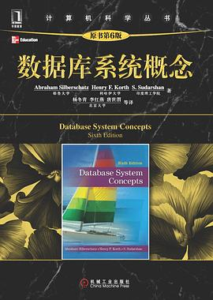
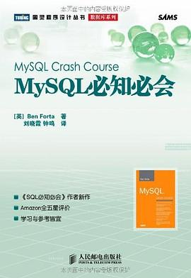
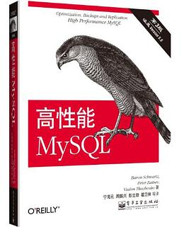
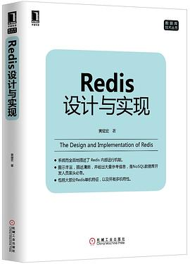
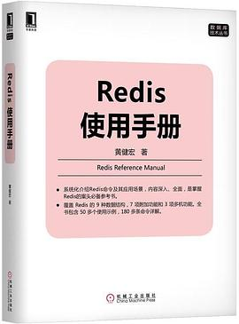

# 数据库原理

## 《数据库系统概念》第六版

（美）Abraham Silberschatz / （美）Henry F.Korth / （美）S.Sudarshan  / 2012-3 / 机械工业出版社

[豆瓣](https://book.douban.com/subject/23008813/)，8.4 分，297 人评分。

  
 

# MySQL

## 《MySQL 必知必会》 

[英]BenForta/ 2009-1 / 人民邮电出版社

[豆瓣](https://book.douban.com/subject/3354490/) 8.4 分，1296 人评分。

  
 

 

## 《高性能 MySQL》

高性能MySQL（第三版）施瓦茨(BaronSchwartz)/扎伊采夫(PeterZaitsev)/特卡琴科(VadimTkachenko)/ 2013-5-1 / 电子工业出版社

高性能MySQL（第二版）施瓦茨(BaronSchwartz)/扎伊采夫(PeterZaitsev)/特卡琴科(VadimTkachenko)/JeremyD.Zawodny/ArjenLent/DerekJ.Ballin/ 2010年1月 / 电子工业出版社

[豆瓣](https://book.douban.com/subject/23008813/)，9.3 分，688 人评分。

  
 

# Redis

## 《Redis设计与实现》 

黄健宏/ 2014-6 / 机械工业出版社

[豆瓣](https://book.douban.com/subject/25900156/) 8.5 分，953 人评分。

  
 

## 《Redis实战 》

JosiahL.Carlson / 黄建宏 / 2015-10 / 人民邮电出版社

[豆瓣](https://book.douban.com/subject/26612779/)，8.0 分，393 人评分。

  
 

## 《Redis使用手册》

黄建宏 / 2019-9-20 / 机械工业出版社

[豆瓣](https://book.douban.com/subject/34836750/)， 7.7 分，22 人评分。

  
 

