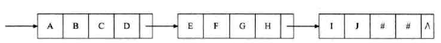

# 串

## 串的定义

串（String）：零个或多个字符组成的有序序列。又叫字符串。
$$
s=“a_1 a_2…a_n”  (n≥0)
$$
 其中，`s` 是串的名，用双引号括起来的字符序列是串的值；`ai (1≤i≤n)` 可以是字母、数字或其他字符；字符的数目 `n` 是串的长度。零个字符的串称为空串（null string），长度为 0。

- 双引号

  串值必须用一对双引号括起来，但双引号本身不属于串，其作用只是为了避免与变量名或数的常量混淆而已。

- 特殊字符

  在高级语言中（比如 C 语言），字符串中隐藏一个特殊的字符即 `’\0’`，它的作用是标识字符串结束，因此称 ’\0’ 为字符串结束符。


其它概念

- 空格串：只包含空格的串。空格串有内容有长度，空串无内容无长度。
- 子串：串中任意个连续的字符组成的子序列称为该串的子串。
- 主串：包含子串的串相应的称为主串。


## 串的比较

- 字符串相等：只有当两个字符串的长度相等，并且各个对应位置的字符都相等才相等。


## 串的抽象数据类型

操作：

- l （1）赋值      strcpy(数组名、字符串)；

- l （2）判空      strlen()  strcmp() 

- l （3）字符串比较   strcmp

- l （4）求字符串长度  strlen

- l （5）字符串拷贝   strcpy

- l （6）字符串连接   strcat

- l （7）求字符串子串（截取字符串）


## 串的表示与实现

1)    定长顺序存储表示：类似线性表的顺序存储结构，用一组地址连续的存储单元存储字符串的字符序列。

2)    堆分配存储表示：这种存储方式特点是：仍一一组连续的存储单元存放字符串序列，但它们的存储空间是在程序执行过程中动态分配而得的。

3)    块链存储表示：和线性表的链式存储类似，也是用链表来保存字符串的值。根据串的特殊，若每个字符占一个结点太小，则采取每个结点可以存放一个也可以存放多个字符。

<div align="center">  </div><br>


## 模式匹配算法

子串的定位操作通常称为串的模式匹配，是各种串处理系统中最重要的操作之一。

设 `S` 是给定的主串（目标串）， `T` 是给定的子串（模式串），在主串 `S` 中查找等于子串 `T` 的串的过程称为模式匹配。如果在 `S` 中找到 `T` 子串，则称匹配成功，函数返回 T 在 `S` 中首次出现的存储位置（或序号），否则匹配失败，返回 0。


暴力匹配算法（Brute-Force算法）

对于给定的主串 S 与子串 P ，主串 S 的长度为 N，子串 T 的长度为 M ；

首先，将 S[1] 和 T[1] 进行比较；

若相等，则再比较 S[2] 和 T[2] ，一直到 T[M] 为止；

若 S[1] 和 T[1] 不等，则 T 向右移动一个字符的位置，再依次进行比较；

<div align="center">  </div><br>


 

### KMP 模式匹配算法

Knuth-Morris-Pratt 字符串查找算法

常用于在一个文本串 S 内查找一个模式串 P 的出现位置。由Donald Knuth、Vaughan Pratt、James H. Morris三人于1977年联合发表。

1)    核心是利用匹配失败后的信息，尽量减少模式串与主串的匹配次数以达到快速匹配的目的。具体通过一个next()函数实现，函数本身包含了模式串的局部匹配信息。KMP算法的时间复杂度O(m+n)。

2)    操作流程：假设现在文本串 S 匹配到 i 位置，模式串 P 匹配到 j 位置

- 如果j = -1  ，或者当前字符匹配成功（即 S[i] == P[j]  ），都令 i++，j++，继续匹配下一个字符；

- 如果j != -1    ，且当前字符匹配失败（即   S[i] != P[j]  ），则令 i 不变， j = next[j] 。此举意味着失配时，模式串 P相对于文本串 S 向右移动了 j - next [j] 位，此值大于等于1。换言之，将模式串 P 失配位置的 next 数组的值对应的模式串 P 的索引位置移动到失配处。


<div align="center">  </div><br>

3)    具体过程解释

a)    给P中所有字符标上序号，列出模式串 P 的所有子串，求得每一个子串的所有前缀与后缀，求前缀后缀的公共元素的最大长度。前缀：指字符串中除了最后一个字符以外，其余字符的全部头部顺序组合。后缀：指字符串中除了第一个字符以外，其余字符的全部尾部顺序组合。

b)    根据最大长度表 去求 next 数组：next 数组相当于“最大长度值” 整体向右移动一位，然后初始值赋为-1。next 数组各值的含义：代表当前字符之前的字符串中，有多大长度的相同前缀后缀。在某个字符失配时，该字符对应的next 值会告诉你下一步匹配中，模式串应该跳到哪个位置（跳到next [j] 的位置）。如果next [j] 等于0或-1，则跳到模式串的开头字符，若next [j] = k 且 k > 0，代表下次匹配跳到j 之前的某个字符，而不是跳到开头，且具体跳过了k 个字符。

<div align="center">  </div><br>

c)    根据next数组进行匹配。

4)    时间复杂度：如果文本串的长度为n，模式串的长度为m，那么匹配过程的时间复杂度为O(n)，算上计算next的O(m)时间，KMP的整体时间复杂度为O(m + n)。

5)    代码实现（动态规划）

```Java
public class KMP {
    private int[][] dp;
    private String pat;
    public KMP(String pat) {
        this.pat = pat;
        int M = pat.length();
        dp = new int[M][256];        // dp[状态][字符] = 下个状态
        dp[0][pat.charAt(0)] = 1;    // base case
        int X = 0;                   // 影子状态 X 初始为 0
        // 当前状态 j 从 1 开始
        for (int j = 1; j < M; j++) {
            for (int c = 0; c < 256; c++) {
                if (pat.charAt(j) == c) 
                    dp[j][c] = j + 1;
                else 
                    dp[j][c] = dp[X][c];
            }
            X = dp[X][pat.charAt(j)];    // 更新影子状态
        }
    }
    public int search(String txt) {
        int M = pat.length();
        int N = txt.length();
        int j = 0;                           // pat 的初始态为 0
        for (int i = 0; i < N; i++) {
            j = dp[j][txt.charAt(i)];        // 计算 pat 的下一个状态
            if (j == M) return i - M + 1;    // 到达终止态，返回结果
        }
        return -1;     // 没到达终止态，匹配失败
    }
}

```


### BM 算法

Boyer-Moore算法

1977年，德克萨斯大学的Robert S. Boyer教授和J Strother Moore教授发明了一种新的字符串匹配算法：Boyer-Moore算法，简称BM算法。该算法从模式串的尾部开始匹配。

1)    规则：

a)    坏字符规则（bad-character shift）：当文本串中的某个字符跟模式串的某个字符不匹配时，文本串中的这个失配字符为坏字符，此时模式串需要向右移动，移动的位数 = 坏字符在模式串中的位置 - 坏字符在模式串中最右出现的位置。此外，如果"坏字符"不包含在模式串之中，则最右出现位置为-1。坏字符针对的是文本串。

b)    好后缀规则（good-suffix shift）：当字符失配时，后移位数 = 好后缀在模式串中的位置 - 好后缀在模式串上一次出现的位置，且如果好后缀在模式串中没有再次出现，则为-1。好后缀针对的是模式串。

<div align="center">  </div><br>

 

2)    过程

a)    "文本串"与"模式串"头部对齐，从尾部开始比较。

b)    根据两个规则移动模式串。每次后移这两个规则之中的较大值。这两个规则的移动位数，只与模式串有关，与原文本串无关。

3)    时间复杂度：最坏O(N)。在实践中，比KMP算法的实际效能高，可以快大概 3-5 倍。


### Sunday算法

实际上，KMP算法并不比最简单的c库函数strstr()快多少，而BM算法虽然通常比KMP算法快，但BM算法也还不是现有字符串查找算法中最快的算法。Sunday算法比BM算法更快，由Daniel M.Sunday在1990年提出，它的思想跟BM算法很相似：

1)    思想：Sunday算法是从前往后匹配，在匹配失败时关注的是文本串中参加匹配的最末位字符的下一位字符。如果该字符没有在模式串中出现则直接跳过，即移动位数 = 匹配串长度 + 1；否则，其移动位数 = 模式串中最右端的该字符到末尾的距离+1。


