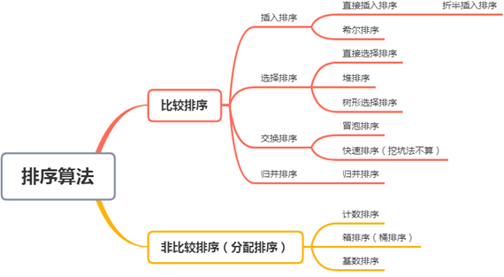
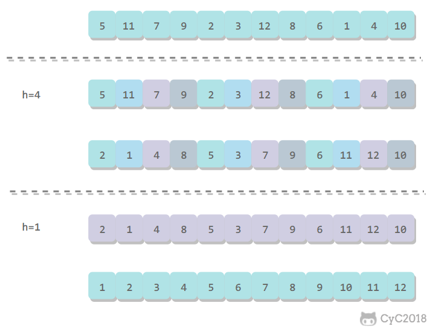
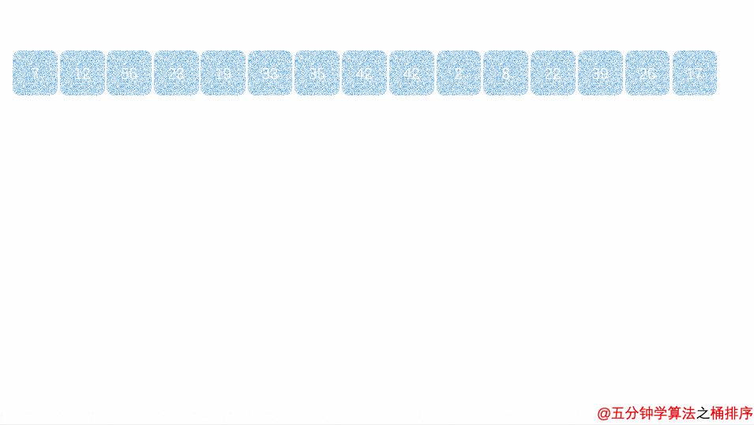

[TOC]

例子：排序时，若不采用计数排序的等空间换时间的方法，合并m个长度为n的已排序数组的时间复杂度最优为 O(mn(logm))。

理解：当n=1时，就成了m个数的归并排序，时间复杂度为O(mlogm)。堆的大小为m，每次调整的时间复杂度为logm，一共需要调整mn次。


# 概述

## **排序分类**

- 按排序过程中依据的原则：比较排序、非比较排序（分配排序）。

  分配排序的基本思想：排序过程通过用额外的空间来"分配"和"收集"来实现排序，它们的时间复杂度可达到线性阶：O(n)。简言之就是：用空间换时间。

  <div align="center">  </div><br>        

- 按稳定性：稳定排序、不稳定排序。

  稳定性：排序后 2 个相等键值的顺序和排序之前它们的顺序相同。不稳定排序：选择排序、希尔排序、快速排序、堆排序。

- 按元素存放的位置：内部排序、外部排序

  内部排序是数据记录在内存中进行排序，而外部排序是因排序的数据很大，一次不能容纳全部的排序记录，在排序过程中需要访问外存。常见的内部排序算法有：插入排序、希尔排序、选择排序、冒泡排序、归并排序、快速排序、堆排序、基数排序等。

  外部排序，置换选择，在内存区保存一段数字，每次弹出内存区中最小的数字（这个数字不能比已经弹出的最大数字大），加入一个新数字，当内存区中不存在比弹出序列中最大数字还大的数字，即内存区中的数字都比上一个弹出的数字小，分段。构造第二个段，以此类推。如果待排元素有序，则只有一个归并段。长度 N。

  影响外排序的时间因素主要是内存与外设交换信息的总次数。

  外排序一般采用的排序方法是 k 路归并排序。k越大，越能减少读取外存的次数，提高效率。但k的增大，使得k路归并排序的时间复杂度也上升 (O(n*k*logn)，n为每路个数)。所以外排序的时候，要好好衡量k的取值，并不是与外设交换次数越少越好。

  外部排序的总时间 = 内部排序（产出初始归并段）所需时间 + 外存信息读取时间 + 内部归并所需的时间。

  外排中使用置换选择排序的目的，是为了增加初始归并段的长度。


## **复杂度总结**

名词解释：

- 参数
  - n：数据规模；
  - k："桶"的个数
- 排序方式：
  - In-place：占用常数内存；
  - Out-place：占用额外内存
- 在内部排序过程中，对尚未确定最终位置的所有元素进行一遍处理称为一趟排序。

- *注意*：冒泡中最好情况的 O(n) 指优化后的冒泡排序。

|          | 对象       | 稳定性 | 平均     | 最好               | 最坏          | 空间            | 排序方式 | 思想             |
| -------- | ---------- | ------ | -------- | ------------------ | ------------- | --------------- | -------- | ---------------- |
| 冒泡排序 | 数组       |        | O(n2)    | **O(n)**    正序   | O(n2)  反序   | O(1)            | In-place |                  |
| 选择排序 | 数组       | 非     | O(n2)    | O(n2)              | O(n2)         | O(1)            | In-place |                  |
| 链表     |            |        |          |                    |               |                 |          |                  |
| 插入排序 | 数组  链表 |        | O(n2)    | **O(n)**  基本有序 | O(n2)  反序   | O(1)            | In-place |                  |
| 折半插入 |            |        | O(n2)    | O(nlog2n)  正序    | O(n2)  反序   |                 | In-place |                  |
| 希尔排序 | 数组       | 非     | O(nlogn) | O(nlog2n)          | O(nlog2n)     | O(1)            | In-place |                  |
| 归并排序 | 数组       |        | O(nlogn) | O(nlogn)           | O(nlogn)      | **O(n)**        | Out      | 分治  递归  迭代 |
| 链表     |            |        |          |                    |               |                 |          |                  |
| 快速排序 | 数组       | 非     |          | O(nlogn)  无序     | O(n2)  有序   | O(logn)  （？） | In-place | 分治  递归       |
| 堆排序   | 数组       | 非     | O(nlogn) | O(nlogn)           | O(nlogn)      | O(1)            | In-place |                  |
| 计数排序 | 数组  链表 |        | O(n+k)   | O(n+k)             | O(n+k)        | O(k)            | Out      | 桶               |
| 桶排序   | 数组  链表 |        | O(n+k)   | O(n+k)  一桶一数   | O(n2)  一个桶 | O(n+k)          | Out      | 桶               |
| 基数排序 | 数组  链表 |        | O(n×k)   | O(n×k)             | O(n×k)        | O(n+k)          | Out      | 桶               |

1)    描述 & 适用

- a)    冒泡排序：(无序区，有序区)。从无序区通过交换找出最大元素放到有序区前端。

  大的元素沉到水底，小的元素气泡。

- b)    选择排序：(有序区，无序区)。——小规模数据

  在无序区里找一个最小的元素跟在有序区的后面。比较多，交换少。

- c)    插入排序：(有序区，无序区)。——小规模数据；基本有序

  把无序区的第一个元素插入到有序区的合适的位置。比较少，交换多。

- d)    希尔排序：——中等规模数据

  每一轮按照事先决定的间隔进行插入排序，间隔依次缩小，最后一次一定要是1。

- e)    归并排序：把数据分为两段，从两段中逐个选最小的元素移入新数据段的末尾。可从上到下或从下到上进行。

  ——速度仅次于快排，**内存少**的时候使用，可以进行并行计算的时候使用。

- f)     快速排序：(小数，基准元素，大数)。——无序数据

  在区间中随机挑选一个元素作基准，将小于基准的元素放在基准之前，大于基准的元素放在基准之后，再分别对小数区与大数区进行排序。

- g)    堆排序：(最大堆，有序区)。从堆顶把根卸出来放在有序区之前，再恢复堆。

  ——最大的前几个数据

- h)    计数排序：统计小于等于该元素值的元素的个数i，于是该元素就放在目标数组的索引i位(i≥0) 。——相差范围不大的数据

- i)     桶排序：将值为i的元素放入i号桶，最后依次把桶里的元素倒出来。

- j)     基数排序：一种多关键字的排序算法，可用桶排序实现。

2)    每一趟排序结束都至少能够确定一个元素最终位置的方法：

冒泡排序、选择排序、**快速排序**、堆排序。

3)    如果在一个排序算法的执行过程中，没有一对元素被比较过两次或以上，则称该排序算法为节俭排序算法（精简排序）。有插入排序、归并排序。

4)    初始状态

比价排序算法的时间复杂度和所需比较关键字的次数有关。

| **初始状态** | 复杂度                         | 排序趟数 | 比较次数 | 移动（交换）次数 |
| ------------ | ------------------------------ | -------- | -------- | ---------------- |
| 冒泡排序     | 正序最好、反序最坏             |          |          |                  |
| 选择排序     | 无关  n越小越好，O(n²)         | 无关     | 无关     | 有序时次数少     |
| 插入排序     | 正序最好、反序最坏             | 无关     |          |                  |
| 希尔排序     | 和增量序列相关                 | 无关     |          |                  |
| 归并排序     | 无关  O(nlogn)                 | 无关     |          | 无关             |
| 快速排序     | 无序最好，有序最坏             |          |          |                  |
| 堆排序       | 无关                           | 无关     |          |                  |
| 计数排序     |                                | 无关     |          |                  |
| 桶排序       | 一桶一数最好  一个桶全部数最坏 | 无关     |          |                  |
| 基数排序     | 无关                           | 无关     | 无关     | 无关             |

5)    比较次数

堆排序（构建堆）>快速排序

6)    数据结构对复杂度影响：

冒泡排序、选择排序、插入排序都是相邻元素之间的操作，更换为链式存储后的时间复杂度还是O(n2)。

希尔排序和堆排序涉及到非相邻元素的交换，都利用了顺序存储的随机访问特性，而链式存储不支持这种性质，所以时间复杂度会增加


## **约定**

```
private void swap(int[] nums,int i,int j){
	int temp = nums[i];
	nums[i] = nums[j];
	nums[j] = temp;
}
```


# 一、 冒泡排序

> Bubble Sort，（无序区，有序区）

1、算法思想


一句话概括：从左到右不断交换相邻逆序的元素，在一轮的循环之后，可以让未排序的最大元素上浮到右侧。

详细算法步骤：

- 从第一个数开始，与第二个数比较，如果第二个数小于第一个数，交换两个数据的位置。
- 指针由第一个数据移向第二个数据，第二个数据与第三个数据相比较，如果第三个数据小于第二个数据，则交换两个数据的位置。

- 依此类推，完成第一轮排序。第一轮排序结束后，最大的元素被移到了最右面。

- 依照上面的过程，针对所有的元素（除了最后一个）重复以上的步骤进行第二轮排序，将第二大的排在倒数第二的位置。

- 重复上述过程，直到没有任何一对数字需要比较。每排完一轮，比较次数就减少一次。

<div align="center">  </div><br>

优化后的冒泡排序

在一轮循环中，如果没有发生交换，那么说明数组已经是有序的，此时可以直接退出。


2、复杂度分析

- 复杂度与初始状态有关。
- 总排序趟数与初始状态有关：优化后的冒泡排序。但优化过后的冒泡排序算法关键字比较的次数与记录的初始排列次序仍有关。
- 最快情况：输入数据是正序，优化后的冒泡 O(n)。
- 最坏情况：输入数据是反序，速度最慢，需要比较次数：n-1+...+1 = n(n-1)/2，复杂度 O(n<sup>2</sup>)。


3、适用场景


4、代码实现

1）编码思路

需要两层循环，第一层循环 i 表示排序的轮数（固定，N-1轮），第二层循环 j 表示比较的次数（变化，随着轮数的增加而减小）。


**2）模板**

```

```


3）具体实现

**JavaScript 实现**

```javascript
function bubbleSort(arr) {
    var len = arr.length;
    for (var i = 0; i < len - 1; i++) {
        for (var j = 0; j < len - 1 - i; j++) {
            if (arr[j] > arr[j+1]) {        // 相邻元素两两对比
                var temp = arr[j+1];        // 元素交换
                arr[j+1] = arr[j];
                arr[j] = temp;
            }
        }
    }
    return arr;
}
```

 

 **Java 实现**

```Java
public class BubbleSort implements IArraySort {
    @Override
    public int[] sort(int[] sourceArray) throws Exception {
        // 对 arr 进行拷贝，不改变参数内容
        int[] arr = Arrays.copyOf(sourceArray, sourceArray.length);
        for (int i = 1; i < arr.length; i++) {
            // 设定一个标记
            boolean flag = true;
            for (int j = 0; j < arr.length - i; j++) {
                if (arr[j] > arr[j + 1]) {
                    int tmp = arr[j];
                    arr[j] = arr[j + 1];
                    arr[j + 1] = tmp;
                    flag = false;
                }
            }
            // 此次循环没有进行交换，也就是待排序列已经有序，排序已经完成
            if (flag) {
                break;
            }
        }
        return arr;
    }
}
```


# 二、 选择排序

> Selection Sort，（有序区，无序区）


1、算法思想

算法步骤

- 首先在未排序序列中找到最小（大）元素，存放到排序序列的起始位置。

- 再从剩余未排序元素中继续寻找最小（大）元素，然后放到已排序序列的末尾。

- 重复第二步，直到所有元素均排序完毕。


<div align="center">  </div><br>

2、算法特点

- 简单直观

- 不稳定性

  在一趟选择，如果当前元素比一个元素小，而小的元素又出现在和当前元素相等的元素后面，那么交换后稳定性就被破坏了。

  比如：序列 5 8 5 2 9，第一遍选择第 1 个 5 和 2 交换，原序列中两个 5 的相对前后顺序被破坏了。


3、复杂度分析

选择排序需要 \~N<sup>2</sup>/2 次比较和 \~N 次交换，它的运行时间与输入（初始状态）无关，无论什么数据都是 O(n²) 的时间复杂度。


4、适用情况

- 数据规模越小越好


5、代码实现

1）编码思路

2）模板

3）具体实现

**JavaScript 实现**

```js
function selectionSort(arr) {
    var len = arr.length;
    var minIndex, temp;
    for (var i = 0; i < len - 1; i++) {
        minIndex = i;
        for (var j = i + 1; j < len; j++) {
            if (arr[j] < arr[minIndex]) {     // 寻找最小的数
                minIndex = j;                 // 将最小数的索引保存
            }
        }
        temp = arr[i];
        arr[i] = arr[minIndex];
        arr[minIndex] = temp;
    }
    return arr;
}
```


**Java 实现**

```Java
public class SelectionSort implements IArraySort {
    @Override
    public int[] sort(int[] sourceArray) throws Exception {
        int[] arr = Arrays.copyOf(sourceArray, sourceArray.length);
        // 总共要经过 N-1 轮比较
        for (int i = 0; i < arr.length - 1; i++) {
            int min = i;
            // 每轮需要比较的次数 N-i
            for (int j = i + 1; j < arr.length; j++) {
                if (arr[j] < arr[min]) {
                    // 记录目前能找到的最小值元素的下标
                    min = j;
                }
            }
            // 将找到的最小值和i位置所在的值进行交换
            if (i != min) {
                int tmp = arr[i];
                arr[i] = arr[min];
                arr[min] = tmp;
            }
        }
        return arr;
    }
}
```


 

# 三、 插入排序

> Insert Sort，（有序区，无序区）

1、算法思想

扑克牌原理

插入排序是一种最简单直观的排序算法，工作原理是通过构建有序序列，对于未排序数据，在已排序序列中从后向前扫描，找到相应位置并插入。

算法步骤（直接插入排序）

- 将第一个数和第二个数排序，然后构成一个有序序列

- 将第三个数插入进去，构成一个新的有序序列。

- 对第四个数、第五个数……直到最后一个数，重复第二步。

- 如果待插入元素与有序序列中的某个元素相等，则将待插入元素插入到相等元素的后面。


<div align="center">  </div><br>

2、复杂度分析

插入排序的时间复杂度取决于数组的初始顺序，如果数组已经部分有序了，那么逆序较少，需要的交换次数也就较少，时间复杂度较低。

- 平均情况： \~N<sup>2</sup>/4 比较以及 \~N<sup>2</sup>/4 次交换；
- 最坏情况： \~N<sup>2</sup>/2 比较以及 \~N<sup>2</sup>/2 次交换，最坏的情况是数组是倒序的；
- 最好情况： N-1 次比较和 0 次交换。基本有序，只需要比较大小，不需要移动，O(n)。


3、适用情况：

小规模数据；基本有序


4、优化：折半插入排序

> Binary Insert Sort

插入排序和冒泡排序一样，也有一种优化算法，叫做拆半插入。

- 插入排序，就是不断的依次将元素插入前面已排好序的序列中。通过折半（（low+high）/2=mid）的方式，凭借一个 mid 来使得我们通过二分插入区的方式，不断缩小插入的区域，直到low>high时，我们即可找到元素的插入位置high+1。此种方式在时间复杂度上仍和直接插入排序算法处于同一个等级，但由于使用了折半的方式，所以在为插入元素寻找插入位置时会更加高效（尤其在数据量较大时）。

- 对同一待排序序列分别进行折半插入排序和直接插入排序，两者之间可能的不同之处是元素之间的比较次数。

- 时间复杂度：
  - 最坏情况（整个序列逆序时）时间复杂度为 O(n2)，
  - 最优情况（整个序列初始顺序，从大到小时）时间复杂度为 O(nlog2n)，
  - 平均情况时间复杂度为 O(n2)。


5、代码实现

1）代码思路（直接插入排序）

- 首先设定插入次数，即循环次数，for(int i=1;i<length;i++)，1个数的那次不用插入。

- 设定插入数（insertNum）和得到已经排好序列的最后一个数的位数（j=i-1）。

- 从最后一个数开始向前循环，如果插入数小于当前数，就将当前数向后移动一位。

- 将当前数放置到空着的位置（j+1）。


具体实现

**JavaScript 实现（直接插入排序）**

```js
function insertionSort(arr) {
    var len = arr.length;
    var preIndex, current;
    for (var i = 1; i < len; i++) {
        preIndex = i - 1;
        current = arr[i];
        while(preIndex >= 0 && arr[preIndex] > current) {
            arr[preIndex+1] = arr[preIndex];
            preIndex--;
        }
        arr[preIndex+1] = current;
    }
    return arr;
}
```


**Java 实现（直接插入排序）**

```Java
public class InsertSort implements IArraySort {
    @Override
    public int[] sort(int[] sourceArray) throws Exception {
        // 对 arr 进行拷贝，不改变参数内容
        int[] arr = Arrays.copyOf(sourceArray, sourceArray.length);
        // 1.设定插入次数，即循环次数。从下标为1的元素开始选择合适的位置插入
        for (int i = 1; i < arr.length; i++) {
            // 2.记录要插入的数据
            int tmp = arr[i];
            // 3.从已经排序的序列最右边的开始比较，找到比其小的数
            int j = i;
            while (j > 0 && tmp < arr[j - 1]) {
                arr[j] = arr[j - 1];
                j--;
            }
            // 4.存在比其小的数，插入
            if (j != i) {
                arr[j] = tmp;
            }
        }
        return arr;
    }
}

```

 

折半插入代码实现

 

 

# 四、 希尔排序

> Shell Sort


1、简介

希尔排序，也称递减增量排序算法，发明者 Donald Shell ，是插入排序的一种更高效的改进版本，对于中等规模数据的性能表现还不错，但不稳定。

对于大规模的数组，插入排序很慢，因为它只能交换相邻的元素，每次只能将逆序数量减少 1。希尔排序的出现就是为了解决插入排序的这种局限性，它通过交换不相邻的元素，每次可以将逆序数量减少大于 1。

希尔排序使用插入排序对间隔 h 的序列进行排序。通过不断减小 h，最后令 h=1，就可以使得整个数组是有序的。

比如：把下标相差 4 的分到一组，a[0] 与 a[4] 是一组、a[1] 与 a[5] 是一组……，这里的差值（距离）被称为增量（gap）。

<div align="center">  </div><br>


2、算法步骤

- 选择一个增量序列 t1，t2，……，tk，其中 ti > tj， tk = 1；

- 按增量序列个数 k，对序列进行 k 趟排序；

- 每趟排序，根据对应的增量 ti，将待排序列分割成若干长度为 m 的子序列，分别对各子表进行直接插入排序。仅增量因子为 1 时，整个序列作为一个表来处理，表长度即为整个序列的长度。

<div align="center">  </div><br>


3、算法特点：

- 不稳定性

  虽然插入排序是稳定的，但是希尔排序在插入的时候是跳跃性插入的，有可能破坏稳定性


4、复杂度分析

希尔排序的时间复杂度分析极其复杂，有的增量序列的复杂度至今还没人能够证明出来。

复杂度和增量序列是相关的：

- {1，2，4，8，...}这种序列并不是很好的增量序列，最坏时间复杂度是 O(n^2)

- Hibbard提出了另一个增量序列{1，3，7，...，2^k-1}，最坏时间复杂度为O(n^1.5)

- Sedgewick提出了几种增量序列，其最坏情形运行时间为O（n^1.3），其中最好的一个序列是{1，5，19，41，109，...}

- 最优的区间计算方法是没有答案的，这是一个长期未解决的问题，不过差不多都会取在二分之一到三分之一附近

希尔排序的运行时间达不到平方级别，使用递增序列 1, 4, 13, 40, ...  的希尔排序所需要的比较次数不会超过 N 的若干倍乘于递增序列的长度。后面介绍的高级排序算法只会比希尔排序快两倍左右。


5、适用场景


6、代码实现

1）代码思路

- 首先确定分的组数。

- 然后对组中元素进行插入排序。

- 然后将 length/2，重复1，2步，直到 length=0 为止。

- *注意*：对各个组进行插入的时候并不是先对一个组进行排序完再对另一个组进行排序，而是轮流对每个组进行插入排序（？）


 2）具体实现

JavaScript 实现

```js
function shellSort(arr) {
    var len = arr.length,
        temp,
        gap = 1;
    while(gap < len/3) {          //动态定义间隔序列
        gap =gap*3+1;
    }
    for (gap; gap > 0; gap = Math.floor(gap/3)) {
        for (var i = gap; i < len; i++) {
            temp = arr[i];
            for (var j = i-gap; j >= 0 && arr[j] > temp; j-=gap) {
                arr[j+gap] = arr[j];
            }
            arr[j+gap] = temp;
        }
    }
    return arr;
}
```


Java实现

```java
public class ShellSort implements IArraySort {
    @Override
    public int[] sort(int[] sourceArray) throws Exception {
        // 对 arr 进行拷贝，不改变参数内容
        int[] arr = Arrays.copyOf(sourceArray, sourceArray.length);
        int gap = 1;
        while (gap < arr.length) {
            gap = gap * 3 + 1;
        }
        while (gap > 0) {
            for (int i = gap; i < arr.length; i++) {
                int tmp = arr[i];
                int j = i - gap;
                while (j >= 0 && arr[j] > tmp) {
                    arr[j + gap] = arr[j];
                    j -= gap;
                }
                arr[j + gap] = tmp;
            }
            gap = (int) Math.floor(gap / 3);
        }
        return arr;
    }
}
```

 

# 五、 归并排序

> Merge sort


1、算法思想

归并排序是采用分治法（Divide and Conquer）的一个非常典型的应用。

基本思想

将一个数组一刀切两半，递归切，直到切成单个元素，然后重新组装合并，单个元素合并成小数组，两个小数组合并成大数组，直到最终合并完成，排序完毕。有两种实现方法：

- 自上而下的递归（所有递归的方法都可以用迭代重写）；

- 自下而上的迭代；


算法步骤

- 1)    申请空间，使其大小为两个已经排序序列之和，该空间用来存放合并后的序列；
- 2)    设定两个指针，最初位置分别为两个已经排序序列的起始位置；

- 3)    比较两个指针指向的元素，选择相对小的元素放入到合并空间，并移动指针到下一位置；

- 4)    重复步骤 3 直到某一指针达到序列尾；
- 5)    将另一序列剩下的所有元素直接复制到合并序列尾。

 <div align="center">  </div><br>


2、复杂度分析

和选择排序一样，归并排序的性能不受输入数据的影响，但表现比选择排序好的多，因为始终都是 O(nlogn) 的时间复杂度。代价是需要额外的内存空间。

归并排序每次合并借助临时数组，需要空间O(N)。

归并排序中，归并的趟数是O（logn）。

将N条长度均为M的有序链表进行合并，合并以后的链表也保持有序，时间复杂度为O(N * M * logN)

- 在每一个链表中取出第一个值，然后把它们放在一个大小为N的数组里，然后把这个数组当成heap建成小(大)根堆。此步骤的时间复杂度为O(N)

- 取出堆中的最小值(也是数组的第一个值)， 然后把该最小值所处的链表的下一个值放在数组的第一个位置。如果链表中有一个已经为空（元素已经都被取出），则改变heap的大小。此步骤的时间复杂度为O(lg N).

- 不断的重复步骤二，直到所有的链表都为空。

  建堆只建一次，复杂度为O(N)；调整堆MN-1次，复杂度为(MN-1)*O(lg N)。所以为O(MN*lg N)


3、适用场景

速度仅次于快排，**内存少**的时候使用，可以进行并行计算的时候使用。


4、代码实现

1）代码思路：

- 选择相邻两个数组成一个有序序列。

- 选择相邻的两个有序序列组成一个有序序列。

- 重复第二步，直到全部组成一个有序序列。


2）具体思想

JavaScript 实现

```js
function mergeSort(arr) {  // 采用自上而下的递归方法
    var len = arr.length;
    if(len < 2) {
        return arr;
    }
    var middle = Math.floor(len / 2),
        left = arr.slice(0, middle),
        right = arr.slice(middle);
    return merge(mergeSort(left), mergeSort(right));
}

function merge(left, right){
    var result = [];

    while (left.length && right.length) {
        if (left[0] <= right[0]) {
            result.push(left.shift());
        } else {
            result.push(right.shift());
        }
    }

    while (left.length)
        result.push(left.shift());

    while (right.length)
        result.push(right.shift());

    return result;
}
```


Java 实现

```Java
public class MergeSort implements IArraySort {
    @Override
    public int[] sort(int[] sourceArray) throws Exception {
        // 对 arr 进行拷贝，不改变参数内容
        int[] arr = Arrays.copyOf(sourceArray, sourceArray.length);
        if (arr.length < 2) {
            return arr;
        }
        int middle = (int) Math.floor(arr.length / 2);
        int[] left = Arrays.copyOfRange(arr, 0, middle);
        int[] right = Arrays.copyOfRange(arr, middle, arr.length);
        return merge(sort(left), sort(right));
    }

    protected int[] merge(int[] left, int[] right) {
        int[] result = new int[left.length + right.length];
        int i = 0;
        while (left.length > 0 && right.length > 0) {
            if (left[0] <= right[0]) {
                result[i++] = left[0];
                left = Arrays.copyOfRange(left, 1, left.length);
            } else {
                result[i++] = right[0];
                right = Arrays.copyOfRange(right, 1, right.length);
            }
        }
        while (left.length > 0) {
            result[i++] = left[0];
            left = Arrays.copyOfRange(left, 1, left.length);
        }
        while (right.length > 0) {
            result[i++] = right[0];
            right = Arrays.copyOfRange(right, 1, right.length);
        }
        return result;
    }
}

```

 

# 六、 快速排序

> Quick sort（小数，基准元素，大数）

1、简介

1962 年由东尼·霍尔发展。分治思想。本质上来看，快速排序是在冒泡排序基础上的递归分治法。快速排序使用分治法策略来把一个串行（list）分为两个子串行（sub-lists）。快排的阶段性排序结果的特点是，第 i 趟完成时，会有 i 个以上的数出现在它最终将要出现的位置，即它左边的数都比它小，它右边的数都比它大。


2、算法思想/算法步骤

- 从数列中挑出一个元素，称为“基准”（pivot）;

- 重新排序数列，所有元素比基准值小的摆放在基准前面，所有元素比基准值大的摆在基准的后面（相同的数可以到任一边）。在这个分区退出之后，该基准就处于数列的中间位置。这个称为分区（partition）操作；
- 递归地（recursive）把小于基准值元素的子数列和大于基准值元素的子数列排序；


3、两种实现方式：

1)    挖坑填数法

- i =0; j = N-1; 将基准数挖出形成第一个坑a[i]。

- j--由后向前找比它小的数，找到后挖出此数填前一个坑a[i]中。

- i++由前向后找比它大的数，找到后也挖出此数填到前一个坑a[j]中。

- 再重复执行2，3二步，直到i==j，将基准数填入a[i]中。


2)    指针交换法

 

<div align="center">  </div><br>

<div align="center">  </div><br>


 

4、复杂度分析 

- 最好情况：待排序列接近无序，时间复杂度为 O(nlog2n)。
- 平均情况：为O(nlog2n)。
- 最坏情况：待排序列接近有序，退化为冒泡排序，时间复杂度为O(n2)。为避免出现这种情况，需在进行一次划分之前，进行“预处理”，即：先对 R(s).key, R(t).key 和   ，进行相互比较，然后取关键字为“三者之中”的记录为枢轴记录。


c)    快速排序是基于比较的排序算法中平均性能最好的一种排序：

在平均状况下，排序 n 个项目要 Ο(nlogn) 次比较，且 O(nlogn) 记号中隐含的常数因子很小，比复杂度为 O(nlogn) 的归并排序要小很多，但这是建立在每次切分都能把数组一刀切两半差不多大的前提下。

在最坏状况下则需要 Ο(n^2) 次比较。比如排一个有序的序列，如[ 9，8，7，6，5，4，3，2，1 ]，选取基准值 9 ，那么需要切分 n - 1 次才能完成整个快速排序的过程，这种情况下，时间复杂度就退化成了 O(n2)，当然极端情况出现的概率也是比较低的。

事实上，快速排序通常明显比其他 Ο(nlogn) 算法更快，因为它的内部循环（inner loop）可以在大部分的架构上很有效率地被实现出来。所以，对绝大多数顺序性较弱的随机数列而言，快速排序总是优于归并排序。

d)    为了避免极端情况的发生，选取基准值应该做到随机选取，或者是打乱一下数组再选取。

e)    快速排序使用递归调用，因此需要至少O(logn)的栈空间。

f)     如果每一次划分后分区比较平衡，则递归次数少；如果划分后分区不平衡，则递归次数多。但快速排序的递归次数与分区处理顺序无关。

g)    （？）对n个记录的线性表进行快速排序为减少算法的递归深度，每次分区后，先处理较短的部分。

在快速排序中，需要使用递归来分别处理左右子段，递归深度可以理解为系统栈保存的深度，先处理短的分段再处理长的分段，可以减少时间复杂度；如果按长的递归优先的话，那么短的递归会一直保存在栈中，直到长的处理完。短的优先的话，长的递归调用没有进行，他是作为一个整体保存在栈中的，所以递归栈中的保留的递归数据少一些。

h)    （？）快速排序每经过一次元素的交换会产生新的逆序


5、适用：

为实现快速排序算法，待排序序列宜采用顺序存储。


6、代码实现

JavaScript 实现

```js
function quickSort(arr, left, right) {
    var len = arr.length,
        partitionIndex,
        left = typeof left != 'number' ? 0 : left,
        right = typeof right != 'number' ? len - 1 : right;

    if (left < right) {
        partitionIndex = partition(arr, left, right);
        quickSort(arr, left, partitionIndex-1);
        quickSort(arr, partitionIndex+1, right);
    }
    return arr;
}

function partition(arr, left ,right) {     // 分区操作
    var pivot = left,                      // 设定基准值（pivot）
        index = pivot + 1;
    for (var i = index; i <= right; i++) {
        if (arr[i] < arr[pivot]) {
            swap(arr, i, index);
            index++;
        }        
    }
    swap(arr, pivot, index - 1);
    return index-1;
}

function swap(arr, i, j) {
    var temp = arr[i];
    arr[i] = arr[j];
    arr[j] = temp;
}
function partition2(arr, low, high) {
  let pivot = arr[low];
  while (low < high) {
    while (low < high && arr[high] > pivot) {
      --high;
    }
    arr[low] = arr[high];
    while (low < high && arr[low] <= pivot) {
      ++low;
    }
    arr[high] = arr[low];
  }
  arr[low] = pivot;
  return low;
}

function quickSort2(arr, low, high) {
  if (low < high) {
    let pivot = partition2(arr, low, high);
    quickSort2(arr, low, pivot - 1);
    quickSort2(arr, pivot + 1, high);
  }
  return arr;
}
```

 

 

# 七、 堆排序

> Heap sort


1、简介

堆排序是一种利用堆的概念来排序的选择排序。堆积是一个近似完全二叉树的结构，并同时满足堆积的性质：即子结点的键值或索引总是小于（或者大于）它的父节点。分为两种方法：

- 大顶堆：每个节点的值都大于或等于其子节点的值，在堆排序算法中用于升序排列；

- 小顶堆：每个节点的值都小于或等于其子节点的值，在堆排序算法中用于降序排列；


2、算法思想

堆排序就是把最大堆堆顶的最大数取出，将剩余的堆继续调整为最大堆，再次将堆顶的最大数取出，这个过程持续到剩余数只有一个时结束。在堆中定义以下几种操作：

（1）最大堆调整（Max-Heapify）：调整堆的末端子节点，使得子节点永远小于父节点。

（2）创建最大堆（Build-Max-Heap）：将堆所有数据重新排序，使其成为最大堆。

（3）堆排序（Heap-Sort）：移除位在第一个数据的根节点，并做最大堆调整的递归运算


3、算法步骤（最大堆，有序区）

- a)    创建一个堆 H[0……n-1]；

- b)    把堆首（最大值）和堆尾互换；

- c)    把堆的尺寸缩小1，并调用 shift_down(0)，目的是把新的数组顶端数据调整到相应位置；

- d)    重复步骤 2，直到堆的尺寸为 1。


<div align="center">  </div><br>

 


4、复杂度分析：

堆排序的时间复杂度都是Ο(nlogn)。构建堆的时间复杂度为O(n)，重建堆的时间复杂度为Ο(nlogn)。


5、适用：在10000个无序的元素中查找最大的10个元素，使用堆排序最快


6、代码实现

```js
var len;    // 因为声明的多个函数都需要数据长度，所以把len设置成为全局变量

function buildMaxHeap(arr) {   // 建立大顶堆
    len = arr.length;
    for (var i = Math.floor(len/2); i >= 0; i--) {
        heapify(arr, i);
    }
}

function heapify(arr, i) {     // 堆调整
    var left = 2 * i + 1,
        right = 2 * i + 2,
        largest = i;

    if (left < len && arr[left] > arr[largest]) {
        largest = left;
    }
    if (right < len && arr[right] > arr[largest]) {
        largest = right;
    }
    if (largest != i) {
        swap(arr, i, largest);
        heapify(arr, largest);
    }
}

function swap(arr, i, j) {
    var temp = arr[i];
    arr[i] = arr[j];
    arr[j] = temp;
}

function heapSort(arr) {
    buildMaxHeap(arr);
    for (var i = arr.length-1; i > 0; i--) {
        swap(arr, 0, i);
        len--;
        heapify(arr, 0);
    }
    return arr;
}
```


 

 

# 八、 计数排序

> Counting sort

1、基本思想：

核心在于将输入的数据值转化为键存储在额外开辟的数组空间中。作为一种线性时间复杂度的排序，计数排序要求输入的数据必须是有确定范围的整数。

通俗地理解，例如有 10 个年龄不同的人，统计出有 8 个人的年龄比 A 小，那 A 的年龄就排在第 9 位，用这个方法可以得到其他每个人的位置，也就排好了序。当然，年龄有重复时需要特殊处理（保证稳定性），这就是为什么最后要反向填充目标数组，以及将每个数字的统计减去 1 的原因。

2、算法步骤

- a)    找出待排序的数组中最大和最小的元素

- b)    统计数组中每个值为i的元素出现的次数，存入数组C的第i项

- c)    对所有的计数累加（从C中的第一个元素开始，每一项和前一项相加）

- d)    反向填充目标数组：将每个元素i放在新数组的第C(i)项，每放一个元素就将C(i)减去1


<div align="center">  </div><br>

3、复杂度分析

1)    当输入的元素是 n 个 0 到 k 之间的整数时，它的运行时间是 O(n + k)。

2)    计数排序不是比较排序，排序的速度快于任何比较排序算法。


4、适用：

由于用来计数的数组C的长度取决于待排序数组中数据的范围（等于待排序数组的最大值与最小值的差加上1），这使得计数排序对于数据范围很大的数组，需要大量时间和内存。

l 如果数据中存在0或负数，即使用偏移量将0或负数变为正数，也仍可能存在负数。比如，已知有一个负数-3，加上10后，确实变为正数了，但可能不知道还存在一个-10。

l 计数排序适合排序相差范围不大的数据。数值大但相差范围不大的数据可用偏移量解决。

l 计数排序是用来排序0到100之间的数字的最好的算法，但不适合按字母顺序排序人名。但是，计数排序可以用在基数排序中的算法来排序数据范围很大的数组。


优化（稳定排序）：

对成绩排名次时，原来排在前面的人，排序后还是处于相同成绩的人的前面。

对 countArr 计数数组进行一个变形，与名次挂钩， countArr 原来存放的是分数的出现次数，将 countArr 中的每个元素顺序求和，可以算出每个分数的最大名次。

取排名的时候应该特别注意，原数组中的数据要从右往左取，从 countArr 取出排名后要把 countArr 中的排名减 1 ，以便于再次取重复数据的时候排名往前一位


5、代码实现

代码思路

- 找到这组数字中最大的数，也就是 8，创建一个最大下标为 8 的空数组 arr 。
- 遍历数据，将数据的出现次数填入arr中对应的下标位置中。
- 遍历 arr ，将数据依次取出即可。


 JavaScript 实现

```js
function countingSort(arr, maxValue) {
    var bucket = new Array(maxValue+1),
        sortedIndex = 0;
        arrLen = arr.length,
        bucketLen = maxValue + 1;

    for (var i = 0; i < arrLen; i++) {
        if (!bucket[arr[i]]) {
            bucket[arr[i]] = 0;
        }
        bucket[arr[i]]++;
    }

    for (var j = 0; j < bucketLen; j++) {
        while(bucket[j] > 0) {
            arr[sortedIndex++] = j;
            bucket[j]--;
        }
    }
    return arr;
}
```

 

# 九、 桶排序

> Bucket Sort

1、简介

计数排序的升级版。它利用了函数的映射关系，高效与否的关键就在于这个映射函数的确定。为了使桶排序更加高效，需要做到这两点：

- 在额外空间充足的情况下，尽量扩大桶的数量

- 使用的映射函数能够将输入的N个数据均匀的分配到K个桶中


同时，对于桶中元素的排序，选择多个比较排序算法对于性能的影响实质。

2、算法步骤

将要排的数据分到多个有序的桶里，每个桶里的数据再单独排序，再把每个桶的数据依次取出，即可完成排序。（数据入桶的映射算法其实是一个开放性问题）

<div align="center">  </div><br>


复杂度分析

a)    什么时候最慢：当输入的数据被分配到了同一个桶中。

b)    最好时间复杂度O(n)：在额外空间充足的情况下，尽量增大桶的数量，极限情况下每个桶只有一个数据时，或者是每只桶只装一个值时，完全避开了桶内排序的操作。比如高考总分750分，全国几百万人，创建751个桶，循环一遍挨个扔进去，排序速度是毫秒级。

c)    如果数据经过桶的划分之后，桶与桶的数据分布极不均匀，有些数据非常多，有些数据非常少，比如[ 8，2，9，10，1，23，53，22，12，9000 ]，分成十个桶装，结果发现第一个桶装了 9 个数据，这是非常影响效率的情况，会使时间复杂度下降到 O(nlogn)，解决办法是我们每次桶内排序时判断一下数据量，如果桶里的数据量过大，那么应该在桶里面回调自身再进行一次桶排序。


代码实现

代码思路：

- 桶这个东西怎么表示？

- 怎么确定桶的数量？

- 桶内排序用什么方法排？


JavaScript 实现

```js
function bucketSort(arr, bucketSize) {
    if (arr.length === 0) {
      return arr;
    }

    var i;
    var minValue = arr[0];
    var maxValue = arr[0];
    for (i = 1; i < arr.length; i++) {
      if (arr[i] < minValue) {
          minValue = arr[i];                // 输入数据的最小值
      } else if (arr[i] > maxValue) {
          maxValue = arr[i];                // 输入数据的最大值
      }
    }

    //桶的初始化
    var DEFAULT_BUCKET_SIZE = 5;            // 设置桶的默认数量为5
    bucketSize = bucketSize || DEFAULT_BUCKET_SIZE;
    var bucketCount = Math.floor((maxValue - minValue) / bucketSize) + 1;  
    var buckets = new Array(bucketCount);
    for (i = 0; i < buckets.length; i++) {
        buckets[i] = [];
    }

    //利用映射函数将数据分配到各个桶中
    for (i = 0; i < arr.length; i++) {
        buckets[Math.floor((arr[i] - minValue) / bucketSize)].push(arr[i]);
    }

    arr.length = 0;
    for (i = 0; i < buckets.length; i++) {
        insertionSort(buckets[i]);            // 对每个桶进行排序，这里使用了插入排序
        for (var j = 0; j < buckets[i].length; j++) {
            arr.push(buckets[i][j]);                      
        }
    }

    return arr;
}
```

 

 

# 十、 基数排序

> Radix Sort

1、简介

一种非比较型整数排序算法，其原理是将整数按位数切割成不同的数字，然后按每个位数分别比较。由于整数也可以表达字符串（比如名字或日期）和特定格式的浮点数，所以基数排序也不是只能使用于整数。

2、基数排序 vs 计数排序 vs 桶排序

这三种排序算法都利用了桶的概念，但对桶的使用方法上有明显差异：

计数排序：每个桶只存储单一键值；

桶排序：每个桶存储一定范围的数值；

基数排序：根据键值的每位数字来分配桶；

3、思想

不管数字有多大，按照一位一位的排，0 - 9 最多也就十个桶：先按权重小的位置排序，然后按权重大的位置排序。也可以选择从高位往低位排。

4、算法步骤

- a)    创建十个桶，用来辅助排序。

- b)    先排个位数，根据个位数的值将数据放到对应下标值的桶中。

- c)    排完后，将桶中的数据依次取出。

- d)    再排十位数，根据十位数的值将数据放到对应下标值的桶中。

- e)    重复上述步骤，依次对更高数位的值进行排序。


<div align="center">  </div><br>

5、复杂度分析


6、适用：

- 对 100 万个手机号码进行排序
- 以数字为关键字的情况

- 以字符串为关键字的情况


代码实现

JavaScript 实现

```js
//LSD Radix Sort
var counter = [];
function radixSort(arr, maxDigit) {
    var mod = 10;
    var dev = 1;
    for (var i = 0; i < maxDigit; i++, dev *= 10, mod *= 10) {
        for(var j = 0; j < arr.length; j++) {
            var bucket = parseInt((arr[j] % mod) / dev);
            if(counter[bucket]==null) {
                counter[bucket] = [];
            }
            counter[bucket].push(arr[j]);
        }
        var pos = 0;
        for(var j = 0; j < counter.length; j++) {
            var value = null;
            if(counter[j]!=null) {
                while ((value = counter[j].shift()) != null) {
                      arr[pos++] = value;
                }
          }
        }
    }
    return arr;
}
```

 

# 十一、 枚举排序

> Enumeration Sort

通常也被叫做秩排序，算法基本思想是：对每一个要排序的元素，统计小于它的所有元素的个数，从而得到该元素在整个序列中的位置，时间复杂度为O（n^2）


# 参考资料

https://github.com/hustcc/JS-Sorting-Algorithm

https://www.runoob.com/w3cnote/ten-sorting-algorithm.html

[五分钟学算法](https://mp.weixin.qq.com/s?__biz=MzUyNjQxNjYyMg==&mid=2247485556&idx=1&sn=344738dd74b211e091f8f3477bdf91ee&chksm=fa0e67f5cd79eee3139d4667f3b94fa9618067efc45a797b69b41105a7f313654d0e86949607&scene=21#wechat_redirect)