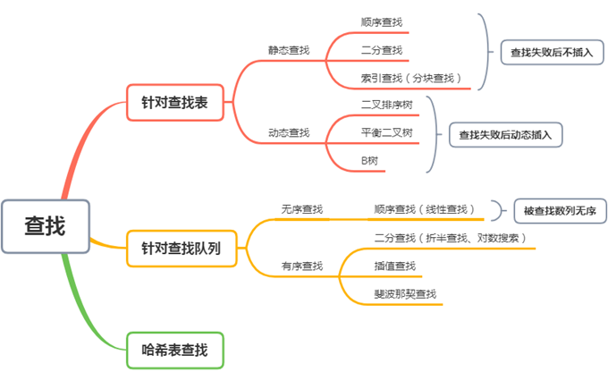

[TOC]

# 一、概述

分类

  
 

​                               

一些定义

- 静态查找表：仅做查询和检索操作的查找表；

- 动态查找表：在查询之后，还需要将查询结果为不在查找表中的数据元素插入到查找表中；或者，从查找表中删除其查询结果为在查找表中的数据元素；

- 平均查找长度（Average Search Length，ASL）：需和指定 key 进行比较的关键字的个数的期望值，称为查找算法在查找成功时的平均查找长度。

  对于含有 n 个数据元素的查找表，查找成功的平均查找长度为：ASL = Pi*Ci的和。

  Pi：查找表中第 i 个数据元素的概率。Ci：找到第 i 个数据元素时已经比较过的次数。

 

# 二、 顺序表查找

基本思想

顺序查找（Sequential Search），也称为线形查找，属于无序查找算法。从数据结构线形表的一端开始，顺序扫描，依次将扫描到的结点关键字与给定值 k 相比较，若相等则表示查找成功；若扫描结束仍没有找到关键字等于 k 的结点，表示查找失败。

适用

存储结构为顺序存储或链接存储的线性表。

复杂度分析

平均情况：查找成功时（假设每个数据元素的概率相等）ASL=1/n(1+2+3+…+n) = **(n+1)/2**；

最坏情况：当查找不成功时，需要 n 次比较，时间复杂度为 O(n)。

 

# 三、有序表查找

## 二分查找

\1.    简介

二分查找（binary search），也称折半搜索（half-interval search）、对数搜索（logarithmic search），是一种在有序数组中查找某一特定元素的搜索算法。这种搜索算法每一次比较都使搜索范围缩小一半。

\2.    算法步骤

- 1)    搜索过程从数组的中间元素开始，如果中间元素正好是要查找的元素，则搜索过程结束；
- 2)    如果某一特定元素大于或者小于中间元素，则在数组大于或小于中间元素的那一半中查找，而且跟开始一样从中间元素开始比较。

- 3)    递归进行，直到查找到或查找结束发现表中没有这样的结点。

\3.    适用：以顺序方式存储，且数据元素有序（有序表、顺序表）。如果无序，要先排序。对于静态查找表，一次排序后不再变化，折半查找能得到不错的效率。但对于需要频繁执行插入或删除操作的数据集来说，维护有序的排序会带来不小的工作量，那就不建议使用。

\4.    复杂度分析：

- a)    最坏情况下O(n)，关键词比较次数为log(n)+1（log(n)取下整）。（？）通常情况下快于顺序查找，但不能说二分查找一定优于顺序查找，在最坏的情况下不优于顺序查找。

- b)    平均时间复杂度为O(logn)

- c)    （？）由于数据项的特殊性可能会导致二叉查找树呈链式结构，查找的时间复杂度退化为O(n)，但并不是节点太复杂导致其查找效率降低的。

\5.    改进bug

- mid = (min + max) / 2;

  在 min 和 max 很大的时候，会出现溢出的情况，从而导致数组访问出错。

  - 改进1：将加法变成减法。mid = min + (max - min) / 2;
  - 改进2：官方实现写法，使用位运算。

  mid = min + ((max - min) >>> 1);// 无符号位运算符的优先级较低，先括起来

\6.    C++实现

 

 

 

## 插值查找

\1.    简介

折半查找不是自适应的（也就是说是傻瓜式的）。二分查找中查找点计算如下：

mid=(low+high)/2， 即mid=low+1/2*(high-low);

通过类比，我们可以将查找的点改进为：mid=low+(key-a[low])/(a[high]-a[low])*(high-low)

也就是将上述的比例参数1/2改进为自适应的，根据关键字在整个有序表中所处的位置，让mid值的变化更靠近关键字key，这样也就间接地减少了比较次数。

\2.    基本思想：基于二分查找算法，将查找点的选择改进为自适应选择，可以提高查找效率。当然，插值查找也属于有序查找。

注：对于表长较大，而关键字分布又比较均匀的查找表来说，插值查找算法的平均性能比折半查找要好的多。反之，数组中如果分布非常不均匀，那么插值查找未必是很合适的选择。

\3.    复杂度分析：查找成功或者失败的时间复杂度均为O(log(logn))

\4.    C++实现

 

 

## 斐波那契查找

\1.    简介

黄金比例又称黄金分割，是指事物各部分间一定的数学比例关系，即将整体一分为二，较大部分与较小部分之比等于整体与较大部分之比，其比值约为1:0.618或1.618:1。

斐波那契数列（Fibonacci sequence），又称黄金分割数列、因数学家列昂纳多·斐波那契（Leonardoda Fibonacci）以兔子繁殖为例子而引入，故又称为“兔子数列”，指这样一个数列：1、1、2、3、5、8、13、21、34、……在数学上，斐波那契数列以如下被以递推的方法定义：F(1)=1，F(2)=1， F(n)=F(n - 1)+F(n - 2)（n ≥ 3，n ∈ N*）（从第三个数开始，后边每一个数都是前两个数的和）。

随着斐波那契数列的递增，前后两个数的比值会越来越接近0.618，利用这个特性，我们就可以将黄金比例运用到查找技术中。

斐波那契查找也是二分查找的一种提升算法，通过运用黄金比例的概念在数列中选择查找点进行查找，提高查找效率。同样地，斐波那契查找也属于一种有序查找算法。

\2.    基本思想： 

根据斐波那契序列的特点对有序表进行分割。要求开始表中记录的个数为某个斐波那契数小1，及n=F(k)-1;

开始将k值与第F(k-1)位置的记录进行比较(及mid=low+F(k-1)-1)，比较结果也分为三种：

l 相等，mid位置的元素即为所求；

l >，low=mid+1，k-=2;

说明：low=mid+1说明待查找的元素在[mid+1，high]范围内，k-=2 说明范围[mid+1，high]内的元素个数为n-(F(k-1))= Fk-1-F(k-1)=Fk-F(k-1)-1=F(k-2)-1个，所以可以递归的应用斐波那契查找。

l <，high=mid-1，k-=1。

说明：low=mid+1说明待查找的元素在[low，mid-1]范围内，k-=1 说明范围[low，mid-1]内的元素个数为F(k-1)-1个，所以可以递归 的应用斐波那契查找。

\3.    复杂度分析：

a)    最坏情况下，时间复杂度为O(logn) ，

b)    期望复杂度也为O(logn)

 

# 四、线性索引查找

## 稠密索引

## 分块索引

\1.    又称索引顺序查找，是顺序查找的一种改进方法。

\2.    算法思想：将n个数据元素"按块有序"划分为m块（m ≤ n）。每一块中的结点不必有序，但块与块之间必须"按块有序"；即第1块中任一元素的关键字都必须小于第2块中任一元素的关键字；而第2块中任一元素又都必须小于第3块中的任一元素，……

\3.    算法步骤：

1)    先选取各块中的最大关键字构成一个索引表；

2)    查找分两个部分：先对索引表进行二分查找或顺序查找，以确定待查记录在哪一块中；然后，在已确定的块中用顺序法进行查找。

 

## 倒排索引

# 五、 树表查找

## 二叉排序树

\1.    简介

二叉查找树（Binary Search Tree，BST），也叫二叉搜索树，二叉排序树（Binary Sort Tree）。或者是一棵空树，或者是具有下列性质的二叉树：

- 若任意节点的左子树不空，则左子树上所有结点的值均小于它的根结点的值；
- 若任意节点的右子树不空，则右子树上所有结点的值均大于它的根结点的值；

- 任意节点的左、右子树也分别为二叉查找树。

\2.    基本思想：二叉查找树是先对待查找的数据进行生成树，确保树的左分支的值小于右分支的值，然后在就行和每个节点的父节点比较大小，查找最适合的范围。 这个算法的查找效率很高，但是如果使用这种查找方法要首先创建树。

\3.    二叉查找树性质：

- 1)    对二叉查找树进行中序遍历，即可得到递增有序的数列。

- 2)    若二叉排序树中关键码互不相同，则其中最小元素和最大元素不一定是叶子结点。

- 3)    具有 n 个结点的二叉排序树有多种，其中树高最小的二叉排序树是最佳的

- 4)    在二叉排序树中，最小值结点的左孩子一定为空指针

\4.    时间复杂度： 

二叉查找树的查询速度取决于树的深度，相同结点数深度最小的是平衡二叉树。

- 最好情况：二叉排序树是平衡的，则n个节点的二叉排序树的高度为log2n+1，其查找效率为O（logn），近似于折半查找。

- 最坏情况：二叉排序树完全不平衡，其深度可达到n，查找效率O(n)，退化为顺序查找。

- 一般的，二叉排序树的查找性能在O（logn）到O(n)之间。因此，为了获得较好的查找性能，就要构造一棵平衡的二叉排序树。

## 平衡二叉树

\1.    引入：平衡二叉树是在二叉排序树的基础上发展而来的。二叉搜索树的结构与值的插入顺序有关。同一组数，若其元素的插入顺序不同，二叉搜索树的结构是千差万别的。插入的序列越接近有序，生成的二叉搜索树就越像一个链表。为了避免二叉搜索树变成“链表”，引入平衡二叉树，即让树的结构看起来尽量“均匀”，左右子树的节点数尽量一样多。

​                               

\2.    定义：

平衡二叉查找树，简称平衡二叉树（Balanced Binary Tree）。由前苏联的数学家Adelse-Velskil和Landis在1962年提出的高度平衡的二叉树，根据科学家的英文名也称为AVL树。

1)    性质：可以是空树。假如不是空树，**任何一个结点**的左子树与右子树都是平衡二叉树，并且高度之差的绝对值不超过1。

2)    平衡因子：左子树的高度减去右子树的高度。由平衡二叉树的定义可知，平衡因子的取值只可能为0,1,-1，分别对应着左右子树等高，左子树比较高，右子树比较高。

平衡二叉树的常用实现方法有红黑树、AVL、替罪羊树、Treap、伸展树等。 最小二叉平衡树的节点的公式如下 F(n)=F(n-1)+F(n-2)+1 这个类似于一个递归的数列，可以参考Fibonacci数列，1是根节点，F(n-1)是左子树的节点数量，F(n-2)是右子树的节点数量。

\3.    生成平衡二叉树

1)    先按照生成二叉搜索树的方法构造二叉树，直至二叉树变得不平衡，即出现这样的节点：左子树与右子树的高度差大于1。如何调整要看插入的导致二叉树不平衡的节点的位置。主要有四种调整方式：LL（左旋）、RR（右旋）、LR（先左旋再右旋）、RL（先右旋再左旋）。

2)    插入时的失衡与调整：平衡二叉树的失衡调整主要是通过旋转最小失衡子树来实现的。

最小失衡子树：在新插入的结点向上查找，以第一个平衡因子的绝对值超过1的结点为根的子树称为最小不平衡子树。也就是说，一棵失衡的树，是有可能有多棵子树同时失衡的。而这个时候，只要调整最小的不平衡子树，就能够将不平衡的树调整为平衡的树。

a)    左子树过高

l LL型

 

l LE型：不可能出现

l LR型

b)    右子树过高

l RR型

l RL型

c)    删除时的失衡与调整

l  

\4.    实现平衡二叉树

1)    思路：

（1）首先定义一个节点，里面有get和set方法，构造函数等等做准备工作

（2）直接写业务流程，比如说这里的insert操作，里面涉及到的旋转操作先用方法代替

（3）对主业务流程的操作，缺哪一个方法，写哪一个方法即可

2)    定义节点

 

3)    插入数据

 

4)    右旋调整

 

5)    左旋调整

 

6)    计算是否平衡

 

7)    计算深度

 

 

 

### I、2-3查找树

2-3 Tree

\5.    多路查找树

多路查找树(multi-way search tree)，其每一个节点的孩子数可以多于两个，且每一个节点处可以存储多个元素。由于它是查找树，所有元素之间存在某种特定的排序关系。

\6.    2-3查找树定义：

和二叉树不一样，2-3树运行每个节点保存1个或者两个的值。对于普通的2节点(2-node)，它保存1个key和左右两个自己点。对应3节点(3-node)，保存两个Key，定义如下：

 

1)    要么为空，要么有2个孩子和1个数据元素，要么有3个孩子和2个数据元素，叶子节点没有孩子，并且有1个或2个数据元素。

2)    对于2节点，该节点保存一个key及对应value，以及两个指向左右节点的节点，左节点也是一个2-3节点，所有的值都比key要小，右节点也是一个2-3节点，所有的值比key要大。

3)    对于3节点，该节点保存两个key及对应value，以及三个指向左中右的节点。左节点也是一个2-3节点，所有的值均比两个key中的最小的key还要小；中间节点也是一个2-3节点，中间节点的key值在两个根节点key值之间；右节点也是一个2-3节点，节点的所有key值比两个key中的最大的key还要大。

\7.    性质

性质1：

1）如果中序遍历2-3查找树，就可以得到排好序的序列；

2）在一个完全平衡的2-3查找树中，根节点到每一个为空节点的距离都相同。（这也是平衡树中“平衡”一词的概念，根节点到叶节点的最长距离对应于查找算法的最坏情况，而平衡树中根节点到叶节点的距离都一样，最坏情况也具有对数复杂度。）

性质2：

 

 

### II、红黑树 

Red-Black Tree

\9.    定义

红黑树（Red-Black Tree，RBT）是一个自平衡(不是绝对的平衡)的二叉查找树(BST)，在进行插入和删除等可能会破坏树的平衡的操作时，需要重新自处理达到平衡状态。树上的每个节点都遵循下面的规则：

1)    每个节点要么是黑色，要么是红色。

2)    树的根始终是黑色的 (黑土地孕育黑树根)

3)    每个叶子节点（NIL）是黑色。

4)    每个红色结点的两个子结点一定都是黑色。没有两个相邻的红色节点（红色节点不能有红色父节点或红色子节点，并没有说不能出现连续的黑色节点）。

**5)**    **任意一结点到每个叶子结点的路径都包含数量相同的黑结点。**

6)    如果一个结点存在黑子结点，那么该结点肯定有两个子结点。从性质五推算出。

 

作者：安卓大叔

链接：https://www.jianshu.com/p/e136ec79235c

来源：简书

著作权归作者所有。商业转载请联系作者获得授权，非商业转载请注明出处。

 

 

 

 

### III、B树和B+树

B Tree/B+ Tree

 

B+树的叶子节点 （阿里零面）

\19.  B树（平衡多路查找树）定义：

B树和平衡二叉树稍有不同的是B树属于多叉树，又名平衡多路查找树（查找路径不只两个），数据库索引技术里大量使用者B树和B+树的数据结构。B树可以看作是对2-3查找树的一种扩展，即他允许每个节点有M-1个子节点。

l 根节点至少有两个子节点

l 每个节点有M-1个key，并且以升序排列

l 位于M-1和M key的子节点的值位于M-1 和M key对应的Value之间

l 其它节点至少有M/2个子节点

 

 

\20.  B+树定义：

B+树是对B树的一种变形树，它与B树的差异在于：

l 有k个子结点的结点必然有k个关键码；

l 非叶结点仅具有索引作用，跟记录有关的信息均存放在叶结点中。

l 树的所有叶结点构成一个有序链表，可以按照关键码排序的次序遍历全部记录。

 

\21.  B+ 树的优点在于：

由于B+树在内部节点上不好含数据信息，因此在内存页中能够存放更多的key。 数据存放的更加紧密，具有更好的空间局部性。因此访问叶子几点上关联的数据也具有更好的缓存命中率。

B+树的叶子结点都是相链的，因此对整棵树的便利只需要一次线性遍历叶子结点即可。而且由于数据顺序排列并且相连，所以便于区间查找和搜索。而B树则需要进行每一层的递归遍历。相邻的元素可能在内存中不相邻，所以缓存命中性没有B+树好。

但是B树也有优点，其优点在于，由于B树的每一个节点都包含key和value，因此经常访问的元素可能离根节点更近，因此访问也更迅速。

# 六、 哈希表

Hash table

\2.    定义

1)    Hash：一般翻译做散列、杂凑，或音译为哈希，是把任意长度的输入（又叫做预映射pre-image）通过散列算法变换成固定长度的输出，该输出就是散列值。简单的说就是一种将任意长度的消息压缩到某一固定长度的消息摘要的函数。应用：哈希表、分布式缓存。

2)    散列表（哈希表）：根据键（Key）直接访问在内存存储位置的数据结构。理想散列表是一个包含关键字的具有固定大小的数组，能够以常数时间执行插入，删除和查找操作。

3)    散列函数：每个关键字被映射到0到数组大小N-1范围，并且放到合适的位置，这个映射规则就叫散列函数。hash(key) 的值表示经过散列函数计算得到的散列值。关键字越分散，则以后查找的时间复杂度越小，空间复杂度越高。

4)    散列冲突：若key1≠key2, 而f(key1)=f(key2)。这种转换是一种压缩映射，也就是，散列值的空间通常远小于输入的空间，不同的输入可能会散列成相同的输出，所以不可能从散列值来确定唯一的输入值。理想情况下，两个不同的关键字映射到不同的单元，然而，无论设置的存储区域（n）有多大，当需要存储的数据大于 n 时，必然存在哈希值相同的情况。再好的散列函数都无法避免散列冲突。这涉及数学中的抽屉原理：桌上有十个苹果，要把这十个苹果放到九个抽屉里，无论怎样放，至少会有一个抽屉里面至少放两个苹果。

## 散列函数

1)    算法思想：哈希的思路很简单，如果所有的键都是整数，那么就可以使用一个简单的无序数组来实现：将键作为索引，值即为其对应的值，这样就可以快速访问任意键的值。这是对于简单的键的情况，我们将其扩展到可以处理更加复杂的类型的键。

2)    算法流程：用给定的哈希函数构造哈希表；根据选择的冲突处理方法解决地址冲突；在哈希表的基础上执行哈希查找。

\4.    常见散列函数

1)    直接寻址法。取关键字或关键字的某个线性函数值为散列地址。如：H(key)=key或H(key) = a·key + b，其中a和b为常数（这种散列函数叫做自身函数）

2)    除留余数法：取关键字被某个不大于散列表长度 m 的数 p 求余。对除数p的选择很重要，若p选的不好，则很容易产生同义词。一般，将p选为素数或不包含大于20的。即 H(key) = key % p, p < m。

3)    数字分析法：当关键字的位数大于地址的位数，对关键字的各位分布进行分析，选出分布均匀的任意几位作为散列地址。仅适用于所有关键字都已知的情况下，根据实际应用确定要选取的部分，尽量避免发生冲突。

4)  平方取中法：先计算出关键字值的平方，然后取平方值中间几位作为散列地址。随机分布的关键字，得到的散列地址也是随机分布的。

5)    折叠法（叠加法）

6)    随机数法

7)    MD5（Message-Digest Algorithm 5，信息-摘要算法5）

用于确保信息传输完整一致。是计算机广泛使用的杂凑算法之一。将数据（如汉字）运算为另一固定长度值，是杂凑算法的基础原理，MD5 的前身有 MD2 、MD3 和 MD4 。

MD5 是输入不定长度信息，输出固定长度 128-bits 的算法。经过程序流程，生成四个32位数据，最后联合起来成为一个 128-bits 散列。

基本方式为，求余、取余、调整长度、与链接变量进行循环运算，得出结果。

MD5 计算广泛应用于错误检查。在一些 BitTorrent 下载中，软件通过计算 MD5 来检验下载到的碎片的完整性。

8)    SHA-1（英语：Secure Hash Algorithm 1，中文名：安全散列算法1）

一种密码散列函数，SHA-1可以生成一个被称为消息摘要的160位（20字节）散列值，散列值通常的呈现形式为40个十六进制数。SHA-1 曾经在许多安全协议中广为使用，包括TLS和SSL、PGP、SSH、S/MIME和IPsec，曾被视为是MD5的后继者。

## 冲突解决

1)    拉链法（链地址法，chaining）：将所有关键字为同义词的结点链接在同一个单链表中。

2)    开放地址法（open addressing）

思想：如果冲突发生，就选择另外一个可用的位置。

  ，i=1,2,…，  ，其中H(key)为散列函数，m为散列表长，di为增量序列，可有三种取法：

a)    线性探测再散列（Linear Probing）：di=1,2,3,…，m-1

b)  二次探测再散列： 

c)    伪随机探测再散列：di=伪随机数序列。

d)    平方探测法（Quadratic probing）

e)    双重散列（Double hashing）：hi=(h(key)+i*h1(key)) ％ m，0 ≤ i ≤ m-1

不仅要使用一个散列函数，而是使用一组散列函数 hash1(key)，hash2(key)，hash3(key)……先用第一个散列函数，如果计算得到的存储位置已经被占用，再用第二个散列函数，依次类推，直到找到空闲的存储位置。

3)    再散列：Hi=RHi(key),i=1,2,…，k，RHi均是不同的散列函数，即在同义词产生地址冲突时计算另一个散列函数地址，直到冲突不再发生，这种方法不易产生“聚集”，但增加了计算时间。

4)    建立一个公共溢出区：将哈希表分为基本表和溢出表两部分，凡是和基本表发生冲突的元素，一律填入溢出表。

\6.    提高哈希表的查询效率

查找效率取决于散列函数、处理冲突的方法和装填因子。显然，冲突的产生概率与装填因子（表中记录数与表长之比）的大小成正比，即装填得越满越容易发生冲突。采用合适的处理冲突的方式避免产生聚集现象，也将提高查找效率，例如用拉链法解决冲突时就不存在聚集现象，用线性探测法解决冲突时易引起聚集现象。

\7.    哈希表的特点：

1)    以空间换时间。如果没有内存限制，那么可以直接将键作为数组的索引。那么所有的查找时间复杂度为O(1)；如果没有时间限制，那么我们可以使用无序数组并进行顺序查找，这样只需要很少的内存。哈希表使用了适度的时间和空间来在这两个极端之间找到了平衡。只需要调整哈希函数算法即可在时间和空间上做出取舍。

\8.    应用：

1)    错误校正

2)    语音识别

3)    信息安全：文件校验；数字签名；鉴权协议

4)    快速查询。redis中的字典结构就使用了散列表，使用MurmurHash算法来计算字符串的hash值，并采用拉链法处理冲突，当散列表的装载因子（关键字个数与散列表大小的比）接近某个大小时，进行再散列。

## Hash-Flooding Attack

