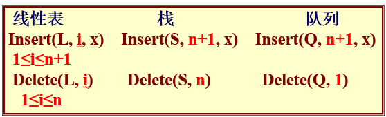
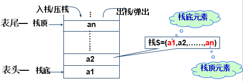
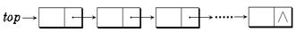
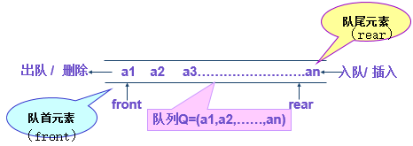
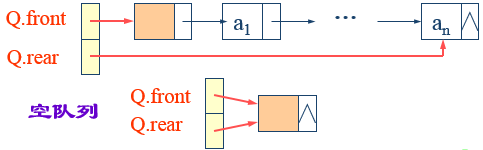

<!-- GFM-TOC -->

* [1. 用栈实现队列](#1-用栈实现队列)
* [2. 用队列实现栈](#2-用队列实现栈)
* [3. 最小值栈](#3-最小值栈)
* [4. 用栈实现括号匹配](#4-用栈实现括号匹配)
* [5. 数组中元素与下一个比它大的元素之间的距离](#5-数组中元素与下一个比它大的元素之间的距离)
* [6. 循环数组中比当前元素大的下一个元素](#6-循环数组中比当前元素大的下一个元素)
  <!-- GFM-TOC -->


# 栈

限定性的线性表

栈和队列是限定插入和删除只能在表的“端点”进行的线性表，又称为限定性的线性表。

<div align="center">  </div><br>  


1、定义

栈（Stack）：限定仅在**表尾**进行插入和删除操作的线性表。

表尾—栈顶（top），表头—栈底（bottom），不含元素的空表称空栈。

特点：先进后出（FILO）或后进先出（LIFO）。

<div align="center">  </div><br>  

- 线性表：栈是一个线性表。
- 栈底固定，仅在**表尾**进行插入和删除操作
- 栈的插入操作——进栈，压栈，入栈
- 栈的删除操作——出栈，弹栈


2、进栈出栈变化形式

> 最先进栈的元素只能是最后出栈？不一定

栈限制了插入和删除的位置，并没有限制元素进出的时间。

- 全部进，全部出：1，2，3进；3，2，1出。出栈顺序321
- 进一个，出一个：1进，1出，2进，2出，3进，3出。出栈顺序123
- 1进，2进，2出，1出，3进，3出。出栈顺序：213
- ……


3、抽象数据类型

```
ADT Stack {
	数据对象：
         D＝{ ai | ai ∈ElemSet, i=1,2,...,n,  n≥0 }
    数据关系：
         R1＝{ <ai-1, ai >| ai-1, ai∈D, i=2,...,n }
                   约定an 端为栈顶，a1 端为栈底。  
	基本操作：
		InitStack(&S)          //操作结果：构造一个空栈S
      	DestroyStack (&S)      //初始条件：栈S已存在；操作结果:销毁栈S
      	ClearStack (&S)   //初始条件:栈S已存在；操作结果:将栈置为空栈
      	StackEmpty(&S)    //初始条件:栈S已存在；操作结果:空栈返回TRUE
      	StackLength(&S)   //初始条件:栈S已存在；操作结果:返回栈的长度
      	GetTop(S, &e)     //初始条件:栈S已存在；操作结果:用e返回栈项元素
      	Push(&S, e)    //初始条件:栈S已存在；操作结果:插入e为新的栈项元素
        Pop(&S, &e)    //初始条件:栈S已存在且非空；
                        //操作结果:删除S的栈项元素，并用e返回其值
         StackTraverse(&S, visit())         //初始条件:栈S已存在且非空
         //操作结果:从栈底到栈顶依次对栈S的每个数据元素调用函数visit()，一旦visit()失败, 则操作失败
}ADT Stack
```


## 栈的顺序存储结构

可用数组来实现顺序栈。

顺序栈的基本操作的时间复杂度，除“遍历”之外，均为常量阶，即O(1)。


1、C 语言实现

由于栈的运算受限性，即：

- 栈底位置是固定不变的，所以可以将栈底位置设置在数组两端的任何一个端点；
- 栈顶位置随着进栈和出栈操作而变化，故需用一个整型变量 top 来指示当前栈顶的位置，通常称 top 为栈顶指针。

```C
//方法一
#define stacksize 6
typedef struct {
    ElemType  data[stacksize];
    int top;
} SeqStack；

//方法二
typedef struct { 
    ElemType *base;    // 存储空间基址 
    int top;           // 栈顶指针 
    int stacksize;     // 允许的最大存储空间
// 以元素为单位
 } SeqStack; 
```

- 栈满：`top-base= stacksize`

- 上溢（overflow）：栈满时入栈，则上溢。上溢是一种出错状态，应设法避免。
- 栈空：`top=base`
- 下溢（underflow）：栈空时出栈，则下溢。下溢通常属于正常现象，因为栈在程序中使用时，其初态或终态都是空栈，所以下溢常常用来作为程序控制转移的条件。


## 栈的链式存储结构

链栈的结点结构和单链表中的结点结构相同。

由于栈只在栈顶作插入和删除操作，因此链栈中不需要设置头结点，但要注意链栈中指针的方向是从栈顶指向栈底的，这正好和单链表是相反的。

<div align="center">  </div><br>  

##  栈与递归


## 应用

- 1)    数制转换
- 2)    括号匹配的检验
- 3)    迷宫求解
- 4)    表达式求值
- a)    算符优先算法
- 5)    递归
- a)    将一个递归算法改为非递归算法时，通常使用栈作为辅助结构
- 6)    汉诺塔问题


# 队列

1、定义

队列（Queue）：只能在表的一端进行插入（入队），而在表的另一端进行删除（出队）的线性表。

特点：先进先出（FIFO）

<div align="center">  </div><br>  

- 初值：`front=rear=0;`
- 空队：`front==rear;`
- 入队：`sq[rear++]=x;`
- 出队：`x=sq[front++];`


2、抽象数据类型

```
ADT Queue {
    数据对象：
               D＝{ai | ai∈ElemSet, i=1,2,...,n, n≥0}
    数据关系：
               R1＝{ <a i-1, ai > | ai-1, ai ∈D, i=2,...,n}
       约定其中a1 端为队列头，an 端为队列尾
    基本操作：
        InitQueue(&Q)
        DestroyQueue(&Q)
        QueueEmpty(Q)
        QueueLength(Q)
        GetHead(Q, &e)
        ClearQueue(&Q)
        EnQueue(&Q, e)
        DeQueue(&Q, &e)
        QueueTraverse(Q, visit0)
} ADT Queue 
```


## 顺序队列

顺序队列（顺序映象）

```C
#define queuesize 100
 typedef  struct  sqqueue {
    ElemType  sq[queuesize];
    int front;
    int rear;
  } SqQueue；
SqQueue Q; 
```


## 循环队列

1、队列顺序存储的不足

- 假溢出问题

  设顺序空间为M，则：

  真溢出：当 `front=0,rear=M-1` 时，再有元素入队发生溢出

  假溢出：当 `front≠0,rear=M-1` 时，再有元素入队发生溢出

- 解决方法

  - 队首固定，每次出队剩余元素向下移动——浪费时间
  - 循环队列


2、定义

循环队列（Circular Queue）：把队列设想成一个首尾相接的环形。


3、操作

入队： sq[rear]=x; rear=(rear+1)%queuesize;

出队： x=sq[front]; front=(front+1)%queuesize;

队满、队空：

- 另设一个标志以区别队满和队空；
- 队空：front==rear；
- 队满：(rear+1)%M==front。

<div align="center">  </div><br> 


## 链队列

（链式映象）

```C
typedef struct QNode {// 结点类型
    QElemType data;
    struct QNode *next;
} QNode, *QueuePtr;

typedef struct { // 链队列类型
    QueuePtr  front;  // 队头指针
    QueuePtr  rear;   // 队尾指针
} LinkQueue;
 
```

<div align="center">  </div><br>  


## 应用

a)    杨辉三角


# 参考资料

[力扣 - 探索 - 队列 & 栈](https://leetcode-cn.com/explore/learn/card/queue-stack/)

