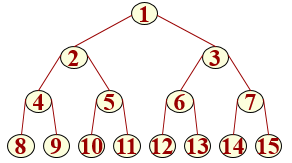
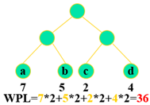

[TOC]

# 1、树的定义和基本概念

树是一类重要的非线性数据结构，是以分支关系定义的层次结构。

1、递归定义：  

树（Tree）是 `n(n≥0)` 个结点的有限集 `T`。

如果 `n = 0`，称为空树；

否则，有且仅有一个称为树的根（root）的结点；其余结点可分为 `m(m>0)` 个互不相交的有限集 T1，T2，……，Tm，其中每一个集合本身又是一棵树，称为根的子树（subtree）。

2、表示形式

- 倒立的树；

- 其它形式：嵌套集合、广义表、凹入表示法

  
  
 

  

 

3、树的基本术语

- 结点分类
  - 结点（node）：树中的元素，包括数据项及若干指向其子树的分支。
  - 度（Degree）：结点拥有的（分支）子树个数称为结点的度。
  - 叶结点（Leaf）：度为 0 的结点称为叶结点或终端结点。
  - 树的度：树中各结点的度数的最大值。
- 结点间关系
  - 孩子（Child）：结点的子树的根称为该结点的孩子（结点）
  - 双亲（父结点）：孩子结点的上一层结点称为该结点的父结点。
  - 兄弟（Sibling）：同一双亲的孩子互称兄弟（结点）
  -  结点的祖先：从根结点到该结点所经分支上的所有结点（不包括该结点本身）。
  -  结点的子孙：以某结点为根的子树中的任一结点（不包括该结点）。
- 其它概念
  - 结点的层次：从根结点算起，根为第一层，它的孩子为第二层……
  - 树的深度（树高）：树中结点的最大层次数。
  - 堂兄弟：其双亲在同一层的结点互称为堂兄弟。
  - 有序树和无序树：树中各结点的子树**从左到右有次序（不能互换）**，称该树为有序树，否则为无序树。（有序树：第一个孩子、第二个孩子…）
  - 森林：`m(m≥0)` 棵互不相交的树构成的集合。

线性结构和树结构的对比

|          线性结构          |             树结构             |
| :------------------------: | :----------------------------: |
|   第一个数据元素：无前驱   |      根结点：无双亲，唯一      |
|  最后一个数据元素：无后继  | 叶结点：无孩子，可以多个叶节点 |
| 中间元素：一个前驱一个后继 |   中间结点：一个双亲多个孩子   |

## 抽象数据类型

基本操作

a)    查找类

- Root(T) // 求树的根结点

- Value(T, cur_ e) //求当前结点的元素值

- Parent(T, cur_ e) //求当前结点的双亲结点

- LeftChild(T, cur_ e) //求当前结点的最左孩子

- RightSibling(T, cur_ e) // 求当前结点的右兄弟

- TreeEmpty(T) i/ 判定树是否为空树

- TreeDepth(T) /1 求树的深度

- TraverseTree( T, Visit0) // 遍历

b)    插入类

- InitTree(&T) //初始化置空树

- CreateTree(&T, definition) // 按定义构造树

- Assign(&T, cur_ e, value) // 给当前结点赋值

- InsertChild(&T, &p,i c) //将以c为根的树插入为结点p的第i棵子树

c)    删除类

- ClearTree(&T) //将树清空

- DestroyTree(&T) //销毁树的结构

- DeleteChild(&T, &p, i)//删除结点p的第i棵子树

## 存储结构

树的某个结点的孩子可以有多个。简单的顺序存储结构不能满足树的实现要求。

不过充分利用顺序存储和链式存储结构的特点，完全可以实现对树的存储结构的表示。我们这里要介绍三种不同的表示法：双亲表示法、孩子表示法、孩子兄弟表示法。

- 双亲表示法
  - 特点：找双亲容易，找孩子难
- 孩子链表表示法（顺序存储和链式存储相结合）
- 树的二叉链表（孩子-兄弟）表示法

##  树、森林的遍历

树和森林的遍历有三种：（无中序遍历）

- 先根（序）遍历：若树不空，则先访问根结点，然后依次先根遍历各棵子树。
- 后根（序）遍历：若树不空，则先依次后根遍历各棵子树，然后访问根结点。

- 层次遍历：若树不空，则自上而下自左至右访问树中每个结点。

# 2、二叉树

1、二叉树的定义

> 二叉树（Binary Tree）：度不大于 2 且有左右之分的树型结构。
>

二叉树，是 `n(n≥0)` 个结点的有限集合。二叉树或为空树，或是由一个根结点加上两棵分别称为左子树和右子树的、互不相交的二叉树组成。

2、二叉树的特点

- 每个结点最多只有两棵子树。二叉树的结点的度不大于 2。区别于度为 2 的树。
- 子树有左右之分，其次序不能任意颠倒，是一个有序的树型结构。区别于度不大于 2 的树。

3、二叉树的形态

- 空二叉树
- 只有一个根节点
- 根节点只有左子树
- 根节点只有右子树
- 根节点既有左子树又有右子树

## 特殊的二叉树

- 斜树：所有的结点都只有左子树的二叉树叫左斜树。所有结点都是只有右子树的二叉树叫右斜树。这两者统称为斜树。

  斜树的每一层都只有一个结点，结点的个数与二叉树的深度相同。
  线性表结构可以理解为树的一种极其特殊的表现形式。

- 满二叉树：深度为 `k` 且含有 `2^k-1` 个结点的二叉树。每一层上的结点数都是最大结点数。

  在一棵二叉树中，如果所有分支结点都存在左子树和右子树，并且所有叶子都在同层上，这样的二叉树称为满二叉树。

  
  
 

- 完全二叉树：二叉树中所含的 `n` 个结点与满二叉树中编号为 `1` 至 `n` 的结点一一对应（编号和位置一一对应）。
  
  
  
 
  
  -  特点：叶子结点只可能在层次最大的两层上出现；对任一结点，若其右分支下子孙的最大层次为 `l` ，则其左分支下子孙的最大层次必为 `l` 或 `l+1`。
  - 判断方法一：若二叉树中最多只有最下两层有度小于 `2` 的结点，且最下层的结点都依次排列在最左边，则称此二叉树为完全二叉树。
  - 判断方法二：深度为 `k` 的二叉树，若第 `1` 到第 `k-1` 层为深度为 `k-1` 的满二叉树，第 `k` 层的结点都依次排列在最左边，则称此二叉树为完全二叉树。
  
- 平衡二叉树：AVL 树、红黑树

## 二叉树的性质

- 性质1：在二叉树的第 `i` 层上至多有 `2^(i-1)` 个结点（`i≥1`）。
- 性质2：深度为 `k` 的二叉树上至多含 `2^k-1` 个结点（`k≥1`）。
- 性质3：对任何一棵二叉树，若它含有 n0 个叶子结点、 n2 个度为 2 的结点，则  n0 = n2 +1。
- 性质4：具有 `n` 个结点的完全二叉树的深度为 ⌊log2 n⌋+1 。(⌊x⌋不表示不大于 x 的最大整数)
- 性质5：如果对一棵有 `n` 个结点的完全二叉树的结点按层序编号，则对任一结点  `i(1≤i≤n)`：
  - 如果 `i=1`，则结点 `i` 是二叉树的根，无双亲；如果 `i>1`，则其双亲是 `⌊i/2⌋`
  - 如果 `2i>n`，则结点 `i` 无左孩子；如果 `2i<n`，则其左孩子是 `2i`
  - 如果 `2i+1>n`，则结点 `i` 无右孩子；如果 `2i+1≤n`，则其右孩子是 `2i+1`

## 二叉树的抽象数据类型

基本操作

1)    查找类

2)    插入类

- InitBiTree(&T);

- Assign(&T, &e, value);

- CreateBiTree(&T, definition);

- InsertChild(&T, p, LR, c);

3)    删除类

- ClearBiTree(&T); 

- DestroyBiTree(&T);

- DeleteChild(&T, p, LR);

## 二叉树的表示与实现

### 顺序存储结构

分为完全二叉树和非完全二叉树两种情况讨论。

- 完全二叉树：用一组连续存储空间（一维数组）依次从上到下、从左到右存储完全二叉树中的所有结点，亦即完全二叉树编号为 i 的结点存到一维数组的下标为 i (0 号单元不存储节点） 的位置中。

  
 

  
 

- 若该二叉树为非完全二叉树，则必须将相应位置空出来或用 0 补充，使存放的结果符合完全二叉树形状。为方便存储，需要把二叉树中补充成完全二叉树形状。

考虑到一些极端情况（斜树等），顺序存储结构会浪费存储空间，所以顺序存储结构一般只用于完全二叉树。

### 链式存储结构

优点：便于插入、删除和修改；数据不需移动；只需修改指针；可提高效率。分类：

#### 二叉链表

a)    结点结构： 

b)    特点：找孩子容易，但不利于找双亲

#### 三叉链表

a)    特点：找孩子容易，找双亲也很容易

b)    结点结构： 

#### 双亲链表（静态链表）

应用场景：找双亲容易，找孩子不容易，适用于如判断一个元素在哪个集合中，集合的合并等操作。

#### 线索链表

指向“前驱”和 “后继” 的**指针**，称为“线索”。包含 “线索” 的存储结构，称为 “线索链表”。相应的二叉树称为线索二叉树（Threaded Binary Tree）。

##  二叉树的遍历

二叉树的遍历：从根节点出发，按一定规律（顺着某一条搜索路径）依次**访问**二叉树中的所有结点，使得每个结点**均被访问**而且**仅被访问一次**。

- “访问”的含义很广，可以是输出，也可以是修改结点信息等。
- 次序。线性结构的遍历方式一般有从头至尾、循环、双向等。树的结点之间不存在唯一的前驱和后继关系。
- 二叉树的遍历的本质：把一个非线性结构的二叉树转化为一个线性结构。

遍历方式：

- 先序（preorder，先根、前序）：访问根结点；先序遍历左子树；先序遍历右子树
- 中序（inorder，中根）：中序遍历左子树；访问根结点；中序遍历右子树

- 后序（后根）：(1)后序遍历左子树; (2)后序遍历右子树；(3)访问根结点

- 层次（层序）：若树为空，则空操作返回，否则从根结点开始访问，从上而下逐层遍历，在同一层中，按从左到右的顺序对结点逐个访问。

遍历算法的应用：

- 按先序遍历序列建立二叉树的二叉链表

- 统计二叉树中结点的个数（先序）
- 求二叉树的深度（后序）
- 复制二叉树（后序）
- 根据遍历确定树（**必须要有中序才能唯一确定一棵二叉树**）
  - 先序和中序：先序确定二叉树的根结点；中序确定二叉树的左右子树序列。
  - 后序和中序：

## 树、森林与二叉树的转换

1)    树→二叉树：

- a)    加线：在兄弟之间加一连线

- b)    抹线：对每个结点，除了其左孩子外，去除其与其余孩子之间的关系

- c)    旋转：以树的根结点为轴心，将整树顺时针转45°

2)    二叉树→树：

- a)    加线：若p结点是双亲结点的左孩子，则将p的右孩子，右孩子的右孩子，……沿分支找到的所有右孩子，都与p的双亲用线连起来

- b)    抹线：抹掉原二叉树中双亲与右孩子之间的连线

- c)    调整：将结点按层次排列，形成树结构

3)    森林→二叉树

- a)    将各棵树分别转换成二叉树

- b)    将每棵树的根结点用线相连

- c)    以第一棵树根结点为二叉树的根，再以根结点为轴心，顺时针旋转，构成二叉树结构

4)    二叉树→森林

- a)    抹线：将二叉树中根结点与其右孩子连线，及沿右分支搜索到的所有右孩子间连线全部抹掉，使之变成孤立的二叉树

- b)    还原：将孤立的二叉树还原成树

# 3、哈夫曼树

1、定义

- 路径：从树中一个结点到另一个结点之间的结点与分支（边）构成这两个结点之间的路径。

- 路径长度：路径上的分支（边）数。

- 树的路径长度：从树根到每一个叶子结点的路径长度之和

- 树的带权路径长度：树中所有叶子结点的带权路径（Weighted Path Length，WPL）长度之和。
  $$
  WPL=∑_{k-1}^n w_k l_k
  $$
  

`n`：叶子结点的个数；wk：第 k 个叶子结点的权值；lk：第 k 个叶子结点到根的路径长度。

  
 

- 哈夫曼树（Huffman tree）又称最优二叉树，是 n 个带权叶子结点构成的所有二叉树中，是 WPL 最小的二叉树。路径上权值较大的结点离根较近。

## 构造哈夫曼树

已知权值 W={ 5, 6, 2, 9, 7 }

  
 

- 1)    根据给定的 n 个权值{w1, w2, …, wn}构成 n 棵二叉树的集合 F ={T1, T2, …, Tn} ，其中每棵二叉树 Ti (1≤i≤n) 中只有一个带权为wi的根结点，其左右子树均空；
- 2)    在 F 中选取两棵根结点的权值最小的树作为左右子树，构造一棵新的二叉树，且置新的二叉树的根结点的权值为其左、右子树上根结点的权值之和。
- 3)    在F中删除这两棵树，同时将新得到的二叉树加入 F 中。

- 4)    重复(2)和(3)，直到 F 只含一棵树为止。这棵树便是所求的哈夫曼树。

## 哈夫曼树的应用

1)    寻求最佳判断过程

## 哈夫曼编码

1)    背景：（1）如何使电报编码变短，非前缀编码会出现二义性；（2）用二叉树可以构造前缀编码；（3）由哈夫曼树得到最优编码

2)    基本原理：哈夫曼(Huffman)编码是一种常用的压缩编码方法，是Huffman于1952年为压缩文本文件建立的。基本原理是：频繁使用的信息用较短的代码代替，较少使用的信息用较长的代码代替，每个信息的代码各不相同。这些代码都是二进制码，且码的长度是可变的。

3)    Huffman编码是一种前缀编码（有的教材又称无前缀编码）。即任一字符的编码不会是另一字符的编码前缀。只有前缀编码才能被正确译码。同样的元素集合，产生的haffman树及编码都可能是不一样的。但编码方和译码方的哈夫曼树必须一致，否则不能正确译码。

4)    译码：从Huffman树根开始，从待译码电文中逐位取码。若编码是“0”，则向左走；若编码是“1”，则向右走；一旦到达叶子结点，则译出一个字符；再重新从根出发，直到电文结束。

### 哈夫曼编码的实现

1)    由n个叶子结点构成的哈夫曼树共有2n-1个结点，有n-1度为2的结点。仅有度为2的结点和叶子结点，没有度为1的结点。

2)    一棵有n个叶子的哈夫曼树可以用一个大小为 2n-1 的一维数组存放哈夫曼树的各个结点。 由于每个结点同时还包含其双亲信息和孩子结点的信息，所以构成一个静态三叉链表。

### 哈夫曼编码的应用

1)    数据压缩

  

 

