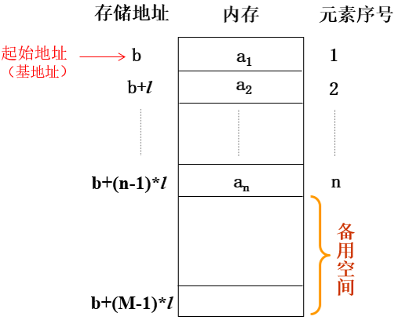

[TOC]


# 线性表

> 线性表（List）：“一根直线”。

## 定义

1、文字定义

由 `n（n≥0）` 个**类型相同**的数据元素组成的有限序列。

- **类型相同**。例子：排队占位，人和书包的类型不同，书包不能占位。

- **序列**：元素间有顺序。若元素存在多个，则第一个元素无前驱，最后一个元素无后继，其他每个元素都有且只有一个前驱和后继。例子：公司的组织架构不是线性表。

- **有限**：元素个数是有限的。在计算机中处理的对象都是有限的，无限的数列只存在于数学的概念中。


2、数学定义

线性表通常表示成下列形式：
$$
L=(a_1，a_2，...，a_{i-1}，a_i，a_{i+1}...，a_n)
$$
`n` 为线性表中数据元素的个数，称为线性表的长度。当 `n=0` 时，线性表为空，称为空表，又称为空线性表。


## 抽象数据类型

3、抽象数据类型中的操作

```
1)    初始化：InitList( &L )  //构造一个空的线性表L。
2)    结构销毁：DestroyList( &L )
3)    判空：ListEmpty( L )
4)    长度：ListLength( L )
5)    求前驱：PriorElem( L, cur_e, &pre_e )
6)    求后继：NextElem( L, cur_e, &next_e )
7)    求某个位置的元素的值：GetElem( L, i, &e )
8)    定位/查找：LocateElem( L, e, compare( ) )
9)    遍历：ListTraverse(L, visit( ))
10)  置空：ClearList( &L )
11)  改变某个位置的元素的值：PutElem( &L, i, &e )
12)  插入：ListInsert( &L, i, e )
13)  删除：ListDelete(&L, i, &e )
```


## 存储结构

线性表有两种物理结构（存储结构）：顺序存储结构和链式存储结构（链表）。

<div align="center">  </div><br>

### 顺序存储结构

1、定义

线性表的顺序存储结构：用一段**地址连续**的存储单元依次存储线性表的数据元素。

<div align="center">  </div><br>


2、操作

- 插入：在第 `i（1≤i≤n+1）` 个元素之<u>前</u>插入一个新的数据元素 `x` ，使长度为 `n` 的线性表变为 `n+1` 。
  $$
  L=(a_1，a_2，...，a_{i-1}，x，a_i，a_{i+1}...，a_n)
  $$
  需将第 `i` 至第 `n` 共 `n-i+1` 个元素后移。所需移动的元素次数的平均次数为： `n/2` 。算法时间复杂度为 `O(n)` 。

- 删除：将第 `i（1≤i≤n）` 个元素删除，使长度为 `n` 的线性表变成长度为 `n-1` 的线性表。

  需将第 `i+1` 至第 `n` 共 `n-i` 个元素前移。所需移动的元素次数的平均次数为：  `(n-1)/2`。算法时间复杂度为 `O(n)` 。

结论：在顺序表中插入或删除一个元素时，平均移动一半元素，当 `n` 很大时，效率很低。


3、优缺点

- 优点：逻辑上相邻，物理地址相邻；可随机存取任一元素；存储空间使用紧凑。

- 缺点：插入、删除操作需要移动大量的元素；预先分配空间需按最大空间分配，利用不充分；表容量难以扩充。


### 链式存储结构

1、顺序存储结构不足的解决办法

顺序存储结构最大的缺点是插入、删除操作需要移动大量的元素。

问题原因：相邻两元素的存储位置也具有邻居关系。

解决方法：线性表的链式存储结构。解除相邻两元素存储位置的邻居关系。有效解决顺序存储中插入和删除时的数据移动问题。


# 线性表、链表、栈和队列之间的关系

线性表是最基本的数据结构之一。

顺序表、链表是线性表的两种实现方式，解决数据存放问题。

栈和队列是线性表的应用，无需关心其在物理上的存储位置，而是关注数据操作。

栈和队列的都有两种实现方式：内置数组实现、链表实现。

