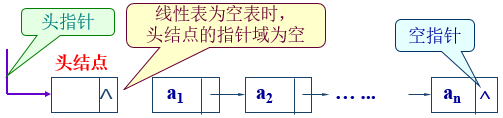
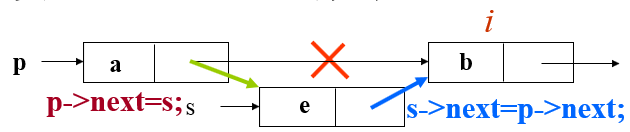
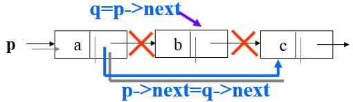
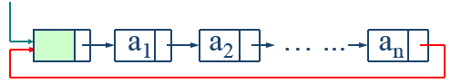
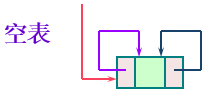
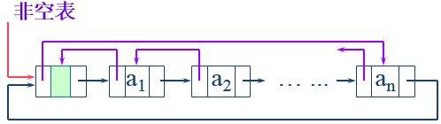

# 线性表的链式存储结构

## 定义

1、顺序存储结构不足的解决办法

线性表的链式存储结构解除相邻两元素存储位置的邻居关系，有效解决线性表的顺序存储中插入和删除时的数据移动问题。


2、一些定义

线性表的链式存储结构：用一**组地址任意**的存储单元存放线性表中的数据元素。

链表（Linked List）：以“结点的序列”表示线性表。元素（数据元素的映象）+指针（指示后继元素的存储位置）=结点（表示数据元素及关系的映象）

在链表表示中，表的数据元素可存放在存储器中的任何位置，**每一个元素都与其下一个元素的地址（指针）相关联。**

<div align="center">  </div><br>

- 单链表：结点中只含一个指针域的链表。

- 首元结点 ：链表中存储第一个数据元素的结点

- 头指针：指向链表中第一个结点（头结点或首元结点）的指针

  头指针具有标识作用，所以常用头指针冠以链表的名字

  无论链表是否为空，头指针均不为空。头指针是链表的必要元素

- 头结点：在首元结点之前附设一个结点，其数据域一般无意义（也可存放链表的长度），其指针域指向首元结点。指针域为空表示线性表为空。

  头结点不一定是链表必须要素

  **头结点是为了操作的统一和方便而设立的**：带头结点时，不管是否为空表，头指针的值都指向头结点，而不带头结点则需要根据不同情况来修改头指针的值，操作不统一，所以绝大多是都使用带头结点方式较为方便。作用主要是为了方便对链表的操作，可以对空表、非空表以及首元结点的操作进行统一处理。例如，对在第一元素结点前插入结点和删除第一结点操作与其他结点的操作统一。


3、单链表的 C 语言描述

在 C 语言中可用结构指针描述单链表

- (*p)：表示 `p` 所指向的结点
- (*p).data↔p->data： `p` 指向结点的数据域；
- (*p).next↔p->next： `p` 指向结点的指针域

```C
// 单链表的头指针：LinkList L
// 生成一个Lnode型新结点：p = (Lnode *) malloc ( sizeof ( Lnode ) );
// 系统回收 p 结点：free(p)
typedef struct Node{ 
    elemtype       data;
    struct Node  *next;
}Node;
typedef struct Node *Linklist;     // 定义 Linklist
```


## 单链表的操作

单链表的操作

- GetElem(L, i, &e)   // 取第 i 个数据元素
- ListInsert(&L,i,e)   // 插入数据元素
-  ListDelete(&L,i, &e)   // 删除数据元素
- ClearList(&L) // 重置线性表为空表
- CreateList(&L, n)//生成含n个数据元素的链表


### 单链表的插入

在带头结点的单链表 `L` 中第 `i` 个位置之前插入元素 `e`：

- 定位 `i-1` 位置
- 建立插入结点 `e` 
- 插入链表
  - 将 `i-1` 的 `next` 赋给 `e` 的 `next` —— `s->next = p->next`
  - 将 `e` 赋给 `i-1` 的 `next` —— `p->next = s`
- 时间复杂度：O(n)。

<div align="center">  （先蓝后绿）</div><br>  


### 单链表的删除

在带头结点的单链表 `L` 中删除第 `i` 个元素：

- `p->next=p->next->next;`
-  时间复杂度：O(n)

 <div align="center">  </div><br>  


### 头插法建立单链表

从一个空表开始，重复读入数据，生成新结点，将读入的数据存放到新结点的数据域中，然后将新结点插入到当前链表的表头上，直到读入结束标志为止。


### 尾插法建立单链表

头插法建立链表虽然算法简单，但生成的链表中结点的次序和输入的顺序相反。若希望二者次序一致，可采用尾插法建表。该方法是将新结点插入到当前链表的表尾上，为此必须增加一个尾指针 r，使其始终指向当前链表的尾结点。


### 单链表的整表删除


## 单链表特点

- 它是一种动态结构，整个存储空间为多个链表共用；
- 不需预先分配空间；
- 指针占用额外存储空间；
- 不能随机存取，查找速度慢


## 其它形式的链表

### 静态链表


### 循环链表

循环链表（circular linked list）：最后一个结点的指针域的指针又指回第一个结点的链表。

<div align="center">  </div><br>  

- 特点：从表中任一结点出发均可找到表中其他结点，提高查找效率
- 操作与单链表基本一致，判最后一个结点的循环条件不同
  - 单链表：p->next = NULL
  - 循环链表：p->next = h


### 双向链表

单链表具有单向性的缺点，在查找某节点的直接前趋的时间复杂度将达到 O(n)。

双向链表（Doubly linked list）：在单链表的每个结点中再增加一个指向其前驱的指针域 prior。这样形成的链表中有两个方向不同的链，故称为双向链表。

```C
typedef struct Dulnode {
    ElemType   data ;
    struct Dulnode *prior ;
    struct Dulnode *next ;
}Dulnode, *Dulinklist ;
```

双向链表的特点：

- 查询和单链表相同。
- 插入和删除时需要同时修改两个方向上的指针。


### 双向循环链表

双向循环链表

<div align="center">  </div> 

<div align="center">  </div><br>  

- 性质

  ```
  p->prior->next= p= p->next->proir;
  ```

- 删除带头结点的双向循环线性表 L 的第 `i` 个元素：

  ```
  p->prior->next=p->next; 
  p->next->prior=p->prior;
  ```

- 插入：在双向循环线性表 L 的第 `i` 个位置之前插入元素 `e`。

  ```
  s->data=e;
  s->prior=p->prior;
  p->prior->next=s;
  s->next=p;
  p->prior=s;
  ```


# 参考资料

- [力扣 - 探索 - 链表](https://leetcode-cn.com/explore/learn/card/linked-list/)


