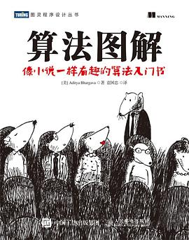

# 理论参考

## 《大话数据结构》

程杰 / 2011-6 / 清华大学出版社

[豆瓣](https://book.douban.com/subject/6424904/) 7.9分，1283 人评分。

  
 

过一遍基础。

## 《数据结构》

严蔚敏，吴伟民 / 2007-3-1 / 清华大学出版社

[豆瓣](https://book.douban.com/subject/2024655/) 7.0分，1315 人评分。

  
 

## 《数据结构》

[豆瓣](https://book.douban.com/subject/25859528/) 9.4 分，139 人评分。

  
 

使用 C++ 实现，可以结合配套视频学习：[清华大学 数据结构](https://www.xuetangx.com/courses/course-v1:TsinghuaX+30240184+sp/about)。

## 《算法》（第4版）（1）

塞奇威克(RobertSedgewick) / 韦恩(KevinWayne)/ 2012-10-1 / 人民邮电出版社

[豆瓣](https://book.douban.com/subject/19952400/) 9.4 分，873 人评分。

  
 

比《算法导论》更容易理解，非常适合作为数据结构与算法的入门书籍。使用 Java 实现，但不会涉及太多的 Java 高级语法，因此也适合其它语言使用者使用。

Coursera 配套视频课程：[Algorithms](https://www.coursera.org/learn/algorithms-part1)。如果课程还没到该课程的注册时间，可以点进去观看视频，只是没有作业和证书。

## 《算法导论》（第3版）（1）

ThomasH.Cormen/CharlesE.Leiserson/RonaldL.Rivest/CliffordStein/ 2012-12 / 机械工业出版社

[豆瓣](https://book.douban.com/subject/20432061/) 9.2 分，996 人评分。

  
 

## 《算法图解》 

[美]Aditya Bhargava / 2017-3 / 人民邮电出版社

[豆瓣](https://book.douban.com/subject/26979890/) 8.4分，1682 人评分。

  
 

## 力扣探索（2）

[力扣探索](https://leetcode-cn.com/explore/) & [LeetCode explore](https://leetcode.com/explore/)

# 编程题库

## 刷题网站

[牛客网在线编程](https://www.nowcoder.com/activity/oj)

LeetCode

[力扣](https://leetcode-cn.com/problemset/all/) & [Leetcode](https://leetcode.com/problemset/algorithms/)

> 必刷Top类型

剑指 Offer 上的题目基本能在 Leetcode 上找到，而且 Leetcode 更全面，如果时间充足的话建议先刷 Leetcode 再刷剑指 Offer。刷 200 题就足够应对大多数公司的代码面试题。

最开始可以按 Acceptance 逆序来刷，不会的题目先看看 Discuss 上的高票答案，先学习别人是怎么做的。建议使用 Leetcode 英文版，因为英文版 Discuss 上的优质答案比较多。

## 题库书籍

### 《剑指Offer》（1）

剑指 Offer 何海涛 / 2012-1 / 电子工业出版社
剑指 Offer：名企面试官精讲典型编程题（第2版） 何海涛 / 2017-5 / 电子工业出版社出品方:博文视点

[豆瓣](https://book.douban.com/subject/6966465/) 8.3 分，572 人评分。

  
  

基本涵盖了高频代码面试题，在面试之前很有必要把这本书里面的题目都刷完。

刷题网站：[牛客网](https://www.nowcoder.com/ta/coding-interviews) ；[力扣](https://leetcode-cn.com/problemset/lcof/)

题解：
- 官方提供了第二版的源代码（原书使用 C++ 实现）：[CodingInterviewChinese2](https://github.com/zhedahht/CodingInterviewChinese2)。
- CYC2018：[剑指 Offer 题解](https://github.com/CyC2018/CS-Notes/blob/master/notes/%E5%89%91%E6%8C%87%20Offer%20%E9%A2%98%E8%A7%A3%20-%20%E7%9B%AE%E5%BD%95.md)
- DIY：印象笔记

### 《程序员面试金典》

Gayle Laakmann McDowell / 2019-9-18 / 人民邮电出版社 / 图灵教育（出品）

[豆瓣](https://book.douban.com/subject/34813624/)，分，评分人数不足。

  
  

### 《程序员代码面试指南：IT名企算法与数据结构题目最优解 》（2）

左程云/ 2015-9 / 电子工业出版社

[豆瓣](https://book.douban.com/subject/26638586/) 8.9 分，135 人评分。

  
  

适合当做 Leetcode 的辅助书籍，对一些题目讲解的不错。除了算法题之外，还有一些海量数据分析的题目很值得看一下。

### 《挑战程序设计竞赛》（3）

[日]秋叶拓哉 / [日]岩田阳一 / [日]北川宜稔 / 2013-7-1 / 人民邮电出版社

[豆瓣](https://book.douban.com/subject/24749842/) 9.0 分，276 人评分。

  
  

大厂面试可能会出现一些简单 ACM 题目，所以这本书也值得看一部分内容，比如线段树、网络流等。

