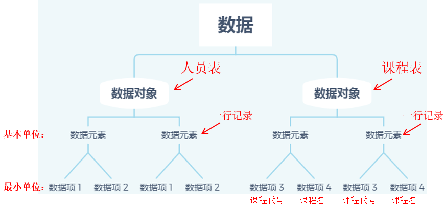
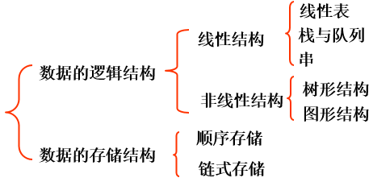
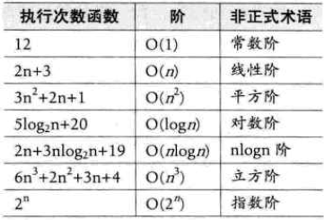
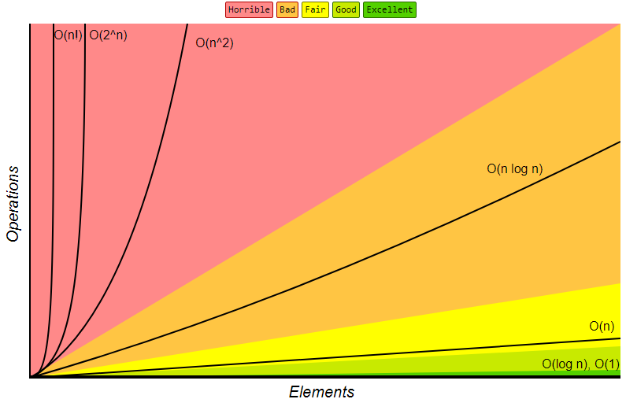
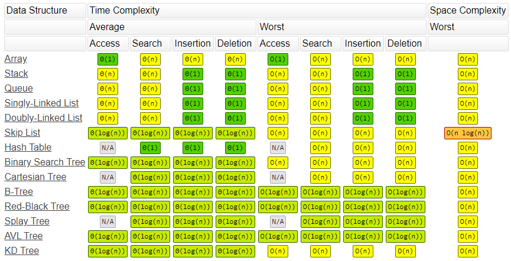
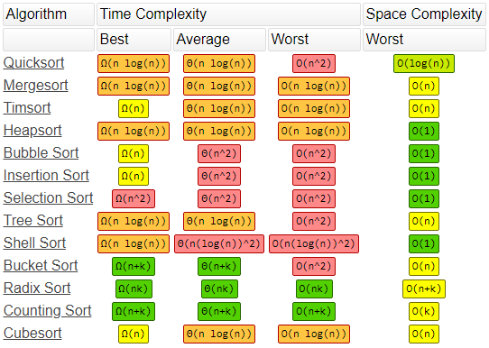

# 数据结构绪论

## 概念

1、基本概念

数据结构（Data structure）：相互之间存在一种或多种特定**关系**的**数据元素**的集合。（带有结构的数据元素的集合）

<div align="center">  </div><br>

- 数据（data）：**描述客观事物的符号的总称**。计算机可以操作的对象，能被计算机识别，并输入给计算机处理的符号集合。

  （包括整型、实型等数值类型，字符及音像、视频等非数值类型）。

- 数据元素（data element）：组成数据的、有一定意义的**基本单位**，通常作为整体处理。也称节点（node）或记录（record）。

- 数据项（data item）：一个数据元素可以由若干个数据项组成。数据项是数据不可分割的**最小单位**。

- 数据对象（data object）：性质相同（数据元素具有相同数量和类型的数据项）的数据元素的集合，是数据的子集。

> *注意*：在实际应用中，处理的数据元素通常具有相同性质。在不产生混淆的情况下，我们都将数据对象简称为数据。


2、数据结构的形式化定义

数据结构是一个二元组：Data_Structure=(D,S)

- D 是数据元素的有限集；
- S 是 D 上关系的有限集。


## 逻辑结构与物理结构

<div align="center">  </div><br>

- 逻辑结构：数据对象中数据元素之间的相互关系。
  - 集合结构：数据元素除“同属于一个集合”外，没有其他关系。各数据元素“平等”。
  - 线性结构：数据元素之间是 “一对一” 的关系。比如：线性表、栈、队列、链表。
  - 树形结构：数据元素之间是“一对多”的层次关系。比如：树。
  - 图形结构：数据元素之间是“多对多”的关系。比如：图。

- 物理结构（存储结构）：指数据的逻辑结构在计算机中的存储形式。
  - 顺序存储结构：把数据元素存放在地址连续的存储单元里，其数据间的逻辑关系和物理关系是一致的。
  - 链式存储结构：把数据元素存放在任意的存储单元里，这组存储单元可以是连续的，也可以是不连续的。


## 抽象数据类型

- 数据类型：一组性质相同的值的集合及定义在此集合上的一些操作的总称。在C语言中，按照取值的不同，数据类型可以分为两类：

  - 原子类型：不可以再分解的基本类型。包括整型、实型、字符型等。
  - 结构类型：若干个类型组合而成，可再分解。如：整型数组由若干个整型数据组成。

- 抽象：抽取出事物具有的普遍性的本质。

  抽出问题的特征而忽略非本质的细节，是对具体事物的一个概括。抽象是一种思考问题的方式，隐藏了繁杂的细节，只保留实现目标所必需的信息。

- 抽象数据类型（Abstract Data Type，ADT）：指一个数学模型及定义在该模型上的一组操作。其定义仅取决于它的一组逻辑特性，与其在计算机内部如何表示和实现无关。

  -  “抽象”的意义在于数据类型的数学抽象特性。
  -  抽象数据类型体现了程序设计中问题分解、抽象和信息隐藏的特性。将实际生活中的问题分解为多个规模小且容易处理的问题，然后建立一个计算机能处理的数据模型，并把每个功能模型的实现细节作为一个独立的单位，从而使具体实现过程隐藏起来。
  -  ADT的形式化定义：抽象数据类型的三元组表示，{D,S,P}，
     -  D 是数据对象；
     -  S 是 D 上的关系集；
     -  P 是对 D 的基本操作集

```C
ADT 抽象数据类型名
Data
    数据元素之间逻辑关系的定义
Operation
    操作1
        初始条件
        操作结果描述
    操作2
        ……
    操作n
        ……
endADT
```


# 算法绪论

1、概念

算法（Algorithm）是对特定问题求解步骤的一种描述，在计算机中表现为指令的有限序列，并且每条指令表示一个或多个操作。

算法是在计算机中表现为指令的有限序列，并且每条指令表示一个或多个操作。


## 五个特性

五个特性

- 输入：零个或多个

- 输出：一个或多个

- 有穷性：一个算法必须在执行有限步骤之后结束。

  算法在执行有效的步骤后自动结束，不会出现无限循环，且每一个步骤在可接受的时间内完成。（不是纯数学意义的，是实际应用中合理的、可以接受的“有边界”。）

- 确定性：算法的每一步骤都具有确定的含义，不会出现二义性，并且算法只有唯一的一条执行路径。

- 可行性：算法的每一步都必须可行。也就是说，每一步都能够通过执行有效次数完成。


## 设计要求

算法设计的要求

- 正确性：算法至少应该具有输入、输出和加工处理无歧义性、能正确反映问题的需求、能够得到问题的正确答案。
  - 算法程序没有语法错误。（最易）
  - 算法程序对于合法的输入数据能够产生满足要求的输出结果。
  - 算法程序对于非法的输入数据能够得出满足规格说明的结果。（算法是否正确标准）
  - 算法程序对于精心选择的，甚至刁难的测试数据都有满足要求的输出结果。（最难）
- 可读性：算法设计的另一目的是为了便于阅读、理解和交流。不要一味追求代码量。
- 健壮性：输入数据不合法时，算法能做出相关处理，而不是产生异常或莫名其妙的结果。
- 时间效率高和存储量低。


## 算法分析

1、算法效率的度量

方法：时间复杂度、空间复杂度。

当不用限定词地使用“复杂度”时，通常都是指时间复杂度。


2、函数的渐近增长：

输入规模 n 在没有限制的情况下，只要超过一个数值 N，这个函数就总是大于另一个函数，我们称函数是渐近增长的。给定两个函数 f(n) 和 g(n) ，如果存在一个整数 N，使得对于所有的 n>N ，f(n) 总是比 g(n) 大，那么，我们说 f(n) 的增长渐近快于 g(n) 。


3、时间复杂度

在进行算法分析时，语句总的执行次数 T(n) 是关于问题规模 n 的函数，进而分析 T(n) 随n的变化情况并确定 T(n) 的数量级。算法的时间复杂度，也就是算法的时间量度，记作：T(n)=O(f(n))。它表示随问题规模 n 的增大，算法执行时间的增长率和 f(n) 的增长率相同，称作算法的渐近时间复杂度，简称为时间复杂度。其中 f(n) 是问题规模 n 的某个函数。一般情况下，随着 n 的增大，T(n) 增长最慢的算法为最优算法。


4、空间复杂度：

通过计算算法所需的存储空间实现，计算公式记作：S(n)=O(f(n))，其中，n 为问题的规模，f(n) 为语句关于 n 所占存储空间的函数。


### 数学模型

1. 近似

   N<sup>3</sup>/6-N<sup>2</sup>/2+N/3 \~ N<sup>3</sup>/6。使用 \~f(N) 来表示所有随着 N 的增大除以 f(N) 的结果趋近于 1 的函数。

2. 增长数量级

   N<sup>3</sup>/6-N<sup>2</sup>/2+N/3 的增长数量级为 O(N<sup>3</sup>)。

   增长数量级将算法与它的具体实现隔离开来，一个算法的增长数量级为 O(N<sup>3</sup>) 与它是否用 Java 实现，是否运行于特定计算机上无关。

3. 内循环

   执行最频繁的指令决定了程序执行的总时间，把这些指令称为程序的内循环。

4. 成本模型

   使用成本模型来评估算法，例如数组的访问次数就是一种成本模型。


### 大O符号


用大写 O() 来体现算法时间复杂度的记法，称之为大 O 记法。大 O 符号描述了当数据结构里面的元素增加的时候，算法的规模或者是一个渐进上界。

大 O 符号也可用来描述其他的行为，比如：内存消耗。因为集合类实际上是数据结构，我们一般使用大 O 符号基于时间，内存和性能来选择最好的实现。大 O 符号可以对大量数据的性能给出一个很好的说明。


 推导大 O 阶方法

<div align="center">  </div><br>

- 用常数 1 取代运行时间中的所有加法常数；
- 在修改后的运行次数函数中，只保留最高阶项；
- 如果最高阶项存在且不是 1，则去除与这个项相乘的常数。得到的结果就是大 O 阶。


### 注意事项

1. 大常数

   在求近似时，如果低级项的常数系数很大，那么近似的结果是错误的。

2. 缓存

   计算机系统会使用缓存技术来组织内存，访问数组相邻的元素会比访问不相邻的元素快很多。

3. 对最坏情况下的性能的保证

   在核反应堆、心脏起搏器或者刹车控制器中的软件，最坏情况下的性能是十分重要的。

4. 随机化算法

   通过打乱输入，去除算法对输入的依赖。

5. 均摊分析

   将所有操作的总成本除于操作总数来将成本均摊。例如对一个空栈进行 N 次连续的 push() 调用需要访问数组的次数为 N+4+8+16+...+2N=5N-4（N 是向数组写入元素的次数，其余都是调整数组大小时进行复制需要的访问数组次数），均摊后访问数组的平均次数为常数。


### 常用的时间复杂度

常用的时间复杂度从小到大排列：
$$
O(1)<O(logn)<O(n)<O(nlogn)<O(n^2)<O(n^3)<O(2^n)<O(n!)（阶乘阶）<O(n^n)
$$


- 对数阶

```Java
int count = 1;
while(count < n){
    count = count * 2;    //多少个2相乘后大于n？ 2^x=n 得到x=logn。
}
```


- 平方阶

  - O(m*n)

  ```Java
  for(int i =0;i < m;i++)
      for(int j = 0;j < n;j++)
          /*时间复杂度为O(1)的程序步骤序列*/
  ```
  
    - O(n*n)
  
  ```Java
  for(int i =0;i < m;i++)
      for(int j = i;j < n;j++)
          /*时间复杂度为O(1)的程序步骤序列*/
  ```
  
  

 

### 计算时间复杂度

时间复杂度的计算方法：

- 找出频度最大的基本操作；
- 计算最坏情况下语句的频度；
- 去掉常量及阶小的项。


##  算法复杂度速查表

> https://www.bigocheatsheet.com/

1、大O

<div align="center">  </div><br> 


2、数据结构操作

 <div align="center">  </div><br> 


3、数组排序算法

  <div align="center">  </div><br> 


# 例子：ThreeSum

ThreeSum 用于统计一个数组中和为 0 的三元组数量。

```java
public interface ThreeSum {
    int count(int[] nums);
}
```

##  1. ThreeSumSlow

该算法的内循环为 `if (nums[i] + nums[j] + nums[k] == 0)` 语句，总共执行的次数为 N(N-1)(N-2) = N<sup>3</sup>/6-N<sup>2</sup>/2+N/3，因此它的近似执行次数为 \~N<sup>3</sup>/6，增长数量级为 O(N<sup>3</sup>)。

```java
public class ThreeSumSlow implements ThreeSum {
    @Override
    public int count(int[] nums) {
        int N = nums.length;
        int cnt = 0;
        for (int i = 0; i < N; i++) {
            for (int j = i + 1; j < N; j++) {
                for (int k = j + 1; k < N; k++) {
                    if (nums[i] + nums[j] + nums[k] == 0) {
                        cnt++;
                    }
                }
            }
        }
        return cnt;
    }
}
```

##  2. ThreeSumBinarySearch

将数组进行排序，对两个元素求和，并用二分查找方法查找是否存在该和的相反数，如果存在，就说明存在和为 0 的三元组。

应该注意的是，只有数组不含有相同元素才能使用这种解法，否则二分查找的结果会出错。

该方法可以将 ThreeSum 算法增长数量级降低为 O(N<sup>2</sup>logN)。

```java
public class ThreeSumBinarySearch implements ThreeSum {

    @Override
    public int count(int[] nums) {
        Arrays.sort(nums);
        int N = nums.length;
        int cnt = 0;
        for (int i = 0; i < N; i++) {
            for (int j = i + 1; j < N; j++) {
                int target = -nums[i] - nums[j];
                int index = BinarySearch.search(nums, target);
                // 应该注意这里的下标必须大于 j，否则会重复统计。
                if (index > j) {
                    cnt++;
                }
            }
        }
        return cnt;
    }
}
```

```java
public class BinarySearch {

    public static int search(int[] nums, int target) {
        int l = 0, h = nums.length - 1;
        while (l <= h) {
            int m = l + (h - l) / 2;
            if (target == nums[m]) {
                return m;
            } else if (target > nums[m]) {
                l = m + 1;
            } else {
                h = m - 1;
            }
        }
        return -1;
    }
}
```

##  3. ThreeSumTwoPointer

更有效的方法是先将数组排序，然后使用双指针进行查找，时间复杂度为 O(N<sup>2</sup>)。

同样不适用与数组存在重复元素的情况。

```java
public class ThreeSumTwoPointer implements ThreeSum {

    @Override
    public int count(int[] nums) {
        int N = nums.length;
        int cnt = 0;
        Arrays.sort(nums);
        for (int i = 0; i < N - 2; i++) {
            int l = i + 1, h = N - 1, target = -nums[i];
            while (l < h) {
                int sum = nums[l] + nums[h];
                if (sum == target) {
                    cnt++;
                    l++;
                    h--;
                } else if (sum < target) {
                    l++;
                } else {
                    h--;
                }
            }
        }
        return cnt;
    }
}
```

# 倍率实验

如果 T(N) \~ aN<sup>b</sup>logN，那么 T(2N)/T(N) \~ 2<sup>b</sup>。

例如对于暴力的 ThreeSum 算法，近似时间为 \~N<sup>3</sup>/6。进行如下实验：多次运行该算法，每次取的 N 值为前一次的两倍，统计每次执行的时间，并统计本次运行时间与前一次运行时间的比值，得到如下结果：

|   N   | Time(ms) | Ratio |
| :---: | :------: | :---: |
|  500  |    48    |   /   |
| 1000  |   320    |  6.7  |
| 2000  |   555    |  1.7  |
| 4000  |   4105   |  7.4  |
| 8000  |  33575   |  8.2  |
| 16000 |  268909  |  8.0  |

可以看到，T(2N)/T(N) \~ 2<sup>3</sup>，因此可以确定 T(N) \~ aN<sup>3</sup>logN。

```java
public class RatioTest {

    public static void main(String[] args) {
        int N = 500;
        int loopTimes = 7;
        double preTime = -1;
        while (loopTimes-- > 0) {
            int[] nums = new int[N];
            StopWatch.start();
            ThreeSum threeSum = new ThreeSumSlow();
            int cnt = threeSum.count(nums);
            System.out.println(cnt);
            double elapsedTime = StopWatch.elapsedTime();
            double ratio = preTime == -1 ? 0 : elapsedTime / preTime;
            System.out.println(N + "  " + elapsedTime + "  " + ratio);
            preTime = elapsedTime;
            N *= 2;
        }
    }
}
```

```java
public class StopWatch {

    private static long start;


    public static void start() {
        start = System.currentTimeMillis();
    }


    public static double elapsedTime() {
        long now = System.currentTimeMillis();
        return (now - start) / 1000.0;
    }
}
```


